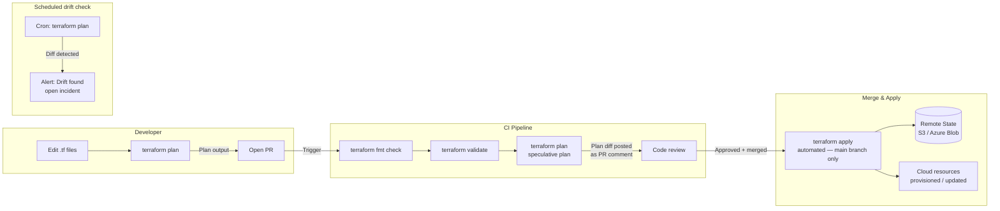

# Infrastructure as Code (IaC)

## Category

DevOps, Infrastructure as Code, Terraform, Pulumi, Bicep, State Management, Drift Detection

## Context

**Infrastructure as Code (IaC)** is the practice of managing and provisioning infrastructure through machine-readable configuration files rather than manual processes or interactive tools. IaC applies software engineering practices — version control, code review, testing, and CI/CD — to infrastructure.

### IaC tools comparison

| Tool                     | Language                   | State                         | Cloud support         | Approach                        |
| ------------------------ | -------------------------- | ----------------------------- | --------------------- | ------------------------------- |
| **Terraform** (OpenTofu) | HCL                        | Remote state (S3, Azure Blob) | Multi-cloud           | Declarative                     |
| **Pulumi**               | TypeScript, Python, Go, C# | Pulumi Cloud or self-hosted   | Multi-cloud           | Declarative with real languages |
| **Bicep**                | DSL (ARM successor)        | None (ARM-driven)             | Azure only            | Declarative                     |
| **CloudFormation**       | YAML/JSON                  | None (CFn-driven)             | AWS only              | Declarative                     |
| **Ansible**              | YAML                       | Stateless (idempotent runs)   | Multi-cloud + on-prem | Procedural/idempotent           |
| **CDK (AWS/Azure)**      | TypeScript, Python         | CFn / ARM state               | AWS / Azure           | Declarative via synthesis       |

### Terraform project structure

```
infra/
  modules/           ← Reusable, versioned modules
    vpc/
    aks-cluster/
    postgres/
  environments/
    staging/
      main.tf        ← Calls modules with staging-specific vars
      variables.tf
      terraform.tfvars
      backend.tf     ← Remote state config
    production/
      main.tf        ← Same modules, production vars
```

### State management

Terraform maintains a **state file** — a mapping between the configuration and real infrastructure resources. Remote state must be:

- **Locked** to prevent concurrent applies (DynamoDB, Azure Blob lease, GCS)
- **Encrypted** at rest (S3 SSE-KMS, Azure Blob CMK)
- **Versioned** to enable rollback to a previous known state

### IaC practices

| Practice                             | Description                                                                                 |
| ------------------------------------ | ------------------------------------------------------------------------------------------- |
| **Plan before apply**                | `terraform plan` shows changes before applying — never `apply` without reviewing the plan   |
| **PR-based workflow**                | All changes via code review; auto-run `plan` on PR; apply only after merge                  |
| **Module versioning**                | Pin module versions (`source = "git::...?ref=v2.1.0"`) — never use `ref=main` in production |
| **Drift detection**                  | Schedule `terraform plan` to detect manual changes made outside IaC                         |
| **Workspace or directory isolation** | Separate state per environment — never share state between staging and prod                 |

---

## Pros

- **Reproducibility**: Identical infrastructure can be recreated from code — disaster recovery and environment parity guaranteed.
- **Auditability**: Every infrastructure change is a Git commit with a code review and a clear author.
- **Speed**: Provisioning a full environment (VNet, AKS, databases, DNS) takes minutes, not days.
- **Drift detection**: Scheduled `terraform plan` catches manual changes before they cause incidents.
- **Cost estimation**: Tools like Infracost can estimate cost impact before applying a change.

---

## Cons

- **State file is a liability**: If state is corrupted or lost, Terraform loses track of managed resources. Requires disciplined remote state management.
- **Blast radius**: A mistake in a shared module can affect many environments simultaneously.
- **Not fully idempotent for all resources**: Some resources require destroy+recreate, causing downtime (e.g., RDS change, VM resize).
- **Provider version drift**: Upgrading Terraform providers can introduce breaking changes — requires pinning and controlled upgrades.
- **Secret handling**: Variables containing secrets must be handled carefully — never stored in `.tfvars` files committed to Git.

---

## Design Diagram



---

## Code Sample

### HCL — Terraform Module: AKS Cluster

```hcl
# infra/modules/aks-cluster/main.tf

terraform {
  required_version = ">= 1.7"
  required_providers {
    azurerm = {
      source  = "hashicorp/azurerm"
      version = "~> 3.100"
    }
  }
}

variable "name"               { type = string }
variable "location"           { type = string }
variable "resource_group_name"{ type = string }
variable "node_count"         { type = number; default = 3 }
variable "node_vm_size"       { type = string; default = "Standard_D4ds_v5" }
variable "kubernetes_version"  { type = string }
variable "subnet_id"          { type = string }
variable "log_analytics_workspace_id" { type = string }

resource "azurerm_kubernetes_cluster" "this" {
  name                = var.name
  location            = var.location
  resource_group_name = var.resource_group_name
  dns_prefix          = var.name
  kubernetes_version  = var.kubernetes_version

  # System node pool — do not schedule workloads here
  default_node_pool {
    name                = "system"
    node_count          = 2
    vm_size             = "Standard_D2ds_v5"
    vnet_subnet_id      = var.subnet_id
    os_disk_type        = "Ephemeral"
    only_critical_addons_enabled = true   # Taint: CriticalAddonsOnly
    upgrade_settings { max_surge = "33%" }
  }

  identity {
    type = "SystemAssigned"
  }

  network_profile {
    network_plugin      = "azure"
    network_plugin_mode = "overlay"
    network_policy      = "cilium"
    ebpf_data_plane     = "cilium"
    load_balancer_sku   = "standard"
    outbound_type       = "userAssignedNATGateway"
  }

  oms_agent {
    log_analytics_workspace_id      = var.log_analytics_workspace_id
    msi_auth_for_monitoring_enabled = true
  }

  azure_active_directory_role_based_access_control {
    azure_rbac_enabled = true
    managed            = true
  }

  # Disable local accounts — force Entra ID RBAC
  local_account_disabled = true

  maintenance_window_auto_upgrade {
    frequency   = "Weekly"
    interval    = 1
    duration    = 4
    day_of_week = "Sunday"
    start_time  = "02:00"
  }
}

# Workload node pool — user workloads
resource "azurerm_kubernetes_cluster_node_pool" "workload" {
  name                  = "workload"
  kubernetes_cluster_id = azurerm_kubernetes_cluster.this.id
  vm_size               = var.node_vm_size
  node_count            = var.node_count
  vnet_subnet_id        = var.subnet_id
  os_disk_type          = "Ephemeral"
  auto_scaling_enabled  = true
  min_count             = var.node_count
  max_count             = var.node_count * 3
  upgrade_settings { max_surge = "33%" }
}

output "cluster_id"   { value = azurerm_kubernetes_cluster.this.id }
output "kube_config"  {
  value     = azurerm_kubernetes_cluster.this.kube_config_raw
  sensitive = true
}
output "kubelet_identity" {
  value = azurerm_kubernetes_cluster.this.kubelet_identity[0].object_id
}
```

### HCL — Environment Composition (calling modules)

```hcl
# infra/environments/production/main.tf

terraform {
  backend "azurerm" {
    resource_group_name  = "rg-tfstate"
    storage_account_name = "stmyorgtfstate"
    container_name       = "tfstate"
    key                  = "production.tfstate"
    use_oidc             = true   # Federated identity — no storage key in CI
  }
}

provider "azurerm" {
  features {}
  use_oidc        = true
  subscription_id = var.subscription_id
}

# Remote state from networking team's workspace
data "terraform_remote_state" "networking" {
  backend = "azurerm"
  config = {
    resource_group_name  = "rg-tfstate"
    storage_account_name = "stmyorgtfstate"
    container_name       = "tfstate"
    key                  = "networking.tfstate"
    use_oidc             = true
  }
}

module "aks" {
  source = "../../modules/aks-cluster"

  name                        = "aks-myapp-prod"
  location                    = "westeurope"
  resource_group_name         = "rg-myapp-prod"
  kubernetes_version          = "1.29"
  node_count                  = 5
  node_vm_size                = "Standard_D8ds_v5"
  subnet_id                   = data.terraform_remote_state.networking.outputs.aks_subnet_id
  log_analytics_workspace_id  = module.monitoring.workspace_id
}
```

### YAML — Terraform CI Pipeline (GitHub Actions with OIDC)

```yaml
# .github/workflows/terraform.yaml
name: Terraform Plan / Apply

on:
  push:
    branches: [main]
    paths: ["infra/**"]
  pull_request:
    paths: ["infra/**"]

permissions:
  id-token: write # OIDC token for Azure federated identity
  contents: read
  pull-requests: write # Post plan to PR comments

jobs:
  terraform:
    name: Terraform ${{ github.event_name == 'push' && 'Apply' || 'Plan' }}
    runs-on: ubuntu-latest
    environment: ${{ github.event_name == 'push' && 'production' || '' }}

    steps:
      - uses: actions/checkout@v4

      - uses: hashicorp/setup-terraform@v3
        with: { terraform_version: "1.8.x" }

      - name: Azure OIDC login
        uses: azure/login@v2
        with:
          client-id: ${{ secrets.AZURE_CLIENT_ID }}
          tenant-id: ${{ secrets.AZURE_TENANT_ID }}
          subscription-id: ${{ secrets.AZURE_SUBSCRIPTION_ID }}

      - name: Terraform Init
        working-directory: infra/environments/production
        run: terraform init

      - name: Terraform Plan
        id: plan
        working-directory: infra/environments/production
        run: terraform plan -no-color -out=tfplan
        continue-on-error: true

      - name: Post plan to PR
        if: github.event_name == 'pull_request'
        uses: actions/github-script@v7
        with:
          script: |
            const output = `### Terraform Plan
            \`\`\`
            ${{ steps.plan.outputs.stdout }}
            \`\`\``;
            github.rest.issues.createComment({
              issue_number: context.issue.number,
              owner: context.repo.owner,
              repo: context.repo.repo,
              body: output
            });

      - name: Terraform Apply
        if: github.event_name == 'push' && github.ref == 'refs/heads/main'
        working-directory: infra/environments/production
        run: terraform apply -auto-approve tfplan
```
