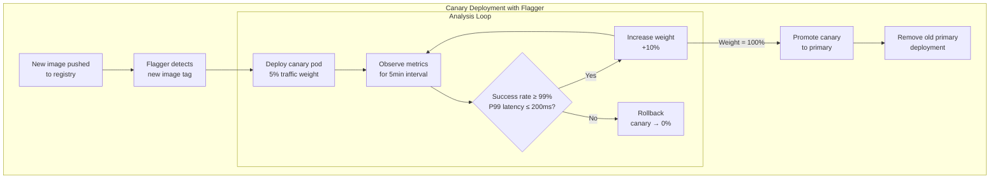

# Deployment Strategies

## Category
DevOps, Deployment, Blue-Green, Canary, Rolling Update, Progressive Delivery, Traffic Splitting

## Context

**Deployment strategies** define how new versions of an application are released into production while managing risk, availability, and rollback capability. Choosing the right strategy depends on the acceptable risk, required testing in production, and the cost of rollback.

### Strategies comparison

| Strategy | Downtime | Rollback speed | Production testing | Complexity | Best for |
|----------|----------|---------------|-------------------|-----------|---------|
| **Recreate** | Yes (brief) | Medium | No | Low | Dev/staging only |
| **Rolling update** | No | Minutes | Limited | Low | Stateless services |
| **Blue-Green** | No | Instant (DNS/LB swap) | Optional smoke tests | Medium | Stateful apps, databases |
| **Canary** | No | Fast (shift traffic) | Yes — real users | Medium-High | High-risk changes, ML models |
| **A/B testing** | No | Fast | Yes — targeted users | High | UX experiments, feature validation |
| **Shadow** | No | N/A | Yes — no live impact | High | Testing new services safely |

### Rolling update (Kubernetes default)

```
v1 v1 v1 v1  →  v2 v1 v1 v1  →  v2 v2 v1 v1  →  v2 v2 v2 v1  →  v2 v2 v2 v2
```
- Pods replaced one at a time (controlled by `maxSurge` and `maxUnavailable`)
- Mix of v1 and v2 runs briefly — both versions must handle the same API
- No extra infrastructure needed

### Blue-Green

```
                     ┌──────────────┐
Traffic ─ LB ──────► │  Blue (v1)   │ ← currently live
                     └──────────────┘
                     ┌──────────────┐
                     │ Green (v2)   │ ← deployed, tested, idle
                     └──────────────┘
         After verification:
Traffic ─ LB ──────► │ Green (v2)   │ ← swap; Blue kept as instant rollback
```

### Canary

```
Load balancer splits traffic:
  95% → v1 (stable)
   5% → v2 (canary)   ← monitor error rate, latency, business metrics

Analysis: automated (Flagger) or manual
Promote: shift traffic 25% → 50% → 100% on success
Rollback: set canary weight to 0% instantly
```

### Progressive delivery (Flagger + Argo Rollouts)

Automated canary analysis: the progressive delivery controller promotes automatically if metrics stay within thresholds, or rolls back if they breach.

---

## Pros

- **Blue-Green**: Zero downtime; instant rollback; allows full smoke testing of v2 before going live.
- **Canary**: Real production traffic validates new code; reduces blast radius; supports automated metric-based promotion or rollback.
- **Rolling**: No extra resources needed; built into Kubernetes natively.
- **Progressive delivery**: Removes human dependency from promotion decision — faster, more consistent.

---

## Cons

- **Blue-Green doubles infrastructure cost** during the deployment window — costly for large deployments.
- **Canary requires version-compatible APIs**: During the canary period, both versions serve requests — API contracts must be backward compatible.
- **Rolling updates risk mixed-version clusters**: Database schema changes cannot be done in rolling updates without backward-compatible migrations.
- **Flagger analysis complexity**: Defining meaningful SLO-based promotion gates requires careful metric selection and threshold tuning.

---

## Design Diagram



---

## Code Sample

### YAML — Kubernetes Rolling Update Configuration

```yaml
# kubernetes/api-service/deployment.yaml
apiVersion: apps/v1
kind: Deployment
metadata:
  name:      api-service
  namespace: production
spec:
  replicas: 6
  strategy:
    type: RollingUpdate
    rollingUpdate:
      maxSurge:       2    # Allow 2 extra pods during rollout (total: 8 briefly)
      maxUnavailable: 0    # Never reduce below desired count — zero downtime
  selector:
    matchLabels:
      app: api-service
  template:
    metadata:
      labels:
        app:     api-service
        version: "{{ .Values.image.tag }}"
    spec:
      terminationGracePeriodSeconds: 60   # Allow in-flight requests to complete

      containers:
        - name:  api
          image: ghcr.io/myorg/api:{{ .Values.image.tag }}

          # Readiness gate — pod only receives traffic when truly ready
          readinessProbe:
            httpGet: { path: /health/ready, port: 3000 }
            initialDelaySeconds: 10
            periodSeconds:       5
            failureThreshold:    3

          # Liveness — restart pod if stuck
          livenessProbe:
            httpGet: { path: /health/live, port: 3000 }
            initialDelaySeconds: 30
            periodSeconds:       15
            failureThreshold:    3

          # Graceful shutdown — stop accepting new requests on SIGTERM
          lifecycle:
            preStop:
              exec:
                command: ["/bin/sh", "-c", "sleep 5"]
```

### YAML — Argo Rollouts Canary Strategy

```yaml
# kubernetes/api-service/rollout.yaml
apiVersion: argoproj.io/v1alpha1
kind: Rollout
metadata:
  name:      api-service
  namespace: production
spec:
  replicas: 10
  revisionHistoryLimit: 3

  selector:
    matchLabels:
      app: api-service

  template:
    metadata:
      labels:
        app: api-service
    spec:
      containers:
        - name:  api
          image: ghcr.io/myorg/api:latest
          ports:
            - containerPort: 3000

  strategy:
    canary:
      # Reference to an Ingress or Service mesh for traffic splitting
      trafficRouting:
        nginx:
          stableIngress: api-service-stable
        canaryService: api-service-canary
        stableService:  api-service-stable

      steps:
        - setWeight: 5       # 5% canary traffic
        - pause: { duration: 5m }
        - analysis:
            templates:
              - templateName: success-rate-check
        - setWeight: 25
        - pause: { duration: 10m }
        - setWeight: 50
        - pause: { duration: 10m }
        - setWeight: 100

---
# Analysis template: success rate from Prometheus
apiVersion: argoproj.io/v1alpha1
kind: AnalysisTemplate
metadata:
  name:      success-rate-check
  namespace: production
spec:
  metrics:
    - name:             success-rate
      interval:         1m
      count:            5
      successCondition: result[0] >= 0.99
      failureLimit:     2
      provider:
        prometheus:
          address: http://prometheus.monitoring.svc.cluster.local:9090
          query: |
            sum(rate(http_requests_total{app="api-service", status!~"5.."}[1m])) /
            sum(rate(http_requests_total{app="api-service"}[1m]))

    - name:             p99-latency
      successCondition: result[0] <= 0.2
      failureLimit:     2
      provider:
        prometheus:
          address: http://prometheus.monitoring.svc.cluster.local:9090
          query: |
            histogram_quantile(0.99,
              sum(rate(http_request_duration_seconds_bucket{app="api-service"}[1m])) by (le)
            )
```

### TypeScript — Blue-Green Switch Script

```typescript
// scripts/blue-green-switch.ts
// Switches traffic between blue and green environments via Azure Application Gateway

import { NetworkManagementClient } from '@azure/arm-network';
import { DefaultAzureCredential } from '@azure/identity';

const credential       = new DefaultAzureCredential();
const networkClient    = new NetworkManagementClient(credential, process.env.AZURE_SUBSCRIPTION_ID!);

const RESOURCE_GROUP   = process.env.AZURE_RG!;
const APP_GATEWAY_NAME = process.env.APP_GATEWAY_NAME!;

async function switchTraffic(activeSlot: 'blue' | 'green'): Promise<void> {
  const gw = await networkClient.applicationGateways.get(RESOURCE_GROUP, APP_GATEWAY_NAME);

  const bluePoolId  = gw.backendAddressPools?.find(p => p.name === 'blue-pool')?.id!;
  const greenPoolId = gw.backendAddressPools?.find(p => p.name === 'green-pool')?.id!;

  const targetPoolId = activeSlot === 'blue' ? bluePoolId : greenPoolId;

  // Update all routing rules to point to the active backend pool
  gw.requestRoutingRules?.forEach(rule => {
    if (rule.backendAddressPool) {
      rule.backendAddressPool.id = targetPoolId;
    }
  });

  await networkClient.applicationGateways.beginCreateOrUpdateAndWait(
    RESOURCE_GROUP,
    APP_GATEWAY_NAME,
    gw
  );

  console.log(`Traffic switched to ${activeSlot} (pool: ${targetPoolId})`);
}

// Usage: npx ts-node scripts/blue-green-switch.ts green
const slot = process.argv[2] as 'blue' | 'green';
if (!['blue', 'green'].includes(slot)) {
  console.error('Usage: blue-green-switch.ts <blue|green>');
  process.exit(1);
}
switchTraffic(slot);
```
