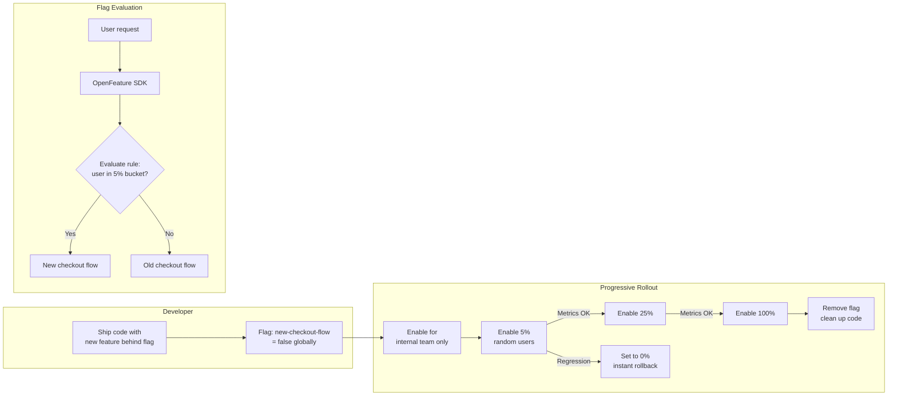

# Feature Flags & Progressive Delivery

## Category
DevOps, Feature Flags, Progressive Delivery, LaunchDarkly, OpenFeature, Trunk-Based Development, Dark Launches

## Context

**Feature flags** (also called feature toggles) are runtime configuration switches that enable or disable specific code paths without deploying new code. They decouple **deployment** (releasing code to production) from **release** (exposing features to users), allowing teams to ship continuously while controlling feature exposure independently.

### Feature flag types

| Type | Lifecycle | Use case |
|------|-----------|---------|
| **Release flags** | Days to weeks | Hide incomplete features during trunk-based development |
| **Experiment flags** | Days to weeks | A/B test; controlled exposure for metrics |
| **Ops flags** | Long-lived | Kill switches for degraded dependencies; circuit breakers |
| **Permission flags** | Long-lived | Beta access, paid tier gating, geographic restrictions |
| **Infrastructure flags** | Short-lived | Database migrations, algorithm swaps |

### Evaluation strategies

| Strategy | Description | Example |
|----------|-------------|---------|
| **Boolean** | On or off for all users | `new-checkout-flow: false` |
| **User targeting** | Enable for specific user IDs | Internal team gets v2 first |
| **Percentage rollout** | Random X% of users | 10% canary — no infrastructure change |
| **Segment** | Group by attribute (country, plan, device) | Enable in EU only |
| **Attribute-based** | Complex rules on user attributes | `plan == 'enterprise' AND region == 'eu'` |

### OpenFeature standard

**OpenFeature** is a CNCF standard SDK that decouples application code from the specific feature flag provider. Switch between LaunchDarkly, Flagd, Growthbook, or ConfigCat without changing application code.

```
Application code → OpenFeature SDK → Provider adapter → LaunchDarkly / Flagd / etc.
```

### Technical debt risk

Feature flags that are never cleaned up accumulate as **flag debt**: stale flags whose conditions are no longer valid create dead code paths, complicate testing permutations, and confuse developers. Each flag should have a **removal ticket** created at the same time it is added.

---

## Pros

- **Dark launches**: Deploy code to 100% of servers but expose to 0% of users — validate performance impact before public release.
- **Instant kill switch**: Roll back a feature by flipping a flag — no deployment required; response time measured in seconds.
- **Percentage rollouts without infrastructure changes**: Canary-style gradual exposure with no Kubernetes traffic splitting required.
- **Experiment-driven development**: A/B test features and measure business metrics before full rollout.
- **Trunk-based development enabler**: Incomplete features are safely merged to main behind a flag — no long-lived feature branches.

---

## Cons

- **Flag combinatorial explosion**: With N flags, there are 2^N possible states — all permutations cannot be tested.
- **Flag debt**: Stale flags accumulate and become unknown risks — requires active flag hygiene.
- **Consistency challenges**: Different flag evaluations for the same user across page loads (especially with percentage rollouts) can cause confusing UI states.
- **Latency**: Remote flag evaluation adds network latency unless flags are cached locally (SDK in streaming mode).
- **Complexity in testing**: Unit tests must account for both flag-on and flag-off paths.

---

## Design Diagram



---

## Code Sample

### TypeScript — OpenFeature SDK with LaunchDarkly Provider

```typescript
// src/feature-flags/client.ts

import { OpenFeature } from '@openfeature/server-sdk';
import { LaunchDarklyProvider } from '@openfeature/launchdarkly-provider';

// Initialise once at application startup
export async function initFeatureFlags(): Promise<void> {
  const provider = new LaunchDarklyProvider(process.env.LAUNCHDARKLY_SDK_KEY!, {
    // Stream mode: receive flag updates in real-time without polling
    streamUri: 'https://stream.launchdarkly.com',
  });

  await OpenFeature.setProviderAndWait(provider);
}

// Convenience wrapper — use this throughout the application
export const featureFlags = OpenFeature.getClient('myapp');
```

```typescript
// src/checkout/checkout-service.ts

import { featureFlags } from '../feature-flags/client.js';
import type { EvaluationContext } from '@openfeature/server-sdk';

export async function processCheckout(userId: string, cart: Cart): Promise<CheckoutResult> {
  const flagContext: EvaluationContext = {
    targetingKey: userId,
    // Additional attributes used in flag targeting rules
    plan:    cart.userPlan,
    country: cart.billingCountry,
  };

  // Boolean flag — default false (safe off state)
  const useNewFlow = await featureFlags.getBooleanValue(
    'new-checkout-flow',
    false,               // Default: old flow if flag evaluation fails
    flagContext
  );

  if (useNewFlow) {
    return newCheckoutFlow(cart);
  }
  return legacyCheckoutFlow(cart);
}

// A/B test variant string flag
export async function getCheckoutLayout(userId: string): Promise<'v1' | 'v2' | 'v3'> {
  const variant = await featureFlags.getStringValue(
    'checkout-layout-experiment',
    'v1',                // Default to control group
    { targetingKey: userId }
  );
  return variant as 'v1' | 'v2' | 'v3';
}

// Ops kill switch — disable a degraded third-party payment provider
export async function getPaymentProvider(userId: string): Promise<'stripe' | 'braintree'> {
  const stripeEnabled = await featureFlags.getBooleanValue(
    'payment-provider-stripe-enabled',
    true,
    { targetingKey: userId }
  );
  return stripeEnabled ? 'stripe' : 'braintree';
}
```

### TypeScript — Self-hosted Flagd Provider (no external SaaS)

```typescript
// src/feature-flags/flagd-provider.ts
// Flagd: open-source, self-hosted feature flag daemon — CNCF project

import { OpenFeature } from '@openfeature/server-sdk';
import { FlagdProvider } from '@openfeature/flagd-provider';

export async function initFlagd(): Promise<void> {
  const provider = new FlagdProvider({
    host:      process.env.FLAGD_HOST ?? 'flagd.flagd-system.svc.cluster.local',
    port:      8013,
    tls:       false,
    deadline:  500,    // ms
  });

  await OpenFeature.setProviderAndWait(provider);
}
```

```yaml
# infrastructure/kubernetes/flagd/feature-flags.yaml
# Flagd flag configuration — stored in a ConfigMap (or git-synced)
apiVersion: v1
kind: ConfigMap
metadata:
  name:      feature-flags
  namespace: flagd-system
data:
  flags.json: |
    {
      "$schema": "https://flagd.dev/schema/v0/flags.json",
      "flags": {
        "new-checkout-flow": {
          "state": "ENABLED",
          "variants": {
            "on":  true,
            "off": false
          },
          "defaultVariant": "off",
          "targeting": {
            "if": [
              {
                "in": [{ "var": "targetingKey" }, ["user-A", "user-B", "user-C"]]
              },
              "on",
              {
                "<=": [{ "fractional": [{ "var": "targetingKey" }, [["on", 10], ["off", 90]]] }, 10]
              },
              "on",
              "off"
            ]
          }
        },
        "payment-provider-stripe-enabled": {
          "state": "ENABLED",
          "variants": { "on": true, "off": false },
          "defaultVariant": "on"
        }
      }
    }
```

### TypeScript — Flag Usage Tracking & Stale Flag Detection

```typescript
// src/feature-flags/flag-tracker.ts
// Record flag evaluations — detect flags that haven't been evaluated recently (stale)

import { OpenFeature } from '@openfeature/server-sdk';

const flagUsage = new Map<string, { lastSeen: Date; evaluations: number }>();

OpenFeature.addHooks({
  after(hookContext) {
    const key = hookContext.flagKey;
    const existing = flagUsage.get(key) ?? { lastSeen: new Date(0), evaluations: 0 };
    flagUsage.set(key, {
      lastSeen:    new Date(),
      evaluations: existing.evaluations + 1,
    });
  },
});

/** Report flags not evaluated in the last 30 days — candidates for removal */
export function detectStaleFlags(thresholdDays = 30): string[] {
  const cutoff = new Date(Date.now() - thresholdDays * 86_400_000);
  return [...flagUsage.entries()]
    .filter(([, stats]) => stats.lastSeen < cutoff)
    .map(([key]) => key);
}
```
