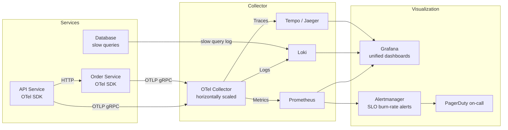

# Observability & OpenTelemetry

## Category
DevOps, Observability, OpenTelemetry, Distributed Tracing, Metrics, Logs, Prometheus, Grafana

## Context

**Observability** is the capability to understand the internal state of a system from its external outputs — logs, metrics, and traces. The three pillars form a unified understanding of system behaviour, especially in distributed microservices where a single request may traverse dozens of services.

### The three pillars

| Pillar | What it answers | Examples | Storage |
|--------|----------------|---------|---------|
| **Metrics** | Is the system healthy? How many? How fast? | Request rate, error rate, latency, CPU, memory | Prometheus, Azure Monitor, Datadog |
| **Logs** | What happened during a specific event? | Structured JSON logs with request context | Loki, ELK, Splunk, Azure Monitor Logs |
| **Traces** | How did a request flow through the system? | Trace with spans across service A → B → DB | Jaeger, Tempo, Azure Monitor, Datadog APM |

### OpenTelemetry (OTel)

**OpenTelemetry** is the CNCF observability standard — an open, vendor-neutral SDK and wire protocol (OTLP) for collecting metrics, logs, and traces. It replaces vendor-specific instrumentation:

```
Application (OTel SDK) → OTLP → OTel Collector → Backend (Jaeger, Prometheus, Loki, Datadog, etc.)
```

Benefits: instrument once, switch backends without code changes.

### The RED method (for services)

| Signal | Meaning |
|--------|---------|
| **Rate** | Requests per second |
| **Errors** | Percentage of requests that fail |
| **Duration** | Latency distribution (p50, p95, p99) |

### The USE method (for resources)

| Signal | Meaning |
|--------|---------|
| **Utilisation** | Percentage of time the resource is busy |
| **Saturation** | Amount of work the resource cannot service (queue depth, wait) |
| **Errors** | Error events from the resource |

### Trace context propagation

For distributed traces to work, trace context (`trace-id`, `span-id`) must be propagated across service boundaries:
- HTTP: `traceparent` header (W3C Trace Context spec)
- Messaging: embedded in message headers (Kafka headers, SQS message attributes)
- gRPC: metadata headers

---

## Pros

- **Root cause in distributed systems**: Traces show exactly which service and which line of code caused a latency spike or error.
- **Vendor neutrality with OTel**: One SDK, one collector, multiple backends — no lock-in.
- **Proactive alerting**: Metrics + alerting rules catch degradation before users report it.
- **SLO measurement**: OTel metrics feed into error budget burn-rate alerts.
- **Auto-instrumentation**: OTel auto-instrumentation agents collect HTTP, DB, and RPC spans with zero code changes.

---

## Cons

- **Cardinality explosions**: High-cardinality labels (user ID per metric tag) cause Prometheus memory exhaustion and query costs.
- **Sampling overhead**: 100% trace collection is expensive at scale; tail-based sampling requires careful configuration.
- **Collector operability**: The OTel Collector is a critical piece of infrastructure — requires HA deployment and monitoring.
- **Log/trace correlation requires effort**: Correlating logs to traces requires injecting `trace_id` into every log record.
- **Dashboard sprawl**: Without governance, teams create hundreds of dashboards that nobody maintains — prefer USE/RED standardised dashboards.

---

## Design Diagram



---

## Code Sample

### TypeScript — OTel SDK Initialisation (Node.js)

```typescript
// src/observability/telemetry.ts
// Must be the FIRST import in the application entry point

import { NodeSDK } from '@opentelemetry/sdk-node';
import { OTLPTraceExporter } from '@opentelemetry/exporter-trace-otlp-grpc';
import { OTLPMetricExporter } from '@opentelemetry/exporter-metrics-otlp-grpc';
import { PeriodicExportingMetricReader } from '@opentelemetry/sdk-metrics';
import { Resource } from '@opentelemetry/resources';
import { ATTR_SERVICE_NAME, ATTR_SERVICE_VERSION } from '@opentelemetry/semantic-conventions';
import { getNodeAutoInstrumentations } from '@opentelemetry/auto-instrumentations-node';
import { BatchSpanProcessor } from '@opentelemetry/sdk-trace-base';
import { TraceIdRatioBasedSampler } from '@opentelemetry/sdk-trace-node';

const sdk = new NodeSDK({
  resource: new Resource({
    [ATTR_SERVICE_NAME]:    process.env.SERVICE_NAME    ?? 'api-service',
    [ATTR_SERVICE_VERSION]: process.env.SERVICE_VERSION ?? 'unknown',
    'deployment.environment': process.env.ENVIRONMENT   ?? 'development',
  }),

  // Traces: send to OTel Collector via OTLP/gRPC
  spanProcessor: new BatchSpanProcessor(
    new OTLPTraceExporter({
      url: process.env.OTEL_EXPORTER_OTLP_TRACES_ENDPOINT ?? 'http://otel-collector:4317',
    }),
    { maxExportBatchSize: 512, scheduledDelayMillis: 5_000 }
  ),

  // Sample 100% in dev/staging; 10% in prod (tail-based sampling in Collector)
  sampler: new TraceIdRatioBasedSampler(
    process.env.ENVIRONMENT === 'production' ? 0.1 : 1.0
  ),

  // Metrics: export every 60 seconds
  metricReader: new PeriodicExportingMetricReader({
    exporter:     new OTLPMetricExporter({
      url: process.env.OTEL_EXPORTER_OTLP_METRICS_ENDPOINT ?? 'http://otel-collector:4317',
    }),
    exportIntervalMillis: 60_000,
  }),

  // Auto-instrument: HTTP, Express, fetch, pg, redis, gRPC — zero code changes
  instrumentations: [
    getNodeAutoInstrumentations({
      '@opentelemetry/instrumentation-fs': { enabled: false },   // Too noisy
      '@opentelemetry/instrumentation-http': {
        ignoreIncomingRequestHook: (req) =>
          ['/health', '/metrics'].some(p => req.url?.startsWith(p)),
      },
    }),
  ],
});

sdk.start();

process.on('SIGTERM', () => sdk.shutdown());
```

### TypeScript — Custom Span & Metrics

```typescript
// src/observability/instrumentation.ts

import { trace, metrics, context, SpanStatusCode } from '@opentelemetry/api';

const tracer  = trace.getTracer('myapp');
const meter   = metrics.getMeter('myapp');

// === Custom metrics ===
const httpRequestsTotal = meter.createCounter('http_requests_total', {
  description: 'Total HTTP requests',
});
const activeConnections = meter.createUpDownCounter('active_connections', {
  description: 'Currently active connections',
});
const requestLatency = meter.createHistogram('http_request_duration_seconds', {
  description: 'HTTP request duration',
  unit:        's',
  advice:      { explicitBucketBoundaries: [0.005, 0.01, 0.025, 0.05, 0.1, 0.25, 0.5, 1, 2.5] },
});

// Express middleware — record RED metrics
export function metricsMiddleware(
  req: Express.Request,
  res: Express.Response,
  next: Express.NextFunction
): void {
  const start = performance.now();
  const labels = { method: req.method, route: req.route?.path ?? req.path };

  activeConnections.add(1, labels);

  res.on('finish', () => {
    const durationSeconds = (performance.now() - start) / 1000;
    httpRequestsTotal.add(1, { ...labels, status: String(res.statusCode) });
    requestLatency.record(durationSeconds, labels);
    activeConnections.add(-1, labels);
  });

  next();
}

// === Custom trace span around business logic ===
export async function withSpan<T>(
  name: string,
  fn: () => Promise<T>,
  attributes?: Record<string, string | number | boolean>
): Promise<T> {
  return tracer.startActiveSpan(name, async (span) => {
    if (attributes) span.setAttributes(attributes);
    try {
      const result = await fn();
      span.setStatus({ code: SpanStatusCode.OK });
      return result;
    } catch (err) {
      span.setStatus({ code: SpanStatusCode.ERROR, message: String(err) });
      span.recordException(err as Error);
      throw err;
    } finally {
      span.end();
    }
  });
}

// Inject trace ID into log records for correlation
export function getCurrentTraceId(): string | undefined {
  const span = trace.getActiveSpan();
  if (!span) return undefined;
  const { traceId } = span.spanContext();
  return traceId;
}
```

### YAML — OTel Collector Configuration (Kubernetes)

```yaml
# infrastructure/kubernetes/observability/otel-collector-config.yaml
apiVersion: v1
kind: ConfigMap
metadata:
  name:      otel-collector-config
  namespace: observability
data:
  config.yaml: |
    receivers:
      otlp:
        protocols:
          grpc: { endpoint: 0.0.0.0:4317 }
          http: { endpoint: 0.0.0.0:4318 }

    processors:
      batch:
        timeout:          5s
        send_batch_size:  1024
      memory_limiter:
        limit_mib:        512
        check_interval:   1s
      resource:
        attributes:
          - key:    environment
            value:  production
            action: insert
      # Tail-based sampling — keep 100% of error traces, 10% of success traces
      tail_sampling:
        decision_wait:     10s
        num_traces:        100000
        expected_new_traces_per_sec: 1000
        policies:
          - name:   errors
            type:   status_code
            status_code: { status_codes: [ERROR] }
          - name:   slow-traces
            type:   latency
            latency: { threshold_ms: 1000 }
          - name:   sample-rest
            type:   probabilistic
            probabilistic: { sampling_percentage: 10 }

    exporters:
      # Traces → Grafana Tempo
      otlp/tempo:
        endpoint: tempo.observability.svc.cluster.local:4317
        tls: { insecure: true }

      # Metrics → Prometheus remote write
      prometheusremotewrite:
        endpoint: http://prometheus.observability.svc.cluster.local:9090/api/v1/write

      # Logs → Loki
      loki:
        endpoint: http://loki.observability.svc.cluster.local:3100/loki/api/v1/push

    service:
      pipelines:
        traces:
          receivers:  [otlp]
          processors: [memory_limiter, tail_sampling, batch]
          exporters:  [otlp/tempo]
        metrics:
          receivers:  [otlp]
          processors: [memory_limiter, resource, batch]
          exporters:  [prometheusremotewrite]
        logs:
          receivers:  [otlp]
          processors: [memory_limiter, batch]
          exporters:  [loki]
```
