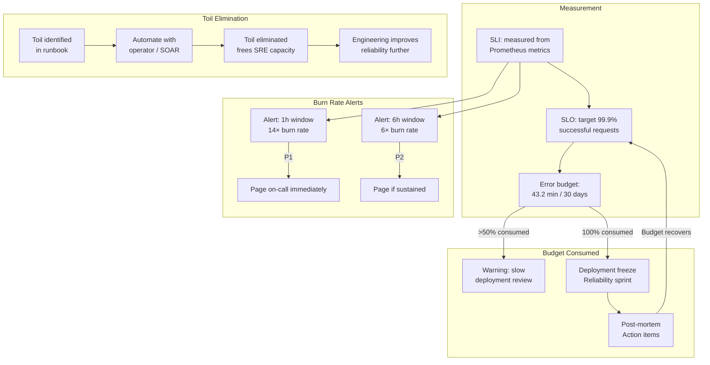

# SRE Practices & SLOs

## Category
DevOps, SRE, SLO, SLI, SLA, Error Budget, Toil Reduction, Reliability Engineering

## Context

**Site Reliability Engineering (SRE)** is a discipline that applies software engineering principles to operations, with the goal of creating scalable and highly reliable software systems. Coined at Google, SRE introduces formal frameworks for defining, measuring, and enforcing reliability.

### SLI, SLO, SLA hierarchy

| Term | Definition | Example |
|------|-----------|---------|
| **SLI** (Service Level Indicator) | A quantitative measure of service reliability | 99.2% of requests succeed; p99 latency = 180ms |
| **SLO** (Service Level Objective) | The target for an SLI — an internal reliability goal | 99.9% success rate; p99 latency < 200ms |
| **SLA** (Service Level Agreement) | A contractual commitment to customers with penalties for breach | 99.5% uptime; 24h support response |

**SLO should be tighter than SLA** — the buffer between SLO and SLA is operational headroom.

### Error budget

The **error budget** is the allowable amount of unreliability defined by the SLO:

```
Error budget (time) = (1 - SLO) × window
For SLO = 99.9% over 30 days:
  error budget = 0.1% × 30 × 24 × 60 = 43.2 minutes of allowed downtime
```

When the error budget is exhausted:
- **Feature work pauses** — engineering focuses on reliability improvements
- **Deployments freeze** — no new risky changes until budget recovers
- **Incident postmortem** — mandatory after budget-consuming incidents

### Error budget burn rate alerts (multi-window)

| Alert window | Burn rate | Severity | Time to budget exhaustion |
|-------------|-----------|---------|--------------------------|
| 1h | > 14× | P1 — page immediately | ~2 hours |
| 6h | > 6× | P2 — page if also sustained | ~1 day |
| 3d | > 1× | Ticket — trend is bad | At 30 days |

### Toil

**Toil** is operational work tied to running a production service that is manual, repetitive, automatable, tactical, and scales linearly with service growth. Examples:
- Manually restarting a service when a specific error occurs
- Adding users to a group in response to requests
- Manually rotating secrets on a schedule
- Responding to pager alerts that don't require human judgment

SRE targets: spend < 50% of time on toil; remainder on engineering that eliminates toil.

### Golden signals (Google SRE book)

| Signal | Description |
|--------|-------------|
| **Latency** | Time to service a request — distinguish successful vs failed request latency |
| **Traffic** | Demand on the system — requests per second, queries per second |
| **Errors** | Rate of failed requests — explicit (5xx) and implicit (wrong content, success with degraded data) |
| **Saturation** | Fullness of the service — CPU, memory, I/O, connection pool utilisation |

---

## Pros

- **Objective reliability conversations**: SLOs replace "is the service down?" with "how much error budget remains?" — actionable and data-driven.
- **Balanced reliability vs velocity**: Error budgets make the tradeoff between reliability work and feature velocity explicit and negotiated.
- **Prevents over-engineering**: 100% reliability is unachievable and unnecessary — SLOs define "good enough."
- **Toil reduction compounds**: Automation of toil frees time for engineering that improves reliability further.
- **Alignment with business**: SLAs aligned to SLOs ensure engineering understands the business risk of reliability failures.

---

## Cons

- **SLO definition is hard**: Choosing the right SLIs that capture real user experience without noise requires deep service knowledge.
- **Alert tuning takes time**: Multi-window burn-rate alerts require initial calibration — too sensitive causes alert fatigue.
- **Cultural resistance**: Error budgets require engineering and product management to accept deployment freezes — political.
- **Toil identification requires self-discipline**: Teams must honestly identify and track toil rather than normalising it.
- **SLA legal complexity**: Crafting SLAs with realistic penalties requires legal and financial modelling.

---

## Design Diagram



---

## Code Sample

### TypeScript — SLO Error Budget Tracker with Prometheus

```typescript
// src/sre/error-budget.ts

interface SloConfig {
  name:       string;
  sloPercent: number;   // e.g. 99.9
  windowDays: number;   // e.g. 30
}

interface BurnRateResult {
  budgetMinutes:    number;   // Total error budget in minutes
  consumedMinutes:  number;   // Error budget consumed
  remainingPercent: number;   // % remaining
  burnRate:         number;   // Current burn rate (1.0 = exactly on SLO pace)
}

export async function calculateErrorBudget(
  prometheusUrl: string,
  slo: SloConfig
): Promise<BurnRateResult> {
  const windowSeconds = slo.windowDays * 24 * 3600;

  // Total budget in minutes
  const budgetMinutes = ((1 - slo.sloPercent / 100) * slo.windowDays * 24 * 60);

  // Query Prometheus: fraction of bad requests in the SLO window
  const query = `
    1 - (
      sum_over_time(sum(rate(http_requests_total{status!~"5.."}[1m]))[${windowSeconds}s:1m])
      /
      sum_over_time(sum(rate(http_requests_total[1m]))[${windowSeconds}s:1m])
    )
  `.trim();

  const res  = await fetch(`${prometheusUrl}/api/v1/query?query=${encodeURIComponent(query)}`);
  const data = await res.json() as { data: { result: [{ value: [number, string] }] } };

  const errorFraction   = parseFloat(data.data.result[0]?.value[1] ?? '0');
  const consumedMinutes = errorFraction * slo.windowDays * 24 * 60;
  const remainingPercent = Math.max(0, (1 - consumedMinutes / budgetMinutes) * 100);

  // Burn rate: how fast we're consuming budget relative to the SLO pace
  const sloErrorRate = 1 - slo.sloPercent / 100;
  const burnRate     = sloErrorRate > 0 ? errorFraction / sloErrorRate : 0;

  return { budgetMinutes, consumedMinutes, remainingPercent, burnRate };
}
```

### YAML — Prometheus Alerting Rules (Multi-Window Burn Rate)

```yaml
# infrastructure/kubernetes/observability/slo-alerts.yaml
# Multi-window, multi-burn-rate SLO alerting (Google SRE Workbook pattern)

apiVersion: monitoring.coreos.com/v1
kind: PrometheusRule
metadata:
  name:      api-service-slo
  namespace: production
  labels:
    prometheus: kube-prometheus
    role:       alert-rules
spec:
  groups:
    - name: api-service.slo.alerts
      interval: 30s
      rules:
        # ── Recording rules: pre-compute error ratios ─────────────────────

        # 5-minute error ratio
        - record: job:http_requests:error_ratio5m
          expr: |
            sum(rate(http_requests_total{job="api-service",status=~"5.."}[5m]))
            /
            sum(rate(http_requests_total{job="api-service"}[5m]))

        # 1-hour error ratio
        - record: job:http_requests:error_ratio1h
          expr: |
            sum(rate(http_requests_total{job="api-service",status=~"5.."}[1h]))
            /
            sum(rate(http_requests_total{job="api-service"}[1h]))

        # 6-hour error ratio
        - record: job:http_requests:error_ratio6h
          expr: |
            sum(rate(http_requests_total{job="api-service",status=~"5.."}[6h]))
            /
            sum(rate(http_requests_total{job="api-service"}[6h]))

        # ── Burn rate alerts ──────────────────────────────────────────────

        # P1: Consuming error budget 14× faster — exhausts 30-day budget in 2h
        - alert: SLOBurnRateCritical
          expr: |
            (job:http_requests:error_ratio5m > (14 * 0.001))
            and
            (job:http_requests:error_ratio1h > (14 * 0.001))
          for: 2m
          labels:
            severity: critical
            slo:      api-service-availability
          annotations:
            summary:     "API service burning error budget at 14× rate"
            description: |
              Error rate {{ $value | humanizePercentage }} — 14× the SLO budget.
              At this rate, the 30-day error budget will be exhausted in ~2 hours.
              Runbook: https://runbooks.example.com/api-service/slo-burn

        # P2: Consuming error budget 6× faster — exhausts budget in ~5 days
        - alert: SLOBurnRateHigh
          expr: |
            (job:http_requests:error_ratio5m > (6 * 0.001))
            and
            (job:http_requests:error_ratio6h > (6 * 0.001))
          for: 15m
          labels:
            severity: warning
            slo:      api-service-availability
          annotations:
            summary:     "API service burning error budget at 6× rate"
            description: "Error rate {{ $value | humanizePercentage }} — review within 4 hours"

        # ── Latency SLO ───────────────────────────────────────────────────

        # P99 latency SLO: 95th percentile must be < 200ms
        - alert: SLOLatencyHigh
          expr: |
            histogram_quantile(0.95,
              sum(rate(http_request_duration_seconds_bucket{job="api-service"}[5m])) by (le)
            ) > 0.2
          for: 5m
          labels:
            severity: warning
          annotations:
            summary: "API service p95 latency exceeds SLO"
            description: "p95 latency is {{ $value | humanizeDuration }}, SLO is 200ms"
```

### TypeScript — Runbook Automation (Toil Elimination)

```typescript
// src/sre/runbook-automation.ts
// Auto-remediate known toil patterns — executed by an operator or SOAR platform

import { KubeConfig, AppsV1Api } from '@kubernetes/client-node';

const kc  = new KubeConfig();
kc.loadFromCluster();   // Runs inside a Kubernetes cluster
const appsApi = kc.makeApiClient(AppsV1Api);

/**
 * Toil: "Restart the order-service pod when it returns >10 consecutive 503s"
 * Automated here so the on-call doesn't get paged at 3am for a known issue.
 */
export async function restartDeploymentIfDegraded(
  namespace: string,
  deploymentName: string
): Promise<void> {
  // Add annotation to trigger a rolling restart (kubectl rollout restart equivalent)
  const patch = {
    spec: {
      template: {
        metadata: {
          annotations: {
            'kubectl.kubernetes.io/restartedAt': new Date().toISOString(),
          },
        },
      },
    },
  };

  await appsApi.patchNamespacedDeployment(
    deploymentName,
    namespace,
    patch,
    undefined, undefined, undefined, undefined,
    { headers: { 'Content-Type': 'application/strategic-merge-patch+json' } }
  );

  console.info(`Automated restart applied to ${namespace}/${deploymentName}`);
}
```
