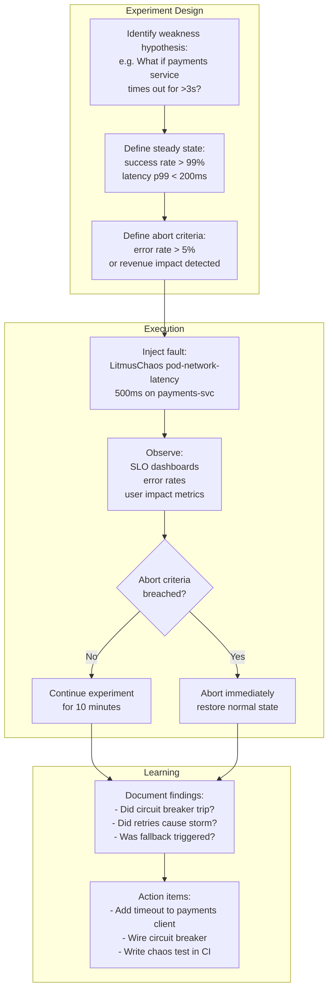

# Chaos Engineering

## Category
DevOps, Chaos Engineering, Resilience Testing, LitmusChaos, Chaos Monkey, Fault Injection, Game Days

## Context

**Chaos Engineering** is the discipline of experimenting on a system in production (or production-like environments) to build confidence in the system's ability to withstand turbulent, unexpected conditions. Chaos experiments proactively find weaknesses before they cause unplanned outages.

> "Chaos Engineering is not about breaking things randomly. It is about breaking things on purpose in a controlled way to learn." — Nora Jones

### Chaos Engineering principles (Netflix)

1. **Hypothesize about steady state**: Define a measurable baseline (success rate, latency P99).
2. **Vary real-world events**: Network partitions, host crashes, disk full, dependency timeouts.
3. **Run experiments in production**: Staging results are less trustworthy; controlled prod experiments build real confidence.
4. **Automate experiments to run continuously**: One-off game days find issues; continuous chaos prevents regression.
5. **Minimise blast radius**: Start small (1 pod), expand as confidence grows.

### Failure modes to test

| Category | Examples |
|----------|---------|
| **Infrastructure** | Node crash, AZ failure, disk full, network partition |
| **Application** | Process crash, OOM kill, long GC pause |
| **Dependency** | Dependency timeout, 500 responses from upstream, DNS failure |
| **Network** | Latency injection (100ms, 500ms), packet loss, bandwidth throttling |
| **Resource** | CPU stress, memory stress, I/O saturation |
| **Data** | Corrupt request body, out-of-sequence events, duplicate messages |

### Chaos tools

| Tool | Platform | Type |
|------|---------|------|
| **LitmusChaos** | Kubernetes (CNCF) | Pod, node, network, disk faults — CRD-driven |
| **Chaos Toolkit** | Multi-platform | Python-based, Kubernetes and cloud |
| **AWS Fault Injection Service** | AWS | EC2, ECS, RDS, EKS faults via managed service |
| **Azure Chaos Studio** | Azure | VM, AKS, Cosmos DB, App Service faults |
| **Gremlin** | Multi-cloud (SaaS) | Enterprise chaos-as-a-service |
| **Chaos Monkey** | Netflix OSS | Random instance termination in AWS ASGs |

### Game day

A **game day** is a scheduled, collaborative chaos experiment where engineers deliberately inject failures and observe how the system and the team respond:
1. Define hypothesis and steady state
2. Set up monitoring and dashboards
3. Inject failure — observe
4. Record observations and surprises
5. Rollback/stop injections
6. Document learnings and action items

---

## Pros

- **Finds unknown unknowns**: Chaos experiments reveal failure modes that code review, load testing, and unit tests miss entirely (e.g., timeout not configured, retry storm, circuit breaker not wired).
- **Validates resilience patterns**: Confirms retries, circuit breakers, fallbacks, and graceful degradation actually work under real conditions.
- **Builds team confidence**: Engineers who have survived controlled failures are less anxious during real incidents.
- **Continuous validation**: Automated chaos experiments prevent regression — a newly introduced dependency without a timeout gets caught.
- **Measures blast radius**: Running experiments reveals whether failures are properly isolated or cascade system-wide.

---

## Cons

- **Risk of real outages**: Even carefully scoped experiments can cause unintended collateral damage — requires rigorous abort criteria.
- **Staging environments are poor proxies**: Chaos in staging rarely reflects production traffic patterns, scale, or dependency behaviour.
- **On-call team load**: Running chaos during business hours burns engineering attention — requires dedicated capacity.
- **Alert noise**: Chaos experiments trigger real alerts — SIEM, on-call systems, and colleagues must be informed in advance.
- **Cultural resistance**: "Why would we deliberately break our own systems?" requires organisational buy-in and psychological safety.

---

## Design Diagram



---

## Code Sample

### YAML — LitmusChaos Experiment: Pod Network Latency

```yaml
# chaos/experiments/pod-network-latency.yaml
# Inject 500ms network latency on all pods of the payments-service
# Validates: circuit breaker, timeout handling, graceful degradation

apiVersion: litmuschaos.io/v1alpha1
kind: ChaosEngine
metadata:
  name:      payments-network-latency
  namespace: production
spec:
  appinfo:
    appns:    production
    applabel: "app=payments-service"
    appkind:  deployment

  # Chaos service account (pre-created with minimal RBAC)
  chaosServiceAccount: litmus-admin

  experiments:
    - name: pod-network-latency
      spec:
        components:
          env:
            # Duration and scope
            - name:  TOTAL_CHAOS_DURATION
              value: "300"          # 5 minutes

            # Network parameters
            - name:  NETWORK_LATENCY
              value: "500"          # 500ms added to all outbound TCP
            - name:  JITTER
              value: "50"           # ±50ms jitter

            # Target: random 1 pod (start small)
            - name:  PODS_AFFECTED_PERC
              value: "33"

            - name:  TARGET_CONTAINER
              value: "payments"

  # Observability connection — LitmusChaos reads these Prometheus queries
  # and auto-aborts if steady-state is violated
  monitoring: true

---
# Steady-state hypothesis validated before and after
apiVersion: litmuschaos.io/v1alpha1
kind: ChaosResult
metadata:
  name:      payments-network-latency
  namespace: production
  # Checked after experiment — compare with pre-experiment baseline
```

### YAML — LitmusChaos Experiment: Pod Crash (Kill)

```yaml
# chaos/experiments/pod-crash.yaml
# Randomly terminate payments-service pods — validates Kubernetes pod restart behaviour,
# readiness probes, and graceful drain

apiVersion: litmuschaos.io/v1alpha1
kind: ChaosEngine
metadata:
  name:      payments-pod-crash
  namespace: production
spec:
  appinfo:
    appns:    production
    applabel: "app=payments-service"
    appkind:  deployment

  chaosServiceAccount: litmus-admin

  experiments:
    - name: pod-delete
      spec:
        components:
          env:
            - name:  TOTAL_CHAOS_DURATION
              value: "120"    # 2 minutes

            - name:  CHAOS_INTERVAL
              value: "30"     # Kill 1 pod every 30 seconds

            - name:  FORCE
              value: "false"  # Graceful termination (SIGTERM, not SIGKILL)

            - name:  PODS_AFFECTED_PERC
              value: "33"     # Kill up to 33% of pods
```

### TypeScript — Chaos Experiment SDK (Chaos Toolkit integration)

```typescript
// chaos/experiments/dependency-timeout-hypothesis.ts
// Defines a Chaos Toolkit experiment in TypeScript
// Validates: API resilience when order-service times out after 3s

export const experiment = {
  title:       "Order service timeout causes graceful degradation, not cascade failure",
  description: "Inject a 3s timeout on all calls FROM api-service TO order-service. The API must return a partial response (orders: []) rather than a 500.",
  tags:        ["resilience", "timeout", "graceful-degradation"],

  "steady-state-hypothesis": {
    title:   "Services are responding normally",
    probes: [
      {
        name:      "api-service-success-rate",
        type:      "probe",
        tolerance: { gte: 0.999 },
        provider: {
          type:    "http",
          url:     "http://prometheus.observability.svc.cluster.local:9090/api/v1/query",
          params:  { query: "sum(rate(http_requests_total{job='api-service',status!~'5..'}[1m])) / sum(rate(http_requests_total{job='api-service'}[1m]))" },
          jsonpath: "$.data.result[0].value[1]",
        },
      },
    ],
  },

  method: [
    // Inject fault: add network latency between api-service and order-service
    {
      name: "inject-network-latency",
      type: "action",
      provider: {
        type:    "process",
        path:    "kubectl",
        arguments: [
          "apply", "-f", "chaos/experiments/order-service-latency.yaml",
          "--namespace", "production",
        ],
      },
    },
    // Pause to let chaos stabilise
    { type: "pauses", after: 30 },
  ],

  rollbacks: [
    {
      name: "remove-latency-injection",
      type: "action",
      provider: {
        type:    "process",
        path:    "kubectl",
        arguments: ["delete", "-f", "chaos/experiments/order-service-latency.yaml", "--namespace", "production"],
      },
    },
  ],
};
```

### YAML — Chaos Schedule (Run automatically in staging weekly)

```yaml
# chaos/schedules/weekly-chaos.yaml
# Run pod-crash experiments automatically every Monday in staging
# Prevents resilience regressions from new deployments

apiVersion: litmuschaos.io/v1alpha1
kind: ChaosSchedule
metadata:
  name:      weekly-resilience-check
  namespace: staging
spec:
  schedule:
    repeat:
      properties:
        minChaosInterval: "168h"   # At most once per week
      workHours:
        includedHours: "9-17"      # Business hours only
      workDays:
        includedDays: "Mon"

  engineTemplateSpec:
    appinfo:
      appns:    staging
      applabel: "app=api-service"
      appkind:  deployment
    chaosServiceAccount: litmus-admin
    experiments:
      - name: pod-delete
        spec:
          components:
            env:
              - name:  TOTAL_CHAOS_DURATION
                value: "60"
              - name:  PODS_AFFECTED_PERC
                value: "50"
```
