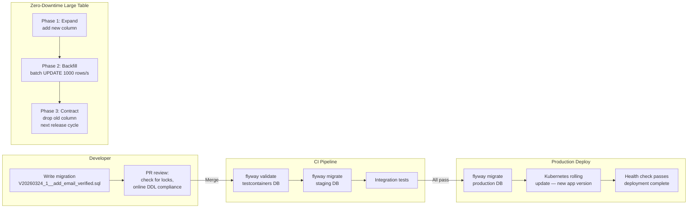

# Database DevOps

## Category
DevOps, Database Migrations, Flyway, Liquibase, Schema Management, Zero-Downtime Migrations

## Context

**Database DevOps** applies continuous delivery principles to database schemas — versioning migrations, automating deployment, and enabling zero-downtime schema changes alongside application code. Without it, databases become the bottleneck in continuous delivery: a manually managed schema that cannot keep pace with application deployments.

### Core problem: schema and code must evolve together

```
Problem: New code expects column `user.email_verified` (boolean).
         Production DB doesn't have it yet.
         Deploy code first → runtime error.
         Run migration first → old code ignores unknown column (OK).
         ∴ Expand-Contract pattern: schema changes always backward compatible first.
```

### Migration tools

| Tool | Language | Features |
|------|----------|---------|
| **Flyway** | Java / CLI | Versioned (V1__desc.sql), repeatable migrations, undo support |
| **Liquibase** | XML, YAML, JSON, SQL | Changeset-based, rollback scripts, drift detection |
| **Alembic** | Python (SQLAlchemy) | ORM-driven, autogenerate from model diffs |
| **Atlas** | Go / HCL | Schema-as-code, drift detection, lint, CI integration |
| **golang-migrate** | Go | Lightweight, many drivers |

### Expand-Contract pattern (zero-downtime migrations)

Complex schema changes (rename column, change type, drop column) that cannot be done atomically require the **Expand-Contract** (aka Parallel-Change) pattern:

```
Phase 1 — EXPAND:
  ALTER TABLE users ADD COLUMN email_new VARCHAR(255);
  (both old column and new column exist)
  Application writes to BOTH columns.

Phase 2 — MIGRATE:
  Backfill: UPDATE users SET email_new = email WHERE email_new IS NULL;
  Application reads from new column, writes to both.

Phase 3 — CONTRACT:
  ALTER TABLE users DROP COLUMN email;
  (after old column no longer referenced in any deployed code)
```

### Migration anti-patterns

| Anti-pattern | Risk |
|-------------|------|
| `DROP COLUMN` before removing all references in app code | Runtime error — column not found |
| `NOT NULL` without default on existing table | Migration blocks — all existing rows fail constraint |
| Long-running migration on large table (no batching) | Table lock causes full outage |
| Migration with application logic (business rules) | Hard to reason about and test |
| No idempotency (`IF NOT EXISTS` missing) | Migration fails on re-run after partial failure |

### Online DDL

Most cloud databases support **online DDL** — schema changes without locking:
- **PostgreSQL**: `pg_repack`, `pgroll`, or native `Not Force-Lock DDL` for some operations
- **MySQL/Aurora**: `ALTER TABLE ... ALGORITHM=INPLACE, LOCK=NONE`
- **AWS Aurora**: Fast DDL for index changes
- **Azure SQL**: Online index rebuild

For very large tables (>100GB), even non-locking migrations can cause replication lag — prefer application-level blue-green migrations.

---

## Pros

- **Schema changes in source control**: All DDL is versioned, reviewable, and auditable like application code.
- **Automated migration in CI/CD**: No manual DBA intervention per deployment — schema and code are deployed atomically.
- **Reproducible environments**: Flyway/Liquibase can bring a fresh database to any historical version — essential for dev/test environments.
- **Rollback clarity**: Each migration has a defined rollback script (or the Expand-Contract provides a path back).
- **Drift detection**: Liquibase and Atlas can detect schemas that diverged from the expected state.

---

## Cons

- **Irreversible migrations are risky**: Once data is deleted or transformed, rollback requires restoring from backup.
- **Long-running migrations block deployments**: Large table alterations can take hours — requires batched approaches.
- **Ordering conflicts in multiple teams**: Two teams adding columns to the same table simultaneously requires migration ordering governance.
- **Schema lock contention**: Even brief locks during migration can cause query timeouts on high-traffic tables.
- **Expand-Contract adds deployment complexity**: Requires coordinating three deployments (expand, backfill, contract) rather than one.

---

## Design Diagram



---

## Code Sample

### SQL — Flyway Migration (Structured, Safe)

```sql
-- db/migrations/V20260324_1__add_email_verification.sql
-- Expand phase: add new column NULLABLE first (no lock on existing rows)
-- Companion PR removes all references to email_verified in subsequent release

-- Safe: add nullable column — no lock on large tables
ALTER TABLE users
  ADD COLUMN IF NOT EXISTS email_verified     BOOLEAN,
  ADD COLUMN IF NOT EXISTS email_verified_at  TIMESTAMPTZ;

-- Safe: add index concurrently — does not block reads or writes (PostgreSQL)
CREATE INDEX CONCURRENTLY IF NOT EXISTS idx_users_email_verified
  ON users (email_verified)
  WHERE email_verified = false;

-- ── Comments for reviewers ────────────────────────────────────────────────
-- This is the EXPAND phase of an expand-contract migration.
-- Subsequent Phase 2 migration will backfill defaults.
-- Phase 3 (ADD NOT NULL constraint) runs after all rows backfilled.
-- Timeline: Phase 2 in same release, Phase 3 in next release.
```

```sql
-- db/migrations/V20260324_2__backfill_email_verified.sql
-- Phase 2: Backfill — run as a batched update to avoid long lock
-- For tables >10M rows use the TypeScript batched migration helper instead

-- Set default for all existing rows
UPDATE users
SET
  email_verified    = true,
  email_verified_at = created_at      -- Assume all existing users are verified
WHERE
  email_verified IS NULL;

-- Now safe to add NOT NULL constraint (all rows have a value)
ALTER TABLE users
  ALTER COLUMN email_verified SET DEFAULT false,
  ALTER COLUMN email_verified SET NOT NULL;
```

### TypeScript — Batched Migration for Large Tables

```typescript
// scripts/db/backfill-email-verified.ts
// Safe batch migration for tables too large to UPDATE in a single transaction

import { db } from '../../src/data/db.js';

const BATCH_SIZE  = 1_000;
const SLEEP_MS    = 100;   // Pause between batches — avoid I/O saturation

async function sleep(ms: number): Promise<void> {
  return new Promise(resolve => setTimeout(resolve, ms));
}

async function backfillEmailVerified(): Promise<void> {
  let totalUpdated = 0;
  let lastId       = BigInt(0);

  console.log('Starting batch backfill for email_verified...');

  while (true) {
    // Batch update: process BATCH_SIZE rows at a time, ordered by PK
    const result = await db.query<{ count: number }>(
      `WITH batch AS (
         SELECT id FROM users
         WHERE id > $1
           AND email_verified IS NULL
         ORDER BY id
         LIMIT $2
       )
       UPDATE users u
       SET
         email_verified    = true,
         email_verified_at = u.created_at
       FROM batch
       WHERE u.id = batch.id
       RETURNING u.id`,
      [lastId, BATCH_SIZE]
    );

    if (result.length === 0) break;   // All rows processed

    lastId       = result[result.length - 1].id as unknown as bigint;
    totalUpdated += result.length;

    console.log(`Updated ${totalUpdated} rows (last id: ${lastId})`);

    // Yield — allow other queries to run between batches
    await sleep(SLEEP_MS);
  }

  console.log(`Backfill complete: ${totalUpdated} rows updated`);
}

backfillEmailVerified().catch(err => { console.error(err); process.exit(1); });
```

### YAML — Flyway in Kubernetes Init Container

```yaml
# kubernetes/api-service/deployment.yaml (init container for migrations)
spec:
  initContainers:
    - name: db-migration
      image: flyway/flyway:10-alpine
      args:
        - "-url=$(DB_URL)"
        - "-user=$(DB_USER)"
        - "-password=$(DB_PASSWORD)"
        - "-locations=filesystem:/migrations"
        - "migrate"

      env:
        - name: DB_URL
          valueFrom:
            secretKeyRef: { name: db-credentials, key: flyway-url }
        - name: DB_USER
          valueFrom:
            secretKeyRef: { name: db-credentials, key: username }
        - name: DB_PASSWORD
          valueFrom:
            secretKeyRef: { name: db-credentials, key: password }

      volumeMounts:
        - name:      migrations
          mountPath: /migrations
          readOnly:  true

  volumes:
    - name: migrations
      configMap:
        name: db-migrations   # Migrations baked into a ConfigMap or OCI image layer

  containers:
    - name: api
      # Application container starts ONLY after init container (migrations) succeeds
      image: ghcr.io/myorg/api:{{ .Values.image.tag }}
```

### YAML — Atlas Schema (Declarative schema-as-code)

```yaml
# db/schema.hcl  — Atlas declarative schema definition
# atlas schema apply --url "postgres://..." --to file://db/schema.hcl

table "users" {
  schema = schema.public

  column "id" {
    type    = bigint
    null    = false
    default = sql("nextval('users_id_seq')")
  }
  column "email" {
    type = varchar(255)
    null = false
  }
  column "email_verified" {
    type    = boolean
    null    = false
    default = false
  }
  column "email_verified_at" {
    type = timestamptz
    null = true
  }
  column "created_at" {
    type    = timestamptz
    null    = false
    default = sql("NOW()")
  }

  primary_key {
    columns = [column.id]
  }
  index "idx_users_email" {
    columns = [column.email]
    unique  = true
  }
  index "idx_users_email_verified" {
    columns = [column.email_verified]
    where   = "email_verified = false"    # Partial index — only unverified rows
  }
}
```
