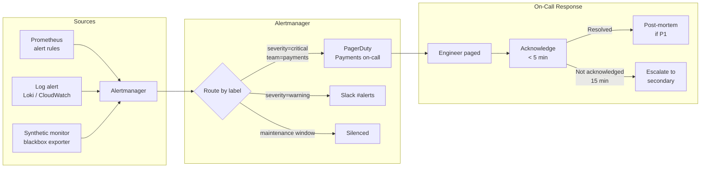

# Alerting & On-Call Management

## Category
DevOps, Alerting, On-Call, PagerDuty, Alertmanager, Runbooks, Incident Management, Alert Fatigue

## Context

**Alerting** is the process of automatically notifying the right people when system behaviour deviates from acceptable bounds. **On-call management** is the operational practice of ensuring qualified engineers are available 24/7 to respond, and that the burden is distributed fairly.

### Alert quality principles

The goal is **actionable, high-signal, low-noise** alerts. Every alert that pages an engineer must:
1. **Require immediate human action** — if it can wait until business hours, it is not a page
2. **Be actionable** — the engineer knows what to do (runbook link)
3. **Be symptoms-based** — alert on user-visible impact, not internal indicators

| Anti-pattern | Problem | Fix |
|-------------|---------|-----|
| Alert on CPU > 80% | CPU is a cause, not a symptom; many high-CPU states are benign | Alert on error rate + latency instead |
| Alert on every exception | High noise from expected exceptions (validation errors, 404s) | Alert on unexpected exception rate increase |
| Alert during known maintenance | Engineers get paged for expected behaviour | Silence/inhibit during maintenance windows |
| No runbook link | On-call spends 15 min searching for context | Every alert must link to a runbook |
| Alert on mean latency | Mean hides long tail — 1% of users with 30s latency invisible | Alert on P95 or P99 |

### Alert severity model

| Severity | Criteria | Response |
|----------|---------|---------|
| **Critical / P1** | User-visible impact; SLO burning at >14× rate | Page immediately; response in 5 min |
| **High / P2** | Elevated error rate; SLO burning at >6× rate | Page during business hours; response in 30 min |
| **Warning / P3** | Trend degrading; potential future impact | Ticket; investigate next business day |
| **Info** | Informational; no action needed | Dashboard only; no notification |

### Alertmanager routing

Prometheus Alertmanager routes alerts based on labels to different receivers:
- `severity=critical` + `team=payments` → PagerDuty payments on-call
- `severity=warning` → Slack `#platform-alerts` channel
- `severity=info` → No notification (dashboard only)

### On-call best practices

| Practice | Description |
|---------|-------------|
| **Rotation** | Rotate on-call weekly — no individual permanently on-call |
| **Escalation policy** | If primary doesn't acknowledge in 15 min → escalate to secondary → manager |
| **Follow-the-sun** | Distribute on-call across time zones so nobody is paged in the middle of the night |
| **Post-mortems** | Every P1 incident has a blameless post-mortem within 48 hours |
| **Alert reviews** | Weekly: review all noisy alerts; fix or delete them |
| **Compensation** | On-call engineers compensated for out-of-hours pages |

---

## Pros

- **Fast incident detection**: Well-tuned SLO-burn alerts detect incidents within minutes of user impact.
- **Reduced MTTR**: Runbook links and rich alert context reduce mean time to resolution.
- **Fair on-call burden**: Rotation, escalation, and compensation make on-call sustainable.
- **Signal over noise**: Symptom-based alerting means every page is meaningful — on-call trust is maintained.
- **Trend visibility**: Warning-level alerts create tickets that are addressed before they become incidents.

---

## Cons

- **Alert tuning is never done**: Systems evolve, thresholds drift — alerting requires continuous maintenance.
- **Alert fatigue is contagious**: Once engineers start ignoring alerts, the whole system degrades — cultural problem.
- **On-call rotation requires team size**: Meaningful rotation requires at least 4-5 engineers (weekly 1-in-4 rota).
- **Runbooks go stale**: Runbooks written during initial setup become inaccurate as systems evolve without updates.
- **Cost of monitoring infrastructure**: Prometheus, Alertmanager, PagerDuty — adds operational overhead.

---

## Design Diagram



---

## Code Sample

### YAML — Alertmanager Configuration with PagerDuty & Slack Routing

```yaml
# infrastructure/kubernetes/alertmanager/alertmanager.yaml
global:
  resolve_timeout: 5m
  pagerduty_url:   https://events.pagerduty.com/v2/enqueue

# Templates for rich Slack messages
templates:
  - '/etc/alertmanager/templates/*.tmpl'

route:
  receiver:        default-slack          # Default: all alerts go to Slack
  group_by:        [alertname, cluster, service]
  group_wait:      30s                    # Wait 30s to group related alerts
  group_interval:  5m                     # Resend grouped alert every 5 min if not resolved
  repeat_interval: 3h                     # Re-notify every 3h if still firing

  routes:
    # Critical alerts → PagerDuty (immediatly page on-call)
    - receiver: pagerduty-critical
      match:
        severity: critical
      continue: false   # Don't also send to Slack default receiver

    # Inhibit all non-critical alerts if a critical is already firing for same service
    - receiver: pagerduty-critical
      match_re:
        severity: (critical|warning)
      active_time_intervals:
        - business-hours   # Only page during business hours for warnings

    # Silence during maintenance windows
    - receiver: blackhole
      match:
        maintenance: "true"

receivers:
  - name: default-slack
    slack_configs:
      - channel:       "#platform-alerts"
        api_url:       "{{ env \"SLACK_WEBHOOK_URL\" }}"
        send_resolved: true
        title:         '{{ template "slack.title" . }}'
        text:          '{{ template "slack.text" . }}'
        color:         '{{ if eq .Status "firing" }}danger{{ else }}good{{ end }}'

  - name: pagerduty-critical
    pagerduty_configs:
      - routing_key:   "{{ env \"PAGERDUTY_ROUTING_KEY\" }}"
        severity:      critical
        description:   '{{ template "pagerduty.description" . }}'
        details:
          runbook:     '{{ (index .Alerts 0).Annotations.runbook_url }}'
          dashboard:   '{{ (index .Alerts 0).Annotations.dashboard_url }}'
          service:     '{{ (index .Alerts 0).Labels.service }}'
        send_resolved: true

  - name: blackhole   # Drop alert — maintenance silence

inhibit_rules:
  # Don't page warning if critical is already known for the same service
  - source_match:  { severity: critical }
    target_match:  { severity: warning }
    equal:         [alertname, service]

time_intervals:
  - name: business-hours
    time_intervals:
      - times:
          - start_time: "08:00"
            end_time:   "18:00"
        weekdays: ["monday:friday"]
        location: "Europe/Amsterdam"
```

### YAML — Alertmanager Templates

```yaml
# infrastructure/kubernetes/alertmanager/templates/slack.tmpl
{{ define "slack.title" -}}
  {{ if eq .Status "firing" }}🔴{{ else }}✅{{ end }}
  [{{ .Status | toUpper }}{{ if eq .Status "firing" }}:{{ .Alerts.Firing | len }}{{ end }}]
  {{ (index .Alerts 0).Labels.alertname }}
  — {{ (index .Alerts 0).Labels.service }} ({{ (index .Alerts 0).Labels.environment }})
{{- end }}

{{ define "slack.text" -}}
  {{ range .Alerts }}
    *Summary:* {{ .Annotations.summary }}
    *Description:* {{ .Annotations.description }}
    {{ if .Annotations.runbook_url }}*Runbook:* <{{ .Annotations.runbook_url }}|Open runbook>{{ end }}
    {{ if .Annotations.dashboard_url }}*Dashboard:* <{{ .Annotations.dashboard_url }}|Open Grafana>{{ end }}
    *Since:* {{ .StartsAt | since }}
  {{ end }}
{{- end }}
```

### TypeScript — PagerDuty Incident Management Client

```typescript
// src/alerting/pagerduty.ts

interface PagerDutyEvent {
  routingKey:  string;
  eventAction: 'trigger' | 'acknowledge' | 'resolve';
  dedupKey?:   string;         // Deduplication — same key = same incident
  summary:     string;
  severity:    'critical' | 'error' | 'warning' | 'info';
  source:      string;
  details?:    Record<string, string>;
  links?:      { href: string; text: string }[];
}

export async function triggerIncident(event: Omit<PagerDutyEvent, 'routingKey' | 'eventAction'>): Promise<string> {
  const payload: PagerDutyEvent = {
    ...event,
    routingKey:  process.env.PAGERDUTY_ROUTING_KEY!,
    eventAction: 'trigger',
  };

  const res = await fetch('https://events.pagerduty.com/v2/enqueue', {
    method:  'POST',
    headers: { 'Content-Type': 'application/json' },
    body:    JSON.stringify({
      routing_key:  payload.routingKey,
      event_action: payload.eventAction,
      dedup_key:    payload.dedupKey,
      payload: {
        summary:  payload.summary,
        severity: payload.severity,
        source:   payload.source,
        custom_details: payload.details,
      },
      links: payload.links,
    }),
  });

  if (!res.ok) throw new Error(`PagerDuty trigger failed: ${res.status}`);
  const data = await res.json() as { dedup_key: string };
  return data.dedup_key;
}

export async function resolveIncident(dedupKey: string): Promise<void> {
  await fetch('https://events.pagerduty.com/v2/enqueue', {
    method:  'POST',
    headers: { 'Content-Type': 'application/json' },
    body:    JSON.stringify({
      routing_key:  process.env.PAGERDUTY_ROUTING_KEY!,
      event_action: 'resolve',
      dedup_key:    dedupKey,
    }),
  });
}
```
