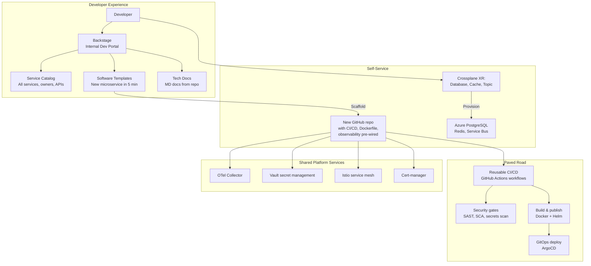

# Platform Engineering & Internal Developer Platform

## Category
DevOps, Platform Engineering, Internal Developer Platform, Backstage, Golden Paths, Self-Service Infrastructure

## Context

**Platform Engineering** is the discipline of building and operating internal developer platforms (IDPs) that enable application engineering teams to ship software faster with less cognitive overhead. Rather than each team managing their own Kubernetes clusters, pipelines, observability, and security controls, a central platform team builds **golden paths** — pre-built, opinionated solutions that encode best practices.

### Platform as a Product

The platform team treats internal developer teams as customers:
- Gather feedback and measure developer experience (DevEx)
- Build self-service capabilities — teams provision environments without the platform team
- Provide documentation, templates, and examples
- Measure success via DORA metrics: lead time, deployment frequency, MTTR, change failure rate

### DORA four key metrics

| Metric | Elite | High | Medium | Low | Measures |
|--------|-------|------|--------|-----|---------|
| **Deployment frequency** | On demand (multiple/day) | Weekly | Monthly | <6 months | Delivery speed |
| **Lead time for changes** | <1 hour | 1 day | 1 week | >6 months | Efficiency |
| **Change failure rate** | 0–5% | <10% | 10–15% | >15% | Quality |
| **Time to restore service** | <1 hour | <1 day | <1 week | >6 months | Recovery |

### Platform components

| Component | Purpose | Examples |
|-----------|---------|---------|
| **Service catalog** | Discoverability — what runs, who owns it, where the docs are | Backstage, Port |
| **Scaffolder / templates** | Golden-path service creation — new service in minutes | Backstage Software Templates |
| **Self-service environment provisioning** | Dev/staging environments on demand | Crossplane, Terraform Cloud, Cluster API |
| **Paved road CI/CD** | Shared pipeline templates — teams inherit security, quality gates | Reusable GitHub Actions workflows |
| **Shared platform services** | Observability, secret management, service mesh — consumed by all | OTel Collector, Vault, Istio |

### Crossplane (Control Plane for infrastructure)

Crossplane extends Kubernetes with **Composite Resource Definitions (XRDs)** — custom platform APIs that abstract cloud complexity. A developer requests a `Database` resource; Crossplane provisions the actual Azure PostgreSQL, IAM, networking, and monitoring.

---

## Pros

- **Self-service removes platform team bottlenecks**: Teams provision environments without raising tickets to platform.
- **Encoded best practices**: Golden path templates bake in security, observability, and compliance from day 0.
- **Consistent developer experience**: All services have the same CI/CD, observability, and deployment patterns — reduces context switching.
- **DORA metric improvement**: Platforms with golden paths consistently achieve Elite DORA metrics — deployment frequency and lead time improve most.
- **Reduced cognitive load**: Teams focus on domain problems, not infrastructure complexity.

---

## Cons

- **Platform team is a central dependency**: Poorly resourced platform teams become the bottleneck they were meant to eliminate.
- **Golden paths can become golden cages**: Over-opinionated platforms that don't allow escape hatches frustrate teams with unique requirements.
- **Adoption requires cultural change**: Platform as a product requires platform teams to think as product managers, not just engineers.
- **Initial investment is high**: Building Backstage, Crossplane, and paved-road pipelines requires significant upfront investment.
- **Versioning and migration**: When the platform changes, all consuming teams must upgrade — requires backward compatibility and deprecation cycles.

---

## Design Diagram



---

## Code Sample

### YAML — Backstage Software Template (Scaffold a new microservice)

```yaml
# backstage/templates/nodejs-microservice/template.yaml
apiVersion: scaffolder.backstage.io/v1beta3
kind: Template
metadata:
  name:        nodejs-microservice
  title:       "Node.js Microservice"
  description: "Create a production-ready Node.js microservice with CI/CD, observability, and security pre-configured"
  tags:
    - nodejs
    - typescript
    - recommended
spec:
  owner:          group:platform-engineering
  type:           service

  parameters:
    - title: Service Details
      required: [name, description, owner]
      properties:
        name:
          title:       Service Name
          type:        string
          pattern:     "^[a-z][a-z0-9-]{2,30}$"
          description: "Lowercase, hyphens only (e.g. payment-processor)"
        description:
          title: Service Description
          type:  string
        owner:
          title: Team Owner
          type:  string
          ui:field: OwnerPicker
          ui:options:
            allowedKinds: [Group]

    - title: Infrastructure
      properties:
        database:
          title:   Needs a PostgreSQL database?
          type:    boolean
          default: false
        cache:
          title:   Needs Redis cache?
          type:    boolean
          default: false

  steps:
    # 1. Create GitHub repo from template skeleton
    - id:     create-repo
      name:   Create GitHub Repository
      action: publish:github
      input:
        repoUrl:        "github.com?owner=myorg&repo=${{ parameters.name }}"
        description:    "${{ parameters.description }}"
        defaultBranch:  main
        repoVisibility: private
        topics:         ["microservice", "nodejs"]
        sourcePath:     skeleton/

    # 2. Provision infrastructure (if requested) via Crossplane XR
    - id:     provision-database
      name:   Provision PostgreSQL (if requested)
      if:     "${{ parameters.database }}"
      action: catalog:write
      input:
        entity:
          apiVersion: platform.example.com/v1alpha1
          kind:       Database
          metadata:
            name:      "${{ parameters.name }}-db"
            namespace: "${{ parameters.name }}"
          spec:
            engine:  postgres
            version: "15"
            size:    small

    # 3. Register in Backstage catalog
    - id:     register
      name:   Register in Service Catalog
      action: catalog:register
      input:
        repoContentsUrl: "${{ steps['create-repo'].output.repoContentsUrl }}"
        catalogInfoPath: "/catalog-info.yaml"

  output:
    links:
      - title:  Repository
        url:    "${{ steps['create-repo'].output.remoteUrl }}"
      - title:  Open in Backstage
        icon:   catalog
        entityRef: "${{ steps['register'].output.entityRef }}"
```

### YAML — Crossplane Composite Resource (Database XR)

```yaml
# crossplane/xrd/database.yaml
# Platform API: Developer requests a "Database", platform provisions the actual Azure PostgreSQL

apiVersion: apiextensions.crossplane.io/v1
kind: CompositeResourceDefinition
metadata:
  name: databases.platform.example.com
spec:
  group: platform.example.com
  names:
    kind:     Database
    plural:   databases
  versions:
    - name:          v1alpha1
      served:        true
      referenceable: true
      schema:
        openAPIV3Schema:
          type: object
          properties:
            spec:
              type: object
              properties:
                engine:
                  type: string
                  enum: [postgres, mysql]
                version:
                  type: string
                size:
                  type: string
                  enum: [small, medium, large]   # Platform-defined T-shirt sizes

---
# Composition: maps the abstract spec to real Azure resources
apiVersion: apiextensions.crossplane.io/v1
kind: Composition
metadata:
  name: databases.platform.example.com
spec:
  compositeTypeRef:
    apiVersion: platform.example.com/v1alpha1
    kind:       Database

  resources:
    # Azure PostgreSQL Flexible Server
    - name: postgresql-server
      base:
        apiVersion: dbforpostgresql.azure.upbound.io/v1beta1
        kind:       FlexibleServer
        spec:
          forProvider:
            location:             westeurope
            administratorLogin:   pgadmin
            skuName:              GP_Standard_D2ds_v4   # Overridden per size
            version:              "15"
            storageMb:            32768
            backupRetentionDays:  14
            geoRedundantBackup:   Enabled
          providerConfigRef:
            name: azure-provider

      patches:
        # Map T-shirt size to actual SKU
        - type:          CombineFromComposite
          fromFieldPath:  spec.size
          toFieldPath:    spec.forProvider.skuName
          transforms:
            - type: map
              map:
                small:  GP_Standard_D2ds_v4
                medium: GP_Standard_D4ds_v4
                large:  GP_Standard_D8ds_v4
```

### YAML — Reusable GitHub Actions Workflow (Paved Road CI)

```yaml
# .github/workflows/reusable-node-ci.yaml
# Paved-road CI — called from service repos with a single 'uses' line
# Enforces: lint, test, SAST, SCA, container build, Helm publish

name: Reusable Node.js CI

on:
  workflow_call:
    inputs:
      node-version:    { type: string, default: '22' }
      helm-chart-path: { type: string, default: './charts' }
    secrets:
      REGISTRY_TOKEN:   { required: true }
      SONAR_TOKEN:      { required: true }

jobs:
  quality:
    runs-on: ubuntu-latest
    steps:
      - uses: actions/checkout@v4
      - uses: actions/setup-node@v4
        with: { node-version: ${{ inputs.node-version }}, cache: npm }
      - run: npm ci --ignore-scripts
      - run: npm run lint && npm run typecheck
      - run: npm test -- --coverage
      - name: SonarCloud Scan
        uses: SonarSource/sonarcloud-github-action@master
        env: { SONAR_TOKEN: ${{ secrets.SONAR_TOKEN }} }

  security:
    runs-on: ubuntu-latest
    steps:
      - uses: actions/checkout@v4
      - name: Run Trivy SCA scan
        uses: aquasecurity/trivy-action@master
        with:
          scan-type: fs
          severity:  CRITICAL,HIGH
          exit-code: "1"

  build-publish:
    needs: [quality, security]
    uses: myorg/.github/.github/workflows/docker-build-push.yaml@main
    with:
      registry-token: ${{ secrets.REGISTRY_TOKEN }}
```

```yaml
# Service repo — consume the paved road workflow
# .github/workflows/ci.yaml (in each service repo)
name: CI
on: [push, pull_request]
jobs:
  ci:
    uses: myorg/.github/.github/workflows/reusable-node-ci.yaml@main
    secrets:
      REGISTRY_TOKEN: ${{ secrets.REGISTRY_TOKEN }}
      SONAR_TOKEN:    ${{ secrets.SONAR_TOKEN }}
```
