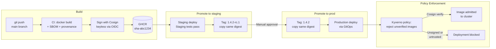

# Artifact & Release Management

## Category
DevOps, Artifact Management, Container Registry, Helm, Versioning, Release Notes, Supply Chain

## Context

**Artifact management** is the practice of storing, versioning, and distributing the build outputs of a software delivery pipeline: container images, Helm charts, JAR files, NPM packages, NuGet packages, and binaries. Rigorous artifact management ensures reproducibility, traceability, and supply chain integrity.

### Artifact types and registries

| Artifact | Format | Registry |
|----------|--------|---------|
| Container images | OCI / Docker | GitHub Container Registry (GHCR), ECR, ACR, Docker Hub |
| Helm charts | OCI or HTTP | GHCR, Artifact Hub, Artifactory, Harbor |
| npm packages | npm tarball | npm Registry, GitHub Packages, Artifactory |
| Maven/Gradle | JAR/WAR | Maven Central, Nexus, Artifactory |
| Python packages | Wheel/sdist | PyPI, Artifactory, Google Artifact Registry |
| Terraform modules | Git/OCI | Terraform Registry, GHCR OCI |

### Versioning strategy

| Approach | Format | Description |
|----------|--------|------------|
| **Semantic Versioning** | `1.4.2` | MAJOR.MINOR.PATCH — breaking.feature.bugfix |
| **Calendar versioning** | `2026.03.24` | Date-based — good for apps without API stability |
| **SHA-based** | `sha-abc1234` | Immutable — exactly identifies a commit |
| **Combination** | `1.4.2-sha-abc1234` | SemVer + traceability |

**Rule**: never mutate an existing tag. `:latest` should not be used in production manifests — always use an immutable tag.

### Artifact promotion model

```
Build → Dev registry (ghcr.io/myorg/api:sha-abc)
   ↓ Promotion (tests pass in staging)
Staging → Promoted tag (ghcr.io/myorg/api:1.4.2-rc.1)
   ↓ Promotion (E2E + manual approval)
Production → Release tag (ghcr.io/myorg/api:1.4.2)
```

The same image SHA is promoted through tags — never rebuilt. Immutability guarantees "what was tested is what was deployed."

### Supply chain integrity

| Control | Tool | What it ensures |
|---------|------|----------------|
| **SBOM** | Syft, Docker SBOM | Full list of dependencies in the artifact |
| **Provenance attestation** | SLSA, Sigstore | Cryptographic proof of build inputs and process |
| **Image signing** | Cosign (Sigstore) | Verify image has not been tampered with since signing |
| **Policy enforcement** | Kyverno, Gatekeeper | Block unsigned or unscanned images from running in cluster |

---

## Pros

- **Reproducibility**: Any past image tag can be redeployed identically — essential for rollback and forensics.
- **Supply chain security**: Signing + SBOM + provenance closes the loop on "did this image really come from our CI?"
- **Cache efficiency**: Immutable layers in OCI images enable global registry cache hits — faster builds.
- **Multi-environment promotion**: One artifact promoted through environments = confidence that staging tested exactly what runs in prod.
- **License compliance**: SBOM generated at build time enables license scanning and compliance reports.

---

## Cons

- **Registry storage costs grow**: Old images accumulate — requires lifecycle policies to clean up untagged and old digests.
- **SemVer discipline burden**: Conventional commit tooling + release automation is needed for consistent versioning.
- **SLSA attestation complexity**: Full SLSA Level 3 compliance requires hermetic builds in trusted execution environments.
- **Multi-registry synchronisation**: Organisation-wide artifact mirroring (for DR or geo-distribution) adds complexity.
- **Signing key management**: Cosign keys (or keyless signing via OIDC) must be managed securely; rotation adds operational burden.

---

## Design Diagram



---

## Code Sample

### YAML — GitHub Actions: SBOM + Sign + Attest in CI

```yaml
# .github/workflows/build-sign.yaml
# Build container image with SBOM, sign with Cosign (keyless), and attest provenance

name: Build, Sign & Attest

on:
  push:
    branches: [main]

jobs:
  build:
    runs-on: ubuntu-latest
    permissions:
      id-token:  write      # OIDC for keyless Cosign signing
      contents:  read
      packages:  write
      security-events: write

    outputs:
      digest: ${{ steps.push.outputs.digest }}

    steps:
      - uses: actions/checkout@v4

      - uses: docker/setup-buildx-action@v3

      - uses: docker/login-action@v3
        with:
          registry: ghcr.io
          username: ${{ github.actor }}
          password: ${{ secrets.GITHUB_TOKEN }}

      - name: Extract metadata
        id: meta
        uses: docker/metadata-action@v5
        with:
          images: ghcr.io/${{ github.repository }}
          tags: |
            type=sha,prefix=sha-
            type=semver,pattern={{version}}

      - name: Build and push
        id: push
        uses: docker/build-push-action@v5
        with:
          context:    .
          push:       true
          tags:       ${{ steps.meta.outputs.tags }}
          labels:     ${{ steps.meta.outputs.labels }}
          provenance: true    # SLSA provenance attestation embedded in manifest
          sbom:       true    # SPDX SBOM attached to image

      # Install Cosign for signing
      - uses: sigstore/cosign-installer@v3

      # Sign image with keyless Cosign (OIDC — no long-lived key to manage)
      - name: Sign image with Cosign
        run: |
          cosign sign --yes \
            ghcr.io/${{ github.repository }}@${{ steps.push.outputs.digest }}
        env:
          COSIGN_EXPERIMENTAL: "1"

      # Generate SBOM with Syft (richer than Docker's built-in)
      - name: Generate SBOM with Syft
        uses: anchore/sbom-action@v0
        with:
          image:          ghcr.io/${{ github.repository }}@${{ steps.push.outputs.digest }}
          format:         spdx-json
          output-file:    sbom.spdx.json

      # Attach SBOM as attestation to the image
      - name: Attest SBOM
        run: |
          cosign attest --yes \
            --predicate sbom.spdx.json \
            --type spdxjson \
            ghcr.io/${{ github.repository }}@${{ steps.push.outputs.digest }}
        env:
          COSIGN_EXPERIMENTAL: "1"
```

### YAML — Kyverno Policy: Enforce Signed Images

```yaml
# infrastructure/kubernetes/policy/require-signed-images.yaml
# Block any pod from using an image that hasn't been signed by our CI

apiVersion: kyverno.io/v1
kind: ClusterPolicy
metadata:
  name: require-signed-images
spec:
  validationFailureAction: Enforce   # Block — use Audit for initial rollout
  background:                true
  webhookTimeoutSeconds:     15

  rules:
    - name: check-image-signature
      match:
        any:
          - resources:
              kinds: [Pod]
              namespaces: [production, staging]

      verifyImages:
        - imageReferences:
            - "ghcr.io/myorg/*"    # Only verify our own images

          attestors:
            - count: 1
              entries:
                - keyless:
                    subject:  "https://github.com/myorg/*/.github/workflows/*.yaml@refs/heads/main"
                    issuer:   "https://token.actions.githubusercontent.com"
                    # Rekor transparency log — signed image is publicly verifiable
                    rekor:
                      url: https://rekor.sigstore.dev

          # Verify SBOM attestation is present
          attestations:
            - predicateType: https://spdx.dev/Document
              conditions:
                - all:
                    - key:      "{{ creationInfo.created }}"
                      operator: GreaterThanOrEquals
                      value:    "{{ time_add('{{ time_now() }}', '-720h') }}"   # SBOM < 30 days old
```

### TypeScript — Automated Semantic Versioning & Release Notes

```typescript
// scripts/release.ts
// Automated release: version bump + GitHub Release with changelog

import { execSync } from 'child_process';
import { Octokit } from '@octokit/rest';

const octokit = new Octokit({ auth: process.env.GITHUB_TOKEN });
const [owner, repo] = (process.env.GITHUB_REPOSITORY ?? '').split('/');

function git(cmd: string): string {
  return execSync(cmd, { encoding: 'utf8' }).trim();
}

interface CommitGroup {
  breaking: string[];
  features: string[];
  fixes:    string[];
}

async function createRelease(): Promise<void> {
  const lastTag = git('git describe --tags --abbrev=0 2>/dev/null || echo v0.0.0');

  // Parse conventional commits since last tag
  const rawCommits = git(`git log ${lastTag}..HEAD --pretty=format:"%s"`).split('\n').filter(Boolean);

  const groups: CommitGroup = { breaking: [], features: [], fixes: [] };
  for (const msg of rawCommits) {
    if (msg.includes('!') || msg.startsWith('BREAKING CHANGE')) groups.breaking.push(msg);
    else if (msg.startsWith('feat')) groups.features.push(msg);
    else if (msg.startsWith('fix'))  groups.fixes.push(msg);
  }

  // Determine bump type
  const bump: 'major' | 'minor' | 'patch' =
    groups.breaking.length > 0 ? 'major' :
    groups.features.length  > 0 ? 'minor' : 'patch';

  // Calculate next version
  const [maj, min, pat] = lastTag.replace(/^v/, '').split('.').map(Number);
  const next = bump === 'major' ? `${maj + 1}.0.0` :
               bump === 'minor' ? `${maj}.${min + 1}.0` :
                                  `${maj}.${min}.${pat + 1}`;

  // Build release notes
  const notes = [
    groups.breaking.length ? `## ⚠️ Breaking Changes\n${groups.breaking.map(c => `- ${c}`).join('\n')}` : '',
    groups.features.length  ? `## ✨ Features\n${groups.features.map(c => `- ${c}`).join('\n')}` : '',
    groups.fixes.length     ? `## 🐛 Bug Fixes\n${groups.fixes.map(c => `- ${c}`).join('\n')}` : '',
  ].filter(Boolean).join('\n\n');

  // Create GitHub Release
  await octokit.rest.repos.createRelease({
    owner, repo,
    tag_name:         `v${next}`,
    name:             `v${next}`,
    body:             notes,
    draft:            false,
    prerelease:       false,
    generate_release_notes: false,
  });

  console.log(`Released v${next}`);
}

createRelease();
```
