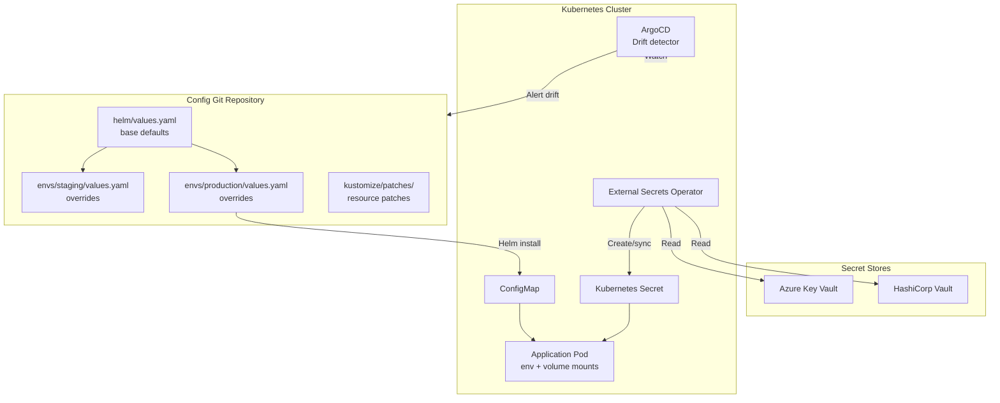

# Configuration Management

## Category
DevOps, Configuration Management, Helm, Kustomize, Ansible, External Secrets, Config Drift, GitOps

## Context

**Configuration management** is the discipline of systematically handling application and infrastructure configuration so that any environment can be reproduced consistently and any drift from desired state is detected and corrected. It spans three layers:

1. **Application configuration** — feature flags, connection strings, timeouts, limits.
2. **Kubernetes configuration** — Helm values, Kustomize overlays, ConfigMaps.
3. **Infrastructure/OS configuration** — Ansible playbooks for VM OS hardening, package installation, service configuration.

### Configuration hierarchy (Kubernetes)

```
helm chart defaults (values.yaml)
    └── base overlay (values.base.yaml)
        ├── staging overlay (values.staging.yaml)
        └── production overlay (values.production.yaml)
            └── runtime overrides (External Secrets from Vault/Azure Key Vault)
```

### Configuration sources

| Source | What it holds | How it is accessed |
|--------|--------------|-------------------|
| Git (Helm values / Kustomize) | Non-sensitive config: replica counts, image tags, resource limits | GitOps pull |
| Kubernetes ConfigMap | Non-sensitive app runtime config: feature toggles, URLs | Mounted as env/volume |
| Kubernetes Secret | Sensitive: tokens, passwords | From External Secrets Operator |
| Azure Key Vault / HashiCorp Vault | Canonical secret store | ESO `SecretStore` custom resource |
| AWS SSM Parameter Store / Secrets Manager | Cloud-native secret store | ESO `SecretStore` or AWS SDK |

### Config drift

**Drift** occurs when the actual state of a system diverges from its declared state — e.g., a manual `kubectl edit`, an Ansible out-of-band change, or an auto-scaling event that modifies replicas.

| Detection tool | Scope | How |
|---------------|-------|-----|
| ArgoCD / Flux | K8s manifests | Continuous reconciliation, drift alert |
| `terraform plan` in CI | Infrastructure | Shows diff vs state file |
| `ansible-lint` + idempotent playbooks | VM/OS config | Re-run on schedule — detect changes |
| Kyverno audit mode | K8s resource policies | Report violations without blocking |

---

## Pros

- **Reproducibility**: Every environment built from the same Helm chart with a known values overlay — no snowflake servers.
- **Auditability**: All config changes are code changes in Git — full history, PR review, blame.
- **Secret separation**: Secrets never committed to Git — External Secrets Operator syncs from a trusted vault at runtime.
- **Drift detection**: GitOps controllers continuously compare declared vs live state and report or auto-remediate.
- **Environment parity**: Staging and prod differ only in explicit override values — reduces "works on my machine" failures.

---

## Cons

- **Helm complexity**: Template syntax and complex values hierarchies have a steep learning curve; debugging with `--dry-run` is essential.
- **Kustomize fragility**: Strategic merge patches can be order-sensitive and hard to predict for deep nested objects.
- **Ansible idempotency burden**: Every task must be written so that re-running it produces the same result — requires discipline.
- **External Secrets latency**: Secrets rotation requires either a pod restart or a sidecar refresh loop; stale cached values can exist for the rotation window.
- **Config sprawl**: Large organisations accumulate many overlays and patch files that become hard to reason about without strong naming conventions.

---

## Design Diagram



---

## Code Sample

### YAML — Helm values hierarchy

```yaml
# helm/values.yaml  — chart defaults (committed, non-sensitive)
replicaCount: 1

image:
  repository: ghcr.io/myorg/payments-api
  pullPolicy: IfNotPresent
  tag: ""   # Overridden per environment via --set or overlay

service:
  type: ClusterIP
  port: 8080

resources:
  requests: { cpu: 100m, memory: 128Mi }
  limits:   { cpu: 500m, memory: 512Mi }

autoscaling:
  enabled:                        false
  minReplicas:                    2
  maxReplicas:                    10
  targetCPUUtilizationPercentage: 70

config:
  logLevel:            info
  dbPoolMin:           2
  dbPoolMax:           10
  httpTimeoutSeconds:  30
  featureNewCheckout:  false

# Sensitive values are NOT set here — sourced from External Secrets at runtime
```

```yaml
# helm/envs/production/values.yaml  — production overlay
replicaCount: 3

image:
  tag: "1.4.2"   # Pinned — GitOps promotion updates this field

autoscaling:
  enabled:     true
  minReplicas: 3
  maxReplicas: 30

resources:
  requests: { cpu: 250m, memory: 256Mi }
  limits:   { cpu: 1,    memory: 1Gi  }

config:
  logLevel:            warn   # Reduced verbosity in production
  dbPoolMax:           50
  featureNewCheckout:  true   # Graduated to 100% in production
```

### YAML — External Secrets Operator: sync from Azure Key Vault

```yaml
# kubernetes/production/secret-store.yaml
# Connect ESO to Azure Key Vault via workload identity (no credentials in cluster)

apiVersion: external-secrets.io/v1beta1
kind: SecretStore
metadata:
  name:      azure-keyvault
  namespace: payments
spec:
  provider:
    azurekv:
      vaultUrl:   https://payments-prod-kv.vault.azure.net
      authType:   WorkloadIdentity          # Uses pod's service account OIDC token
      serviceAccountRef:
        name: payments-api-sa               # Bound to Azure Managed Identity

---
# kubernetes/production/external-secret.yaml
# Sync specific Key Vault secrets into a Kubernetes Secret

apiVersion: external-secrets.io/v1beta1
kind: ExternalSecret
metadata:
  name:      payments-api-secrets
  namespace: payments
spec:
  refreshInterval: 5m                        # Re-sync every 5 minutes — picks up rotations

  secretStoreRef:
    name: azure-keyvault
    kind: SecretStore

  target:
    name:             payments-api-secret     # Kubernetes Secret name created/updated
    creationPolicy:   Owner                  # ESO owns the Secret lifecycle

  data:
    - secretKey:  DATABASE_URL               # Key in Kubernetes Secret
      remoteRef:
        key:      payments-db-url            # Key Vault secret name
    - secretKey:  JWT_SECRET
      remoteRef:
        key:      payments-jwt-secret
    - secretKey:  STRIPE_API_KEY
      remoteRef:
        key:      payments-stripe-key
```

### YAML — Kustomize patch: production resource tuning

```yaml
# kustomize/overlays/production/kustomization.yaml

apiVersion: kustomize.config.k8s.io/v1beta1
kind: Kustomization

resources:
  - ../../base

# Patch to increase resource limits for production without modifying the base
patches:
  - target:
      kind:      Deployment
      name:      payments-api
    patch: |-
      - op:    replace
        path:  /spec/template/spec/containers/0/resources/limits/memory
        value: 2Gi
      - op:    replace
        path:  /spec/template/spec/containers/0/resources/limits/cpu
        value: "2"

# Override the replica count via ConfigMap generator
configMapGenerator:
  - name: payments-config
    literals:
      - LOG_LEVEL=warn
      - DB_POOL_MAX=50
```

### YAML — Ansible playbook: idempotent VM hardening

```yaml
# ansible/playbooks/harden-node.yaml
# Idempotent OS hardening for Linux VMs — safe to re-run at any time

- name: Harden Linux node
  hosts: all
  become: true
  vars:
    required_packages:
      - unattended-upgrades
      - fail2ban
      - auditd

  tasks:
    - name: Install required security packages
      ansible.builtin.package:
        name:  "{{ required_packages }}"
        state: present

    - name: Disable root SSH login
      ansible.builtin.lineinfile:
        path:   /etc/ssh/sshd_config
        regexp: "^PermitRootLogin"
        line:   "PermitRootLogin no"
        state:  present
      notify: Restart sshd

    - name: Set SSH idle timeout (600 seconds)
      ansible.builtin.lineinfile:
        path:   /etc/ssh/sshd_config
        regexp: "^ClientAliveInterval"
        line:   "ClientAliveInterval 600"
        state:  present
      notify: Restart sshd

    - name: Enable UFW firewall and default deny
      community.general.ufw:
        state:   enabled
        policy:  deny
        direction: incoming

    - name: Allow SSH through UFW
      community.general.ufw:
        rule:  allow
        port:  "22"
        proto: tcp

    - name: Enable auditd for compliance logging
      ansible.builtin.systemd:
        name:    auditd
        state:   started
        enabled: true

    - name: Enable fail2ban
      ansible.builtin.systemd:
        name:    fail2ban
        state:   started
        enabled: true

  handlers:
    - name: Restart sshd
      ansible.builtin.systemd:
        name:  sshd
        state: restarted
```

### TypeScript — Runtime configuration validation

```typescript
// src/config/index.ts
// Validate all required configuration at startup — fail fast if anything is missing

import { z } from 'zod';

const configSchema = z.object({
  DATABASE_URL:        z.string().url(),
  JWT_SECRET:          z.string().min(32, 'JWT_SECRET must be at least 32 characters'),
  PORT:                z.coerce.number().int().min(1).max(65535).default(8080),
  DB_POOL_MAX:         z.coerce.number().int().positive().default(10),
  HTTP_TIMEOUT_SEC:    z.coerce.number().int().positive().default(30),
  LOG_LEVEL:           z.enum(['debug', 'info', 'warn', 'error']).default('info'),
  FEATURE_NEW_CHECKOUT: z.enum(['true', 'false']).transform(v => v === 'true').default('false'),
});

export type Config = z.infer<typeof configSchema>;

// Parse once at module load — throws on validation failure, preventing startup
const parsed = configSchema.safeParse(process.env);

if (!parsed.success) {
  console.error('Invalid configuration:');
  for (const issue of parsed.error.issues) {
    console.error(`  ${issue.path.join('.')}: ${issue.message}`);
  }
  process.exit(1);
}

export const config: Readonly<Config> = Object.freeze(parsed.data);
```
