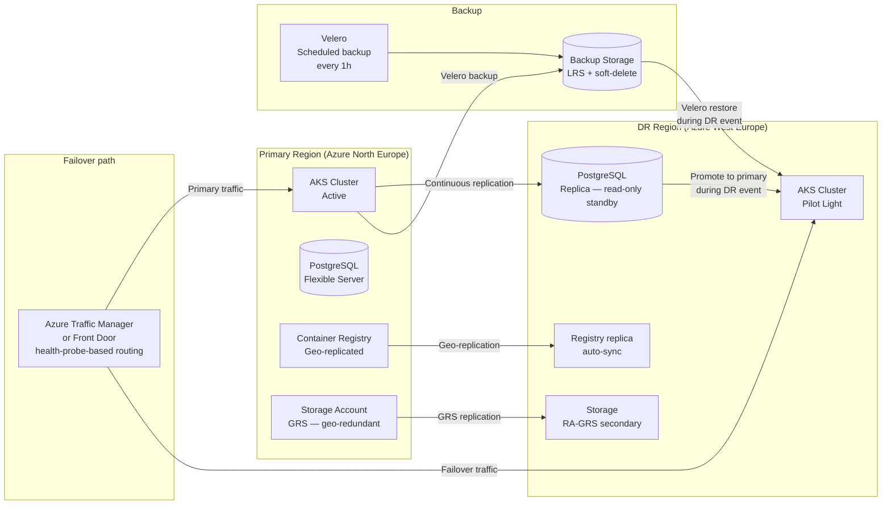

# Disaster Recovery & Business Continuity

## Category
DevOps, Disaster Recovery, Business Continuity, Backup, Failover, Velero, Cross-region, RTO, RPO

## Context

**Disaster Recovery (DR)** defines processes and systems to restore service operation after a catastrophic failure — hardware failure, data corruption, cloud-region outage, or accidental deletion. **Business Continuity (BC)** is the broader practice of ensuring critical business operations survive and recover from disruptions.

### Key metrics

| Metric | Definition | Example |
|--------|-----------|---------|
| **RTO** (Recovery Time Objective) | Maximum acceptable downtime — how quickly must we be online? | 30 minutes |
| **RPO** (Recovery Point Objective) | Maximum acceptable data loss — how old can restored data be? | 5 minutes |
| **MTTR** (Mean Time to Recovery) | Average time to recover from an incident — operational baseline | 45 minutes |
| **Availability** | 1 - (downtime / total time) | 99.95% = 4.38 hr downtime/yr |

### DR patterns

| Pattern | RTO | RPO | Cost | Description |
|---------|-----|-----|------|-------------|
| **Backup & Restore** | Hours | Hours | $ | Full backup to cold storage; restore on failure |
| **Pilot Light** | 30–60 min | Minutes | $$ | Core services always running; scaled up on failure |
| **Warm Standby** | 5–30 min | Seconds | $$$ | Reduced-capacity copy always running; scaled to full on failure |
| **Active-Active** | Seconds | Zero | $$$$ | Full capacity in 2+ regions; traffic shared continuously |

### Kubernetes-specific DR

| Resource | Backup tool | Restore target |
|----------|-------------|---------------|
| Kubernetes objects (Deployments, ConfigMaps, RBAC) | **Velero** | Same or new cluster |
| Persistent Volume data | Velero + CSI snapshots | New PV from snapshot |
| Helm releases | Helm chart + GitOps | Re-apply charts to new cluster |
| Container images | Registry replication | Mirror to secondary registry |
| Database (PostgreSQL) | pg_dump + Azure Backup | Restore to new server |

---

## Pros

- **Business resilience**: Defined RTO/RPO targets give clear engineering goals and SLA commitments to customers.
- **Automated runbooks**: Scripted failover is faster and less error-prone than manual steps during high-stress incidents.
- **Regular testing**: DR fire drills (GameDays) expose gaps before real incidents — treat runbooks as living documents.
- **Data protection**: Immutable backups in geographically separate storage protect against ransomware and accidental deletion.
- **Compliance alignment**: SOC 2, ISO 27001, PCI-DSS all require documented and tested DR plans.

---

## Cons

- **Cost**: Warm standby or active-active doubles (or more) infrastructure spend.
- **Data consistency challenges**: Active-active requires distributed transaction or eventual consistency — complex for stateful services.
- **Runbook drift**: DR procedures written once and never tested drift out of date as the system evolves.
- **Blast radius testing gaps**: Real disasters often combine multiple failure modes that individual tests never simulate.
- **RTO/RPO trade-offs**: Tighter targets require more expensive solutions — requires deliberate business decision, not just technical choice.

---

## Design Diagram



---

## Code Sample

### YAML — Velero scheduled backup (Kubernetes objects + PV snapshots)

```yaml
# kubernetes/dr/velero-schedule.yaml
# Back up the entire 'payments' namespace every hour with 30-day retention

apiVersion: velero.io/v1
kind: Schedule
metadata:
  name:      payments-hourly-backup
  namespace: velero
spec:
  schedule: "0 * * * *"   # Every hour on the hour (cron)

  template:
    includedNamespaces:
      - payments
      - auth
      - gateway

    # PV data backed up via CSI volume snapshots
    snapshotVolumes:            true
    volumeSnapshotLocations:
      - azure-east              # Defined in BackupStorageLocation

    storageLocation: azure-east   # BackupStorageLocation pointing to Azure Blob

    # Retain backups for 30 days
    ttl: 720h0m0s

    # Exclude ephemeral / regeneratable data to reduce backup size
    excludedResources:
      - events
      - pods          # Managed by Deployments — no need to back up
      - replicasets   # Managed by Deployments

    labelSelector:
      matchExpressions:
        - key:      velero.io/exclude
          operator: DoesNotExist   # Respect opt-out label on resources

---
# Restore object (applied manually during DR)
# velero restore create --from-schedule payments-hourly-backup --namespace-mappings payments:payments
```

### Bash — DR failover runbook script

```bash
#!/usr/bin/env bash
# dr-failover.sh
# Orchestrates failover of the payments service to the DR region.
# Prerequisites: az CLI, kubectl, jq -- run with DR_REGION and DR_RG set.
# Usage: DR_REGION=westeurope DR_RG=myorg-dr bash dr-failover.sh

set -euo pipefail

PRIMARY_RG="${PRIMARY_RG:-myorg-prod}"
DR_RG="${DR_RG:?DR_RG must be set}"
DR_REGION="${DR_REGION:?DR_REGION must be set}"

PG_SERVER="${PG_SERVER:-payments-pg-prod}"
AKS_DR="${AKS_DR:-payments-aks-dr}"
VELERO_SCHEDULE="${VELERO_SCHEDULE:-payments-hourly-backup}"

log() { echo "[$(date -u +%H:%M:%S)] $*"; }

# ─── Step 1: Promote PostgreSQL read replica to primary ───────────────────────
log "Promoting PostgreSQL replica in DR region to primary..."
az postgres flexible-server replica stop-replication \
  --resource-group "$DR_RG" \
  --name           "${PG_SERVER}-dr" \
  --yes

log "PostgreSQL promoted. Waiting for server to become ready..."
az postgres flexible-server wait \
  --resource-group "$DR_RG" \
  --name           "${PG_SERVER}-dr" \
  --updated

# ─── Step 2: Point kubectl to DR cluster ──────────────────────────────────────
log "Configuring kubectl for DR AKS cluster..."
az aks get-credentials \
  --resource-group "$DR_RG" \
  --name           "$AKS_DR" \
  --overwrite-existing

# ─── Step 3: Restore latest Velero backup ─────────────────────────────────────
log "Finding latest successful Velero backup..."
LATEST_BACKUP=$(velero backup get --selector velero.io/schedule-name="${VELERO_SCHEDULE}" \
  -o json | jq -r '.items | sort_by(.metadata.creationTimestamp) | last | .metadata.name')

log "Restoring backup: ${LATEST_BACKUP}"
velero restore create "dr-restore-$(date +%Y%m%d%H%M)" \
  --from-backup "${LATEST_BACKUP}" \
  --wait

# ─── Step 4: Update DB connection string secret in DR cluster ─────────────────
log "Updating DATABASE_URL secret to point to promoted DR PostgreSQL..."
DR_PG_HOST=$(az postgres flexible-server show \
  --resource-group "$DR_RG" \
  --name           "${PG_SERVER}-dr" \
  --query          "fullyQualifiedDomainName" -o tsv)

kubectl create secret generic payments-api-secret \
  --namespace payments \
  --from-literal "DATABASE_URL=postgresql://paymentsapp@${DR_PG_HOST}/paymentsdb?sslmode=require" \
  --dry-run=client -o yaml | kubectl apply -f -

# ─── Step 5: Scale up DR workloads ────────────────────────────────────────────
log "Scaling DR deployments to production capacity..."
kubectl scale deployment/payments-api --replicas=3 -n payments
kubectl scale deployment/payments-worker --replicas=2 -n payments

# ─── Step 6: Update Traffic Manager to route to DR ────────────────────────────
log "Failing over Traffic Manager endpoint to DR region..."
az network traffic-manager endpoint update \
  --resource-group "$PRIMARY_RG" \
  --profile-name   "payments-tm" \
  --name           "primary-endpoint" \
  --type           azureEndpoints \
  --endpoint-status Disabled

az network traffic-manager endpoint update \
  --resource-group "$DR_RG" \
  --profile-name   "payments-tm" \
  --name           "dr-endpoint" \
  --type           azureEndpoints \
  --endpoint-status Enabled

log "Failover complete. Verify: curl https://payments.myorg.com/health"
```

### TypeScript — DR health check and automated alerting

```typescript
// scripts/dr-health-check.ts
// Runs in monitoring pipeline — verifies both regions are healthy
// Emits metrics to Prometheus Pushgateway for Grafana dashboard

import https from 'https';

interface RegionHealth {
  region:      string;
  endpoint:    string;
  healthy:     boolean;
  latencyMs:   number;
  statusCode?: number;
}

/** Probe an HTTP endpoint and measure latency */
async function probeEndpoint(region: string, url: string): Promise<RegionHealth> {
  const start = Date.now();
  return new Promise(resolve => {
    const req = https.get(url, { timeout: 5000 }, res => {
      const latencyMs  = Date.now() - start;
      const statusCode = res.statusCode ?? 0;
      resolve({ region, endpoint: url, healthy: statusCode === 200, latencyMs, statusCode });
      res.resume(); // Drain response body to free socket
    });
    req.on('error',   () => resolve({ region, endpoint: url, healthy: false, latencyMs: Date.now() - start }));
    req.on('timeout', () => { req.destroy(); resolve({ region, endpoint: url, healthy: false, latencyMs: 5000 }); });
  });
}

/** Format Prometheus exposition format for Pushgateway */
function toPrometheusText(results: RegionHealth[]): string {
  const lines: string[] = ['# HELP region_health_up Regional endpoint health (1=healthy, 0=degraded)'];
  lines.push('# TYPE region_health_up gauge');
  for (const r of results) {
    lines.push(`region_health_up{region="${r.region}"} ${r.healthy ? 1 : 0}`);
    lines.push(`region_health_latency_ms{region="${r.region}"} ${r.latencyMs}`);
  }
  return lines.join('<br/>') + '<br/>';
}

async function checkDRHealth(): Promise<void> {
  const probes: [string, string][] = [
    ['north-europe', 'https://payments-ne.myorg.com/health'],
    ['west-europe',  'https://payments-we.myorg.com/health'],
  ];

  const results = await Promise.all(probes.map(([r, u]) => probeEndpoint(r, u)));

  for (const r of results) {
    const status = r.healthy ? 'HEALTHY' : 'DEGRADED';
    console.log(`[${r.region}] ${status} — ${r.latencyMs}ms (HTTP ${r.statusCode ?? 'timeout'})`);
  }

  const degradedRegions = results.filter(r => !r.healthy);
  if (degradedRegions.length > 0) {
    const regions = degradedRegions.map(r => r.region).join(', ');
    console.error(`ALERT: Regions degraded — ${regions}. Verify failover readiness.`);
    // Return non-zero so CI/monitoring pipeline can trigger alert
    process.exitCode = 1;
  }
}

checkDRHealth();
```
