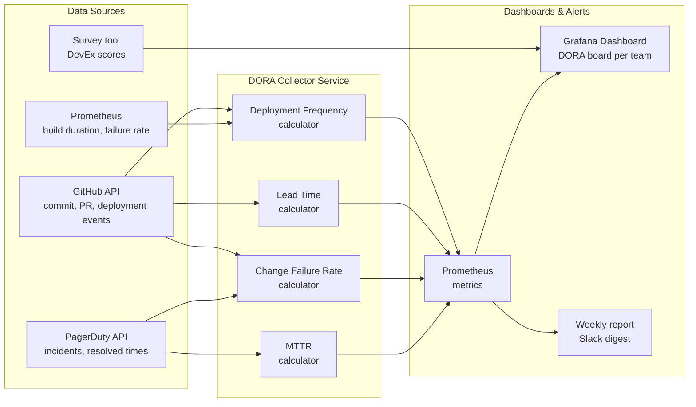

# DevOps Metrics & Continuous Improvement

## Category
DevOps, DORA Metrics, Value Stream Mapping, Developer Experience, Lead Time, Deployment Frequency, MTTR, Change Failure Rate

## Context

**Measuring DevOps performance** enables teams to understand the impact of their practices and investments, make data-driven decisions, and create a culture of continuous improvement. Without metrics, "DevOps transformation" is indistinguishable from activity without progress.

### DORA Four Key Metrics (research-backed)

The DORA (DevOps Research and Assessment) programme identified four metrics that distinguish elite engineering organisations:

| Metric | Definition | Elite | High | Medium | Low |
|--------|-----------|-------|------|--------|-----|
| **Deployment Frequency** | How often code is deployed to production | On demand (multiple/day) | 1/week–1/month | 1/month–1/6months | < Once per 6 months |
| **Lead Time for Changes** | Commit → production | < 1 hour | 1 day–1 week | 1 week–1 month | > 6 months |
| **Change Failure Rate** | % of deployments causing incident | 0–5% | 5–10% | — | > 15% |
| **MTTR** | Mean time to recover from incident | < 1 hour | < 1 day | 1 day–1 week | > 1 week |

### Additional signals

| Metric | Value it shows |
|--------|---------------|
| **Toil ratio** | % of work that is manual, repetitive — target < 50% |
| **Mean time to detect (MTTD)** | Alerting effectiveness — faster = healthier observability |
| **Failed build rate** | CI quality — high rate = flaky tests or poor test design |
| **Developer Experience (DevEx)** | Survey score — productivity, toolchain satisfaction, flow state |
| **On-call burden** | Pages per engineer per week — proxy for system quality |
| **PR cycle time** | Time from PR open to merge — reflects review process efficiency |

### Continuous improvement loop

```
Measure → (DORA / DevEx surveys / system metrics)
  ↓
Analyse → (Value Stream Mapping — find waste and wait time)
  ↓
Hypothesise → (which practice change will move the metric?)
  ↓
Implement → (small, measurable change)
  ↓
Measure again → (did the metric move in the right direction?)
```

---

## Pros

- **Evidence over intuition**: DORA metrics replace anecdote-driven planning with reproducible data — easy to prioritise investments.
- **Culture of improvement**: Publicly visible metrics create shared accountability; teams celebrate measurable improvement.
- **Benchmarking**: DORA elite/high/medium/low classifications allow comparison against industry peers.
- **Feedback loop**: Short, measurable cycles enable rapid hypothesis testing — practices that don't move the metric are abandoned.
- **Investor/exec communication**: DORA improvements translate into business outcomes (faster feature delivery, fewer incidents, lower cost).

---

## Cons

- **Gaming risk**: If metrics become targets, teams optimise the metric rather than the behaviour — e.g., splitting commits artificially to inflate deployment frequency.
- **Data collection overhead**: Accurate lead-time measurement requires instrumentation of the full delivery pipeline (commit timestamp → deployment timestamp).
- **Correlation ≠ impact**: A metric improving after a process change does not always prove causation — other factors may be responsible.
- **Survey fatigue**: DevEx surveys lose response quality if run too frequently.
- **Context sensitivity**: A 1×/week deployment frequency may be elite for a regulated bank but poor for a SaaS startup — always interpret in context.

---

## Design Diagram



---

## Code Sample

### TypeScript — DORA metrics collector from GitHub & PagerDuty

```typescript
// scripts/dora-metrics.ts
// Collects DORA four-key metrics and emits Prometheus-compatible gauges

import { Octokit }        from '@octokit/rest';
import { DefaultAzureCredential } from '@azure/identity';

const octokit = new Octokit({ auth: process.env.GITHUB_TOKEN });
const [owner, repo] = (process.env.GITHUB_REPOSITORY ?? '').split('/');

// ─────────────────────────────────────────────────
// 1. Deployment Frequency (deployments per day over last 30 days)
// ─────────────────────────────────────────────────
async function deploymentFrequency(): Promise<number> {
  const since = new Date(Date.now() - 30 * 24 * 60 * 60 * 1000).toISOString();

  const deployments = await octokit.paginate(
    octokit.rest.repos.listDeployments,
    { owner, repo, environment: 'production', per_page: 100 },
  );

  const recentSuccessful = deployments.filter(d => new Date(d.created_at) > new Date(since));
  const deploysPerDay = recentSuccessful.length / 30;
  console.log(`Deployment frequency: ${deploysPerDay.toFixed(2)}/day (${recentSuccessful.length} in 30 days)`);
  return deploysPerDay;
}

// ─────────────────────────────────────────────────
// 2. Lead Time for Changes (median: commit merge → production deploy)
// ─────────────────────────────────────────────────
async function leadTimeForChanges(): Promise<number> {
  const deployments = await octokit.paginate(
    octokit.rest.repos.listDeployments,
    { owner, repo, environment: 'production', per_page: 20 },
  );

  const leadTimes: number[] = [];

  for (const deployment of deployments.slice(0, 10)) {
    // The SHA deployed
    const sha = deployment.sha;

    // Find the PR that introduced this SHA
    const prs = await octokit.rest.repos.listPullRequestsAssociatedWithCommit({ owner, repo, commit_sha: sha });
    const pr = prs.data[0];
    if (!pr?.merged_at) continue;

    const mergedAt  = new Date(pr.merged_at).getTime();
    const deployedAt = new Date(deployment.created_at).getTime();
    const leadTimeHours = (deployedAt - mergedAt) / 3_600_000;
    leadTimes.push(leadTimeHours);
  }

  if (leadTimes.length === 0) return 0;
  leadTimes.sort((a, b) => a - b);
  const median = leadTimes[Math.floor(leadTimes.length / 2)];
  console.log(`Lead time (median): ${median.toFixed(1)} hours`);
  return median;
}

// ─────────────────────────────────────────────────
// 3. Change Failure Rate (% of deployments that caused an incident — via PagerDuty)
// ─────────────────────────────────────────────────
async function changeFailureRate(): Promise<number> {
  // PagerDuty API: fetch incidents in last 30 days with 'deployment' tag
  const since = new Date(Date.now() - 30 * 24 * 60 * 60 * 1000).toISOString();

  const incidentsRes = await fetch(
    `https://api.pagerduty.com/incidents?since=${since}&statuses[]=resolved&tag_names[]=deployment-caused`,
    { headers: { Authorization: `Token token=${process.env.PAGERDUTY_API_KEY}`, Accept: 'application/json' } },
  );
  const { incidents } = await incidentsRes.json() as { incidents: unknown[] };

  const deployments = await octokit.paginate(
    octokit.rest.repos.listDeployments,
    { owner, repo, environment: 'production', per_page: 100 },
  );
  const recentDeploys = deployments.filter(d => new Date(d.created_at) > new Date(since));

  const cfr = recentDeploys.length > 0 ? (incidents.length / recentDeploys.length) * 100 : 0;
  console.log(`Change failure rate: ${cfr.toFixed(1)}% (${incidents.length} incidents / ${recentDeploys.length} deploys)`);
  return cfr;
}

// ─────────────────────────────────────────────────
// 4. Emit metrics to stdout in Prometheus text format for Pushgateway
// ─────────────────────────────────────────────────
async function emitMetrics(): Promise<void> {
  const [df, lt, cfr] = await Promise.all([
    deploymentFrequency(),
    leadTimeForChanges(),
    changeFailureRate(),
  ]);

  const team = process.env.TEAM_NAME ?? 'unknown';

  const lines = [
    `# HELP dora_deployment_frequency_per_day Deployments to production per day (30-day window)`,
    `# TYPE dora_deployment_frequency_per_day gauge`,
    `dora_deployment_frequency_per_day{team="${team}"} ${df.toFixed(4)}`,
    `# HELP dora_lead_time_hours Median lead time for changes in hours`,
    `# TYPE dora_lead_time_hours gauge`,
    `dora_lead_time_hours{team="${team}"} ${lt.toFixed(4)}`,
    `# HELP dora_change_failure_rate_percent Change failure rate as a percentage`,
    `# TYPE dora_change_failure_rate_percent gauge`,
    `dora_change_failure_rate_percent{team="${team}"} ${cfr.toFixed(4)}`,
  ];

  console.log('\n--- Prometheus output ---');
  console.log(lines.join('\n'));

  // Push to Pushgateway (if PUSHGATEWAY_URL set)
  const pgUrl = process.env.PUSHGATEWAY_URL;
  if (pgUrl) {
    await fetch(`${pgUrl}/metrics/job/dora-metrics/instance/${team}`, {
      method: 'POST',
      body:   lines.join('\n'),
      headers: { 'Content-Type': 'text/plain' },
    });
  }
}

emitMetrics();
```

### YAML — Grafana dashboard as code (DORA panel definitions)

```yaml
# grafana/dashboards/dora.yaml
# ConfigMap loaded by Grafana sidecar for automatic dashboard provisioning

apiVersion: v1
kind: ConfigMap
metadata:
  name:      dora-dashboard
  namespace: monitoring
  labels:
    grafana_dashboard: "1"   # Triggers sidecar to import this dashboard

data:
  dora.json: |
    {
      "title": "DORA Four Key Metrics",
      "uid":   "dora-metrics",
      "time":  {"from": "now-30d", "to": "now"},
      "panels": [
        {
          "type":         "stat",
          "title":        "Deployment Frequency (per day)",
          "description":  "Elite: >1/day | High: 1/week–1/day",
          "targets": [{"expr": "avg(dora_deployment_frequency_per_day)", "legendFormat": "Deployments/day"}],
          "fieldConfig": {
            "defaults": {
              "thresholds": {
                "steps": [
                  {"value": 0,    "color": "red"},
                  {"value": 0.14, "color": "yellow"},
                  {"value": 1,    "color": "green"}
                ]
              }
            }
          }
        },
        {
          "type":  "stat",
          "title": "Lead Time (hours)",
          "description": "Elite: <1h | High: <1 day",
          "targets": [{"expr": "avg(dora_lead_time_hours)", "legendFormat": "Hours"}],
          "fieldConfig": {
            "defaults": {
              "thresholds": {
                "steps": [
                  {"value": 0,   "color": "green"},
                  {"value": 24,  "color": "yellow"},
                  {"value": 168, "color": "red"}
                ]
              }
            }
          }
        },
        {
          "type":  "stat",
          "title": "Change Failure Rate (%)",
          "description": "Elite: 0–5% | Low: >15%",
          "targets": [{"expr": "avg(dora_change_failure_rate_percent)", "legendFormat": "CFR %"}],
          "fieldConfig": {
            "defaults": {
              "thresholds": {
                "steps": [
                  {"value": 0,  "color": "green"},
                  {"value": 10, "color": "yellow"},
                  {"value": 15, "color": "red"}
                ]
              }
            }
          }
        }
      ]
    }
```

### YAML — GitHub Actions: DORA metrics collection workflow

```yaml
# .github/workflows/dora-metrics.yaml
# Runs daily and on deployment events to update DORA dashboards

name: DORA Metrics Collector

on:
  deployment_status:            # Triggers on every production deployment
  schedule:
    - cron: "0 6 * * *"        # Daily at 06:00 UTC for 30-day rolling averages

jobs:
  collect:
    runs-on: ubuntu-latest
    if: ${{ github.event_name == 'schedule' || github.event.deployment_status.environment == 'production' }}

    steps:
      - uses: actions/checkout@v4

      - uses: actions/setup-node@v4
        with:
          node-version: "20"
          cache: npm

      - run: npm ci

      - name: Collect and publish DORA metrics
        env:
          GITHUB_TOKEN:      ${{ secrets.GITHUB_TOKEN }}
          PAGERDUTY_API_KEY: ${{ secrets.PAGERDUTY_API_KEY }}
          PUSHGATEWAY_URL:   ${{ secrets.PUSHGATEWAY_URL }}
          TEAM_NAME:         ${{ vars.TEAM_NAME }}
          GITHUB_REPOSITORY: ${{ github.repository }}
        run: npx ts-node scripts/dora-metrics.ts
```
