# Shift-Left Security

## Category

DevSecOps, Security Culture, SDLC, Prevention

## Context

**Shift-Left Security** is the practice of introducing security activities **earlier** (to the "left") in the Software Development Lifecycle (SDLC), rather than testing security only at the end before release. Traditionally, security was a gate at the end — a team would review code or run penetration tests just before deployment. This is slow, expensive, and catches defects late when they are most costly to fix.

Shift-Left embeds security into:

- Developer **IDE** (real-time lint-based security hints)
- **Pre-commit hooks** (secrets detection, basic linting)
- **Pull Request checks** (SAST, SCA, IaC scanning)
- **CI pipeline** (DAST, fuzzing, policy-as-code gates)
- **Threat modeling** (design phase, before any code is written)

The National Institute of Standards and Technology (NIST) estimates that fixing a vulnerability at design time costs ~$60, at development ~$100, at testing ~$1,500, at production ~$7,600.

---

## Pros

- **Lower remediation cost**: Defects caught early are orders of magnitude cheaper to fix.
- **Developer ownership**: Security becomes a first-class engineering concern, not an afterthought.
- **Faster release cycles**: No security bottleneck at release gates.
- **Better vulnerability coverage**: More scan types run more frequently.
- **Cultural change**: Builds a security-aware engineering culture (DevSecOps mindset).
- **Compliance readiness**: Continuous security evidence simplifies audits (SOC2, ISO 27001).

---

## Cons

- **Tooling investment**: Requires integrating multiple tools across the pipeline.
- **Developer friction**: Excessive false positives from security tooling slows developers down.
- **Training required**: Developers must understand security findings to act on them.
- **Alert fatigue**: Too many low-priority findings can cause teams to ignore all findings.
- **Not a silver bullet**: Shift-left reduces risk; it does not eliminate the need for penetration testing and runtime monitoring.

---

## Design Diagram

```mermaid
graph LR
    subgraph Plan["Plan"]
        TM["Threat Modeling<br/>STRIDE / Attack Trees"]
        SR["Security Requirements<br/>OWASP ASVS"]
    end

    subgraph Code["Code"]
        IDE["IDE Plugins<br/>Semgrep · Snyk · SonarLint"]
        PC["Pre-commit Hooks<br/>git-secrets · detect-secrets"]
    end

    subgraph Build["Build / PR"]
        SAST["SAST<br/>Semgrep · CodeQL · SonarQube"]
        SCA["SCA<br/>Snyk · OWASP Dependency-Check"]
        SECRET["Secrets Scan<br/>Trivy · Gitleaks"]
        IAC["IaC Scan<br/>tfsec · Checkov · Kics"]
    end

    subgraph Test["Test / Staging"]
        DAST["DAST<br/>OWASP ZAP · Burp Suite"]
        FUZZ["Fuzzing<br/>AFL++ · OSS-Fuzz"]
        PENTEST["Pentest<br/>Quarterly"]
    end

    subgraph Deploy["Deploy / Runtime"]
        RUNTIME["Runtime Security<br/>Falco · eBPF"]
        SBOM["SBOM + VEX<br/>Syft · Grype"]
        MONITOR["SIEM / Alerts<br/>Splunk · Datadog"]
    end

    Plan --> Code --> Build --> Test --> Deploy

    style Plan fill:#d4edda
    style Code fill:#cce5ff
    style Build fill:#fff3cd
    style Test fill:#ffd7d7
    style Deploy fill:#e2d9f3
```



---

## Code Sample

### Pre-commit Hook: Secrets Detection

```bash
#!/bin/bash
# .git/hooks/pre-commit  (or use pre-commit framework)
# Install: pip install detect-secrets && detect-secrets scan > .secrets.baseline

set -e

echo "Running pre-commit security checks..."

# 1. Detect hardcoded secrets
detect-secrets-hook --baseline .secrets.baseline $(git diff --cached --name-only)

# 2. Check for common secret patterns manually (fallback)
STAGED=$(git diff --cached --name-only --diff-filter=ACM)

SECRET_PATTERNS=(
  "password\s*=\s*['\"][^'\"]{4,}"
  "api[_-]?key\s*=\s*['\"][^'\"]{8,}"
  "AWS_SECRET_ACCESS_KEY"
  "PRIVATE KEY"
  "BEGIN RSA"
)

for pattern in "${SECRET_PATTERNS[@]}"; do
  if git diff --cached -U0 | grep -qiE "$pattern"; then
    echo "ERROR: Potential secret detected matching: $pattern"
    echo "Please remove secrets and use environment variables or a secrets manager."
    exit 1
  fi
done

echo "Pre-commit security checks passed."
```

### Pre-commit Framework Configuration

```yaml
# .pre-commit-config.yaml
repos:
  - repo: https://github.com/Yelp/detect-secrets
    rev: v1.4.0
    hooks:
      - id: detect-secrets
        args: ["--baseline", ".secrets.baseline"]

  - repo: https://github.com/gitleaks/gitleaks
    rev: v8.18.2
    hooks:
      - id: gitleaks

  - repo: https://github.com/returntocorp/semgrep
    rev: v1.56.0
    hooks:
      - id: semgrep
        args: ["--config", "p/owasp-top-ten", "--error"]

  - repo: https://github.com/pycqa/bandit
    rev: 1.7.6
    hooks:
      - id: bandit
        args: ["-r", ".", "-ll"] # Only HIGH severity
```

### GitHub Actions: Shift-Left Security Pipeline

```yaml
# .github/workflows/security.yml
name: Security Checks

on:
  pull_request:
    branches: [main, develop]
  push:
    branches: [main]

permissions:
  contents: read
  security-events: write # Required for SARIF upload

jobs:
  sast:
    name: SAST (Semgrep)
    runs-on: ubuntu-latest
    steps:
      - uses: actions/checkout@v4

      - name: Run Semgrep
        uses: returntocorp/semgrep-action@v1
        with:
          config: |
            p/owasp-top-ten
            p/nodejs
            p/typescript
          auditOn: push
        env:
          SEMGREP_APP_TOKEN: ${{ secrets.SEMGREP_APP_TOKEN }}

  secrets-scan:
    name: Secrets Scan (Gitleaks)
    runs-on: ubuntu-latest
    steps:
      - uses: actions/checkout@v4
        with:
          fetch-depth: 0 # Full history for secret scanning

      - name: Gitleaks
        uses: gitleaks/gitleaks-action@v2
        env:
          GITHUB_TOKEN: ${{ secrets.GITHUB_TOKEN }}

  sca:
    name: SCA (Snyk)
    runs-on: ubuntu-latest
    steps:
      - uses: actions/checkout@v4

      - name: Snyk dependency scan
        uses: snyk/actions/node@master
        with:
          args: --severity-threshold=high --fail-on=upgradable
        env:
          SNYK_TOKEN: ${{ secrets.SNYK_TOKEN }}

  iac-scan:
    name: IaC Security (Checkov)
    runs-on: ubuntu-latest
    steps:
      - uses: actions/checkout@v4

      - name: Checkov IaC scan
        uses: bridgecrewio/checkov-action@master
        with:
          directory: infrastructure/
          framework: terraform,dockerfile,kubernetes
          output_format: sarif
          output_file_path: checkov.sarif
          soft_fail: false
          check: HIGH,CRITICAL

      - name: Upload Checkov SARIF
        uses: github/codeql-action/upload-sarif@v3
        with:
          sarif_file: checkov.sarif
        if: always()

  security-gate:
    name: Security Gate
    needs: [sast, secrets-scan, sca, iac-scan]
    runs-on: ubuntu-latest
    steps:
      - name: All security checks passed
        run: echo "All security gates passed — safe to merge"
```

### Developer IDE Security (VS Code settings)

```json
{
  "semgrep.rules": ["p/owasp-top-ten", "p/nodejs"],
  "sonarlint.connectedMode.connections.sonarqube": [
    { "serverUrl": "https://sonarqube.internal", "token": "" }
  ],
  "snyk.severity": "high",
  "snyk.yesBannerNotification": true
}
```
