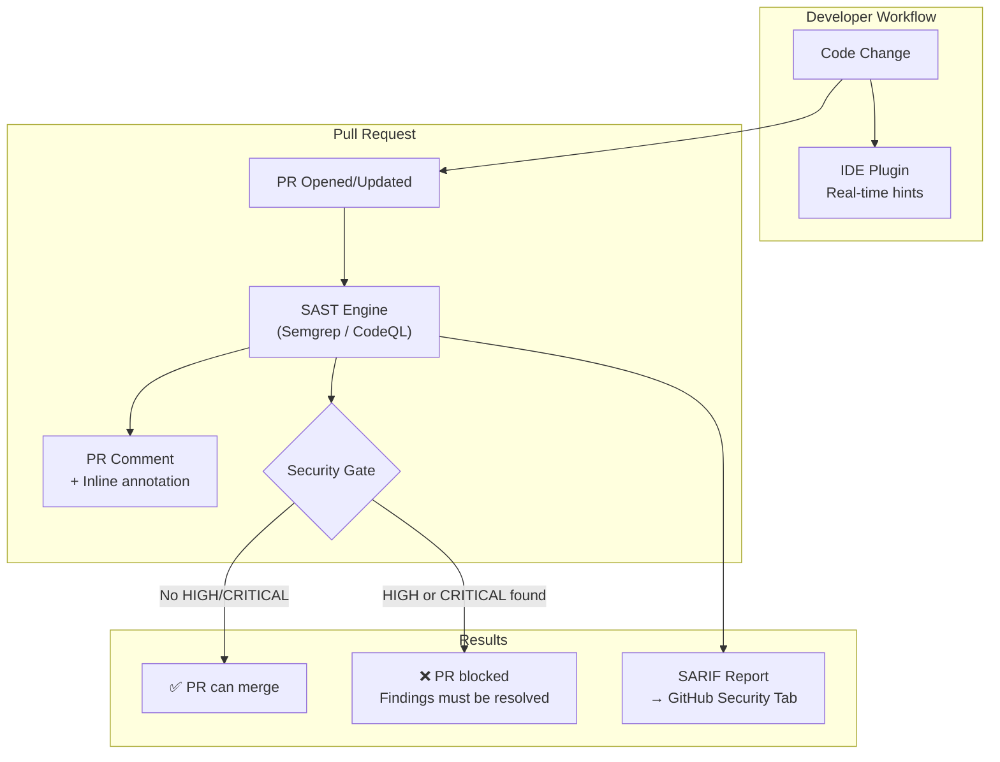

# Static Application Security Testing (SAST)

## Category
DevSecOps, Security Testing, Code Analysis, CI/CD

## Context

**Static Application Security Testing (SAST)** analyzes source code, bytecode, or binaries for security vulnerabilities **without executing the application**. It works by modeling data flows, taint analysis, and pattern matching across the entire codebase.

SAST tools can identify:
- **Injection flaws** (SQL injection, command injection, XSS, SSTI)
- **Insecure data handling** (hardcoded credentials, weak encryption, sensitive data in logs)
- **Authentication & session issues** (insecure JWT validation, session fixation)
- **Deserialization vulnerabilities**
- **SSRF, path traversal, open redirects**
- **Security misconfigurations**

**Popular SAST tools**:
| Tool | Language Support | Notes |
|------|-----------------|-------|
| **Semgrep** | 30+ languages | Fast, customizable rules, free tier |
| **CodeQL** | 10+ languages | GitHub-native, deep data flow analysis |
| **SonarQube** | 30+ languages | Enterprise, dashboard, quality gates |
| **Checkmarx** | 25+ languages | Enterprise, deep analysis |
| **Bandit** | Python | Lightweight, pip installable |
| **ESLint Security** | JavaScript/TypeScript | Plugin-based |

---

## Pros

- **Early detection**: Finds bugs before code runs.
- **Full codebase coverage**: Scans every line, not just exercised paths.
- **Zero runtime risk**: No live system is touched.
- **CI/CD integration**: Blocks PRs with security violations automatically.
- **Developer feedback loop**: Results appear in IDE or PR comments.
- **Custom rules**: Define organization-specific patterns (e.g., banned API usage).

---

## Cons

- **False positives**: SAST tools are imprecise; teams must tune rules to avoid alert fatigue.
- **No runtime context**: Cannot detect logic flaws that only manifest at runtime.
- **Language limitations**: Tool coverage varies by language and framework.
- **Taint analysis complexity**: Complex data flows (e.g., through message queues) are not fully tracked.
- **Scan time**: Deep analysis (CodeQL) can take 10–30+ minutes on large codebases.

---

## Design Diagram



---

## Code Sample

### Semgrep Custom Rules

```yaml
# .semgrep/custom-rules.yml
# Organization-specific security rules

rules:
  # Rule 1: Detect SQL queries built with string concatenation
  - id: sql-injection-string-concat
    patterns:
      - pattern: |
          $DB.query($QUERY + $INPUT, ...)
      - pattern: |
          $DB.query(`...${$INPUT}...`, ...)
    message: >
      Potential SQL injection: never concatenate user input into SQL queries.
      Use parameterized queries ($DB.query(sql, [params])) instead.
    languages: [javascript, typescript]
    severity: ERROR
    metadata:
      cwe: CWE-89
      owasp: A03:2021 - Injection

  # Rule 2: Hardcoded JWT secret
  - id: hardcoded-jwt-secret
    pattern: |
      jwt.sign($PAYLOAD, "$SECRET", ...)
    message: >
      Hardcoded JWT secret detected. Use environment variables:
      jwt.sign(payload, process.env.JWT_SECRET, options)
    languages: [javascript, typescript]
    severity: ERROR
    metadata:
      cwe: CWE-321

  # Rule 3: Missing authorization check
  - id: express-route-no-auth-middleware
    patterns:
      - pattern: |
          $APP.post($PATH, async ($REQ, $RES) => { ... })
      - pattern-not: |
          $APP.post($PATH, $AUTH, ...)
    paths:
      include:
        - src/routes/**
    message: >
      Express POST route may be missing authentication middleware.
      Ensure routes are protected: app.post(path, authMiddleware, handler)
    languages: [javascript, typescript]
    severity: WARNING

  # Rule 4: eval() usage
  - id: no-eval
    pattern: eval(...)
    message: "eval() is dangerous and can lead to code injection. Use safer alternatives."
    languages: [javascript, typescript]
    severity: ERROR
    metadata:
      cwe: CWE-95

  # Rule 5: Dangerous deserialization
  - id: unsafe-deserialize
    patterns:
      - pattern: serialize.unserialize(...)
      - pattern: node-serialize.unserialize(...)
    message: >
      Unsafe deserialization can lead to Remote Code Execution.
      Never deserialize untrusted data.
    languages: [javascript, typescript]
    severity: ERROR
    metadata:
      cwe: CWE-502
```

### CodeQL Configuration

```yaml
# .github/codeql/codeql-config.yml
name: CodeQL Security Scan

queries:
  - uses: security-and-quality
  - uses: security-extended

paths-ignore:
  - node_modules
  - dist
  - coverage
  - '**/*.test.ts'
  - '**/*.spec.ts'
```

```yaml
# .github/workflows/codeql.yml
name: CodeQL

on:
  push:
    branches: [main]
  pull_request:
    branches: [main]
  schedule:
    - cron: '30 2 * * 1'  # Weekly scan on Monday

jobs:
  analyze:
    name: Analyze
    runs-on: ubuntu-latest
    permissions:
      actions: read
      contents: read
      security-events: write

    strategy:
      matrix:
        language: [javascript-typescript]

    steps:
      - uses: actions/checkout@v4

      - name: Initialize CodeQL
        uses: github/codeql-action/init@v3
        with:
          languages: ${{ matrix.language }}
          config-file: .github/codeql/codeql-config.yml

      - name: Build
        run: npm ci && npm run build

      - name: Perform CodeQL Analysis
        uses: github/codeql-action/analyze@v3
        with:
          category: /language:${{ matrix.language }}
          output: sarif-results
          upload: true
```

### Suppressing False Positives (Semgrep)

```typescript
// Suppressing a known false positive with inline annotation
// semgrep-ignore: sql-injection-string-concat -- This is a static admin query, no user input
const adminQuery = db.query('SELECT * FROM system_config WHERE key = ' + configKey, []);

// Or via nosemgrep comment for all rules
const safeBase64 = Buffer.from(data).toString('base64'); // nosemgrep

// NEVER suppress without justification — document WHY it's a false positive
```

### SonarQube Quality Gate Configuration

```json
{
  "name": "Security Gate",
  "conditions": [
    {
      "metric": "new_security_hotspots_reviewed",
      "op": "LT",
      "error": "100"
    },
    {
      "metric": "new_blocker_violations",
      "op": "GT",
      "error": "0"
    },
    {
      "metric": "new_critical_violations",
      "op": "GT",
      "error": "0"
    },
    {
      "metric": "new_vulnerabilities",
      "op": "GT",
      "error": "0"
    }
  ]
}
```
