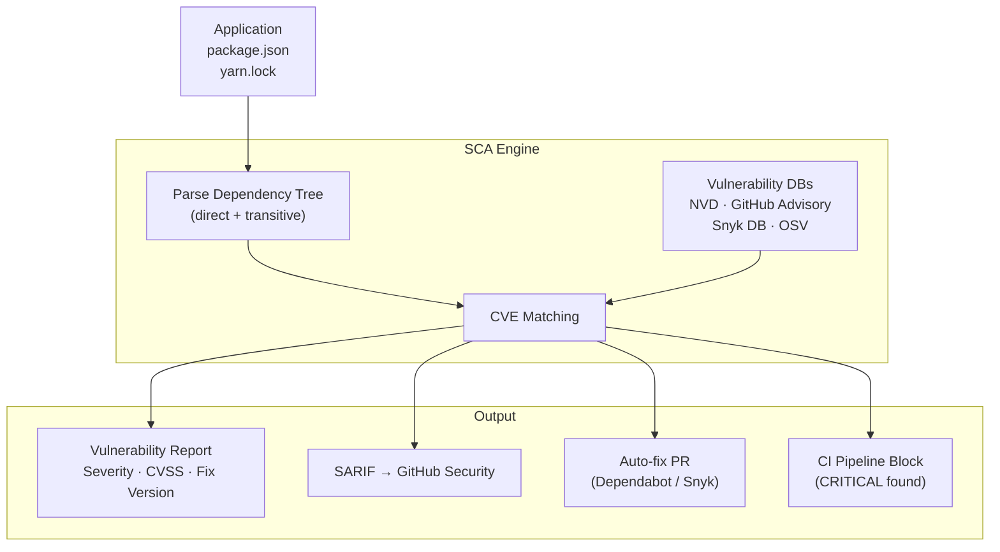

# Software Composition Analysis (SCA)

## Category
DevSecOps, Dependency Security, Supply Chain, Open Source Risk

## Context

Modern applications are built on top of hundreds of open-source dependencies. **Software Composition Analysis (SCA)** automatically identifies **known vulnerabilities in third-party libraries** by comparing your dependency tree against public vulnerability databases (NVD, GitHub Advisory, OSV, Snyk DB).

An SCA tool:
1. Parses lock files (`package-lock.json`, `yarn.lock`, `pom.xml`, `requirements.txt`)
2. Builds a complete dependency tree (direct and transitive)
3. Cross-references each package version against CVE/advisory databases
4. Reports vulnerable packages with severity, CVSS score, and fix version
5. Optionally opens automated PRs to upgrade affected packages

**Popular SCA tools**:
| Tool | Notes |
|------|-------|
| **Snyk** | Full-featured, auto-fix PRs, license compliance, free tier |
| **OWASP Dependency-Check** | Open-source, generates HTML/XML/JSON reports |
| **GitHub Dependabot** | Built-in GitHub, auto-PRs for patches |
| **Trivy** | Multi-purpose scanner (deps, containers, IaC, SBOM) |
| **Socket.dev** | Focuses on supply chain attacks (malicious packages) |
| **Grype** | Anchore's open-source vulnerability scanner |

---

## Pros

- **Automated CVE detection**: No manual tracking of vulnerable libraries.
- **Transitive dependency coverage**: Finds vulnerabilities in dependencies of dependencies.
- **Automated fix PRs**: Tools like Dependabot and Snyk open PRs automatically.
- **License compliance**: Identifies GPL/LGPL/AGPL licenses that may be legally problematic.
- **SBOM generation**: Produces a bill of materials for compliance and auditing.
- **Low false positive rate**: Based on known CVEs — very few false positives.

---

## Cons

- **Upgrade breaks**: Patching a transitive may require upgrading the direct dependency (breaking changes).
- **No fix available**: Some CVEs have no patched version — requires alternative library or workaround.
- **Noise volume**: Large projects may have hundreds of findings, many LOW severity.
- **Supply chain gaps**: SCA only catches known CVEs; malicious new packages (typosquatting) require additional tooling.
- **Language support varies**: Some tools have better support for certain ecosystems.

---

## Design Diagram



---

## Code Sample

### Snyk CI Integration

```yaml
# .github/workflows/sca.yml
name: SCA - Dependency Vulnerability Scan

on:
  pull_request:
  push:
    branches: [main]
  schedule:
    - cron: '0 6 * * *'  # Daily scan (new CVEs published daily)

jobs:
  snyk:
    name: Snyk SCA
    runs-on: ubuntu-latest
    steps:
      - uses: actions/checkout@v4

      - uses: actions/setup-node@v4
        with:
          node-version: '20'

      - run: npm ci

      - name: Snyk test
        uses: snyk/actions/node@master
        with:
          # Only fail on HIGH/CRITICAL; report MEDIUM/LOW as warnings
          args: >
            --severity-threshold=high
            --fail-on=upgradable
            --sarif-file-output=snyk.sarif
        env:
          SNYK_TOKEN: ${{ secrets.SNYK_TOKEN }}
        continue-on-error: false

      - name: Upload Snyk SARIF
        uses: github/codeql-action/upload-sarif@v3
        with:
          sarif_file: snyk.sarif
        if: always()

  dependabot-auto-merge:
    name: Auto-merge Dependabot patch PRs
    runs-on: ubuntu-latest
    if: github.actor == 'dependabot[bot]'
    needs: [snyk]
    permissions:
      pull-requests: write
      contents: write
    steps:
      - name: Merge patch-level updates
        uses: fastify/github-action-merge-dependabot@v3
        with:
          merge-method: squash
          target: patch  # Only auto-merge patch updates
```

### OWASP Dependency-Check (Self-hosted)

```yaml
# docker-compose.dependency-check.yml
services:
  dependency-check:
    image: owasp/dependency-check:latest
    volumes:
      - .:/src
      - ./reports:/reports
      - dependency-check-data:/usr/share/dependency-check/data
    command: >
      --scan /src
      --format ALL
      --project "my-app"
      --out /reports
      --failOnCVSS 7
      --enableRetired
      --enableExperimental
      --nvdApiKey ${NVD_API_KEY}

volumes:
  dependency-check-data:
```

### Renovate Bot Configuration (Automated Dependency Updates)

```json
{
  "$schema": "https://docs.renovatebot.com/renovate-schema.json",
  "extends": ["config:recommended"],
  "packageRules": [
    {
      "description": "Auto-merge patch updates for all dependencies",
      "matchUpdateTypes": ["patch"],
      "automerge": true,
      "automergeType": "pr",
      "platformAutomerge": true
    },
    {
      "description": "Group all AWS SDK updates",
      "matchPackagePrefixes": ["@aws-sdk/"],
      "groupName": "AWS SDK"
    },
    {
      "description": "Security updates — highest priority",
      "matchCategories": ["security"],
      "priorityWeight": 10,
      "schedule": ["at any time"],
      "automerge": false
    }
  ],
  "vulnerabilityAlerts": {
    "enabled": true,
    "labels": ["security"],
    "assignees": ["@security-team"]
  },
  "schedule": ["before 6am on Monday"]
}
```

### Vulnerability Triage Script

```typescript
// sca/vulnerability-triage.ts
// Parse Snyk JSON output and triage findings

import { execSync } from 'child_process';
import * as fs from 'fs';

interface SnykVulnerability {
  id: string;
  title: string;
  severity: 'critical' | 'high' | 'medium' | 'low';
  cvssScore: number;
  packageName: string;
  version: string;
  fixedIn: string[];
  isUpgradable: boolean;
  isPatchable: boolean;
}

interface SnykReport {
  ok: boolean;
  vulnerabilities: SnykVulnerability[];
  dependencyCount: number;
}

function triageVulnerabilities(reportPath: string): void {
  const report: SnykReport = JSON.parse(fs.readFileSync(reportPath, 'utf-8'));

  if (report.ok) {
    console.log('✅ No vulnerabilities found');
    return;
  }

  const bySeverity = {
    critical: report.vulnerabilities.filter(v => v.severity === 'critical'),
    high: report.vulnerabilities.filter(v => v.severity === 'high'),
    medium: report.vulnerabilities.filter(v => v.severity === 'medium'),
    low: report.vulnerabilities.filter(v => v.severity === 'low'),
  };

  const upgradable = report.vulnerabilities.filter(v => v.isUpgradable);

  console.log(`\n📦 Dependency Count: ${report.dependencyCount}`);
  console.log(`🔴 Critical: ${bySeverity.critical.length}`);
  console.log(`🟠 High:     ${bySeverity.high.length}`);
  console.log(`🟡 Medium:   ${bySeverity.medium.length}`);
  console.log(`🟢 Low:      ${bySeverity.low.length}`);
  console.log(`🔧 Upgradable fixes available: ${upgradable.length}`);

  if (bySeverity.critical.length > 0 || bySeverity.high.length > 0) {
    console.error('\n❌ Build BLOCKED — CRITICAL or HIGH vulnerabilities found:');
    [...bySeverity.critical, ...bySeverity.high].forEach(v => {
      console.error(`  [${v.severity.toUpperCase()}] ${v.packageName}@${v.version} — ${v.title}`);
      if (v.isUpgradable && v.fixedIn.length > 0) {
        console.error(`    Fix: upgrade to ${v.fixedIn.join(' or ')}`);
      }
    });
    process.exit(1);
  }
}
```

### Dependabot Configuration

```yaml
# .github/dependabot.yml
version: 2

updates:
  - package-ecosystem: npm
    directory: /
    schedule:
      interval: daily
      time: "06:00"
      timezone: "UTC"
    open-pull-requests-limit: 10
    labels:
      - dependencies
      - security
    reviewers:
      - security-team
    groups:
      production-dependencies:
        dependency-type: production
        update-types:
          - minor
          - patch

  - package-ecosystem: docker
    directory: /
    schedule:
      interval: weekly
    labels:
      - dependencies
      - docker
```
