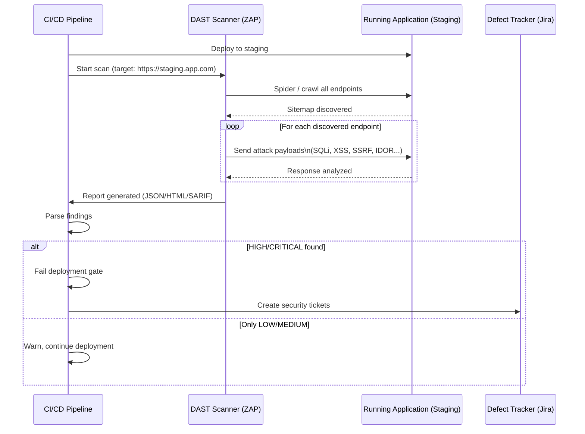

# Dynamic Application Security Testing (DAST)

## Category
DevSecOps, Security Testing, Runtime Analysis, Black-Box Testing

## Context

**Dynamic Application Security Testing (DAST)** tests a running application from the **outside**, simulating attacks as an external attacker would — without access to source code. It sends crafted HTTP requests, analyzes responses, and identifies vulnerabilities that only manifest at runtime.

DAST complements SAST: while SAST finds code-level flaws statically, DAST finds vulnerabilities that emerge from the combination of code, configuration, middleware, network settings, and runtime behavior.

**What DAST finds that SAST misses**:
- **Misconfigurations** (insecure headers, CORS misconfiguration, server version exposure)
- **Authentication flaws** (broken login, session management issues, password policies)
- **Business logic vulnerabilities** (price manipulation, race conditions)
- **Environment-specific issues** (dev secrets in production, debug endpoints enabled)
- **Injection in complex scenarios** (multi-step, stateful request sequences)

**Popular DAST tools**:
| Tool | Type | Notes |
|------|------|-------|
| **OWASP ZAP** | Open-source | Free, full-featured, API mode for CI |
| **Burp Suite** | Commercial | Industry standard for manual + automated testing |
| **Nuclei** | Open-source | Template-based, fast, community templates |
| **Nikto** | Open-source | Web server scanner |
| **HCL AppScan** | Commercial | Enterprise-grade |
| **StackHawk** | Commercial | Developer-first DAST for CI/CD |

---

## Pros

- **Finds runtime-only vulnerabilities**: Configuration issues, business logic flaws, environment misconfigurations.
- **Language-agnostic**: Works against any web application regardless of technology stack.
- **No source code required**: Black-box testing mirrors real attacker perspective.
- **Tests actual HTTP interactions**: Catches issues missed by static analysis.
- **Automated in CI/CD**: Can run against staging environments on every deployment.

---

## Cons

- **Requires running application**: Cannot run during code review — needs a deployed environment.
- **Slower than SAST**: Full DAST scans can take hours on complex applications.
- **Authentication complexity**: Stateful authentication flows require configuration.
- **Not suitable for pre-production only**: Cannot gate PR merges (only deployment stages).
- **Limited code coverage**: Only tests reachable URLs and endpoints.
- **May miss server-side-only logic**: Doesn't see code executed after the response is sent.

---

## Design Diagram



---

## Code Sample

### OWASP ZAP in CI/CD (Docker + API)

```yaml
# .github/workflows/dast.yml
name: DAST — OWASP ZAP

on:
  workflow_run:
    workflows: ["Deploy to Staging"]
    types: [completed]

jobs:
  dast:
    name: DAST Scan
    runs-on: ubuntu-latest
    if: ${{ github.event.workflow_run.conclusion == 'success' }}

    steps:
      - uses: actions/checkout@v4

      - name: OWASP ZAP Full Scan
        uses: zaproxy/action-full-scan@v0.10.0
        with:
          target: ${{ vars.STAGING_URL }}
          rules_file_name: .zap/rules.tsv
          cmd_options: >
            -config scanner.maxDepth=5
            -config scanner.maxChildren=20
          fail_action: true
          allow_issue_writing: false
          artifact_name: zap-report

      - name: Upload ZAP SARIF to GitHub Security
        uses: github/codeql-action/upload-sarif@v3
        with:
          sarif_file: zap.sarif
        if: always()

      - name: Upload full ZAP report
        uses: actions/upload-artifact@v4
        with:
          name: zap-full-report
          path: |
            zap_out/
            zap.sarif
        if: always()
```

### ZAP Rules File (Fine-tuning)

```tsv
# .zap/rules.tsv
# Alert ID	Action (IGNORE=0, WARN=1, FAIL=2)

# Ignore low-risk cosmetic alerts
10015	0	# Incomplete or No Cache-control header (acceptable for API)
10035	0	# Strict-Transport-Security header not set (handled by load balancer)
10027	0	# Information disclosure - suspicious comments (dev comments, low risk)

# Warn on medium
10040	1	# Secure pages include mixed content
10028	1	# Open redirect

# Block on high/critical
90034	2	# Cloud Metadata Potentially Exposed (SSRF)
40012	2	# Cross-Site Scripting (Reflected)
40018	2	# SQL Injection
40014	2	# Cross-Site Scripting (Persistent)
40017	2	# Cross-Site Request Forgery
30001	2	# Buffer Overflow
```

### Authenticated DAST Scan (ZAP API)

```typescript
// dast/zap-authenticated-scan.ts
import axios from 'axios';

const ZAP_API = 'http://localhost:8080';
const ZAP_API_KEY = process.env.ZAP_API_KEY!;
const TARGET_URL = process.env.STAGING_URL!;

async function runAuthenticatedScan(): Promise<void> {
  const zap = axios.create({
    baseURL: ZAP_API,
    params: { apikey: ZAP_API_KEY },
  });

  console.log('Starting authenticated ZAP scan...');

  // Step 1: Create session context
  const contextRes = await zap.get('/JSON/context/action/newContext/', {
    params: { contextName: 'staging-auth' },
  });
  const contextId = contextRes.data.contextId;

  // Step 2: Include all app URLs in context
  await zap.get('/JSON/context/action/includeInContext/', {
    params: { contextName: 'staging-auth', regex: `${TARGET_URL}.*` },
  });

  // Step 3: Set form-based authentication
  await zap.get('/JSON/authentication/action/setAuthenticationMethod/', {
    params: {
      contextId,
      authMethodName: 'formBasedAuthentication',
      authMethodConfigParams: `loginUrl=${TARGET_URL}/auth/login&loginRequestData=email%3D%7B%25username%25%7D%26password%3D%7B%25password%25%7D`,
    },
  });

  // Set logged-in indicator
  await zap.get('/JSON/authentication/action/setLoggedInIndicator/', {
    params: { contextId, loggedInIndicatorRegex: '"authenticated":true' },
  });

  // Step 4: Create test user
  const userRes = await zap.get('/JSON/users/action/newUser/', {
    params: { contextId, name: 'dast-test-user' },
  });
  const userId = userRes.data.userId;

  await zap.get('/JSON/users/action/setAuthenticationCredentials/', {
    params: {
      contextId,
      userId,
      authCredentialsConfigParams: 'username=dast@example.com&password=DastTest@123',
    },
  });
  await zap.get('/JSON/users/action/setUserEnabled/', {
    params: { contextId, userId, enabled: true },
  });

  // Step 5: Spider the application
  const spiderRes = await zap.get('/JSON/spider/action/scanAsUser/', {
    params: { contextId, userId, url: TARGET_URL, maxChildren: 10 },
  });
  const spiderId = spiderRes.data.scan;
  await waitForCompletion(zap, '/JSON/spider/view/status/', spiderId);

  // Step 6: Active scan
  const scanRes = await zap.get('/JSON/ascan/action/scanAsUser/', {
    params: { url: TARGET_URL, contextId, userId, recurse: true },
  });
  const scanId = scanRes.data.scan;
  await waitForCompletion(zap, '/JSON/ascan/view/status/', scanId);

  // Step 7: Get results
  const alerts = await zap.get('/JSON/alert/view/alerts/', {
    params: { baseurl: TARGET_URL },
  });

  const high = alerts.data.alerts.filter((a: { risk: string }) => ['High', 'Critical'].includes(a.risk));
  if (high.length > 0) {
    console.error(`❌ DAST found ${high.length} HIGH/CRITICAL vulnerabilities`);
    high.forEach((a: { alert: string; risk: string; url: string }) =>
      console.error(`  [${a.risk}] ${a.alert} at ${a.url}`)
    );
    process.exit(1);
  }

  console.log('✅ DAST scan passed');
}

async function waitForCompletion(
  zap: ReturnType<typeof axios.create>,
  statusUrl: string,
  scanId: string
): Promise<void> {
  while (true) {
    const status = await zap.get(statusUrl, { params: { scanId } });
    if (parseInt(status.data.status) >= 100) break;
    await new Promise(res => setTimeout(res, 5000));
  }
}

runAuthenticatedScan().catch(console.error);
```

### Nuclei Template-based Scanning

```yaml
# nuclei/custom-templates/auth-header-check.yaml
id: missing-security-headers

info:
  name: Missing Security Headers
  author: security-team
  severity: medium
  description: Checks for essential security response headers
  tags: headers,security

http:
  - method: GET
    path:
      - "{{BaseURL}}"

    matchers-condition: or
    matchers:
      - type: dsl
        dsl:
          - "!contains(all_headers, 'x-content-type-options')"
        name: missing-x-content-type-options

      - type: dsl
        dsl:
          - "!contains(all_headers, 'x-frame-options')"
        name: missing-x-frame-options

      - type: dsl
        dsl:
          - "!contains(all_headers, 'strict-transport-security')"
        name: missing-hsts
```
