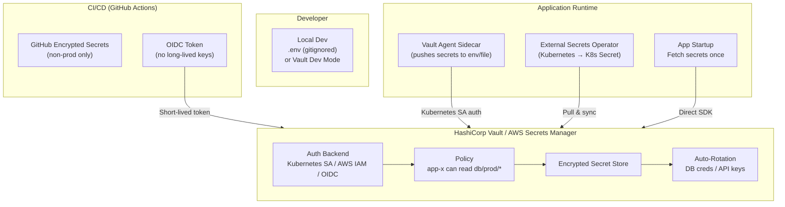

# Secret Management

## Category
DevSecOps, Security, Credential Management, Zero Trust

## Context

**Secrets** are sensitive values that grant access to systems: passwords, API keys, database credentials, TLS private keys, JWT signing keys, OAuth client secrets, and cloud IAM credentials. Mismanaged secrets are one of the most common causes of security breaches.

**The problem with naive approaches**:
- Hardcoded in source code → exposed in git history forever
- Stored in `.env` files committed to the repository
- Passed as unencrypted environment variables visible to all processes
- Rotated manually (never, in practice)

A **Secret Management** system provides:
- **Centralized storage** with encryption at rest and in transit
- **Fine-grained access control** (only app X can read DB password Y)
- **Audit logging** (who accessed which secret, when)
- **Dynamic secrets** (short-lived, auto-generated credentials)
- **Secret rotation** (automated, without application restart)
- **Secret leakage detection** (scan for secrets in code and logs)

**Tools**:
| Tool | Notes |
|------|-------|
| **HashiCorp Vault** | Gold standard; dynamic secrets, many auth backends |
| **AWS Secrets Manager** | Managed, rotation built-in, tight IAM integration |
| **Azure Key Vault** | Native Azure integration |
| **GCP Secret Manager** | Native GCP integration |
| **Kubernetes Secrets** | Native, but base64 only — use with External Secrets Operator |
| **Doppler** | Developer-friendly SaaS secrets manager |

---

## Pros

- **Centralized control**: Rotate one secret; all consumers get the new value.
- **Least privilege**: Applications only access secrets they are authorized for.
- **Audit trail**: Every secret access is logged for compliance and incident response.
- **Dynamic secrets**: Database credentials valid for only 1 hour — stolen creds become useless.
- **Automatic rotation**: Eliminates the human risk of "we'll rotate it eventually."
- **No secrets in code**: Eliminates the most common source of credential leaks.

---

## Cons

- **Vault availability**: Secret manager becomes a critical dependency — needs HA deployment.
- **Latency**: Secret fetches add network round-trips to startup.
- **Complexity**: Dynamic secrets require application-level lease renewal.
- **Migration effort**: Replacing hardcoded secrets across an existing codebase is time-consuming.
- **Cost**: Managed services charge per API call/secret.

---

## Design Diagram



---

## Code Sample

### HashiCorp Vault — Node.js SDK

```typescript
// secrets/vault-client.ts
import vault from 'node-vault';

interface AppSecrets {
  dbPassword: string;
  jwtSecret: string;
  apiKey: string;
}

class VaultSecretManager {
  private client: ReturnType<typeof vault>;
  private secrets: AppSecrets | null = null;
  private leaseRenewInterval: NodeJS.Timeout | null = null;

  constructor() {
    this.client = vault({
      apiVersion: 'v1',
      endpoint: process.env.VAULT_ADDR ?? 'https://vault.internal:8200',
      token: process.env.VAULT_TOKEN, // For dev; use auth method in production
    });
  }

  /** Authenticate using Kubernetes Service Account */
  async authenticateWithKubernetes(): Promise<void> {
    const jwt = require('fs').readFileSync(
      '/var/run/secrets/kubernetes.io/serviceaccount/token',
      'utf-8'
    );

    const result = await this.client.kubernetesLogin({
      role: process.env.VAULT_K8S_ROLE ?? 'my-app',
      jwt,
    });

    this.client.token = result.auth.client_token;

    // Schedule token renewal before expiry
    const renewBefore = (result.auth.lease_duration - 60) * 1000;
    setTimeout(() => this.renewToken(), renewBefore);
  }

  /** Fetch static secrets from KV v2 */
  async loadSecrets(): Promise<AppSecrets> {
    if (this.secrets) return this.secrets;

    const kv = await this.client.read('secret/data/my-app/production');
    this.secrets = {
      dbPassword: kv.data.data.db_password,
      jwtSecret: kv.data.data.jwt_secret,
      apiKey: kv.data.data.api_key,
    };

    return this.secrets;
  }

  /** Get dynamic database credentials (auto-expire after TTL) */
  async getDynamicDatabaseCredentials(): Promise<{ username: string; password: string; leaseId: string }> {
    const lease = await this.client.read('database/creds/my-app-role');

    const leaseDurationMs = (lease.lease_duration - 60) * 1000;

    // Auto-renew before expiry
    this.leaseRenewInterval = setInterval(async () => {
      await this.client.write('sys/leases/renew', {
        lease_id: lease.lease_id,
        increment: lease.lease_duration,
      });
    }, leaseDurationMs);

    return {
      username: lease.data.username,
      password: lease.data.password,
      leaseId: lease.lease_id,
    };
  }

  private async renewToken(): Promise<void> {
    const result = await this.client.tokenRenewSelf();
    const renewBefore = (result.auth.lease_duration - 60) * 1000;
    setTimeout(() => this.renewToken(), renewBefore);
  }
}

// Singleton — initialized at startup
export const secretManager = new VaultSecretManager();
```

### AWS Secrets Manager — Node.js

```typescript
// secrets/aws-secrets-manager.ts
import { SecretsManagerClient, GetSecretValueCommand } from '@aws-sdk/client-secrets-manager';

const client = new SecretsManagerClient({ region: process.env.AWS_REGION ?? 'eu-west-1' });

// Cache secrets in memory with TTL
const cache = new Map<string, { value: string; expiresAt: number }>();
const CACHE_TTL_MS = 5 * 60 * 1000; // 5 minutes

export async function getSecret(secretId: string): Promise<string> {
  const cached = cache.get(secretId);
  if (cached && Date.now() < cached.expiresAt) {
    return cached.value;
  }

  const response = await client.send(
    new GetSecretValueCommand({ SecretId: secretId })
  );

  const value = response.SecretString ?? Buffer.from(response.SecretBinary!).toString('utf-8');

  cache.set(secretId, { value, expiresAt: Date.now() + CACHE_TTL_MS });
  return value;
}

export async function getSecretJson<T>(secretId: string): Promise<T> {
  return JSON.parse(await getSecret(secretId)) as T;
}

// Usage example
async function bootstrapApp(): Promise<void> {
  const dbCreds = await getSecretJson<{ username: string; password: string; host: string }>(
    'prod/my-app/database'
  );

  const { Pool } = await import('pg');
  const pool = new Pool({
    host: dbCreds.host,
    user: dbCreds.username,
    password: dbCreds.password,
    database: 'myapp',
  });

  console.log('Database connected using secrets from AWS Secrets Manager');
}
```

### Kubernetes External Secrets Operator

```yaml
# k8s/external-secret.yaml
apiVersion: external-secrets.io/v1beta1
kind: ExternalSecret
metadata:
  name: my-app-secrets
  namespace: production
spec:
  refreshInterval: 1h
  secretStoreRef:
    kind: ClusterSecretStore
    name: vault-backend   # or aws-secrets-manager-backend
  target:
    name: my-app-secrets     # Creates this K8s Secret
    creationPolicy: Owner
    template:
      type: Opaque
      data:
        DATABASE_URL: "postgresql://{{ .db_user }}:{{ .db_password }}@{{ .db_host }}/myapp"
        JWT_SECRET: "{{ .jwt_secret }}"
  data:
    - secretKey: db_user
      remoteRef:
        key: secret/my-app/production
        property: db_user
    - secretKey: db_password
      remoteRef:
        key: secret/my-app/production
        property: db_password
    - secretKey: db_host
      remoteRef:
        key: secret/my-app/production
        property: db_host
    - secretKey: jwt_secret
      remoteRef:
        key: secret/my-app/production
        property: jwt_secret
---
# ClusterSecretStore for Vault
apiVersion: external-secrets.io/v1beta1
kind: ClusterSecretStore
metadata:
  name: vault-backend
spec:
  provider:
    vault:
      server: "https://vault.internal:8200"
      path: "secret"
      version: "v2"
      auth:
        kubernetes:
          mountPath: "kubernetes"
          role: "external-secrets"
          serviceAccountRef:
            name: "external-secrets"
            namespace: "external-secrets"
```

### Vault Policy (Least-Privilege)

```hcl
# vault/policy-my-app.hcl
# Allow reading secrets for this specific app only — no other paths

path "secret/data/my-app/production" {
  capabilities = ["read"]
}

path "secret/data/my-app/production/*" {
  capabilities = ["read"]
}

# Allow fetching dynamic DB credentials
path "database/creds/my-app-role" {
  capabilities = ["read"]
}

# Allow token self-renewal
path "auth/token/renew-self" {
  capabilities = ["update"]
}

# Deny everything else
path "*" {
  capabilities = ["deny"]
}
```
