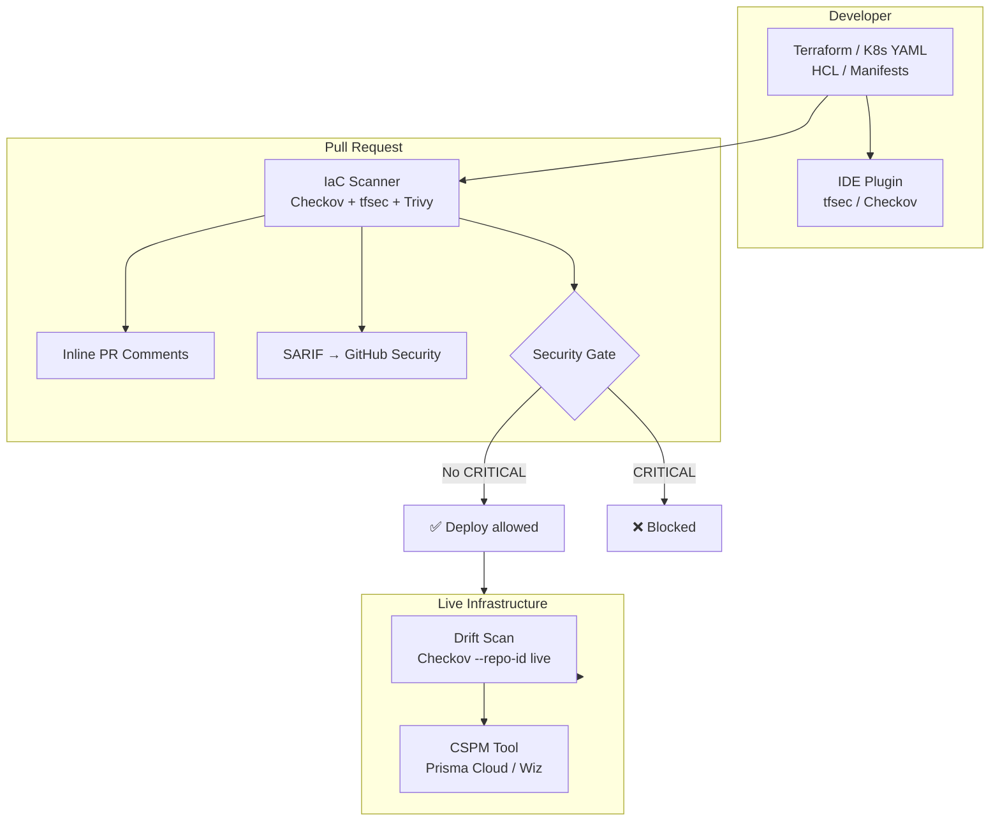

# Infrastructure as Code Security

## Category
DevSecOps, Infrastructure, Security, Cloud Configuration

## Context

**Infrastructure as Code (IaC)** allows teams to define cloud infrastructure using declarative configuration files (Terraform, CloudFormation, Kubernetes manifests, Helm charts, Bicep). While IaC dramatically improves reproducibility and speed, it also introduces a new attack surface: **misconfigured infrastructure defined in code**.

Common IaC security misconfigurations include:
- S3 buckets with public access enabled
- Security groups allowing `0.0.0.0/0` ingress on all ports
- EC2 instances without IMDSv2 enforcement
- Kubernetes containers running as root
- Missing encryption at rest for RDS/EBS/S3
- IAM roles with overly permissive policies (`*:*`)
- Missing logging/audit trail configuration
- Plaintext secrets in Terraform variables

**IaC Security Scanning Tools**:
| Tool | Targets | Notes |
|------|---------|-------|
| **Checkov** | Terraform, CFN, K8s, Helm, Bicep, ARM | 1000+ rules, SARIF output |
| **tfsec** | Terraform | Fast, opinionated, Terraform-native |
| **KICS** | All major IaC | Very broad coverage |
| **Terrascan** | Terraform, K8s, Helm | OPA/Rego policies |
| **Trivy config** | Terraform, K8s, Helm | Multi-purpose (also container scanning) |
| **cfn-lint** | CloudFormation | AWS-native linter |

---

## Pros

- **Catch before deployment**: Fix misconfigurations in PR review, not after a security breach.
- **Policy as code**: Security rules are version-controlled and auditable.
- **Compliance mapping**: Tools map findings to CIS benchmarks, NIST, HIPAA, PCI-DSS.
- **Drift detection**: Scan live infrastructure against IaC to detect out-of-band changes.
- **Developer empowerment**: Developers get instant feedback on cloud security best practices.

---

## Cons

- **False positives**: Some rules trigger on intentionally public resources (e.g., CDN buckets).
- **Context blindness**: Tools don't understand organizational context — require tuning.
- **IaC coverage only**: Live infrastructure that wasn't provisioned via IaC isn't scanned.
- **Module opacity**: External Terraform modules may introduce unscanned resources.
- **Rule maintenance**: Custom rules require ongoing updates as cloud services evolve.

---

## Design Diagram



---

## Code Sample

### Checkov GitHub Actions Integration

```yaml
# .github/workflows/iac-security.yml
name: IaC Security Scan

on:
  pull_request:
    paths:
      - 'infrastructure/**'
      - '**/*.tf'
      - '**/Chart.yaml'
      - 'k8s/**'

jobs:
  checkov:
    name: Checkov IaC Scanner
    runs-on: ubuntu-latest
    permissions:
      contents: read
      security-events: write

    steps:
      - uses: actions/checkout@v4

      - name: Run Checkov
        uses: bridgecrewio/checkov-action@master
        with:
          directory: infrastructure/
          framework: terraform,kubernetes,helm,dockerfile
          output_format: sarif
          output_file_path: checkov.sarif
          # Fail only on CRITICAL and HIGH
          check: CRITICAL,HIGH
          # Skip known false-positives (document skip in comments)
          skip_check: CKV_AWS_144,CKV2_AWS_63
          soft_fail: false
          quiet: false

      - name: Upload SARIF
        uses: github/codeql-action/upload-sarif@v3
        if: always()
        with:
          sarif_file: checkov.sarif

  tfsec:
    name: tfsec Terraform Scan
    runs-on: ubuntu-latest

    steps:
      - uses: actions/checkout@v4

      - name: Run tfsec
        uses: aquasecurity/tfsec-action@v1.0.3
        with:
          working_directory: infrastructure/terraform
          format: sarif
          sarif_file: tfsec.sarif
          github_token: ${{ secrets.GITHUB_TOKEN }}
          soft_fail: false
          minimum_severity: HIGH
```

### Secure Terraform Module Example (AWS)

```hcl
# infrastructure/terraform/modules/rds/main.tf
# RDS instance — configured to pass Checkov CRITICAL checks

resource "aws_db_instance" "app_database" {
  identifier = "${var.environment}-${var.app_name}-db"

  engine         = "postgres"
  engine_version = "15.4"
  instance_class = var.instance_class

  allocated_storage     = var.storage_gb
  max_allocated_storage = var.max_storage_gb

  db_name  = var.db_name
  username = var.db_username
  password = random_password.db_password.result  # Never hardcode!

  # CKV_AWS_17: Ensure DB instance is NOT publicly accessible
  publicly_accessible = false

  # CKV_AWS_133: Enable deletion protection in production
  deletion_protection = var.environment == "production" ? true : false

  # CKV_AWS_129, CKV_AWS_157: Encryption at rest
  storage_encrypted = true
  kms_key_id        = aws_kms_key.rds_key.arn

  # CKV_AWS_118: Enhanced monitoring
  monitoring_interval = 60
  monitoring_role_arn = aws_iam_role.rds_monitoring.arn

  # CKV_AWS_293: Enable performance insights
  performance_insights_enabled = true

  # CKV_AWS_211: CloudWatch logging
  enabled_cloudwatch_logs_exports = ["postgresql", "upgrade"]

  # CKV2_AWS_60: Enable automated backups
  backup_retention_period = var.environment == "production" ? 30 : 7
  backup_window           = "03:00-04:00"
  maintenance_window      = "Mon:04:00-Mon:05:00"

  # CKV_AWS_293: Auto minor version upgrade
  auto_minor_version_upgrade = true

  vpc_security_group_ids = [aws_security_group.rds_sg.id]
  db_subnet_group_name   = aws_db_subnet_group.main.name

  tags = var.tags
}

resource "aws_security_group" "rds_sg" {
  name        = "${var.environment}-rds-sg"
  description = "Security group for RDS — only allows access from app tier"
  vpc_id      = var.vpc_id

  ingress {
    description     = "PostgreSQL from app tier only"
    from_port       = 5432
    to_port         = 5432
    protocol        = "tcp"
    security_groups = [var.app_security_group_id]
    # CKV_AWS_277, CKV_AWS_25: NO 0.0.0.0/0 — restrict to app SG only
    cidr_blocks     = []
    ipv6_cidr_blocks = []
  }

  egress {
    description = "No outbound allowed from RDS"
    from_port   = 0
    to_port     = 0
    protocol    = "-1"
    cidr_blocks = []
  }

  tags = var.tags
}

resource "random_password" "db_password" {
  length           = 32
  special          = true
  override_special = "!#$%&*()-_=+[]{}<>:?"
}

resource "aws_secretsmanager_secret" "db_password" {
  name        = "${var.environment}/${var.app_name}/db-password"
  description = "RDS database password for ${var.app_name}"
  kms_key_id  = aws_kms_key.secrets_key.arn  # CKV_AWS_149: encrypt with CMK

  recovery_window_in_days = 7

  tags = var.tags
}

resource "aws_secretsmanager_secret_version" "db_password" {
  secret_id     = aws_secretsmanager_secret.db_password.id
  secret_string = random_password.db_password.result
}
```

### Kubernetes Security Scanning (Trivy)

```yaml
# .github/workflows/k8s-security.yml — Kubernetes manifest scanning
- name: Trivy K8s config scan
  uses: aquasecurity/trivy-action@master
  with:
    scan-type: config
    scan-ref: k8s/
    format: sarif
    output: trivy-k8s.sarif
    severity: CRITICAL,HIGH
    exit-code: '1'
```

```yaml
# k8s/deployment.yaml — Security-hardened pod spec
apiVersion: apps/v1
kind: Deployment
metadata:
  name: my-app
spec:
  template:
    spec:
      # KSV008: No host namespaces
      hostPID: false
      hostIPC: false
      hostNetwork: false

      # KSV036: Run as non-root
      securityContext:
        runAsNonRoot: true
        runAsUser: 1000
        runAsGroup: 3000
        fsGroup: 2000
        seccompProfile:
          type: RuntimeDefault

      containers:
        - name: app
          image: my-app:latest
          securityContext:
            # KSV001: Disable privilege escalation
            allowPrivilegeEscalation: false
            # KSV003: Drop ALL capabilities
            capabilities:
              drop: ["ALL"]
            # KSV011: Read-only root filesystem
            readOnlyRootFilesystem: true
            runAsNonRoot: true
            runAsUser: 1000

          resources:
            # KSV011: Always set resource limits
            limits:
              cpu: "500m"
              memory: "512Mi"
            requests:
              cpu: "100m"
              memory: "128Mi"
```

### Checkov Custom Skip with Documentation

```hcl
# When you must skip a check — ALWAYS document the reason
resource "aws_s3_bucket" "public_assets" {
  bucket = "my-app-public-cdn-assets"

  #checkov:skip=CKV_AWS_20:Public access required for CDN assets (images, CSS, JS)
  #checkov:skip=CKV2_AWS_6:ACLs disabled; bucket policy controls public read for /assets/ prefix only
  tags = { Purpose = "CDN", Public = "true" }
}
```
