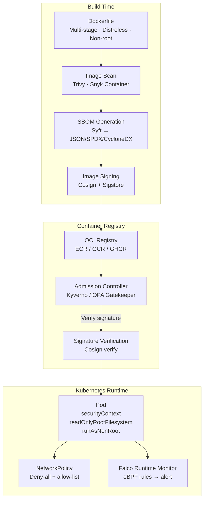

# Container Security

## Category
DevSecOps, Container, Docker, Kubernetes, Supply Chain

## Context

Containers are the dominant deployment unit for modern applications. While containers improve reproducibility and isolation, they introduce their own attack surface:

1. **Base image vulnerabilities**: A `node:18` image bundles hundreds of OS packages — each a potential CVE.
2. **Running as root**: Containers running as root can escape to the host if misconfigured.
3. **Overly permissive capabilities**: Unnecessary Linux capabilities expand the blast radius of exploits.
4. **Secrets in layers**: Copying `.env` files or credentials into images stores them permanently.
5. **Writable filesystems**: Allow attackers to modify binaries or drop payloads.
6. **Third-party base images**: Malicious or abandoned base images poison the supply chain.
7. **Missing network policies**: Containers can freely communicate without Kubernetes NetworkPolicies.

**Security layers for containers**:
- **Build time**: Minimal base images, multi-stage builds, image scanning (Trivy, Snyk), SBOM generation
- **Registry**: Image signing (Sigstore/Cosign), admission controllers (Kyverno, OPA Gatekeeper)
- **Runtime**: seccomp profiles, AppArmor, read-only filesystems, Falco runtime monitoring

---

## Pros

- **Immutable infrastructure**: Correctly built containers are tamper-evident at deploy time.
- **Defense in depth**: Layered controls (build → registry → runtime) limit blast radius.
- **SBOM**: Full software inventory for each image enables instant CVE impact assessment.
- **Image signing**: Cryptographic proof that only your pipeline produced the image.
- **Automated scanning**: Every pushed image is scanned automatically — no manual effort.

---

## Cons

- **Base image update burden**: Must rebuild and redeploy all images when base image CVEs are patched.
- **Distroless tradeoffs**: Minimal images are more secure but harder to debug (no shell).
- **False positive noise**: Popular base images have many low-severity CVEs — requires triage policy.
- **Runtime overhead**: seccomp profiles and eBPF monitoring add CPU overhead.
- **Complexity**: Managing Kyverno/OPA policies, RBAC, NetworkPolicies, and PodSecurity standards is operationally complex.

---

## Design Diagram



---

## Code Sample

### Secure Dockerfile (Multi-stage + Distroless)

```dockerfile
# Dockerfile — Multi-stage build with distroless runtime image

# Stage 1: Build
FROM node:20-alpine AS builder

WORKDIR /app

# Copy only dependency manifests first (Docker layer cache optimization)
COPY package*.json ./
RUN npm ci --only=production && npm cache clean --force

COPY . .
RUN npm run build

# Stage 2: Runtime (distroless — no shell, no package manager, no OS tools)
FROM gcr.io/distroless/nodejs20-debian12:nonroot

# nonroot tag → runs as user 65532 (nonroot) — not UID 0
WORKDIR /app

# Copy only built artifacts and production deps
COPY --from=builder --chown=nonroot:nonroot /app/dist ./dist
COPY --from=builder --chown=nonroot:nonroot /app/node_modules ./node_modules

# Never hardcode secrets — use environment variables at runtime
# NEVER: COPY .env .env ← this would embed secrets in the image forever

EXPOSE 3000

# No shell available in distroless — use exec form (NOT shell form)
CMD ["dist/server.js"]
```

### Image Scanning in CI/CD (Trivy)

```yaml
# .github/workflows/container-security.yml
name: Container Security

on:
  push:
    branches: [main]
  pull_request:

jobs:
  build-and-scan:
    runs-on: ubuntu-latest
    permissions:
      contents: read
      security-events: write
      id-token: write  # For Cosign OIDC signing

    steps:
      - uses: actions/checkout@v4

      - name: Build image
        uses: docker/build-push-action@v5
        with:
          context: .
          push: false
          tags: my-app:${{ github.sha }}
          load: true

      - name: Scan with Trivy — fail on CRITICAL
        uses: aquasecurity/trivy-action@master
        with:
          image-ref: my-app:${{ github.sha }}
          format: sarif
          output: trivy.sarif
          severity: CRITICAL,HIGH
          exit-code: '1'
          ignore-unfixed: true
          vuln-type: os,library

      - name: Upload Trivy SARIF
        uses: github/codeql-action/upload-sarif@v3
        if: always()
        with:
          sarif_file: trivy.sarif

      - name: Generate SBOM with Syft
        uses: anchore/sbom-action@v0
        with:
          image: my-app:${{ github.sha }}
          format: cyclonedx-json
          output-file: sbom.json

      - name: Attest SBOM
        uses: actions/attest-sbom@v1
        with:
          subject-name: my-app
          subject-digest: ${{ steps.build.outputs.digest }}
          sbom-path: sbom.json

      - name: Push image to registry
        if: github.ref == 'refs/heads/main'
        uses: docker/build-push-action@v5
        id: push
        with:
          context: .
          push: true
          tags: ghcr.io/myorg/my-app:${{ github.sha }}

      - name: Sign image with Cosign (keyless)
        if: github.ref == 'refs/heads/main'
        uses: sigstore/cosign-installer@main

      - run: |
          cosign sign --yes ghcr.io/myorg/my-app@${{ steps.push.outputs.digest }}
        if: github.ref == 'refs/heads/main'
        env:
          COSIGN_EXPERIMENTAL: 1
```

### Kyverno Policy — Enforce Security Standards

```yaml
# k8s/kyverno/enforce-container-security.yaml
apiVersion: kyverno.io/v1
kind: ClusterPolicy
metadata:
  name: enforce-container-security
  annotations:
    policies.kyverno.io/description: >
      Enforce baseline security controls on all pods:
      non-root, read-only fs, no privilege escalation, resource limits.
spec:
  validationFailureAction: Enforce  # Block non-compliant pods
  background: true
  rules:
    - name: require-non-root
      match:
        any:
          - resources:
              kinds: [Pod]
      validate:
        message: "Containers must not run as root. Set securityContext.runAsNonRoot=true"
        pattern:
          spec:
            =(initContainers):
              - =(securityContext):
                  =(runAsNonRoot): true
            containers:
              - securityContext:
                  runAsNonRoot: true

    - name: require-read-only-root-fs
      match:
        any:
          - resources:
              kinds: [Pod]
      validate:
        message: "Containers must have a read-only root filesystem"
        pattern:
          spec:
            containers:
              - securityContext:
                  readOnlyRootFilesystem: true

    - name: disallow-privilege-escalation
      match:
        any:
          - resources:
              kinds: [Pod]
      validate:
        message: "Privilege escalation is not allowed"
        pattern:
          spec:
            containers:
              - securityContext:
                  allowPrivilegeEscalation: false

    - name: require-resource-limits
      match:
        any:
          - resources:
              kinds: [Pod]
      validate:
        message: "CPU and memory limits are required for all containers"
        pattern:
          spec:
            containers:
              - resources:
                  limits:
                    cpu: "?*"
                    memory: "?*"

    - name: verify-image-signature
      match:
        any:
          - resources:
              kinds: [Pod]
      verifyImages:
        - imageReferences:
            - "ghcr.io/myorg/*"
          attestors:
            - count: 1
              entries:
                - keyless:
                    subject: "https://github.com/myorg/*"
                    issuer: "https://token.actions.githubusercontent.com"
```

### Kubernetes NetworkPolicy — Default Deny

```yaml
# k8s/network-policies/default-deny.yaml
apiVersion: networking.k8s.io/v1
kind: NetworkPolicy
metadata:
  name: default-deny-all
  namespace: production
spec:
  podSelector: {}  # All pods in namespace
  policyTypes:
    - Ingress
    - Egress
---
# Allow only specific communication
apiVersion: networking.k8s.io/v1
kind: NetworkPolicy
metadata:
  name: allow-app-to-db
  namespace: production
spec:
  podSelector:
    matchLabels:
      app: postgres
  ingress:
    - from:
        - podSelector:
            matchLabels:
              app: my-app  # Only my-app can reach postgres
      ports:
        - protocol: TCP
          port: 5432
```
