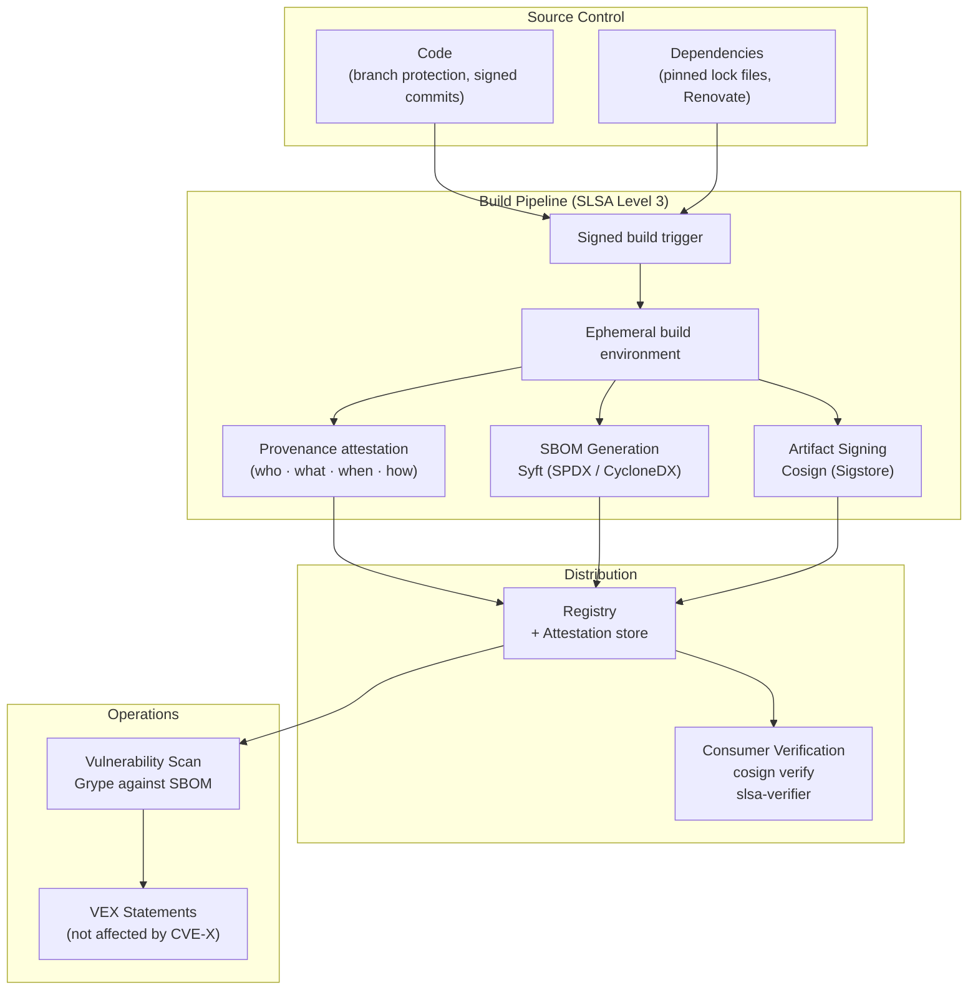

# Supply Chain Security & SBOM

## Category

DevSecOps, Supply Chain, Software Integrity, Compliance

## Context

The **software supply chain** encompasses everything involved in building and delivering software: source code, dependencies, build tools, CI/CD pipelines, registries, and deployment infrastructure. A **supply chain attack** compromises one of these upstream components to inject malicious code into production systems.

Notable incidents:

- **SolarWinds (2020)**: Build pipeline compromised to inject backdoor into signed software updates.
- **Log4Shell (2021)**: Critical RCE in a ubiquitous logging library used by millions of applications.
- **XZ Utils (2024)**: Backdoor injected into a compression library over years of social engineering.
- **event-stream npm (2018)**: Malicious maintainer added cryptomining code to a widely used npm package.

**Key Supply Chain Security practices**:

1. **SBOM (Software Bill of Materials)**: A machine-readable inventory of all software components and their versions.
2. **SLSA (Supply Chain Levels for Software Artifacts)**: A framework of security requirements for build pipelines.
3. **Sigstore/Cosign**: Keyless cryptographic signing of artifacts (containers, packages).
4. **Provenance attestation**: Signed metadata proving _how_ and _where_ a build was produced.
5. **Dependency pinning**: Use exact versions and lock files, not floating ranges.
6. **Typosquatting protection**: Verify package names before install.

---

## Pros

- **Vulnerability impact assessment**: SBOM enables instant "are we affected by Log4Shell?" analysis.
- **Regulatory compliance**: EU Cyber Resilience Act, US EO 14028 mandate SBOMs.
- **Third-party assurance**: Share SBOM with customers as security evidence.
- **Cryptographic verification**: Signed artifacts cannot be tampered with post-build.
- **SLSA compliance**: Auditable, tamper-proof build proofs.
- **Reduced attack surface**: Dependency pinning prevents supply chain injection via version ranges.

---

## Cons

- **SBOM size and complexity**: Large applications produce massive SBOMs (thousands of components).
- **SBOM accuracy**: Automatically generated SBOMs may miss some components or have incorrect versions.
- **Tooling fragmentation**: SPDX vs. CycloneDX formats; multiple tools, no universal standard yet.
- **SLSA level 3+ cost**: Hermetically sealed builds require significant build infrastructure investment.
- **Key management for signing**: Keyless signing via OIDC simplifies this, but requires OIDC provider.

---

## Design Diagram



---

## Code Sample

### SBOM Generation with Syft

```yaml
# .github/workflows/sbom.yml
name: SBOM Generation & Attestation

on:
  push:
    branches: [main]

jobs:
  sbom:
    runs-on: ubuntu-latest
    permissions:
      contents: write
      packages: write
      id-token: write

    steps:
      - uses: actions/checkout@v4

      - name: Build Docker image
        run: |
          docker build -t my-app:${{ github.sha }} .
          docker push ghcr.io/myorg/my-app:${{ github.sha }}

      - name: Generate SBOM with Syft
        uses: anchore/sbom-action@v0
        id: sbom
        with:
          image: ghcr.io/myorg/my-app:${{ github.sha }}
          format: spdx-json # or cyclonedx-json
          output-file: sbom.spdx.json
          upload-artifact: true
          upload-release-assets: true

      - name: Scan SBOM for vulnerabilities with Grype
        uses: anchore/scan-action@v3
        with:
          sbom: sbom.spdx.json
          severity-cutoff: critical
          fail-build: true
          output-format: sarif
          output-file: grype.sarif

      - name: Upload Grype SARIF
        uses: github/codeql-action/upload-sarif@v3
        if: always()
        with:
          sarif_file: grype.sarif

      - name: Attest SBOM to image
        uses: actions/attest-sbom@v1
        with:
          subject-name: ghcr.io/myorg/my-app
          subject-digest: ${{ steps.push.outputs.digest }}
          sbom-path: sbom.spdx.json
          push-to-registry: true
```

### SLSA Provenance (GitHub Actions)

```yaml
# SLSA L2: GitHub's slsa-github-generator
name: SLSA Provenance

on:
  release:
    types: [created]

jobs:
  build:
    outputs:
      hash: ${{ steps.hash.outputs.hash }}
    runs-on: ubuntu-latest
    steps:
      - uses: actions/checkout@v4
      - run: npm ci && npm run build && tar -czf artifact.tar.gz dist/
      - id: hash
        run: echo "hash=$(sha256sum artifact.tar.gz | base64 -w0)" >> "$GITHUB_OUTPUT"
      - uses: actions/upload-artifact@v4
        with:
          name: artifact
          path: artifact.tar.gz

  provenance:
    needs: [build]
    permissions:
      actions: read
      id-token: write
      contents: write
    uses: slsa-framework/slsa-github-generator/.github/workflows/generator_generic_slsa3.yml@v1.10.0
    with:
      base64-subjects: ${{ needs.build.outputs.hash }}
      upload-assets: true
```

### Dependency Pinning & Verification (package.json)

```json
{
  "scripts": {
    "preinstall": "node scripts/verify-packages.js",
    "verify-packages": "node scripts/verify-packages.js"
  }
}
```

```typescript
// scripts/verify-packages.ts
// Verify that installed packages match expected checksums (lockfile integrity)
import { execSync } from "child_process";
import * as fs from "fs";
import * as crypto from "crypto";

interface LockfilePackage {
  resolved: string;
  integrity: string; // sha512 hash
}

function verifyLockfileIntegrity(): void {
  const lockfile = JSON.parse(fs.readFileSync("package-lock.json", "utf-8"));

  let failures = 0;

  for (const [name, pkg] of Object.entries(
    lockfile.packages as Record<string, LockfilePackage>,
  )) {
    if (!pkg.integrity || !pkg.resolved) continue;

    // Detect packages resolved from non-registry sources (red flag)
    if (
      pkg.resolved &&
      !pkg.resolved.startsWith("https://registry.npmjs.org/")
    ) {
      if (
        !pkg.resolved.startsWith("https://registry.yarnpkg.com/") &&
        !pkg.resolved.startsWith("file:")
      ) {
        console.warn(
          `⚠️  Non-standard registry source: ${name} → ${pkg.resolved}`,
        );
        failures++;
      }
    }
  }

  if (failures > 0) {
    console.error(
      `${failures} packages from non-standard registries — investigate before installing`,
    );
    process.exit(1);
  }

  // Let npm itself verify integrity hashes
  execSync("npm ci --ignore-scripts", { stdio: "inherit" });
  console.log("✅ Package integrity verified");
}

verifyLockfileIntegrity();
```

### Cosign Image Verification at Deployment

```bash
#!/bin/bash
# deploy/verify-image.sh — Run before deploying any image to production

set -euo pipefail

IMAGE="${1}"

echo "Verifying image signature: ${IMAGE}"

# Verify Cosign signature (keyless — matches GitHub Actions OIDC issuer)
cosign verify \
  --certificate-identity-regexp="^https://github.com/myorg/.*" \
  --certificate-oidc-issuer="https://token.actions.githubusercontent.com" \
  "${IMAGE}"

echo "Verifying SLSA provenance..."
slsa-verifier verify-image "${IMAGE}" \
  --source-uri "github.com/myorg/my-app" \
  --source-tag "${TAG}"

echo "✅ Image verified — safe to deploy"
```

### Socket.dev Integration (Malicious Package Detection)

```yaml
# .github/workflows/socket-security.yml
name: Socket Security (Supply Chain)

on:
  pull_request:
    paths:
      - "package.json"
      - "package-lock.json"

jobs:
  socket:
    runs-on: ubuntu-latest
    steps:
      - uses: actions/checkout@v4
      - uses: nicolo-ribaudo/socket-security-action@main
        with:
          api-token: ${{ secrets.SOCKET_SECURITY_API_TOKEN }}
          # Detect: typosquatting, malware, obfuscated code,
          # install scripts, new maintainers, deprecated packages
```
