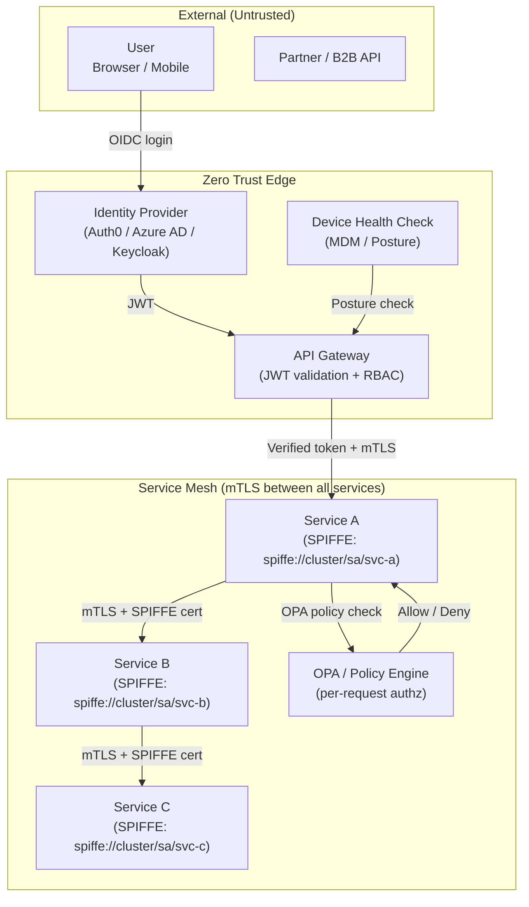

# Zero Trust Architecture

## Category
DevSecOps, Security Architecture, Identity, Network Security

## Context

**Zero Trust** is a security model based on the principle of **"never trust, always verify"**. It abandons the traditional perimeter-based ("castle and moat") security model, which assumed everything inside the corporate network was trustworthy. In the perimeter model, once an attacker breaches the perimeter (via VPN credential theft, phishing, or insider threat), they can move laterally with little resistance.

Zero Trust operates on three core principles:
1. **Verify explicitly**: Always authenticate and authorize based on all available data points — identity, location, device health, service, workload, and behavior.
2. **Use least privilege**: Limit user and service access with just-enough-access (JEA). Use Just-In-Time (JIT) provisioning.
3. **Assume breach**: Minimize blast radius, segment access, encrypt everything end-to-end, and use analytics to detect anomalies.

**Zero Trust pillars**:
- **Identity**: mTLS, OIDC, SPIFFE/SPIRE for workload identity
- **Device**: Device posture checking, MDM enrollment
- **Network**: Microsegmentation, service mesh (Istio), NetworkPolicies
- **Application**: OAuth2/OIDC per-API authorization, OPA policy enforcement
- **Data**: Encryption at rest and in transit, data classification

---

## Pros

- **Reduces lateral movement**: Compromised service/user can't freely access other services.
- **Breach containment**: "Assume breach" mindset limits the impact of any single compromise.
- **Cloud-native fit**: Zero Trust aligns naturally with microservices and multi-cloud architectures.
- **Continuous verification**: Authentication happens on every request, not just at entry.
- **Audit trail**: Every access is logged and attributable to a specific identity.
- **Remote work ready**: Works identically for on-prem, cloud, and remote users.

---

## Cons

- **Complexity**: Implementing mTLS, SPIFFE, OPA, and service mesh requires significant expertise.
- **Latency overhead**: Every request involves identity verification; mTLS handshakes add latency.
- **Cultural shift**: Teams must move from "trusted network" mental models to "verify everything."
- **Legacy system friction**: Legacy applications not designed for per-service authentication are hard to adapt.
- **Operational cost**: Running a service mesh (Istio/Linkerd) and identity infrastructure adds operational burden.

---

## Design Diagram



---

## Code Sample

### SPIFFE/SPIRE Workload Identity (Node.js)

```typescript
// zero-trust/spiffe-identity.ts
// SPIRE agent provides short-lived X.509 SVIDs to workloads via Unix socket

import { spiffeHelper } from '@spiffe/spiffe-helper';
import * as https from 'https';
import * as tls from 'tls';

interface SPIFFEWorkloadCredentials {
  svid: Buffer;     // X.509 certificate (SVID)
  privateKey: Buffer;
  bundle: Buffer;   // Trust bundle (CA certs)
  spiffeId: string; // e.g., spiffe://cluster.local/ns/prod/sa/payment-service
}

class WorkloadIdentityManager {
  private credentials: SPIFFEWorkloadCredentials | null = null;
  private rotationTimer: NodeJS.Timeout | null = null;

  constructor(
    private readonly spiffeSocketPath = '/tmp/spire-agent/public/api.sock'
  ) {}

  async initialize(): Promise<void> {
    await this.fetchCredentials();
  }

  private async fetchCredentials(): Promise<void> {
    // SPIRE agent provides credentials via gRPC over a Unix domain socket
    // This is a conceptual implementation — use @spiffe/spiffe-helper in practice
    const creds = await spiffeHelper.fetchX509SVID(this.spiffeSocketPath);

    this.credentials = {
      svid: creds.x509SvId.certificates,
      privateKey: creds.x509SvId.privateKey,
      bundle: creds.x509Bundles,
      spiffeId: creds.x509SvId.spiffeId,
    };

    // Auto-rotate before expiry (SPIFFE certs typically expire in 1 hour)
    const expiryMs = creds.x509SvId.expiresAt * 1000 - Date.now();
    const rotateIn = expiryMs - 60_000; // Rotate 1 min before expiry

    if (this.rotationTimer) clearTimeout(this.rotationTimer);
    this.rotationTimer = setTimeout(() => this.fetchCredentials(), rotateIn);

    console.log(`SPIFFE identity: ${this.credentials.spiffeId} (rotates in ${Math.round(rotateIn / 1000)}s)`);
  }

  /** Create an HTTPS agent that presents the SPIFFE SVID for mTLS */
  createMtlsAgent(trustedSpiffeId: string): https.Agent {
    if (!this.credentials) throw new Error('WorkloadIdentityManager not initialized');

    return new https.Agent({
      cert: this.credentials.svid,
      key: this.credentials.privateKey,
      ca: this.credentials.bundle,
      // Verify peer's SPIFFE ID (not just certificate validity)
      checkServerIdentity: (_, cert) => {
        const peerSpiffeId = cert.subjectaltname?.match(/URI:spiffe:\/\/[^,]+/)?.[0]?.replace('URI:', '');
        if (peerSpiffeId !== trustedSpiffeId) {
          return new Error(`SPIFFE ID mismatch: expected ${trustedSpiffeId}, got ${peerSpiffeId}`);
        }
        return undefined;
      },
    });
  }
}

// Usage: service-to-service call with SPIFFE mTLS
const identity = new WorkloadIdentityManager();
await identity.initialize();

const agent = identity.createMtlsAgent('spiffe://cluster.local/ns/prod/sa/payment-service');
// All HTTP calls using this agent are mutually authenticated
```

### OPA Policy Enforcement (Per-Request Authorization)

```typescript
// zero-trust/opa-middleware.ts
import { Request, Response, NextFunction } from 'express';
import axios from 'axios';

const OPA_URL = process.env.OPA_URL ?? 'http://opa:8181';

interface OPAInput {
  user: { id: string; roles: string[]; tenantId: string };
  resource: { type: string; id: string; ownerId?: string };
  action: string;
  context: { ip: string; userAgent: string };
}

interface OPAResult {
  result: { allow: boolean; reason?: string };
}

export function requireOPAAuthorization(resourceType: string, action: string) {
  return async (req: Request, res: Response, next: NextFunction): Promise<void> => {
    const user = (req as Request & { user: OPAInput['user'] }).user;

    if (!user) {
      res.status(401).json({ error: 'Unauthenticated' });
      return;
    }

    const input: OPAInput = {
      user,
      resource: {
        type: resourceType,
        id: req.params.id ?? '',
        ownerId: req.body?.ownerId,
      },
      action,
      context: {
        ip: req.ip ?? '',
        userAgent: req.get('user-agent') ?? '',
      },
    };

    let result: OPAResult;
    try {
      const response = await axios.post<OPAResult>(
        `${OPA_URL}/v1/data/myapp/authz/allow`,
        { input },
        { timeout: 500 } // OPA must be fast — <500ms
      );
      result = response.data;
    } catch (err) {
      // Fail closed — if OPA is unreachable, deny
      console.error('OPA unreachable — denying request:', err);
      res.status(503).json({ error: 'Authorization service unavailable' });
      return;
    }

    if (!result.result.allow) {
      res.status(403).json({
        error: 'Forbidden',
        reason: result.result.reason ?? 'Access denied by policy',
      });
      return;
    }

    next();
  };
}
```

### OPA Policy (Rego)

```rego
# opa/policies/authz.rego
package myapp.authz

import future.keywords.if
import future.keywords.in

default allow = false

# Admins can do anything
allow if {
    "admin" in input.user.roles
}

# Resource owners can read and write their own resources
allow if {
    input.action in {"read", "update", "delete"}
    input.resource.ownerId == input.user.id
}

# Read-only roles can only GET
allow if {
    "reader" in input.user.roles
    input.action == "read"
}

# Tenant isolation — users can only access their own tenant's resources
deny if {
    input.resource.tenantId != input.user.tenantId
}

# Block access from known tor/proxy exit nodes (example)
deny if {
    input.context.ip in data.blocklist.ips
}

# Audit log every denied access
audit_log[entry] if {
    not allow
    entry := {
        "timestamp": time.now_ns(),
        "user_id": input.user.id,
        "action": input.action,
        "resource": input.resource,
        "result": "denied",
    }
}
```

### Istio mTLS Service Mesh Policy

```yaml
# k8s/istio/mtls-strict.yaml — Enforce mTLS for all services in namespace
apiVersion: security.istio.io/v1beta1
kind: PeerAuthentication
metadata:
  name: default
  namespace: production
spec:
  mtls:
    mode: STRICT  # Reject any non-mTLS traffic
---
# Authorization Policy — Service A may only call Service B on specific paths
apiVersion: security.istio.io/v1beta1
kind: AuthorizationPolicy
metadata:
  name: allow-order-to-payment
  namespace: production
spec:
  selector:
    matchLabels:
      app: payment-service
  action: ALLOW
  rules:
    - from:
        - source:
            principals:
              - "cluster.local/ns/production/sa/order-service"  # SPIFFE identity
      to:
        - operation:
            methods: ["POST"]
            paths: ["/internal/payments"]
---
# Deny everything else to payment service
apiVersion: security.istio.io/v1beta1
kind: AuthorizationPolicy
metadata:
  name: deny-all-to-payment
  namespace: production
spec:
  selector:
    matchLabels:
      app: payment-service
  action: DENY
  rules:
    - {}  # Match all (deny-all baseline; allow rules above take precedence)
```
