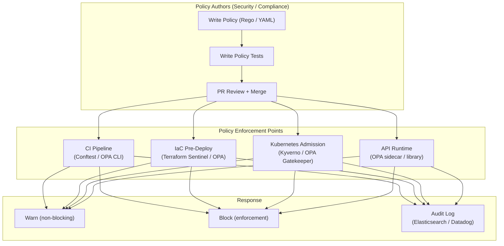

# Policy as Code

## Category

DevSecOps, Governance, Compliance, Automation

## Context

**Policy as Code (PaC)** is the practice of defining, versioning, and enforcing organizational rules — security controls, compliance requirements, resource standards — as machine-readable code rather than documents or manual processes. Policies are stored in source control, reviewed via PR, tested automatically, and enforced in CI/CD pipelines and at runtime.

**Why it matters**: Traditional policy management relies on human checklists and periodic audits. By the time a violation is caught (quarterly audit), dozens of misconfigured resources may already be in production. PaC moves enforcement to the point of change.

**What policies control**:

- **Cloud resources**: Required tags, approved regions, encryption enforcement
- **Kubernetes**: Pod security, network policies, resource limits, approved image registries
- **API authorization**: Per-request access control (OPA, Casbin)
- **Data governance**: PII handling, data retention, cross-border transfer rules
- **Cost controls**: Budget limits, instance type allowlists

**Popular tools**:
| Tool | Domain | Language |
|------|--------|----------|
| **OPA (Open Policy Agent)** | Universal — APIs, K8s, Terraform | Rego |
| **Kyverno** | Kubernetes-native | YAML |
| **Sentinel** | HashiCorp ecosystem (Terraform) | HCL-like |
| **AWS SCPs / Permission Boundaries** | AWS organizations | JSON |
| **Conftest** | Multi-target testing | OPA Rego |
| **Casbin** | Application-level RBAC/ABAC | DSL + model |

---

## Pros

- **Automated enforcement**: Policies enforced at every commit, deployment, and API call — not just audits.
- **Version controlled**: Policy changes go through PR review, approval, and audit trail.
- **Testable**: Policies have unit tests — verify correct behavior before enforcement.
- **Consistent**: Same policy applied everywhere — dev, staging, and production.
- **Compliance evidence**: Automated enforcement creates continuous audit evidence.
- **Separation of concerns**: Policy authors (security/compliance) and application developers work independently.

---

## Cons

- **Learning curve**: Rego and Sentinel have non-trivial learning curves.
- **Policy drift**: Poorly maintained policies fall out of sync with actual requirements.
- **False positives in early adoption**: Overly strict policies block legitimate work — requires tuning.
- **Distributed enforcement**: Ensuring policies run at all enforcement points (CI, admission, runtime) requires coordination.
- **Debugging complexity**: Understanding why a policy denied a request can be difficult.

---

## Design Diagram



---

## Code Sample

### OPA Policy Bundle Structure

```
opa/
├── policies/
│   ├── authz.rego           # API authorization
│   ├── k8s-security.rego    # Kubernetes admission
│   ├── terraform.rego       # IaC compliance
│   └── data-governance.rego # PII / data handling
├── tests/
│   ├── authz_test.rego
│   ├── k8s_security_test.rego
│   └── terraform_test.rego
├── data/
│   ├── blocklist.json       # IP blocklist
│   └── approved-regions.json
└── .opa.yaml               # Bundle config
```

### OPA Policy: Kubernetes Pod Security

```rego
# opa/policies/k8s-security.rego
package kubernetes.admission

import future.keywords.if
import future.keywords.in

# Deny pods running as root
deny[msg] if {
    input.request.kind.kind == "Pod"
    container := input.request.object.spec.containers[_]
    not container.securityContext.runAsNonRoot
    msg := sprintf("Container '%v' must set securityContext.runAsNonRoot=true", [container.name])
}

# Deny containers without resource limits
deny[msg] if {
    input.request.kind.kind == "Pod"
    container := input.request.object.spec.containers[_]
    not container.resources.limits
    msg := sprintf("Container '%v' must define resource limits (CPU and memory)", [container.name])
}

# Deny images from non-approved registries
approved_registries := {
    "ghcr.io/myorg/",
    "123456789.dkr.ecr.eu-west-1.amazonaws.com/",
}

deny[msg] if {
    input.request.kind.kind == "Pod"
    container := input.request.object.spec.containers[_]
    not any_approved(container.image)
    msg := sprintf("Container image '%v' is from a non-approved registry", [container.image])
}

any_approved(image) if {
    some registry in approved_registries
    startswith(image, registry)
}

# Deny privileged containers
deny[msg] if {
    input.request.kind.kind == "Pod"
    container := input.request.object.spec.containers[_]
    container.securityContext.privileged == true
    msg := sprintf("Privileged containers are not allowed: '%v'", [container.name])
}
```

### Policy Tests (Rego)

```rego
# opa/tests/k8s_security_test.rego
package kubernetes.admission

test_deny_root_container if {
    deny["Container 'app' must set securityContext.runAsNonRoot=true"] with input as {
        "request": {
            "kind": { "kind": "Pod" },
            "object": {
                "spec": {
                    "containers": [{
                        "name": "app",
                        "image": "ghcr.io/myorg/app:latest",
                        "securityContext": {},
                        "resources": { "limits": { "cpu": "500m", "memory": "256Mi" } }
                    }]
                }
            }
        }
    }
}

test_allow_compliant_pod if {
    count(deny) == 0 with input as {
        "request": {
            "kind": { "kind": "Pod" },
            "object": {
                "spec": {
                    "containers": [{
                        "name": "app",
                        "image": "ghcr.io/myorg/app:latest",
                        "securityContext": {
                            "runAsNonRoot": true,
                            "allowPrivilegeEscalation": false
                        },
                        "resources": { "limits": { "cpu": "500m", "memory": "256Mi" } }
                    }]
                }
            }
        }
    }
}

test_deny_unapproved_registry if {
    deny["Container image 'nginxorg/nginx:latest' is from a non-approved registry"]
        with input as {
            "request": {
                "kind": { "kind": "Pod" },
                "object": {
                    "spec": {
                        "containers": [{
                            "name": "proxy",
                            "image": "nginxorg/nginx:latest",
                            "securityContext": { "runAsNonRoot": true },
                            "resources": { "limits": { "cpu": "100m", "memory": "64Mi" } }
                        }]
                    }
                }
            }
        }
}
```

### Conftest for Terraform / CI Gate

```yaml
# .github/workflows/policy-gate.yml
name: Policy as Code Gate

on:
  pull_request:

jobs:
  conftest:
    name: Conftest Policy Check
    runs-on: ubuntu-latest

    steps:
      - uses: actions/checkout@v4

      - name: Install Conftest
        run: |
          curl -L https://github.com/open-policy-agent/conftest/releases/download/v0.50.0/conftest_0.50.0_Linux_x86_64.tar.gz | tar xz
          sudo mv conftest /usr/local/bin/

      - name: Test OPA policies
        run: opa test ./opa/policies ./opa/tests -v

      - name: Run Conftest on Terraform plan
        run: |
          cd infrastructure/terraform
          terraform init -backend=false
          terraform plan -out=tfplan.binary
          terraform show -json tfplan.binary > tfplan.json
          conftest test tfplan.json \
            --policy ../../opa/policies/terraform.rego \
            --output json \
            --all-namespaces

      - name: Run Conftest on Kubernetes manifests
        run: |
          conftest test k8s/ \
            --policy opa/policies/k8s-security.rego \
            --output github
```

### Terraform Policy (OPA/Conftest)

```rego
# opa/policies/terraform.rego
package terraform

import future.keywords.if
import future.keywords.in

# Deny S3 buckets with public access
deny[msg] if {
    resource := input.resource_changes[_]
    resource.type == "aws_s3_bucket"
    resource.change.after.acl == "public-read"
    msg := sprintf("S3 bucket '%v' must not be publicly readable", [resource.name])
}

# Require encryption on all RDS instances
deny[msg] if {
    resource := input.resource_changes[_]
    resource.type == "aws_db_instance"
    not resource.change.after.storage_encrypted
    msg := sprintf("RDS instance '%v' must have storage_encrypted=true", [resource.name])
}

# Enforce approved AWS regions only
approved_regions := {"eu-west-1", "eu-central-1", "us-east-1"}

deny[msg] if {
    resource := input.resource_changes[_]
    startswith(resource.type, "aws_")
    region := resource.change.after.region
    not region in approved_regions
    msg := sprintf("Resource '%v' uses non-approved region '%v'. Approved: %v", [resource.name, region, approved_regions])
}

# Require all resources to have required tags
required_tags := {"Environment", "Team", "CostCenter"}

deny[msg] if {
    resource := input.resource_changes[_]
    resource.change.action != "delete"
    tags := object.get(resource.change.after, "tags", {})
    missing := required_tags - object.keys(tags)
    count(missing) > 0
    msg := sprintf("Resource '%v' is missing required tags: %v", [resource.name, missing])
}
```
