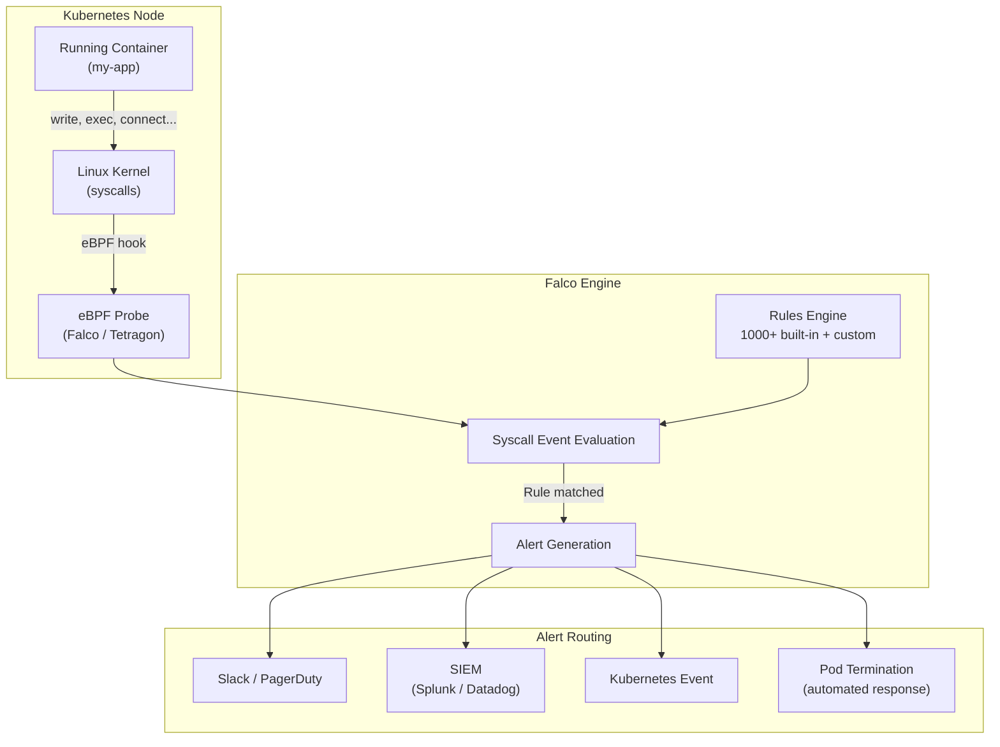

# Runtime Security Monitoring

## Category
DevSecOps, Observability, Threat Detection, Incident Response

## Context

**Runtime Security Monitoring** detects malicious or anomalous behavior *while applications are running* in production. Even with perfect shift-left controls, sophisticated attackers can bypass static defenses, exploit zero-days, or abuse legitimate features. Runtime security provides the final layer of defense.

**What runtime monitoring detects**:
- Container escapes (writing to host filesystem, namespace pivoting)
- Unexpected process spawns (shell in a node.js container — likely RCE)
- Network connections to C2 servers or cryptocurrency mining pools
- Privilege escalation (setuid, capabilities abuse)
- File integrity violations (modified binaries in read-only filesystems)
- Cryptomining (high CPU + network to mining pool IPs)
- Anomalous API call sequences (data exfiltration patterns)

**Tools**:
| Tool | Mechanism | Notes |
|------|-----------|-------|
| **Falco** | eBPF / kernel module syscall interception | CNCF project, 1000+ rules |
| **Tetragon** | eBPF (Cilium project) | Deep Linux security observability |
| **Sysdig Secure** | Commercial Falco-based | Enterprise features |
| **AWS GuardDuty** | CloudTrail + VPC Flow Log ML analysis | Managed, zero-ops |
| **Microsoft Defender for Containers** | Commercial | AKS-integrated |

---

## Pros

- **Zero-day detection**: Detects exploit behavior regardless of CVE knowledge.
- **Behavioral baseline**: Anomalies from normal patterns trigger alerts.
- **Container escape detection**: Catch the exploitation, not just the vulnerability.
- **Low false positives (when tuned)**: Syscall-level events are precise.
- **Evidence for forensics**: Rich event data for post-incident analysis.
- **Compliance**: SOC2, PCI-DSS, and CIS require runtime intrusion detection.

---

## Cons

- **Operational complexity**: Requires tuning to reduce noise and false positives.
- **Resource overhead**: eBPF monitoring adds CPU and memory overhead (~2–5%).
- **Alert fatigue**: Untuned rules generate thousands of alerts; teams ignore all of them.
- **Reactive**: Detects attacks in progress — not preventive.
- **Rule maintenance**: Custom rules need updates as application behavior changes.
- **Skill gap**: Writing effective Falco rules requires deep Linux and syscall knowledge.

---

## Design Diagram



---

## Code Sample

### Falco Rules (Custom)

```yaml
# falco/custom-rules.yaml

# Rule 1: Shell spawned inside a Node.js application container
- rule: Shell in Node.js Container
  desc: >
    A shell process was spawned inside a container running Node.js.
    This commonly indicates Remote Code Execution (RCE) exploitation.
  condition: >
    spawned_process and
    container and
    proc.name in (shell_binaries) and
    container.image.repository contains "node"
  output: >
    Shell spawned in Node.js container
    (pid=%proc.pid user=%user.name container=%container.name
    image=%container.image.repository cmd=%proc.cmdline)
  priority: CRITICAL
  tags: [container, rce, shell]

# Rule 2: Outbound connection to known cryptomining pools
- rule: Cryptomining Pool Connection
  desc: Detect connections to known cryptocurrency mining pool ports/IPs
  condition: >
    outbound and
    fd.sport in (3333, 8333, 4444, 5555, 7777, 14444, 45560, 45700) and
    container
  output: >
    Possible cryptomining connection
    (container=%container.name image=%container.image.repository
    dest=%fd.rip:%fd.rport)
  priority: CRITICAL
  tags: [cryptomining, network]

# Rule 3: Write to /etc inside a container
- rule: Write to /etc in Container
  desc: >
    Writing to /etc inside a container is suspicious —
    may indicate container escape or privilege escalation attempt.
  condition: >
    open_write and
    container and
    fd.name startswith /etc and
    not proc.name in (known_etc_writers)
  output: >
    Write to /etc in container
    (pid=%proc.pid user=%user.name file=%fd.name
    container=%container.name image=%container.image.repository)
  priority: HIGH
  tags: [container, file_integrity]

# Rule 4: kubectl exec into production pod
- rule: Kubectl Exec into Production Pod
  desc: Someone is executing commands directly into a production pod
  condition: >
    ka.verb = "create" and
    ka.resource = "pods/exec" and
    ka.target.namespace = "production"
  output: >
    kubectl exec into production pod
    (user=%ka.user.name pod=%ka.target.name namespace=%ka.target.namespace
    command=%ka.request.object.command)
  priority: WARNING
  source: k8s_audit
  tags: [k8s, audit, access]

# Rule 5: Unexpected outbound connection from database container
- rule: Database Container Unexpected Outbound
  desc: Database containers should not initiate outbound connections
  condition: >
    outbound and
    container.label.app in (database, postgres, mysql, mongodb) and
    fd.rip != "127.0.0.1"
  output: >
    Unexpected outbound connection from database container
    (container=%container.name dest=%fd.rip:%fd.rport)
  priority: HIGH
  tags: [network, database, exfiltration]
```

### Falco Helm Deployment

```yaml
# k8s/falco/values.yaml
falco:
  rules_file:
    - /etc/falco/falco_rules.yaml
    - /etc/falco/falco_rules.local.yaml
    - /etc/falco/custom-rules.yaml

  json_output: true
  json_include_output_property: true
  priority: warning

  # Use eBPF driver (safer than kernel module)
  driver:
    kind: ebpf

falcosidekick:
  enabled: true
  config:
    slack:
      webhookurl: "${SLACK_SECURITY_WEBHOOK}"
      minimumpriority: "warning"
      messageformat: >
        :rotating_light: *Falco Alert*
        Rule: `{{ .Rule }}`
        Priority: *{{ .Priority }}*
        {{ .Output }}

    pagerduty:
      routingkey: "${PAGERDUTY_ROUTING_KEY}"
      minimumpriority: "critical"

    datadog:
      apikey: "${DATADOG_API_KEY}"
      minimumpriority: "notice"
      tags: "env:production,source:falco"
```

### Incident Response Automation

```typescript
// runtime-security/auto-responder.ts
import { KubeConfig, CoreV1Api } from '@kubernetes/client-node';
import { WebClient } from '@slack/web-api';

const kc = new KubeConfig();
kc.loadFromCluster();
const k8s = kc.makeApiClient(CoreV1Api);
const slack = new WebClient(process.env.SLACK_BOT_TOKEN);

interface FalcoAlert {
  rule: string;
  priority: 'DEBUG' | 'INFORMATIONAL' | 'NOTICE' | 'WARNING' | 'ERROR' | 'CRITICAL' | 'ALERT' | 'EMERGENCY';
  output: string;
  outputFields: {
    containerName: string;
    namespace: string;
    podName?: string;
  };
}

export async function handleFalcoAlert(alert: FalcoAlert): Promise<void> {
  console.log(`Falco alert received: [${alert.priority}] ${alert.rule}`);

  // Notify security team immediately
  await slack.chat.postMessage({
    channel: '#security-alerts',
    text: `:rotating_light: *[${alert.priority}] Falco Alert*\n*Rule:* ${alert.rule}\n*Details:* ${alert.output}`,
    attachments: [{
      color: alert.priority === 'CRITICAL' ? '#FF0000' : '#FFA500',
      fields: [
        { title: 'Container', value: alert.outputFields.containerName, short: true },
        { title: 'Namespace', value: alert.outputFields.namespace, short: true },
      ],
    }],
  });

  // Automated response for CRITICAL alerts
  if (['CRITICAL', 'ALERT', 'EMERGENCY'].includes(alert.priority)) {
    await automaticIsolation(alert);
  }
}

async function automaticIsolation(alert: FalcoAlert): Promise<void> {
  const { namespace, podName } = alert.outputFields;

  if (!podName) return;

  // Apply a network-deny label (picked up by NetworkPolicy)
  await k8s.patchNamespacedPod(
    podName,
    namespace,
    { metadata: { labels: { 'security.myorg.com/isolated': 'true' } } },
    undefined,
    undefined,
    undefined,
    undefined,
    undefined,
    { headers: { 'Content-Type': 'application/strategic-merge-patch+json' } }
  );

  // After isolation, collect forensic data before termination
  console.log(`Pod ${podName} in ${namespace} isolated — collecting forensic data...`);

  // Signal forensic collector (another pod/sidecar)
  await slack.chat.postMessage({
    channel: '#security-alerts',
    text: `:shield: Pod \`${podName}\` in \`${namespace}\` has been automatically *isolated*. Manual investigation required.`,
  });
}
```

### AWS GuardDuty Findings Handler (Lambda)

```typescript
// runtime-security/guardduty-handler.ts — AWS Lambda
import { SNSEvent } from 'aws-lambda';
import { GuardDutyClient, GetFindingsCommand } from '@aws-sdk/client-guardduty';

const gd = new GuardDutyClient({ region: process.env.AWS_REGION });

export const handler = async (event: SNSEvent): Promise<void> => {
  for (const record of event.Records) {
    const notification = JSON.parse(record.Sns.Message);

    if (notification.source !== 'aws.guardduty') continue;

    const { findingIds, detectorId } = notification.detail;

    const findings = await gd.send(new GetFindingsCommand({
      DetectorId: detectorId,
      FindingIds: findingIds,
    }));

    for (const finding of findings.Findings ?? []) {
      if ((finding.Severity ?? 0) >= 7.0) { // HIGH or CRITICAL
        console.error(`GuardDuty HIGH finding: ${finding.Type} - ${finding.Description}`);
        // Trigger incident response workflow
      }
    }
  }
};
```
