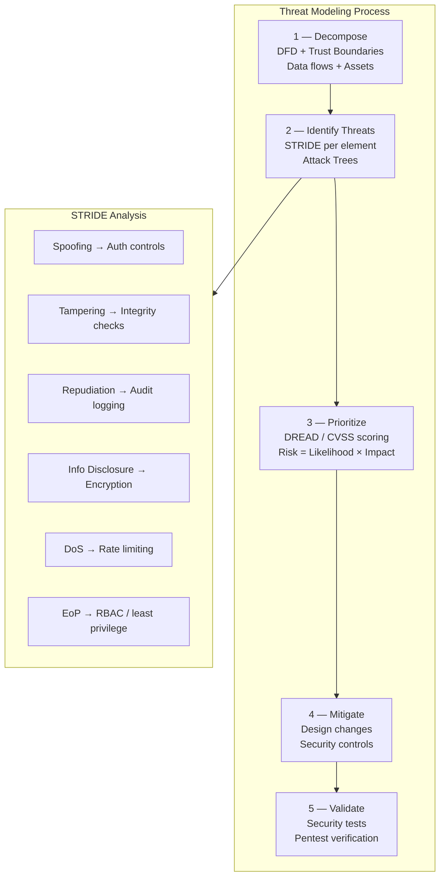

# Threat Modeling

## Category

DevSecOps, Security Design, Risk Management, Architecture

## Context

**Threat Modeling** is a structured process for identifying potential security threats to a system _before_ it is built or changed. By systematically enumerating threats at design time, teams can design mitigations early — when they are least expensive to implement.

Threat modeling answers four key questions:

1. **What are we building?** (DFD, architecture diagram)
2. **What can go wrong?** (STRIDE, attack trees)
3. **What are we going to do about it?** (mitigations, design changes)
4. **Did we do a good enough job?** (validation, acceptance criteria)

**STRIDE Threat Categories** (Microsoft):
| Threat | Violates | Example |
|--------|---------|---------|
| **S**poofing | Authentication | Forging JWT tokens |
| **T**ampering | Integrity | Modifying API request bodies in transit |
| **R**epudiation | Non-repudiation | Claiming a transaction never happened |
| **I**nformation Disclosure | Confidentiality | Leaking PII in error messages |
| **D**enial of Service | Availability | Flooding an endpoint without rate limiting |
| **E**levation of Privilege | Authorization | Accessing another user's data via IDOR |

**When to threat model**:

- New system or service design
- New feature with security implications
- Significant architecture changes
- After a security incident (post-mortem)
- Periodic review (annually for stable systems)

---

## Pros

- **Design-time prevention**: Cheapest time to fix security issues.
- **Risk prioritization**: Focus engineering effort on highest-risk areas.
- **Team security education**: The process builds security awareness.
- **Audit evidence**: Documented threat model satisfies SOC2, ISO 27001 requirements.
- **Architectural clarity**: Forces teams to precisely document data flows and trust boundaries.

---

## Cons

- **Time investment**: A thorough threat model for a complex system takes days.
- **Expertise requirement**: Effective threat modeling requires security knowledge.
- **Maintenance burden**: Models must be updated when the system changes.
- **Risk of false security**: Incomplete models give false confidence.
- **Tooling fragmentation**: Many manual tools (whiteboard, diagrams); automation is immature.

---

## Design Diagram



---

## Code Sample

### Threat Model Document Template (Markdown)

```markdown
# Threat Model: Payment Service

## Version

| Field        | Value                         |
| ------------ | ----------------------------- |
| Date         | 2024-01-15                    |
| Reviewed by  | Security Team + Lead Engineer |
| Last updated | 2024-03-01                    |

## 1. System Overview

The Payment Service processes card payments and bank transfers.
It receives requests from the Order Service and calls Stripe's API.

## 2. Data Flow Diagram (DFD)

[See: payment-service-dfd.mermaid]

Trust boundaries:

- External (internet) ↔ API Gateway
- API Gateway ↔ Payment Service (internal network)
- Payment Service ↔ Stripe (third-party)
- Payment Service ↔ Payment DB (internal)

## 3. Assets and Data Classification

| Asset                | Classification          | Owner        |
| -------------------- | ----------------------- | ------------ |
| Card numbers         | PCI-DSS Cardholder Data | Payment team |
| Bank account numbers | Sensitive PII           | Payment team |
| Transaction records  | Business Confidential   | Finance team |
| Stripe API key       | Secret                  | Payment team |

## 4. STRIDE Analysis

### 4.1 POST /payments endpoint

| STRIDE          | Threat                                            | Risk     | Mitigation                                                    | Status         |
| --------------- | ------------------------------------------------- | -------- | ------------------------------------------------------------- | -------------- |
| Spoofing        | Attacker forges JWT to impersonate another user   | HIGH     | JWT signature verification + audience claim check             | ✅ Done        |
| Tampering       | MITM modifies payment amount in transit           | HIGH     | TLS everywhere + HMAC request signing                         | ✅ Done        |
| Repudiation     | User denies making a payment                      | MEDIUM   | Audit log all transactions with user identity + timestamp     | ✅ Done        |
| Info Disclosure | Payment response leaks full card number           | CRITICAL | Mask card numbers in all logs and responses                   | 🔧 In progress |
| DoS             | Attacker floods /payments with requests           | HIGH     | Rate limiting: 10 req/min per user                            | ✅ Done        |
| EoP             | User A accesses User B's payment history via IDOR | CRITICAL | Ownership check: query WHERE user_id = $authenticated_user_id | ✅ Done        |

## 5. Attack Trees

### Root Goal: Steal User Payment Data

Leaf nodes:

- Compromise Stripe API key → use for unauthorized charges
  - Risk: HIGH | Mitigation: API key in Vault, rotated monthly, IP-restricted
- SQL injection in payment history endpoint
  - Risk: MEDIUM | Mitigation: Parameterized queries (verified by SAST)
- Exploit JWT authentication bypass
  - Risk: HIGH | Mitigation: Use well-tested library (jose), validate all claims

## 6. Open Risks

| ID     | Description                             | Severity | Owner          | Due Date   |
| ------ | --------------------------------------- | -------- | -------------- | ---------- |
| PM-001 | Card numbers appear in debug logs       | CRITICAL | Jane (Payment) | 2024-02-01 |
| PM-002 | Stripe webhook not validating signature | HIGH     | Bob (Payment)  | 2024-01-25 |
```

### Automated STRIDE Analysis (Threat Dragon Export Parser)

```typescript
// threat-modeling/analyze-threats.ts
import * as fs from "fs";

interface ThreatDragonThreat {
  type: string;
  severity: "Very High" | "High" | "Medium" | "Low";
  status: "Open" | "Mitigated" | "NA";
  title: string;
  description: string;
  mitigation: string;
}

interface ThreatDragonModel {
  summary: { title: string };
  detail: {
    diagrams: Array<{
      diagramType: string;
      cells: Array<{
        threats?: ThreatDragonThreat[];
      }>;
    }>;
  };
}

function analyzeThreatModel(modelPath: string): void {
  const model: ThreatDragonModel = JSON.parse(
    fs.readFileSync(modelPath, "utf-8"),
  );

  const allThreats: ThreatDragonThreat[] = model.detail.diagrams.flatMap((d) =>
    d.cells.flatMap((c) => c.threats ?? []),
  );

  const openThreats = allThreats.filter((t) => t.status === "Open");
  const criticalOpen = openThreats.filter(
    (t) => t.severity === "Very High" || t.severity === "High",
  );

  console.log(`\n📋 Threat Model: ${model.summary.title}`);
  console.log(`Total Threats:    ${allThreats.length}`);
  console.log(`Open Threats:     ${openThreats.length}`);
  console.log(`Critical/High:    ${criticalOpen.length}`);

  if (criticalOpen.length > 0) {
    console.error("\n❌ Unmitigated HIGH/CRITICAL threats found:");
    criticalOpen.forEach((t) => {
      console.error(`  [${t.severity}] ${t.type}: ${t.title}`);
      console.error(`    → ${t.description}`);
    });

    // Fail CI if open high-severity threats exist
    process.exit(1);
  }

  console.log("\n✅ All high-severity threats are mitigated");
}

analyzeThreatModel("./threat-models/payment-service.json");
```

### Threat Model CI Gate

```yaml
# .github/workflows/threat-model.yml
name: Threat Model Validation

on:
  pull_request:
    paths:
      - "threat-models/**"
      - "docs/architecture/**"

jobs:
  validate-threat-model:
    runs-on: ubuntu-latest
    steps:
      - uses: actions/checkout@v4

      - name: Set up Node.js
        uses: actions/setup-node@v4
        with:
          node-version: "20"

      - run: npx ts-node scripts/analyze-threats.ts

      - name: Validate STRIDE coverage
        run: |
          # Ensure all STRIDE categories are documented for new services
          for model in threat-models/*.json; do
            node scripts/validate-stride-coverage.js "$model"
          done
```
