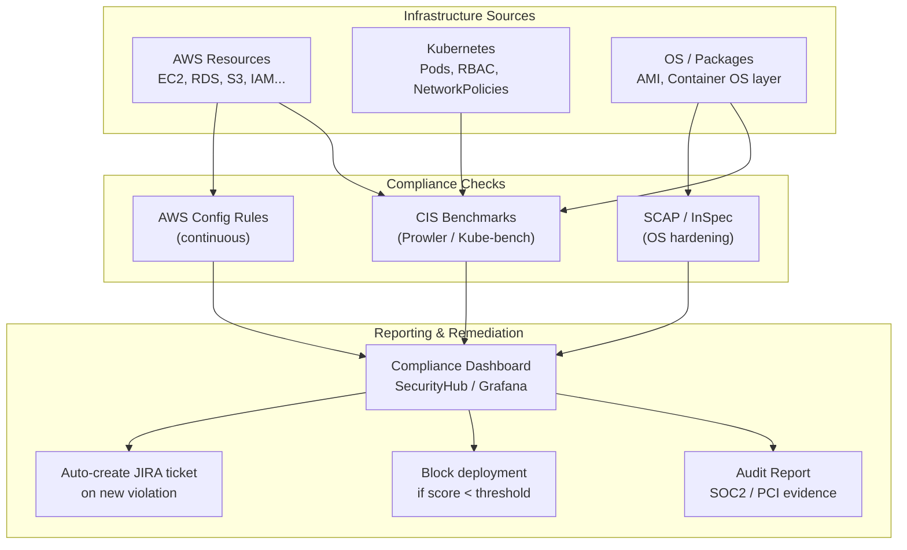

# Compliance as Code

## Category

DevSecOps, Compliance, Governance, Automation, Audit

## Context

**Compliance as Code** is the practice of automating regulatory and internal compliance checks by expressing requirements as executable code. Instead of relying on periodic manual audits, compliance posture is assessed continuously — on every commit, every deployment, and in real time against live infrastructure.

**Regulatory frameworks commonly automated**:
| Framework | Focus Area |
|-----------|-----------|
| **CIS Benchmarks** | Cloud/OS hardening baselines |
| **SOC 2** | Security, availability, confidentiality controls |
| **PCI-DSS** | Payment card security |
| **HIPAA** | Healthcare data protection |
| **GDPR / DPDPA** | Data privacy and processing |
| **ISO 27001** | Information security management |
| **NIST 800-53** | US federal security controls |

**Tools**:
| Tool | Use Case |
|------|---------|
| **AWS Security Hub** | Aggregated compliance checks across AWS services |
| **AWS Config Rules** | Continuous resource-level compliance assessment |
| **Prowler** | Open-source AWS/Azure/GCP CIS benchmark scanner |
| **OpenSCAP** | OS-level CIS/STIG scanning |
| **Kube-bench** | Kubernetes CIS benchmark |
| **Trivy** | SBOM + compliance checks (OS/container) |
| **Chef InSpec** | Compliance testing DSL for infrastructure |

---

## Pros

- **Continuous compliance**: Violations detected in minutes, not quarterly.
- **Audit evidence**: Automated reports provide continuous documentation.
- **Shift-left compliance**: Catch violations in PR review before they reach production.
- **Reduced audit cost**: Auditors review automated evidence rather than manually checking systems.
- **Fast remediation**: Automated alerts enable same-day fixes vs. weeks in manual audits.
- **Standardized benchmarks**: CIS/NIST benchmarks provide community-vetted baselines.

---

## Cons

- **Coverage gaps**: Automated checks cover technical controls; process and human elements need manual evidence.
- **False confidence**: 100% automated compliance score ≠ being secure.
- **Tuning overhead**: Out-of-the-box rules have false positives; require tailoring per environment.
- **Evolving regulations**: Compliance frameworks update annually; tool rules must keep pace.
- **Cross-framework overlap**: Teams may run 3–5 overlapping tools (SecurityHub, Prowler, Checkov, etc.).

---

## Design Diagram



---

## Code Sample

### AWS Config Custom Rule (Lambda)

```typescript
// compliance/aws-config-rule.ts — Lambda evaluating RDS encryption
import {
  ConfigServiceClient,
  PutEvaluationsCommand,
  ConfigurationItem,
} from "@aws-sdk/client-config-service";

const config = new ConfigServiceClient({ region: process.env.AWS_REGION });

// This Lambda is triggered by AWS Config whenever an RDS instance changes
export const handler = async (event: {
  invokingEvent: string;
  resultToken: string;
  ruleParameters?: string;
}): Promise<void> => {
  const invokingEvent = JSON.parse(event.invokingEvent);
  const configurationItem: ConfigurationItem = invokingEvent.configurationItem;

  if (configurationItem.resourceType !== "AWS::RDS::DBInstance") return;

  const configuration = configurationItem.configuration as {
    storageEncrypted: boolean;
    publiclyAccessible: boolean;
    deletionProtection: boolean;
    multiAZ: boolean;
    backupRetentionPeriod: number;
  };

  const violations: string[] = [];

  if (!configuration.storageEncrypted) {
    violations.push("Storage encryption is not enabled");
  }
  if (configuration.publiclyAccessible) {
    violations.push("RDS instance is publicly accessible");
  }
  if (!configuration.deletionProtection) {
    violations.push("Deletion protection is not enabled");
  }
  if (configuration.backupRetentionPeriod < 7) {
    violations.push(
      `Backup retention ${configuration.backupRetentionPeriod} days < required 7 days`,
    );
  }

  const compliance = violations.length === 0 ? "COMPLIANT" : "NON_COMPLIANT";

  await config.send(
    new PutEvaluationsCommand({
      Evaluations: [
        {
          ComplianceResourceType: configurationItem.resourceType!,
          ComplianceResourceId: configurationItem.resourceId!,
          ComplianceType: compliance,
          Annotation: violations.length
            ? violations.join("; ")
            : "All RDS security requirements met",
          OrderingTimestamp: new Date(),
        },
      ],
      ResultToken: event.resultToken,
    }),
  );

  if (compliance === "NON_COMPLIANT") {
    console.error(
      `NON_COMPLIANT RDS: ${configurationItem.resourceId} — ${violations.join("; ")}`,
    );
  }
};
```

### Prowler GitHub Actions Integration

```yaml
# .github/workflows/compliance.yml
name: Compliance Scan (Prowler)

on:
  schedule:
    - cron: "0 2 * * 1" # Weekly Monday 2 AM
  workflow_dispatch:

jobs:
  prowler:
    name: Prowler CIS / SOC2 Scan
    runs-on: ubuntu-latest
    permissions:
      id-token: write
      contents: read

    steps:
      - uses: actions/checkout@v4

      - name: Configure AWS credentials (OIDC — no long-lived keys)
        uses: aws-actions/configure-aws-credentials@v4
        with:
          role-to-assume: arn:aws:iam::${{ vars.AWS_ACCOUNT_ID }}:role/ProwlerScanner
          aws-region: eu-west-1

      - name: Run Prowler CIS Level 2 + SOC2
        run: |
          docker run --rm \
            -e AWS_DEFAULT_REGION=eu-west-1 \
            -v $(pwd)/prowler-output:/output \
            prowlercloud/prowler:latest \
              prowler aws \
              --compliance cis_level2_aws pci_dss_3.2.1_aws \
              --output-formats json-ocsf html \
              --output-directory /output \
              --severity critical high \
              --ignore-exit-code-3

      - name: Upload Prowler results
        uses: actions/upload-artifact@v4
        with:
          name: prowler-compliance-report
          path: prowler-output/

      - name: Fail if CRITICAL violations exceed threshold
        run: |
          CRITICAL=$(cat prowler-output/*.json | jq '[.[] | select(.severity=="critical" and .status=="FAIL")] | length')
          echo "Critical violations: $CRITICAL"
          if [ "$CRITICAL" -gt 0 ]; then
            echo "❌ $CRITICAL critical compliance violations found"
            exit 1
          fi
```

### Kube-bench (Kubernetes CIS Benchmark)

```yaml
# k8s/kube-bench/job.yaml
apiVersion: batch/v1
kind: Job
metadata:
  name: kube-bench
  namespace: security
spec:
  template:
    spec:
      hostPID: true
      containers:
        - name: kube-bench
          image: aquasec/kube-bench:latest
          command: ["kube-bench"]
          args:
            - "--benchmark"
            - "cis-1.8"
            - "--json"
          volumeMounts:
            - name: var-lib-kubelet
              mountPath: /var/lib/kubelet
              readOnly: true
            - name: etc-kubernetes
              mountPath: /etc/kubernetes
              readOnly: true
      restartPolicy: Never
      volumes:
        - name: var-lib-kubelet
          hostPath:
            path: /var/lib/kubelet
        - name: etc-kubernetes
          hostPath:
            path: /etc/kubernetes
```

### Compliance Report Generator

```typescript
// compliance/report-generator.ts
import * as fs from "fs";

interface ComplianceControl {
  id: string;
  description: string;
  framework: string;
  status: "PASS" | "FAIL" | "MANUAL";
  evidence: string;
  lastChecked: Date;
}

interface ComplianceSummary {
  framework: string;
  totalControls: number;
  passed: number;
  failed: number;
  manual: number;
  score: number;
  generatedAt: Date;
}

function generateComplianceReport(
  controls: ComplianceControl[],
): ComplianceSummary[] {
  const byFramework = new Map<string, ComplianceControl[]>();

  for (const control of controls) {
    if (!byFramework.has(control.framework))
      byFramework.set(control.framework, []);
    byFramework.get(control.framework)!.push(control);
  }

  const summaries: ComplianceSummary[] = [];

  for (const [framework, fControls] of byFramework) {
    const passed = fControls.filter((c) => c.status === "PASS").length;
    const failed = fControls.filter((c) => c.status === "FAIL").length;
    const manual = fControls.filter((c) => c.status === "MANUAL").length;
    const automated = passed + failed;

    summaries.push({
      framework,
      totalControls: fControls.length,
      passed,
      failed,
      manual,
      score: automated > 0 ? Math.round((passed / automated) * 100) : 0,
      generatedAt: new Date(),
    });

    if (failed > 0) {
      console.warn(`\n[${framework}] ${failed} failing controls:`);
      fControls
        .filter((c) => c.status === "FAIL")
        .forEach((c) => console.warn(`  ❌ ${c.id}: ${c.description}`));
    }
  }

  const report = {
    generatedAt: new Date().toISOString(),
    summaries,
    failingControls: controls.filter((c) => c.status === "FAIL"),
  };

  fs.writeFileSync("compliance-report.json", JSON.stringify(report, null, 2));
  console.log("\nCompliance report written to compliance-report.json");

  return summaries;
}
```

### AWS Config — Managed Rules for SOC2

```hcl
# infrastructure/terraform/compliance/soc2-config-rules.tf
# AWS Config managed rules mapped to SOC2 trust service criteria

resource "aws_config_config_rule" "rds_storage_encrypted" {
  name = "rds-storage-encrypted"
  # SOC2 CC6.1: Logical and physical access controls
  source {
    owner             = "AWS"
    source_identifier = "RDS_STORAGE_ENCRYPTED"
  }
}

resource "aws_config_config_rule" "s3_bucket_public_access_prohibited" {
  name = "s3-bucket-public-access-prohibited"
  # SOC2 CC6.1, CC6.6: Restrict external access
  source {
    owner             = "AWS"
    source_identifier = "S3_BUCKET_PUBLIC_READ_PROHIBITED"
  }
}

resource "aws_config_config_rule" "cloudtrail_enabled" {
  name = "cloud-trail-enabled"
  # SOC2 CC7.2: System monitoring
  source {
    owner             = "AWS"
    source_identifier = "CLOUD_TRAIL_ENABLED"
  }
}

resource "aws_config_config_rule" "mfa_enabled_for_iam_console" {
  name = "mfa-enabled-for-iam-console-access"
  # SOC2 CC6.1: Authentication
  source {
    owner             = "AWS"
    source_identifier = "MFA_ENABLED_FOR_IAM_CONSOLE_ACCESS"
  }
}

resource "aws_config_config_rule" "root_account_mfa" {
  name = "root-account-mfa-enabled"
  # SOC2 CC6.1: Root account protection
  source {
    owner             = "AWS"
    source_identifier = "ROOT_ACCOUNT_MFA_ENABLED"
  }
}
```
