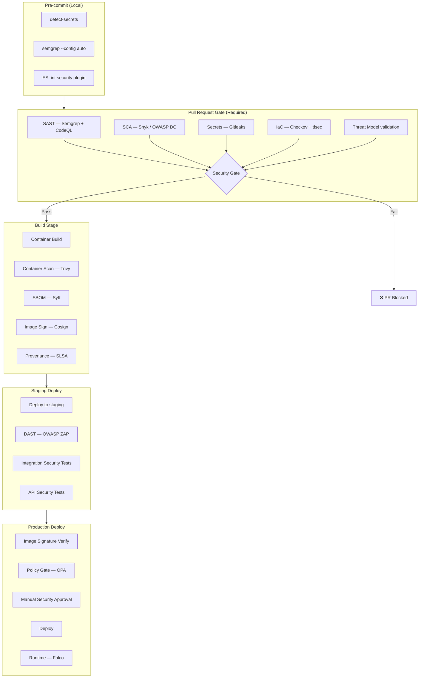

# Security CI/CD Pipeline

## Category
DevSecOps, CI/CD, Automation, Security Orchestration

## Context

A **Security CI/CD Pipeline** integrates all security testing and enforcement tools into a single, ordered pipeline that runs automatically on every code change. Rather than running security tools ad hoc or in isolated silos, the security pipeline orchestrates SAST, SCA, secret scanning, IaC scanning, SBOM generation, container scanning, DAST, and policy gates into a cohesive, developer-friendly workflow.

**Key design principles**:
1. **Fail fast**: Run the fastest and most impactful checks first (pre-commit → PR checks → deployment checks).
2. **Security as a quality gate**: Security checks are mandatory, not optional — block merges or deployments on findings.
3. **Developer-first feedback**: Results appear inline in PRs with actionable guidance, not in separate portals.
4. **Severity-based thresholds**: CRITICAL and HIGH block; MEDIUM and LOW warn.
5. **Audit trail**: Every scan run, result, and exception is logged and traceable to a commit.
6. **Exception management**: Provide a formal, auditable process for suppressing false positives.

**Pipeline stages**:
| Stage | When | Tools |
|-------|------|-------|
| Pre-commit | Local (developer) | detect-secrets, semgrep, ESLint |
| PR check | On PR open/update | SAST, SCA, secrets, IaC scan |
| Build | After PR merge | Container scan, SBOM, signing |
| Staging deploy | After build | DAST, integration security tests |
| Production deploy | Manual approval | Policy gate, signature verify |

---

## Pros

- **Comprehensive coverage**: All security dimensions tested automatically.
- **Consistent enforcement**: No human error — same checks every time.
- **Fast feedback loop**: Developer learns of issues during PR, not after release.
- **Audit-ready**: Every pipeline run is logged with findings and resolutions.
- **Reduced MTTR**: Security issues fixed before they reach production.
- **Developer trust**: Transparent, predictable security gates build trust rather than fear.

---

## Cons

- **Pipeline complexity**: Orchestrating 10+ tools requires careful maintenance.
- **Scan time**: Full security pipeline can add 10–20 minutes to PR validation.
- **Tool sprawl**: Each tool has its own config, false positive tuning, and update cycle.
- **Rate limits**: Some SaaS tools (Snyk, Semgrep) have API rate limits that affect CI throughput.
- **Keeping tools updated**: Outdated scanners miss new CVEs and vulnerability patterns.

---

## Design Diagram



---

## Code Sample

### Comprehensive Security Pipeline (GitHub Actions)

```yaml
# .github/workflows/security-pipeline.yml
name: Security Pipeline

on:
  pull_request:
    branches: [main, develop]
  push:
    branches: [main]

env:
  REGISTRY: ghcr.io
  IMAGE_NAME: ${{ github.repository }}

permissions:
  contents: read
  security-events: write
  id-token: write
  packages: write

jobs:
  # ─────────────────────────────────────────────
  # Stage 1: Fast checks (run in parallel)
  # ─────────────────────────────────────────────
  secrets-scan:
    name: Secrets Detection
    runs-on: ubuntu-latest
    steps:
      - uses: actions/checkout@v4
        with:
          fetch-depth: 0
      - uses: gitleaks/gitleaks-action@v2
        env:
          GITHUB_TOKEN: ${{ secrets.GITHUB_TOKEN }}

  sast:
    name: SAST (Semgrep)
    runs-on: ubuntu-latest
    container:
      image: returntocorp/semgrep
    steps:
      - uses: actions/checkout@v4
      - run: semgrep ci --sarif --output semgrep.sarif
        env:
          SEMGREP_APP_TOKEN: ${{ secrets.SEMGREP_APP_TOKEN }}
      - uses: github/codeql-action/upload-sarif@v3
        with:
          sarif_file: semgrep.sarif
        if: always()

  sca:
    name: SCA (Snyk)
    runs-on: ubuntu-latest
    steps:
      - uses: actions/checkout@v4
      - run: npm ci
      - uses: snyk/actions/node@master
        with:
          args: >
            --severity-threshold=high
            --sarif-file-output=snyk.sarif
        env:
          SNYK_TOKEN: ${{ secrets.SNYK_TOKEN }}
      - uses: github/codeql-action/upload-sarif@v3
        with:
          sarif_file: snyk.sarif
        if: always()

  iac-scan:
    name: IaC Security (Checkov)
    runs-on: ubuntu-latest
    if: contains(github.event.pull_request.changed_files, '.tf') || contains(github.event.pull_request.changed_files, 'k8s/')
    steps:
      - uses: actions/checkout@v4
      - uses: bridgecrewio/checkov-action@master
        with:
          directory: .
          framework: terraform,kubernetes,helm,dockerfile
          check: CRITICAL,HIGH
          output_format: sarif
          output_file_path: checkov.sarif
      - uses: github/codeql-action/upload-sarif@v3
        with:
          sarif_file: checkov.sarif
        if: always()

  # ─────────────────────────────────────────────
  # Stage 2: Security Gate
  # ─────────────────────────────────────────────
  security-gate:
    name: ✅ Security Gate
    needs: [secrets-scan, sast, sca]
    runs-on: ubuntu-latest
    steps:
      - run: echo "All required security checks passed"

  # ─────────────────────────────────────────────
  # Stage 3: Build + Container Security
  # ─────────────────────────────────────────────
  build-and-secure:
    name: Build, Scan & Sign Container
    needs: [security-gate]
    runs-on: ubuntu-latest
    outputs:
      image-digest: ${{ steps.push.outputs.digest }}

    steps:
      - uses: actions/checkout@v4

      - uses: docker/setup-buildx-action@v3

      - uses: docker/login-action@v3
        with:
          registry: ${{ env.REGISTRY }}
          username: ${{ github.actor }}
          password: ${{ secrets.GITHUB_TOKEN }}

      - name: Build image
        uses: docker/build-push-action@v5
        with:
          context: .
          push: false
          load: true
          tags: ${{ env.REGISTRY }}/${{ env.IMAGE_NAME }}:${{ github.sha }}
          cache-from: type=gha
          cache-to: type=gha,mode=max

      - name: Trivy container scan
        uses: aquasecurity/trivy-action@master
        with:
          image-ref: ${{ env.REGISTRY }}/${{ env.IMAGE_NAME }}:${{ github.sha }}
          format: sarif
          output: trivy.sarif
          severity: CRITICAL
          exit-code: '1'
          ignore-unfixed: true
        continue-on-error: false

      - name: Generate SBOM
        uses: anchore/sbom-action@v0
        with:
          image: ${{ env.REGISTRY }}/${{ env.IMAGE_NAME }}:${{ github.sha }}
          format: cyclonedx-json
          output-file: sbom.json

      - name: Push image
        id: push
        if: github.ref == 'refs/heads/main'
        uses: docker/build-push-action@v5
        with:
          context: .
          push: true
          tags: ${{ env.REGISTRY }}/${{ env.IMAGE_NAME }}:${{ github.sha }}

      - name: Sign image with Cosign (keyless OIDC)
        if: github.ref == 'refs/heads/main'
        run: cosign sign --yes "${{ env.REGISTRY }}/${{ env.IMAGE_NAME }}@${{ steps.push.outputs.digest }}"
        env:
          COSIGN_EXPERIMENTAL: 1

      - name: Attest SBOM
        if: github.ref == 'refs/heads/main'
        uses: actions/attest-sbom@v1
        with:
          subject-name: ${{ env.REGISTRY }}/${{ env.IMAGE_NAME }}
          subject-digest: ${{ steps.push.outputs.digest }}
          sbom-path: sbom.json
          push-to-registry: true

  # ─────────────────────────────────────────────
  # Stage 4: DAST against staging
  # ─────────────────────────────────────────────
  dast:
    name: DAST (OWASP ZAP)
    needs: [build-and-secure]
    runs-on: ubuntu-latest
    if: github.ref == 'refs/heads/main'
    environment: staging

    steps:
      - uses: actions/checkout@v4

      - name: Deploy to staging
        run: |
          # Trigger staging deployment and wait
          ./scripts/deploy-staging.sh ${{ github.sha }}

      - name: OWASP ZAP Scan
        uses: zaproxy/action-api-scan@v0.7.0
        with:
          target: ${{ vars.STAGING_API_URL }}
          rules_file_name: .zap/rules.tsv
          fail_action: true

      - uses: github/codeql-action/upload-sarif@v3
        with:
          sarif_file: zap.sarif
        if: always()
```

### Security Exception Management

```typescript
// security/exceptions/exception-manager.ts
// Formal, auditable process for suppressing security findings

interface SecurityException {
  id: string;
  tool: 'semgrep' | 'snyk' | 'checkov' | 'trivy' | 'zap';
  ruleId: string;
  filePath?: string;
  reason: string;               // Why it's a false positive or accepted risk
  approvedBy: string;           // Security team member who approved
  approvalDate: string;         // ISO date
  expiresAt: string;            // Exceptions must expire and be reviewed
  jiraTicket: string;           // Link to tracking ticket
}

// exceptions.json — committed to repo, PR-reviewed
const exceptions: SecurityException[] = [
  {
    id: "EXC-001",
    tool: "checkov",
    ruleId: "CKV_AWS_20",
    filePath: "infrastructure/terraform/cdn/s3.tf",
    reason: "S3 bucket intentionally public — serves static CDN assets (images, CSS, JS). No sensitive data",
    approvedBy: "security@company.com",
    approvalDate: "2024-01-15",
    expiresAt: "2025-01-15",  // Review annually
    jiraTicket: "SEC-123",
  },
];

function validateExceptions(): void {
  const now = new Date();
  const expired = exceptions.filter(e => new Date(e.expiresAt) < now);

  if (expired.length > 0) {
    console.error(`❌ ${expired.length} security exceptions have EXPIRED:`);
    expired.forEach(e => console.error(`  [${e.tool}:${e.ruleId}] ${e.id} — expired ${e.expiresAt}`));
    process.exit(1);
  }

  console.log(`✅ All ${exceptions.length} exceptions valid`);
}

validateExceptions();
```
