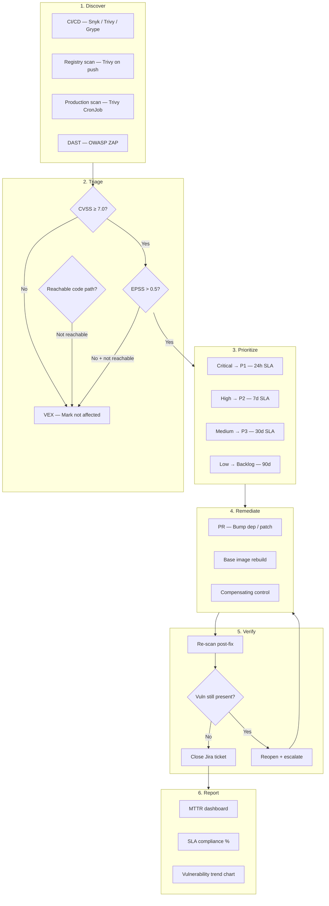

# Vulnerability Management

## Category
DevSecOps, Risk Management, Remediation, Compliance

## Context

**Vulnerability Management** is the continuous process of identifying, classifying, prioritizing, remediating, and verifying security vulnerabilities across all layers of the software stack — code dependencies, container base images, OS packages, and infrastructure. It is not a single scan but a lifecycle with defined SLAs, ownership, escalation, and metrics.

**Lifecycle stages**:
1. **Discover**: Automated scanning in CI/CD, container registries, and production environments.
2. **Triage**: Classify each finding by severity; filter false positives and noise.
3. **Prioritize**: Apply context (exploitability, reachability, CVSS score, EPSS, business criticality).
4. **Remediate**: Update dependencies, apply patches, or implement compensating controls.
5. **Verify**: Re-scan to confirm fix; close tracking ticket.
6. **Report**: MTTR dashboards, SLA compliance, progress over time.

**Key metrics**:
- **MTTR** (Mean Time to Remediate): Average time from discovery to verified fix.
- **SLA compliance rate**: % of vulnerabilities fixed within defined SLAs.
- **Vulnerability density**: Number of vulns per 1,000 lines of code.
- **Reopen rate**: % of "fixed" vulnerabilities that reappear (regression).

**SLA by severity**:
| Severity | CVSS Range | Max Remediation Time |
|----------|-----------|---------------------|
| Critical | 9.0–10.0 | 24 hours |
| High | 7.0–8.9 | 7 days |
| Medium | 4.0–6.9 | 30 days |
| Low | 0.1–3.9 | 90 days |
| Informational | N/A | Best effort |

**VEX (Vulnerability Exploitability eXchange)**: Structured statements that declare whether a known CVE is actually exploitable in a specific product context — a critical tool to reduce false positives and noise.

---

## Pros

- **Risk quantification**: CVE severity and EPSS scores give objective data for prioritization.
- **SLA enforcement**: Defined deadlines create accountability and reduce remediation drift.
- **Trend visibility**: MTTR and density metrics show whether the security posture is improving.
- **Noise reduction**: VEX statements and triage processes filter out non-exploitable findings.
- **Regulatory alignment**: Many standards (SOC 2, PCI DSS, ISO 27001) mandate vulnerability management.
- **Developer ownership**: Tracking in Jira keeps security issues in developer workflow.

---

## Cons

- **Alert fatigue**: Large codebases can generate thousands of findings, overwhelming teams.
- **False positives**: Many CVEs in base images or transitive deps are not actually exploitable.
- **Dependency on upstream**: Fixing a CVE may require waiting for an upstream maintainer to release a patch.
- **Complex tracking**: Without tooling like DefectDojo, deduplication across multiple scanners is error-prone.
- **SLA pressure**: Aggressive SLAs without sufficient security staff create unsustainable remediation burdens.

---

## Design Diagram



---

## Code Sample

### Vulnerability Lifecycle Manager

```typescript
// security/vuln-management/vulnerability-manager.ts
import { execSync } from 'child_process';
import * as fs from 'fs';

interface CVSSMetrics {
  score: number;
  vector: string;
}

interface EPSSScore {
  cve: string;
  score: number;        // 0.0–1.0 probability of exploitation in 30 days
  percentile: number;
}

interface Vulnerability {
  id: string;           // CVE-YYYY-NNNNN or GHSA-
  packageName: string;
  installedVersion: string;
  fixedVersion?: string;
  severity: 'CRITICAL' | 'HIGH' | 'MEDIUM' | 'LOW' | 'INFORMATIONAL';
  cvss?: CVSSMetrics;
  epss?: EPSSScore;
  description: string;
  source: 'trivy' | 'snyk' | 'grype' | 'owasp-dc';
}

interface TrivyReport {
  Results: Array<{
    Target: string;
    Vulnerabilities?: Array<{
      VulnerabilityID: string;
      PkgName: string;
      InstalledVersion: string;
      FixedVersion: string;
      Severity: string;
      CVSS?: { nvd?: { V3Score?: number; V3Vector?: string } };
      Description: string;
    }>;
  }>;
}

interface SLAThresholds {
  CRITICAL: number;
  HIGH: number;
  MEDIUM: number;
  LOW: number;
}

const SLA_DAYS: SLAThresholds = {
  CRITICAL: 1,      // 24 hours
  HIGH: 7,
  MEDIUM: 30,
  LOW: 90,
};

// ─── Parse scanner output ─────────────────────────────────────────────────

function parseTrivyReport(reportPath: string): Vulnerability[] {
  const report: TrivyReport = JSON.parse(fs.readFileSync(reportPath, 'utf-8'));
  const vulns: Vulnerability[] = [];

  for (const result of report.Results) {
    for (const v of result.Vulnerabilities ?? []) {
      const nvd = v.CVSS?.nvd;
      vulns.push({
        id: v.VulnerabilityID,
        packageName: v.PkgName,
        installedVersion: v.InstalledVersion,
        fixedVersion: v.FixedVersion || undefined,
        severity: v.Severity as Vulnerability['severity'],
        cvss: nvd?.V3Score
          ? { score: nvd.V3Score, vector: nvd.V3Vector ?? '' }
          : undefined,
        description: v.Description,
        source: 'trivy',
      });
    }
  }

  return vulns;
}

// ─── Fetch EPSS scores from FIRST.org API ────────────────────────────────

async function fetchEPSSScores(cveIds: string[]): Promise<Map<string, EPSSScore>> {
  if (cveIds.length === 0) return new Map();

  // Batch by 100 (API limit)
  const chunks: string[][] = [];
  for (let i = 0; i < cveIds.length; i += 100) {
    chunks.push(cveIds.slice(i, i + 100));
  }

  const scores = new Map<string, EPSSScore>();

  for (const chunk of chunks) {
    const params = chunk.map(id => `cve=${id}`).join('&');
    const res = await fetch(`https://api.first.org/data/1.0/epss?${params}`);

    if (!res.ok) continue;

    const data = await res.json() as { data: Array<{ cve: string; epss: string; percentile: string }> };
    for (const entry of data.data) {
      scores.set(entry.cve, {
        cve: entry.cve,
        score: parseFloat(entry.epss),
        percentile: parseFloat(entry.percentile) * 100,
      });
    }
  }

  return scores;
}

// ─── SLA assessment ───────────────────────────────────────────────────────

interface SLAAssessment {
  vuln: Vulnerability;
  deadlineDate: Date;
  daysRemaining: number;
  isBreached: boolean;
  priority: 'P1' | 'P2' | 'P3' | 'P4';
}

function assessSLA(
  vuln: Vulnerability,
  discoveredAt: Date = new Date(),
): SLAAssessment {
  const slaMap = { CRITICAL: 'P1', HIGH: 'P2', MEDIUM: 'P3', LOW: 'P4', INFORMATIONAL: 'P4' } as const;
  const slaMs = SLA_DAYS[vuln.severity as keyof SLAThresholds] ?? 90;

  const deadline = new Date(discoveredAt.getTime() + slaMs * 24 * 60 * 60 * 1000);
  const daysRemaining = Math.floor((deadline.getTime() - Date.now()) / (24 * 60 * 60 * 1000));

  return {
    vuln,
    deadlineDate: deadline,
    daysRemaining,
    isBreached: daysRemaining < 0,
    priority: slaMap[vuln.severity],
  };
}

// ─── Risk-based prioritization ───────────────────────────────────────────

function prioritizeVulnerabilities(vulns: Vulnerability[]): Vulnerability[] {
  return vulns.sort((a, b) => {
    // 1. Severity
    const severityRank = { CRITICAL: 0, HIGH: 1, MEDIUM: 2, LOW: 3, INFORMATIONAL: 4 };
    const sRank = severityRank[a.severity] - severityRank[b.severity];
    if (sRank !== 0) return sRank;

    // 2. EPSS score (higher = more likely to be exploited)
    const aEPSS = a.epss?.score ?? 0;
    const bEPSS = b.epss?.score ?? 0;
    if (bEPSS !== aEPSS) return bEPSS - aEPSS;

    // 3. CVSS score
    const aCVSS = a.cvss?.score ?? 0;
    const bCVSS = b.cvss?.score ?? 0;
    return bCVSS - aCVSS;
  });
}

// ─── VEX statement management ────────────────────────────────────────────

interface VEXStatement {
  cveId: string;
  status: 'not_affected' | 'affected' | 'fixed' | 'under_investigation';
  justification?:
    | 'component_not_present'
    | 'vulnerable_code_not_present'
    | 'vulnerable_code_not_in_execute_path'
    | 'vulnerable_code_cannot_be_controlled_by_adversary';
  statement: string;      // Human-readable explanation
  approvedBy: string;
  timestamp: string;
}

function loadVEXStatements(vexPath: string): Map<string, VEXStatement> {
  if (!fs.existsSync(vexPath)) return new Map();

  const statements: VEXStatement[] = JSON.parse(fs.readFileSync(vexPath, 'utf-8'));
  return new Map(statements.map(v => [v.cveId, v]));
}

function filterVEXed(
  vulns: Vulnerability[],
  vexStatements: Map<string, VEXStatement>,
): { active: Vulnerability[]; suppressed: Array<{ vuln: Vulnerability; vex: VEXStatement }> } {
  const active: Vulnerability[] = [];
  const suppressed: Array<{ vuln: Vulnerability; vex: VEXStatement }> = [];

  for (const vuln of vulns) {
    const vex = vexStatements.get(vuln.id);
    if (vex?.status === 'not_affected' || vex?.status === 'fixed') {
      suppressed.push({ vuln, vex });
    } else {
      active.push(vuln);
    }
  }

  return { active, suppressed };
}

// ─── Report + MTTR tracking ──────────────────────────────────────────────

interface VulnSummaryReport {
  timestamp: string;
  totalFound: number;
  suppressed: number;
  active: number;
  breachingSLA: number;
  byPriority: Record<string, number>;
  topVulnerabilities: Array<{
    id: string;
    packageName: string;
    severity: string;
    epssScore?: number;
    fixedVersion?: string;
    daysToSLABreach: number;
  }>;
}

async function generateVulnReport(trivyReportPath: string): Promise<VulnSummaryReport> {
  const rawVulns = parseTrivyReport(trivyReportPath);

  // Fetch EPSS scores for all CVEs
  const cveIds = rawVulns.filter(v => v.id.startsWith('CVE-')).map(v => v.id);
  const epssScores = await fetchEPSSScores(cveIds);

  // Attach EPSS scores
  for (const vuln of rawVulns) {
    vuln.epss = epssScores.get(vuln.id);
  }

  // Filter VEX suppressions
  const vexStatements = loadVEXStatements('.security/vex.json');
  const { active, suppressed } = filterVEXed(rawVulns, vexStatements);

  // Prioritize
  const prioritized = prioritizeVulnerabilities(active);
  const assessed = prioritized.map(v => assessSLA(v));
  const breaching = assessed.filter(a => a.isBreached);

  const byPriority = assessed.reduce<Record<string, number>>((acc, a) => {
    acc[a.priority] = (acc[a.priority] ?? 0) + 1;
    return acc;
  }, {});

  return {
    timestamp: new Date().toISOString(),
    totalFound: rawVulns.length,
    suppressed: suppressed.length,
    active: active.length,
    breachingSLA: breaching.length,
    byPriority,
    topVulnerabilities: assessed.slice(0, 10).map(a => ({
      id: a.vuln.id,
      packageName: a.vuln.packageName,
      severity: a.vuln.severity,
      epssScore: a.vuln.epss?.score,
      fixedVersion: a.vuln.fixedVersion,
      daysToSLABreach: a.daysRemaining,
    })),
  };
}

// ─── CI gate: fail on critical/high that breach SLA ──────────────────────

async function runCIGate(trivyReportPath: string): Promise<void> {
  const report = await generateVulnReport(trivyReportPath);

  console.log(`\n📊 Vulnerability Summary`);
  console.log(`  Total: ${report.totalFound} | Active: ${report.active} | Suppressed: ${report.suppressed}`);
  console.log(`  Breaching SLA: ${report.breachingSLA}`);
  console.log(`  By priority: ${JSON.stringify(report.byPriority)}`);

  const critical = report.byPriority['P1'] ?? 0;
  const high = report.byPriority['P2'] ?? 0;

  if (critical > 0 || high > 0) {
    console.error(`\n❌ Gate failed: ${critical} CRITICAL, ${high} HIGH vulnerabilities`);
    console.error(`   Fix or create VEX statements before merging.`);
    process.exit(1);
  }

  console.log(`\n✅ Gate passed — no CRITICAL or HIGH vulnerabilities`);
}

// Entry point
const reportPath = process.argv[2] ?? 'trivy-report.json';
runCIGate(reportPath).catch(err => {
  console.error('Vulnerability gate error:', err);
  process.exit(1);
});
```

### VEX Statement File

```json
[
  {
    "cveId": "CVE-2023-45133",
    "status": "not_affected",
    "justification": "vulnerable_code_not_in_execute_path",
    "statement": "This CVE affects @babel/traverse's eval() usage. Our codebase only uses Babel for build-time transpilation; no user input reaches the vulnerable code path at runtime.",
    "approvedBy": "security-team@company.com",
    "timestamp": "2024-01-15T10:00:00Z"
  }
]
```

### Kubernetes CronJob — Continuous Production Scanning

```yaml
# infrastructure/k8s/security/trivy-scan-cronjob.yaml
apiVersion: batch/v1
kind: CronJob
metadata:
  name: trivy-vulnerability-scan
  namespace: security
spec:
  schedule: "0 2 * * *"   # Run nightly at 02:00 UTC
  concurrencyPolicy: Forbid
  jobTemplate:
    spec:
      template:
        spec:
          serviceAccountName: trivy-scanner
          restartPolicy: OnFailure
          containers:
            - name: trivy
              image: aquasec/trivy:latest
              env:
                - name: REPORT_BUCKET
                  value: "s3://security-reports/vulnerability-scans"
              command: ["/bin/sh", "-c"]
              args:
                - |
                  DATE=$(date +%Y-%m-%d)

                  # Scan all images currently running in the cluster
                  kubectl get pods -A -o jsonpath='{range .items[*]}{.spec.containers[*].image}{"\n"}{end}' \
                    | sort -u \
                    | while read IMAGE; do
                        trivy image \
                          --format json \
                          --severity CRITICAL,HIGH \
                          --ignore-unfixed \
                          --output "/tmp/scan-$(echo $IMAGE | tr '/:' '-').json" \
                          "$IMAGE"
                      done

                  # Upload reports for MTTR tracking
                  aws s3 sync /tmp/ "${REPORT_BUCKET}/${DATE}/" --include "scan-*.json"
              resources:
                requests:
                  cpu: 200m
                  memory: 256Mi
                limits:
                  cpu: 500m
                  memory: 512Mi
          volumes:
            - name: tmp
              emptyDir: {}
```
