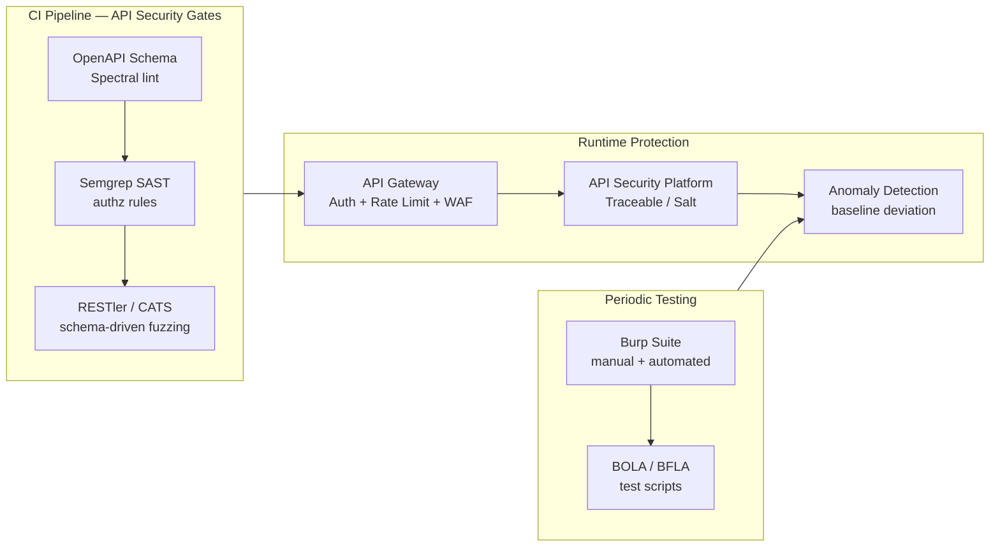

# API Security

## Category

DevSecOps, API Security, OWASP, Security Testing

## Context

**API Security** is a discipline focused on protecting APIs from the OWASP API Security Top 10 — a distinct threat model from the OWASP Web Top 10. APIs have unique attack surfaces: they expose business logic directly, return structured data, and are consumed by both human-facing UIs and machine-to-machine integrations. A misconfigured REST or GraphQL API can expose every user's data with a single parameter change.

### OWASP API Security Top 10 (2023)

| # | Name | Description | Example |
|---|------|-------------|---------|
| API1 | **Broken Object Level Authorization (BOLA)** | User can access another user's object by changing an ID | `GET /payments/456` (attacker owns payment 123) |
| API2 | **Broken Authentication** | Weak/missing auth on API endpoints | Unsigned JWT accepted; no expiry |
| API3 | **Broken Object Property Level Authorization** | Returning or accepting fields the caller shouldn't see | Admin-only `role` field writable by regular user |
| API4 | **Unrestricted Resource Consumption** | No rate limits on expensive operations | Unlimited calls to AI endpoint or PDF export |
| API5 | **Broken Function Level Authorization (BFLA)** | Regular user can call admin-only endpoints | `DELETE /admin/users/456` with user token |
| API6 | **Unrestricted Access to Sensitive Business Flows** | No friction on high-value flows | Unlimited OTP attempts; bulk account creation |
| API7 | **Server-Side Request Forgery (SSRF)** | API fetches attacker-supplied URL | `POST /fetch` with `url: http://169.254.169.254` |
| API8 | **Security Misconfiguration** | Default credentials, debug endpoints, CORS `*` | Swagger UI exposed in production |
| API9 | **Improper Inventory Management** | Outdated API versions, shadow endpoints | `/v1/` deprecated but still live and unpatched |
| API10 | **Unsafe Consumption of APIs** | Trusting 3rd-party API responses without validation | Blindly deserializing vendor webhook payload |

### Testing Approach by SDLC Phase

| Phase | Activity | Tool |
|-------|----------|------|
| Design | STRIDE on API contract | Threat Dragon, OWASP API checklist |
| Code | SAST rules for authz bypass | Semgrep, CodeQL |
| Build | OpenAPI schema validation | Spectral, Redocly |
| Test | API fuzzing (schema-driven) | RESTler, CATS, Dredd |
| Test | Auth bypass / BOLA testing | OWASP ZAP API mode, custom scripts |
| Staging | DAST with authenticated session | StackHawk, Burp Suite Enterprise |
| Operate | Runtime anomaly detection | Traceable AI, Salt Security, Noname |

---

## Pros

- **Catches logic bugs SAST cannot**: BOLA and BFLA require understanding of business context — automated scanners and SAST miss them.
- **Contract-first testing**: OpenAPI / AsyncAPI schemas give tools a precise map of the attack surface.
- **High ROI**: API vulnerabilities are frequently exploited and highly impactful; early detection prevents data breaches.

## Cons

- **Difficult to automate fully**: Business logic bugs like BOLA require knowing which IDs belong to which user — hard to replicate in automation without test data fixtures.
- **GraphQL complexity**: Introspection reveals the full schema; nested queries can trigger DoS without depth limits.
- **Versioned APIs expand surface**: Multiple API versions (`/v1`, `/v2`) mean security controls must be applied to all versions uniformly.

---

## Design Diagram



---

## Code Sample

### 1. BOLA Prevention — Resource Ownership Check

```typescript
// ❌ BOLA vulnerability — trusts caller-supplied paymentId without ownership check
app.get('/api/payments/:paymentId', authenticate, async (req, res) => {
  const payment = await db.payments.findById(req.params.paymentId);
  return res.json(payment);   // any authenticated user can read any payment!
});

// ✅ Fix — always scope query to the authenticated user's ID
app.get('/api/payments/:paymentId', authenticate, async (req, res) => {
  const payment = await db.payments.findOne({
    id:        req.params.paymentId,
    accountId: req.user.accountId,   // enforce ownership at the query level
  });

  if (!payment) {
    // Return 404 — not 403 — to avoid confirming the resource exists
    return res.status(404).json({ error: 'Payment not found' });
  }

  return res.json(payment);
});
```

### 2. BFLA Prevention — Role-Based Function Guard

```typescript
// Middleware — enforce role before reaching handler
function requireRole(...roles: string[]) {
  return (req: Request, res: Response, next: NextFunction) => {
    if (!roles.includes(req.user?.role)) {
      // Log the attempt for detection
      logger.warn('BFLA attempt', {
        userId:   req.user?.id,
        role:     req.user?.role,
        endpoint: req.path,
        method:   req.method,
      });
      return res.status(403).json({ error: 'Forbidden' });
    }
    next();
  };
}

// Admin-only endpoints are protected before any business logic runs
app.delete('/api/admin/accounts/:id',
  authenticate,
  requireRole('admin', 'super-admin'),
  deleteAccountHandler
);

// ❌ Bad — checking role inside the handler (still executes partial logic)
app.delete('/api/admin/accounts/:id', authenticate, async (req, res) => {
  // ...some logic runs before the check...
  if (req.user.role !== 'admin') return res.status(403).json({ error: 'Forbidden' });
});
```

### 3. Mass Assignment (API3) — Allowlist Input Fields

```typescript
import { z } from 'zod';

// Define exactly what fields users can write — reject everything else
const UpdatePaymentSchema = z.object({
  reference: z.string().max(100).optional(),
  metadata:  z.record(z.string()).optional(),
  // NOTE: 'status', 'amount', 'accountId', 'createdBy' are NOT here
  //       — callers cannot set these, even if they include them in the body
}).strict();   // .strict() rejects unknown keys

app.patch('/api/payments/:id', authenticate, async (req, res) => {
  const result = UpdatePaymentSchema.safeParse(req.body);
  if (!result.success) {
    return res.status(400).json({ errors: result.error.format() });
  }
  // result.data only contains the allowlisted fields — safe to spread
  await db.payments.update({ id: req.params.id, accountId: req.user.accountId }, result.data);
  res.json({ ok: true });
});
```

### 4. Rate Limiting — Protect Sensitive Flows (API4 + API6)

```typescript
import rateLimit from 'express-rate-limit';
import RedisStore from 'rate-limit-redis';
import { createClient } from 'redis';

const redis = createClient({ url: process.env.REDIS_URL });

// Standard rate limit — 100 req/min per IP
const standardLimiter = rateLimit({
  windowMs: 60_000,
  max: 100,
  store: new RedisStore({ sendCommand: (...args) => redis.sendCommand(args) }),
  standardHeaders: true,
  legacyHeaders: false,
});

// Strict rate limit — OTP / login / password reset (API6: sensitive business flow)
const authLimiter = rateLimit({
  windowMs: 15 * 60_000,   // 15 minutes
  max: 5,
  store: new RedisStore({ sendCommand: (...args) => redis.sendCommand(args) }),
  keyGenerator: (req) => req.body?.email ?? req.ip,   // per-email limit (not just IP)
  handler: (req, res) => {
    logger.warn('Rate limit hit on auth endpoint', { ip: req.ip, email: req.body?.email });
    res.status(429).json({
      error: 'Too many attempts. Please try again in 15 minutes.',
      retryAfter: Math.ceil(req.rateLimit.resetTime / 1000),
    });
  },
});

app.post('/api/auth/otp/verify',      authLimiter, verifyOtpHandler);
app.post('/api/auth/password/reset',  authLimiter, passwordResetHandler);
app.use('/api',                        standardLimiter);
```

### 5. SSRF Prevention — Validate External URLs (API7)

```typescript
import { URL } from 'url';
import ipaddr from 'ipaddr.js';
import dns from 'dns/promises';

// Block private/loopback/link-local IP ranges — prevent SSRF to cloud metadata, internal services
const BLOCKED_RANGES = [
  '10.0.0.0/8',
  '172.16.0.0/12',
  '192.168.0.0/16',
  '127.0.0.0/8',
  '169.254.0.0/16',     // AWS metadata endpoint 169.254.169.254
  '::1/128',
  'fc00::/7',
];

async function isSafeUrl(rawUrl: string): Promise<boolean> {
  let parsed: URL;
  try {
    parsed = new URL(rawUrl);
  } catch {
    return false;   // invalid URL
  }

  // Only allow HTTPS
  if (parsed.protocol !== 'https:') return false;

  // Resolve to IP and check against blocked ranges
  const addresses = await dns.resolve4(parsed.hostname).catch(() => []);
  for (const addr of addresses) {
    const ip = ipaddr.parse(addr);
    for (const range of BLOCKED_RANGES) {
      if (ip.match(ipaddr.parseCIDR(range))) return false;
    }
  }
  return true;
}

app.post('/api/webhooks/test', authenticate, async (req, res) => {
  const { callbackUrl } = req.body;

  if (!(await isSafeUrl(callbackUrl))) {
    return res.status(400).json({ error: 'Invalid or disallowed URL' });
  }

  const response = await fetch(callbackUrl, { method: 'POST', body: '{"test":true}' });
  res.json({ status: response.status });
});
```

### 6. Security Headers + CORS Hardening (API8)

```typescript
import helmet from 'helmet';
import cors from 'cors';

const ALLOWED_ORIGINS = [
  'https://app.example.com',
  'https://payments.example.com',
];

app.use(helmet({
  contentSecurityPolicy: {
    directives: {
      defaultSrc: ["'none'"],
      scriptSrc: ["'self'"],
      connectSrc: ["'self'"],
      frameguard: { action: 'deny' },
    },
  },
  hsts: {
    maxAge: 31_536_000,       // 1 year
    includeSubDomains: true,
    preload: true,
  },
  referrerPolicy: { policy: 'strict-origin-when-cross-origin' },
  xssFilter: true,
  noSniff: true,
}));

app.use(cors({
  origin: (origin, callback) => {
    if (!origin || ALLOWED_ORIGINS.includes(origin)) {
      callback(null, true);
    } else {
      callback(new Error(`CORS policy violation: origin ${origin} not allowed`));
    }
  },
  methods: ['GET', 'POST', 'PATCH', 'DELETE'],
  allowedHeaders: ['Content-Type', 'Authorization'],
  credentials: true,
  maxAge: 86400,   // preflight cache: 24h
}));

// Disable Swagger/OpenAPI UI in production
if (process.env.NODE_ENV === 'production') {
  app.use('/api-docs', (req, res) => res.status(404).end());
  app.use('/swagger',  (req, res) => res.status(404).end());
}
```

### 7. OpenAPI Schema — Spectral Security Ruleset

```yaml
# .spectral.yaml — enforce security requirements on OpenAPI contract
extends:
  - spectral:oas

rules:
  # All paths must have security defined (no unauthenticated endpoints by accident)
  operation-security-defined:
    message: "Every operation must define a security requirement"
    given: "$.paths[*][get,post,put,patch,delete]"
    then:
      field: security
      function: defined

  # No API key in query params (leaks in logs/URLs)
  no-api-key-in-query:
    message: "API keys must not be passed as query parameters"
    given: "$.paths[*][*].parameters[*]"
    then:
      function: schema
      functionOptions:
        schema:
          not:
            properties:
              in:
                enum: [query]
              name:
                pattern: "(?i)(api[_-]?key|token|secret|password)"

  # 401 and 403 responses must be defined on all secured operations
  security-responses-defined:
    message: "Secured operations must document 401 and 403 responses"
    given: "$.paths[*][get,post,put,patch,delete][?(@.security)]"
    then:
      function: schema
      functionOptions:
        schema:
          required: [responses]
          properties:
            responses:
              required: ["401", "403"]
```

### 8. RESTler — Schema-Driven API Fuzzing in CI

```yaml
# .github/workflows/api-fuzz.yml
name: API Security Fuzzing

on:
  push:
    branches: [main]
  schedule:
    - cron: '0 2 * * 1'    # weekly deep fuzz on Monday at 2am

jobs:
  fuzz:
    runs-on: ubuntu-latest
    steps:
      - uses: actions/checkout@v4

      - name: Start API under test
        run: docker compose up -d api
        env:
          NODE_ENV: test

      - name: Run RESTler fuzzer
        uses: microsoft/restler-fuzzer-action@v1
        with:
          api-spec-path: ./openapi.yaml
          target-endpoint: http://localhost:3000
          # Use 'quick' in PR; 'test' (deeper) in scheduled run
          task: ${{ github.event_name == 'schedule' && 'test' || 'quick-fuzz' }}
          token-refresh-command: "curl -s -X POST http://localhost:3000/auth/token -d '{\"clientId\":\"fuzz\",\"clientSecret\":\"${{ secrets.FUZZ_CLIENT_SECRET }}\"}' | jq -r .accessToken"

      - name: Upload RESTler results
        uses: actions/upload-artifact@v4
        if: always()
        with:
          name: restler-results
          path: ./restler-results/

      - name: Fail on 500 errors or auth bypass
        run: |
          # Fail the build if RESTler found any 500s or unexpected 2xx on admin paths
          BUGS=$(find ./restler-results -name "*.txt" | xargs grep -l "Bug" | wc -l)
          if [ "$BUGS" -gt "0" ]; then
            echo "RESTler found $BUGS bug buckets — failing build"
            exit 1
          fi
```

---

## References

- [OWASP API Security Top 10 (2023)](https://owasp.org/API-Security/editions/2023/en/0x00-header/)
- [OWASP API Security Project](https://owasp.org/www-project-api-security/)
- [RESTler — Microsoft API fuzzer](https://github.com/microsoft/restler-fuzzer)
- [CATS — Contract-Aware Testing](https://github.com/Endava/cats)
- [Spectral — OpenAPI linting](https://stoplight.io/open-source/spectral)
- [PortSwigger Web Academy — API Testing](https://portswigger.net/web-security/api-testing)
- [Salt Security Blog — BOLA explained](https://salt.security/blog/what-is-bola)
