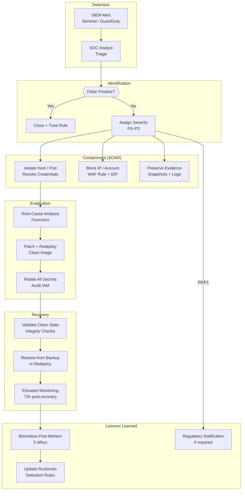

# Incident Response

## Category

DevSecOps, Security Operations, SOAR, Crisis Management

## Context

**Incident Response (IR)** is the organised approach to addressing and managing the aftermath of a security breach or cyberattack. While runtime security monitoring and GuardDuty/Sentinel *detect* incidents, IR defines *what happens next* — containing the threat, preserving evidence, eradicating the attacker, recovering services, and preventing recurrence.

Without a practiced IR plan, teams improvise under pressure — leading to slower containment, evidence destruction, regulatory violations, and larger blast radius.

### Incident Lifecycle (PICERL)

| Phase | Goal | Key Actions |
|-------|------|-------------|
| **P**reparation | Ready to respond before incidents happen | Runbooks, tooling, on-call rotation, game days |
| **I**dentification | Confirm this is an actual incident, not a false positive | Triage alert, collect IOCs, declare severity |
| **C**ontainment | Stop the bleeding — prevent further damage | Isolate affected resources, revoke credentials |
| **E**radication | Remove the root cause | Patch, redeploy, rotate all secrets |
| **R**ecovery | Restore service from known-good state | Validated backups, clean re-deployment |
| **L**essons Learned | Prevent recurrence | Post-mortem, detection gap fixes, runbook updates |

### Severity Classification

| Sev | Criteria | Response Time | Example |
|-----|----------|--------------|---------|
| **P0 — Critical** | Active breach; data exfiltration confirmed or likely; production down | Immediate (24/7) | Attacker with DB access; ransomware |
| **P1 — High** | Potential breach; production impacted; regulatory notification likely | < 1 hour | Compromised service account; GuardDuty critical finding |
| **P2 — Medium** | Suspicious activity; no confirmed breach; SLA at risk | < 4 hours | Anomalous access pattern; failed priv escalation |
| **P3 — Low** | Informational; no immediate impact | Next business day | Low-severity GuardDuty finding; misconfig with no exposure |

### Regulatory Notification Deadlines

| Regulation | Deadline | Trigger |
|-----------|----------|---------|
| GDPR (EU) | 72 hours | Personal data breach |
| PSD2 / NIS2 | 4 hours (major incidents) | Payment service disruption |
| UK GDPR | 72 hours | Personal data breach |
| PCI-DSS | Immediately | Cardholder data compromise |
| US SEC | 4 business days | Material cybersecurity incident |

---

## Pros

- **Reduces blast radius**: Fast containment limits data exfiltrated and systems compromised.
- **Preserves evidence**: Proper IR procedures maintain forensic integrity for legal proceedings.
- **Regulatory compliance**: Documented IR capability is required by ISO 27001, SOC 2, PCI-DSS, GDPR.
- **Builds organisational resilience**: Post-mortems close detection gaps and improve future response.
- **SOAR automation reduces MTTR**: Automated containment (revoke creds, isolate host) can happen in seconds vs hours.

## Cons

- **Runbooks go stale**: IR procedures must be practiced (game days) — untested runbooks fail under pressure.
- **Evidence vs speed tension**: Forensic evidence collection adds time; speed of containment may destroy evidence.
- **Coordination overhead**: Cross-functional coordination (engineering, legal, comms, CISO) under pressure is hard.
- **Alert fatigue degrades response**: Teams that see too many false positives under-respond to real incidents.

---

## Design Diagram



---

## Code Sample

### 1. SOAR Playbook — Automated Containment (AWS Lambda)

```typescript
// Triggered by EventBridge when GuardDuty finding severity >= 7
// Automatically: revokes IAM key, isolates EC2, notifies PagerDuty

import { IAMClient, UpdateAccessKeyCommand, ListAccessKeysCommand } from '@aws-sdk/client-iam';
import { EC2Client, CreateSecurityGroupCommand, AuthorizeSecurityGroupIngressCommand,
         ModifyInstanceAttributeCommand } from '@aws-sdk/client-ec2';

const iam = new IAMClient({});
const ec2 = new EC2Client({});

interface GuardDutyFinding {
  id: string;
  type: string;
  severity: number;
  region: string;
  accountId: string;
  detail: {
    resource: {
      resourceType: 'Instance' | 'AccessKey' | 'Container';
      instanceDetails?: { instanceId: string; vpcId: string; };
      accessKeyDetails?: { userName: string; accessKeyId: string; };
    };
  };
}

export async function handler(event: { detail: GuardDutyFinding }) {
  const finding = event.detail;
  const actions: string[] = [];

  // 1. Contain IAM credential compromise
  if (finding.detail.resource.resourceType === 'AccessKey') {
    const { userName, accessKeyId } = finding.detail.resource.accessKeyDetails!;

    // Disable the specific key
    await iam.send(new UpdateAccessKeyCommand({
      UserName: userName,
      AccessKeyId: accessKeyId,
      Status: 'Inactive',
    }));
    actions.push(`Disabled IAM access key ${accessKeyId} for ${userName}`);

    // Disable ALL keys for this user — attacker may have created new ones
    const allKeys = await iam.send(new ListAccessKeysCommand({ UserName: userName }));
    for (const key of allKeys.AccessKeyMetadata ?? []) {
      if (key.AccessKeyId !== accessKeyId && key.Status === 'Active') {
        await iam.send(new UpdateAccessKeyCommand({
          UserName: userName,
          AccessKeyId: key.AccessKeyId!,
          Status: 'Inactive',
        }));
        actions.push(`Disabled additional key ${key.AccessKeyId} for ${userName}`);
      }
    }
  }

  // 2. Isolate compromised EC2 instance (attach quarantine SG — deny all traffic)
  if (finding.detail.resource.resourceType === 'Instance') {
    const { instanceId, vpcId } = finding.detail.resource.instanceDetails!;

    // Create deny-all security group if not exists
    const quarantineSg = await ec2.send(new CreateSecurityGroupCommand({
      GroupName: `quarantine-${Date.now()}`,
      Description: 'Quarantine — deny all inbound and outbound',
      VpcId: vpcId,
    }));

    // Replace instance SG with quarantine SG (removes network access)
    await ec2.send(new ModifyInstanceAttributeCommand({
      InstanceId: instanceId,
      Groups: [quarantineSg.GroupId!],
    }));
    actions.push(`Isolated instance ${instanceId} — replaced SG with quarantine`);
  }

  // 3. Notify incident response team
  await notifyPagerDuty({
    title: `[P${finding.severity >= 9 ? '0' : '1'}] GuardDuty: ${finding.type}`,
    severity: finding.severity >= 9 ? 'critical' : 'error',
    body: [
      `Finding ID: ${finding.id}`,
      `Account: ${finding.accountId} | Region: ${finding.region}`,
      `Automated actions taken:<br/>${actions.map(a => `  - ${a}`).join('<br/>')}`,
      `Runbook: https://runbooks.internal/ir/${finding.type.split(':')[0].toLowerCase()}`,
    ].join('<br/>'),
  });

  return { findingId: finding.id, actionsCount: actions.length, actions };
}
```

### 2. Incident Runbook — Compromised Container / Pod

```markdown
# Runbook: Compromised Container

**Trigger:** Falco alert — "Terminal shell in container" or "Unexpected outbound connection"  
**Severity:** P1 (potential breach)  
**Owner:** On-call Security Engineer  
**Estimated TTR:** 30–60 minutes

---

## Step 1 — Validate (5 min)
```bash
# Get Falco alert details
kubectl logs -n falco daemonset/falco --since=10m | grep "Terminal shell"

# Identify affected pod
POD_NAME="<pod from alert>"
NAMESPACE="<namespace from alert>"

# Check what processes ran in the pod
kubectl exec -n $NAMESPACE $POD_NAME -- ps aux
kubectl exec -n $NAMESPACE $POD_NAME -- netstat -tulpn
```

## Step 2 — Preserve Evidence (5 min)
```bash
# Dump pod logs BEFORE killing
kubectl logs -n $NAMESPACE $POD_NAME --all-containers=true > /evidence/pod-logs-$(date +%s).txt

# Capture network connections
kubectl exec -n $NAMESPACE $POD_NAME -- ss -tulpn > /evidence/netstat-$(date +%s).txt

# Get pod spec and image digest
kubectl get pod -n $NAMESPACE $POD_NAME -o yaml > /evidence/pod-spec-$(date +%s).yaml
```

## Step 3 — Contain (5 min)
```bash
# Isolate: apply deny-all NetworkPolicy to the pod
kubectl apply -f - <<EOF
apiVersion: networking.k8s.io/v1
kind: NetworkPolicy
metadata:
  name: quarantine-${POD_NAME}
  namespace: ${NAMESPACE}
spec:
  podSelector:
    matchLabels:
      app: $(kubectl get pod -n $NAMESPACE $POD_NAME -o jsonpath='{.metadata.labels.app}')
  policyTypes: [Ingress, Egress]
  # No ingress/egress rules = deny all
EOF

# Scale down deployment to 0 replicas (stops new pods from starting)
kubectl scale deployment -n $NAMESPACE <deployment-name> --replicas=0
```

## Step 4 — Eradicate (20 min)
- Review image for embedded backdoor: `trivy image <image>:<tag>`
- Check git history for unusual commits to Dockerfile
- Rotate all secrets that the pod had access to (check pod env vars + mounted secrets)
- Rebuild image from clean base; deploy fresh

## Step 5 — Recovery (10 min)
```bash
# Deploy clean image from verified digest
kubectl set image deployment/<name> -n $NAMESPACE <container>=<image>@sha256:<digest>
kubectl scale deployment -n $NAMESPACE <name> --replicas=3
kubectl rollout status deployment/<name> -n $NAMESPACE
```

## Step 6 — Post-Mortem (within 48h)
- Complete blameless post-mortem template
- File Jira tickets for each detection/prevention gap
- Update this runbook if steps were missing or unclear
```

### 3. Post-Mortem Template

```markdown
# Post-Mortem: [Incident Title]

**Date:** YYYY-MM-DD  
**Severity:** P0 / P1 / P2  
**Duration:** X hours Y minutes (detection → full recovery)  
**Author:** [Lead engineer]  
**Reviewers:** [Security, Engineering, Legal]  
**Status:** Draft / Under Review / Final  

---

## Summary
One paragraph: what happened, what was affected, and what stopped it.

## Timeline (UTC)

| Time | Event |
|------|-------|
| 14:03 | GuardDuty finding fired: UnauthorizedAccess:IAMUser/ConsoleLoginSuccess.B |
| 14:05 | PagerDuty page sent to on-call security engineer |
| 14:12 | Analyst confirms finding is real — declares P1 |
| 14:15 | IAM access key disabled by SOAR automation |
| 14:30 | Root cause identified: leaked key in GitHub Actions log |
| 15:20 | All secrets rotated; GitHub Actions secrets updated |
| 15:45 | Monitoring elevated; incident downgraded to P2 |
| 16:30 | Full recovery confirmed |

## Root Cause
The 5 Whys:
1. Why was the account compromised? → AWS access key was exposed in a GitHub Actions log
2. Why was it in the log? → A `echo` debug statement printed environment variables
3. Why wasn't this caught? → No secret scanning in CI logs
4. Why is there no secret scanning in CI logs? → Not in scope of original secret scanning implementation
5. Why was it not in scope? → Runbook focused on source code, not CI output

**Root cause:** Secret scanning did not cover CI/CD pipeline outputs.

## Impact
- 2 S3 bucket objects accessed by attacker (no PII — log files only)
- No data exfiltration of customer data confirmed
- Service availability: unaffected
- Regulatory notification: not required (no personal data accessed)

## What Went Well
- SOAR automation disabled the key within 2 minutes of alert
- Escalation path was clear — P1 declared within 7 minutes

## What Went Poorly
- Evidence preservation step skipped initially — almost lost process list
- Runbook did not cover CI log secret scanning

## Action Items

| Action | Owner | Due |
|--------|-------|-----|
| Add Gitleaks scan to CI log output | Platform | 2026-05-01 |
| Remove all `echo` / `console.log` of env vars from CI scripts | All teams | 2026-04-30 |
| Add evidence preservation to IR runbook | Security | 2026-04-25 |
| Conduct tabletop exercise for IAM compromise scenario | Security | 2026-05-15 |
```

### 4. Detection Rule Tuning — Reduce False Positives

```yaml
# Falco custom rules — suppress noisy known-good patterns, alert on genuinely suspicious
# falco-custom-rules.yaml

- rule: Terminal Shell in Container
  desc: Detect shell spawned in container — likely RCE or attacker presence
  condition: >
    spawned_process
    and container
    and proc.name in (shell_binaries)
    and not proc.pname in (shell_binaries)         # not already in a shell
    and not container.image.repository contains "debug"  # exclude debug images
    and not k8s.ns.name in (allowed_shell_namespaces)
  output: >
    Terminal shell in container (pod=%k8s.pod.name ns=%k8s.ns.name
    image=%container.image.repository cmd=%proc.cmdline user=%user.name)
  priority: CRITICAL
  tags: [container, shell, T1059]

- list: allowed_shell_namespaces
  items: [kube-system, monitoring, gitlab-runner]   # CI runners legitimately use shells

- rule: Outbound Connection to Unexpected IP
  desc: Container makes outbound connection to IP not in allowed egress list
  condition: >
    outbound
    and container
    and not fd.sip in (allowed_egress_ips)
    and not fd.sport in (80, 443, 5432, 6379)   # HTTP, HTTPS, PostgreSQL, Redis
    and fd.typechar = 4                          # IPv4 only
  output: >
    Unexpected outbound connection (pod=%k8s.pod.name dst=%fd.sip:%fd.sport
    image=%container.image.repository)
  priority: WARNING
  tags: [network, exfiltration, T1048]
```

---

## References

- [NIST SP 800-61 — Computer Security Incident Handling Guide](https://nvlpubs.nist.gov/nistpubs/SpecialPublications/NIST.SP.800-61r2.pdf)
- [SANS Incident Response Process](https://www.sans.org/white-papers/33901/)
- [AWS Security Incident Response Guide](https://docs.aws.amazon.com/security-ir/latest/guide/introduction.html)
- [Microsoft Incident Response Reference Guide](https://aka.ms/IRRG)
- [PagerDuty Incident Response Docs](https://response.pagerduty.com/)
- [GDPR 72-hour breach notification — Article 33](https://gdpr-info.eu/art-33-gdpr/)
- [MITRE ATT&CK — Incident Response](https://attack.mitre.org/)
- [Falco — Runtime Security Rules](https://falco.org/docs/rules/)
