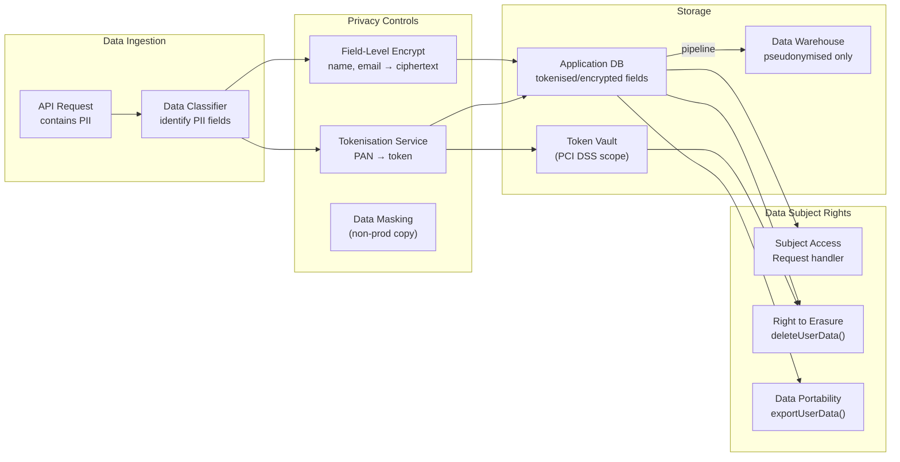

# Data Security & Privacy Engineering

## Category

DevSecOps, Data Protection, Privacy, GDPR, Compliance Engineering

## Context

**Data Security & Privacy Engineering** embeds data protection directly into application code, pipelines, and infrastructure — rather than treating it as an afterthought or purely a legal/compliance concern. The core principle is **Privacy by Design** (GDPR Article 25): data protection built into the architecture from the start.

This is distinct from compliance-as-code (auditing frameworks) and secret management (protecting credentials). It focuses on the *handling of personal and sensitive data* — how it is classified, tokenized, masked, encrypted at the field level, minimised, and ultimately erased.

### Data Classification Framework

| Class | Examples | Handling Requirements |
|-------|---------|----------------------|
| **Public** | Product names, public docs | No restriction |
| **Internal** | Employee directory, meeting notes | Access control; no public sharing |
| **Confidential** | Business strategy, financials, source code | Encryption at rest; need-to-know access |
| **Personal Data** (PII) | Name, email, phone, IP address, cookies | GDPR controls; retention limits; consent |
| **Sensitive Personal Data** | Health, biometric, political views, payment card | Explicit consent; heightened controls; DPA approval |
| **Restricted / Secret** | Private keys, auth tokens, encryption keys | Secrets Manager; HSM; zero standing access |

### GDPR Engineering Obligations (Developer Focus)

| GDPR Article | Engineering Requirement |
|-------------|------------------------|
| Art. 5 — Data minimisation | Collect only what you need; delete when no longer required |
| Art. 17 — Right to erasure | Implement `deleteUserData(userId)` that removes or anonymises all personal data |
| Art. 20 — Data portability | Export all user data in machine-readable format (JSON/CSV) on request |
| Art. 25 — Privacy by Design | Encryption, pseudonymisation, and access controls from day one |
| Art. 32 — Security of processing | Encryption at rest, in transit, access logging, integrity checks |
| Art. 33 — Breach notification | 72-hour notification capability (feeds into Incident Response) |

### Key Techniques

| Technique | Use Case | Reversible? |
|-----------|---------|------------|
| **Tokenisation** | Replace PAN / account number with opaque token in app DB | Yes (via token vault) |
| **Pseudonymisation** | Replace identifying fields with pseudonym (e.g. UUID) | Yes (mapping table) |
| **Anonymisation** | Remove/distort data so re-identification is not possible | No |
| **Data masking** | Scramble/replace data in non-prod environments | No (for non-prod) |
| **Field-level encryption (FLE)** | Encrypt specific columns in DB — app decrypts on read | Yes (with key) |
| **Format-preserving encryption (FPE)** | Encrypt without changing format (e.g. 16-digit number stays 16 digits) | Yes (with key) |
| **Data residency controls** | Store data only in permitted regions | N/A |

---

## Pros

- **Reduces breach impact**: Field-level encryption and tokenisation mean a DB dump yields ciphertext, not plaintext PII.
- **Enables safe test data**: Masked/anonymised copies of production data unblock QA without exposing real PII.
- **Right to erasure becomes tractable**: Pseudonymised data can be erased by deleting the mapping; anonymised data is already erased.
- **Builds customer trust**: GDPR compliance and privacy-first engineering are competitive differentiators.

## Cons

- **Performance overhead**: Field-level encryption adds CPU overhead on read/write; tokenisation adds a network call to the token vault.
- **Schema complexity**: Storing encrypted fields requires careful index design (encrypted fields are not searchable without deterministic encryption).
- **Key management burden**: Field-level encryption keys must be rotated, backed up, and access-controlled — multiplies key management complexity.
- **Erasure is hard with backups and data lakes**: Deleting from all downstream copies (data warehouse, audit logs, backups) is technically complex.

---

## Design Diagram



---

## Code Sample

### 1. PII Field-Level Encryption at the Application Layer

```typescript
// Encrypt specific fields before writing to DB; decrypt on read
// Uses AES-256-GCM — authenticated encryption (prevents tampering)
import { createCipheriv, createDecipheriv, randomBytes } from 'crypto';

const ALGORITHM = 'aes-256-gcm';
// Key loaded from AWS Secrets Manager / Azure Key Vault — NOT from environment variable
const ENCRYPTION_KEY = Buffer.from(process.env.PII_ENCRYPTION_KEY_HEX!, 'hex');  // 32 bytes

export function encryptField(plaintext: string): string {
  const iv  = randomBytes(12);   // 96-bit IV for GCM
  const cipher = createCipheriv(ALGORITHM, ENCRYPTION_KEY, iv);

  const encrypted = Buffer.concat([cipher.update(plaintext, 'utf8'), cipher.final()]);
  const authTag   = cipher.getAuthTag();

  // Store: iv + authTag + ciphertext — all needed for decryption
  return Buffer.concat([iv, authTag, encrypted]).toString('base64');
}

export function decryptField(encoded: string): string {
  const buf       = Buffer.from(encoded, 'base64');
  const iv        = buf.subarray(0, 12);
  const authTag   = buf.subarray(12, 28);
  const encrypted = buf.subarray(28);

  const decipher  = createDecipheriv(ALGORITHM, ENCRYPTION_KEY, iv);
  decipher.setAuthTag(authTag);

  return decipher.update(encrypted) + decipher.final('utf8');
}

// Usage in service layer
interface CustomerRecord {
  id: string;
  emailEncrypted: string;   // never store plaintext email in DB
  phoneEncrypted: string;
  accountNumber:  string;   // tokenised — see next section
}

async function createCustomer(input: { email: string; phone: string; }): Promise<string> {
  const record: CustomerRecord = {
    id:             crypto.randomUUID(),
    emailEncrypted: encryptField(input.email),
    phoneEncrypted: encryptField(input.phone),
    accountNumber:  await tokenizeAccountNumber(input.accountNumber),
  };
  await db.customers.insert(record);
  return record.id;
}

async function getCustomerEmail(customerId: string): Promise<string> {
  const record = await db.customers.findById(customerId);
  return decryptField(record.emailEncrypted);   // decrypt only when needed
}
```

### 2. Tokenisation — Replace Payment Card / Account Numbers

```typescript
// PCI-DSS compliant tokenisation: store token in app DB, real PAN in isolated vault
// The app DB is OUT of PCI scope; only the token vault is in scope

interface TokenVaultEntry {
  token:     string;    // UUID v4 — opaque, no PAN derived from it
  pan:       string;    // encrypted PAN stored only in vault
  last4:     string;    // stored in plaintext for display (not sensitive per PCI)
  expiresAt: Date;
}

class TokenVaultService {
  // Returns an opaque token — the PAN is never stored in the main application DB
  async tokenize(pan: string): Promise<string> {
    const last4  = pan.slice(-4);
    const token  = crypto.randomUUID();

    await this.vaultDb.tokens.insert({
      token,
      pan:       await this.vaultEncrypt(pan),  // encrypted inside the vault DB
      last4,
      expiresAt: new Date(Date.now() + 365 * 24 * 3600 * 1000),
    });

    return token;   // caller stores this; PAN never leaves the vault
  }

  async detokenize(token: string): Promise<string> {
    // Only allowed from specific authorised services (charge, refund) — not the web API
    this.assertCallerIsAuthorised();

    const entry = await this.vaultDb.tokens.findOne({ token });
    if (!entry || entry.expiresAt < new Date()) throw new Error('Invalid or expired token');

    return this.vaultDecrypt(entry.pan);
  }

  async getLast4(token: string): Promise<string> {
    // Safe to call from web API — no PAN returned
    const entry = await this.vaultDb.tokens.findOne({ token });
    return entry?.last4 ?? '????';
  }
}
```

### 3. Data Masking — Non-Production Safe Copy

```typescript
// Mask PII fields when creating test/staging database copies
// Run as part of a pre-seeding pipeline — never copy production data directly to non-prod

import { faker } from '@faker-js/faker';
import crypto from 'crypto';

interface MaskRule {
  table:  string;
  column: string;
  mask:   (original: string) => string;
}

// Define masking rules per column
const MASKING_RULES: MaskRule[] = [
  // Replace email with deterministic fake — same input → same fake (for join consistency)
  {
    table: 'customers', column: 'email',
    mask: (original) => {
      const hash = crypto.createHash('sha256').update(original).digest('hex').slice(0, 8);
      return `test-${hash}@example-masked.com`;
    },
  },
  // Replace name with random fake
  {
    table: 'customers', column: 'full_name',
    mask: (_) => faker.person.fullName(),
  },
  // Mask phone — preserve format (e.g. +44 XXXX XXXXXX)
  {
    table: 'customers', column: 'phone',
    mask: (original) => original.replace(/\d(?=\d{4})/g, 'X'),   // +44 XXXX X29837
  },
  // Nullify sensitive fields not needed in non-prod
  {
    table: 'customers', column: 'national_id',
    mask: (_) => '',
  },
  // Tokenise IP address (keep subnet for analytics)
  {
    table: 'audit_log', column: 'ip_address',
    mask: (ip) => {
      const parts = ip.split('.');
      return `${parts[0]}.${parts[1]}.0.0`;   // zero last 2 octets
    },
  },
];

async function maskDatabase(sourceConn: DbConn, destConn: DbConn) {
  for (const rule of MASKING_RULES) {
    const rows = await sourceConn.query(`SELECT id, "${rule.column}" FROM "${rule.table}"`);
    for (const row of rows) {
      const masked = rule.mask(row[rule.column] ?? '');
      await destConn.query(
        `UPDATE "${rule.table}" SET "${rule.column}" = $1 WHERE id = $2`,
        [masked, row.id]
      );
    }
    console.log(`Masked ${rows.length} rows in ${rule.table}.${rule.column}`);
  }
}
```

### 4. Right to Erasure — deleteUserData()

```typescript
// GDPR Article 17 — Right to Erasure
// Must remove or anonymise all personal data across all systems

interface ErasureResult {
  userId:   string;
  tables:   Record<string, number>;   // rows erased per table
  systems:  string[];                  // external systems notified
  errors:   string[];
}

async function deleteUserData(userId: string): Promise<ErasureResult> {
  const result: ErasureResult = { userId, tables: {}, systems: [], errors: [] };

  // 1. Anonymise in main DB (preserve referential integrity — don't hard delete)
  await db.transaction(async (tx) => {
    // Anonymise customer record — keep row for FK integrity but wipe PII
    const [updated] = await tx.query(`
      UPDATE customers SET
        email_encrypted  = NULL,
        phone_encrypted  = NULL,
        full_name        = 'ERASED',
        date_of_birth    = NULL,
        national_id      = NULL,
        erased_at        = NOW(),
        erased_by_request = true
      WHERE id = $1
    `, [userId]);
    result.tables['customers'] = updated.rowCount;

    // Remove PII from audit logs (replace with pseudonym)
    const [auditUpdated] = await tx.query(`
      UPDATE audit_log SET
        ip_address = '0.0.0.0',
        user_agent = 'ERASED'
      WHERE user_id = $1
    `, [userId]);
    result.tables['audit_log'] = auditUpdated.rowCount;

    // Hard delete non-essential PII tables
    const [deleted] = await tx.query(
      `DELETE FROM customer_addresses WHERE customer_id = $1`, [userId]
    );
    result.tables['customer_addresses'] = deleted.rowCount;
  });

  // 2. Delete tokens from vault (so card numbers can no longer be detokenised)
  try {
    await tokenVaultService.deleteAllForUser(userId);
    result.systems.push('token-vault');
  } catch (err) {
    result.errors.push(`token-vault: ${err}`);
  }

  // 3. Remove from search index
  try {
    await searchIndex.deleteDocument(`customer-${userId}`);
    result.systems.push('search-index');
  } catch (err) {
    result.errors.push(`search-index: ${err}`);
  }

  // 4. Notify downstream systems via event
  await eventBus.publish('customer.erased', {
    userId,
    erasedAt: new Date().toISOString(),
    // Downstream: analytics, email marketing, ML feature store, etc. must also erase
  });
  result.systems.push('event-bus-notified');

  // 5. Create erasure audit record (the fact of erasure must be retained for compliance)
  await db.erasureLog.insert({
    userId,
    requestedAt: new Date(),
    completedAt: new Date(),
    result: JSON.stringify(result),
  });

  return result;
}
```

### 5. Data Portability Export — GDPR Article 20

```typescript
// Export all personal data for a user in machine-readable JSON format
// Must complete within 30 days of request (best practice: within 72 hours)

async function exportUserData(userId: string): Promise<object> {
  const [customer, payments, addresses, preferences, auditLog] = await Promise.all([
    db.customers.findById(userId),
    db.payments.findAll({ customerId: userId }),
    db.addresses.findAll({ customerId: userId }),
    db.preferences.findById(userId),
    db.auditLog.findAll({ userId, limit: 1000 }),
  ]);

  // Decrypt PII for the data export (the user is entitled to their own plaintext data)
  return {
    exportedAt: new Date().toISOString(),
    exportVersion: '1.0',
    subject: {
      id:    customer.id,
      email: decryptField(customer.emailEncrypted),
      name:  customer.fullName,
      phone: decryptField(customer.phoneEncrypted),
      createdAt: customer.createdAt,
    },
    paymentHistory: payments.map(p => ({
      id:        p.id,
      amount:    p.amount,
      currency:  p.currency,
      status:    p.status,
      reference: p.reference,
      createdAt: p.createdAt,
      cardLast4: p.cardToken
        ? await tokenVaultService.getLast4(p.cardToken)
        : undefined,
      // NOTE: Full card number (PAN) is NOT included — only last 4 per PCI-DSS
    })),
    addresses,
    preferences,
    activityLog: auditLog.map(e => ({
      action:    e.action,
      timestamp: e.createdAt,
      // ip_address omitted from portability export (not needed per Art. 20 scope)
    })),
  };
}
```

### 6. Data Residency — Enforce via Region Tagging

```typescript
// Middleware — reject requests to store data in non-allowed regions
// Useful when GDPR requires EU data to stay in EU

const DATA_RESIDENCY_POLICY: Record<string, string[]> = {
  'EU': ['eu-west-1', 'eu-west-2', 'eu-central-1', 'westeurope', 'northeurope'],
  'UK': ['eu-west-2', 'uksouth', 'ukwest'],
  'US': ['us-east-1', 'us-west-2', 'eastus', 'westus2'],
};

async function enforceDataResidency(
  customerId: string,
  targetRegion: string
): Promise<void> {
  const customer = await db.customers.findById(customerId);
  const allowedRegions = DATA_RESIDENCY_POLICY[customer.residencyZone] ?? [];

  if (!allowedRegions.includes(targetRegion)) {
    throw new DataResidencyViolationError(
      `Cannot process ${customer.residencyZone} customer data in region ${targetRegion}. ` +
      `Allowed: ${allowedRegions.join(', ')}`
    );
  }
}

class DataResidencyViolationError extends Error {
  constructor(message: string) {
    super(message);
    this.name = 'DataResidencyViolationError';
  }
}
```

### 7. Privacy Tests — Automated PII Leak Detection

```typescript
// Test that API responses never leak fields that should be masked or excluded
import { describe, it, expect } from 'vitest';

describe('Privacy — PII not leaked in API responses', () => {
  it('GET /payments/:id does not return card PAN', async () => {
    const res = await api.get(`/payments/${testPaymentId}`, { as: 'customer' });
    expect(res.status).toBe(200);

    const body = JSON.stringify(res.data);

    // PAN must never appear — only last 4
    expect(body).not.toMatch(/\b4[0-9]{15}\b/);            // 16-digit Visa-pattern number
    expect(body).not.toMatch(/\b5[1-5][0-9]{14}\b/);       // Mastercard
    expect(body).not.toContain('cardNumber');
    expect(body).not.toContain('pan');
  });

  it('GET /customers/:id does not return email to a different user', async () => {
    const res = await api.get(`/customers/${otherCustomerId}`, { as: 'customer' });
    // Should be 404 or 403 — not the other user's data
    expect([403, 404]).toContain(res.status);
  });

  it('Error responses do not contain stack traces or internal paths', async () => {
    const res = await api.get('/payments/invalid-id', { as: 'customer' });
    const body = JSON.stringify(res.data);

    expect(body).not.toContain('/usr/src/app');
    expect(body).not.toContain('node_modules');
    expect(body).not.toContain('at Object.');    // stack trace pattern
    expect(body).not.toMatch(/sql|postgres|mysql/i);   // DB internals
  });

  it('Logs do not contain PII', async () => {
    // Capture log output during request
    const logs = await captureLogsFor(async () => {
      await api.post('/customers', {
        email: 'test.user+pii@example.com',
        name: 'Test User',
      });
    });

    // Email and name must not appear in logs
    expect(logs).not.toContain('test.user+pii@example.com');
    expect(logs).not.toContain('Test User');
  });
});
```

---

## References

- [GDPR Full Text — EUR-Lex](https://eur-lex.europa.eu/legal-content/EN/TXT/?uri=CELEX:32016R0679)
- [GDPR Art. 25 — Privacy by Design](https://gdpr-info.eu/art-25-gdpr/)
- [PCI-DSS v4.0 — Tokenisation guidance](https://www.pcisecuritystandards.org/)
- [NIST SP 800-188 — De-Identification of Government Datasets](https://nvlpubs.nist.gov/nistpubs/SpecialPublications/NIST.SP.800-188.pdf)
- [OWASP Top 10 Privacy Risks](https://owasp.org/www-project-top-10-privacy-risks/)
- [ICO Guidance — Data minimisation](https://ico.org.uk/for-organisations/uk-gdpr-guidance-and-resources/data-protection-principles/a-guide-to-the-data-protection-principles/the-principles/data-minimisation/)
- [Faker.js — Test data generation](https://fakerjs.dev/)
- [TypeScript zod — schema validation for input minimisation](https://zod.dev/)
