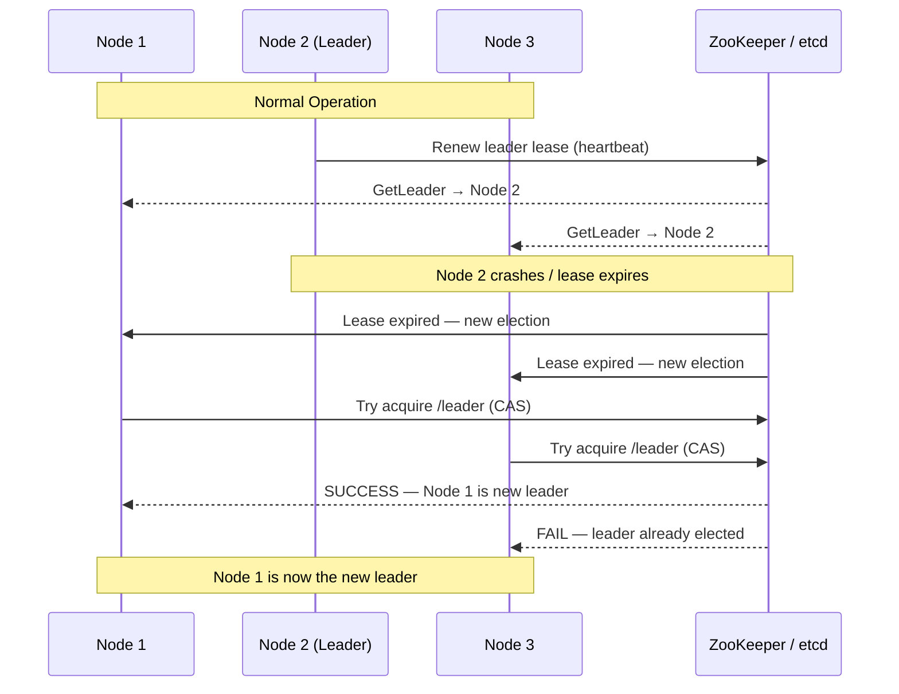

# Leader Election

## Category
Distributed Systems, Coordination, Consensus

## Context

Leader Election is the process by which distributed nodes agree on a single **leader** node to coordinate an activity. A leader simplifies coordination by having one authoritative node make decisions (e.g., write operations in a Primary-Replica database, job scheduling in Kubernetes master, partition leadership in Kafka). When the leader fails, a new election is triggered.

Common algorithms: **Bully Algorithm**, **Raft** (used internally), **ZooKeeper ephemeral nodes**, **etcd distributed lock**, **Redis SETNX**.

---

## Pros

- **Simplified coordination**: One node makes decisions; others follow, avoiding split-brain races.
- **Strong consistency**: All nodes agree on who the leader is at any point.
- **Clear responsibility**: The leader owns critical resources (locks, write access, scheduling).
- **Failure handling**: Automatic re-election ensures the system continues after leader failure.
- **Foundation for other patterns**: Many distributed systems are built on top of leader election.

---

## Cons

- **Leader is a bottleneck**: All coordinating requests route through one node.
- **Single point of failure**: If leader failure detection is slow, a window of unavailability exists.
- **Split-brain risk**: Network partitions may cause multiple nodes to believe they are leader (mitigated by quorum).
- **Overhead of re-election**: Leader failure triggers election protocol, causing brief service interruption.
- **Fencing tokens required**: Stale leaders must be prevented from taking actions after losing leadership.

---

## Design Diagram



---

## Code Sample

### Leader Election with etcd (Node.js)

```javascript
// election/etcd-leader-election.js
const { Etcd3 } = require('etcd3');

const client = new Etcd3({ hosts: ['etcd:2379'] });

const NODE_ID = process.env.NODE_ID ?? `node-${Math.random().toString(36).slice(2)}`;
const ELECTION_KEY = '/services/my-service/leader';
const LEASE_TTL = 10; // seconds

let isLeader = false;
let leaderLease = null;

async function startElection() {
  console.log(`[${NODE_ID}] Starting leader election...`);

  while (true) {
    try {
      // Create a lease — auto-expires if process crashes
      leaderLease = client.lease(LEASE_TTL);
      leaderLease.on('lost', onLeaseLost);

      const leaseId = await leaderLease.grant();

      // Atomically set key only if it doesn't exist (CAS)
      const result = await client
        .if(ELECTION_KEY, 'Create', '==', 0) // Key does not exist
        .then(client.put(ELECTION_KEY).value(NODE_ID).lease(leaseId))
        .else(client.get(ELECTION_KEY))
        .commit();

      if (result.succeeded) {
        onBecomeLeader();
        await keepAliveLoop();
      } else {
        const currentLeader = result.responses[0].kvs[0]?.value.toString();
        console.log(`[${NODE_ID}] Leader is: ${currentLeader}. Watching for changes...`);
        await leaderLease.revoke();
        await watchForLeaderChange();
      }
    } catch (err) {
      console.error(`[${NODE_ID}] Election error:`, err.message);
      await sleep(2000);
    }
  }
}

function onBecomeLeader() {
  isLeader = true;
  console.log(`[${NODE_ID}] *** BECAME LEADER ***`);
  // Start leader-specific work: job scheduling, write coordination, etc.
}

function onLeaseLost() {
  if (isLeader) {
    isLeader = false;
    console.warn(`[${NODE_ID}] Lost leadership! Stopping leader activities.`);
  }
}

async function keepAliveLoop() {
  // Lease keepalive is automatic; just keep the process running
  while (isLeader) {
    await sleep(1000);
    console.log(`[${NODE_ID}] Leading... (isLeader=${isLeader})`);
  }
}

async function watchForLeaderChange() {
  return new Promise<void>((resolve) => {
    const watcher = client.watch().key(ELECTION_KEY).create();
    watcher.then(w => {
      w.on('delete', () => {
        console.log(`[${NODE_ID}] Leader key deleted — re-running election`);
        w.cancel();
        resolve();
      });
    });
  });
}

function sleep(ms: number) { return new Promise(r => setTimeout(r, ms)); }

startElection().catch(console.error);
```

### Leader Election with Redis (SETNX + Lua atomic renewal)

```javascript
// election/redis-leader-election.js
const { createClient } = require('redis');

const redis = createClient({ url: process.env.REDIS_URL });
await redis.connect();

const NODE_ID = process.env.NODE_ID ?? `node-${process.pid}`;
const LEADER_KEY = 'leader:my-service';
const TTL_SECONDS = 10;
const RENEW_INTERVAL = 3000; // Renew every 3s (before TTL expires)

let isLeader = false;

async function tryBecomeLeader() {
  // SET key value NX EX ttl — atomic: set only if not exists
  const result = await redis.set(LEADER_KEY, NODE_ID, { NX: true, EX: TTL_SECONDS });

  if (result === 'OK') {
    isLeader = true;
    console.log(`[${NODE_ID}] Became leader`);
    startRenewal();
    return true;
  }

  const currentLeader = await redis.get(LEADER_KEY);
  console.log(`[${NODE_ID}] Current leader: ${currentLeader}`);
  return false;
}

function startRenewal() {
  const interval = setInterval(async () => {
    // Renew only if we are still the leader (Lua atomic check-and-extend)
    const lua = `
      if redis.call("get", KEYS[1]) == ARGV[1] then
        return redis.call("expire", KEYS[1], ARGV[2])
      else
        return 0
      end
    `;
    const renewed = await redis.eval(lua, { keys: [LEADER_KEY], arguments: [NODE_ID, String(TTL_SECONDS)] });

    if (!renewed) {
      isLeader = false;
      console.warn(`[${NODE_ID}] Lost leadership!`);
      clearInterval(interval);
    } else {
      console.log(`[${NODE_ID}] Renewed leadership`);
    }
  }, RENEW_INTERVAL);
}

// Election loop: retry if not leader
async function electionLoop() {
  while (true) {
    if (!isLeader) await tryBecomeLeader();
    await new Promise(r => setTimeout(r, 5000));
  }
}

electionLoop();
```

### Fencing Token (prevent stale leader actions)

```javascript
// When acquiring leadership, get a monotonically increasing fencing token
// All operations must include the token; storage layer rejects lower tokens

async function acquireLeadershipWithToken() {
  const token = await redis.incr('leader:fencing-token');
  const result = await redis.set(LEADER_KEY, JSON.stringify({ nodeId: NODE_ID, token }), { NX: true, EX: TTL_SECONDS });
  return result === 'OK' ? token : null;
}

// Storage operation MUST include the fence token
async function writeData(token, data) {
  const lua = `
    local currentToken = tonumber(redis.call("get", "current-fence-token") or "0")
    if ARGV[1] + 0 >= currentToken then
      redis.call("set", "current-fence-token", ARGV[1])
      redis.call("set", KEYS[1], ARGV[2])
      return 1
    end
    return 0  -- Reject stale leader
  `;
  return redis.eval(lua, { keys: ['data-key'], arguments: [String(token), JSON.stringify(data)] });
}
```
