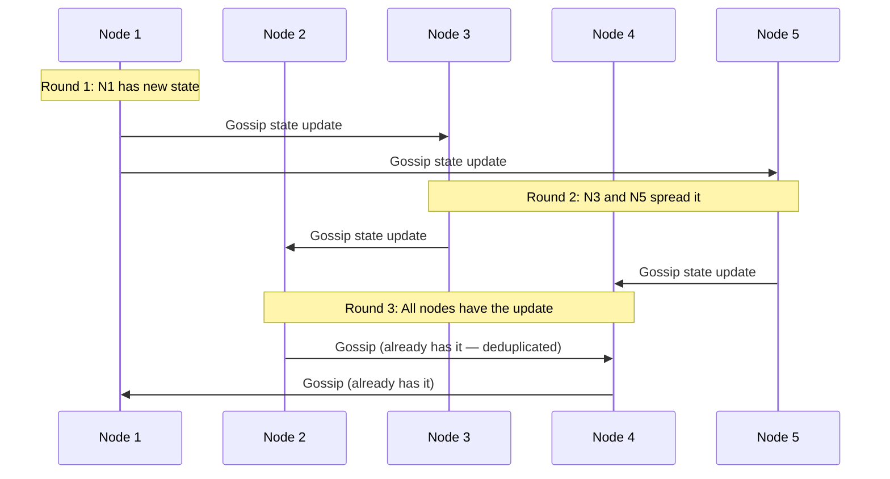

# Gossip Protocol (Epidemic Protocol)

## Category
Distributed Systems, Peer-to-Peer, Fault Detection, Information Dissemination

## Context

The Gossip Protocol is a communication paradigm inspired by how rumors spread in a population. Each node periodically selects a random peer and exchanges state information (such as cluster membership, node health, or data). Over multiple rounds, information propagates exponentially through the cluster.

Used in: Apache Cassandra (membership & failure detection), Amazon DynamoDB, Redis Cluster, Consul, BitTorrent, Blockchain networks.

---

## Pros

- **Resilience**: No single point of failure — information propagates even if many nodes fail.
- **Scalability**: Message complexity is O(log N) rounds to reach all N nodes.
- **Decentralized**: No central coordinator — nodes self-organize.
- **Fault tolerant**: Tolerates arbitrary node failures and network partitions.
- **Self-healing**: Nodes that were down re-sync when they rejoin.
- **Low overhead**: Each node sends/receives from only a few peers per round.

---

## Cons

- **Eventual consistency**: Information takes `O(log N)` rounds to reach all nodes — not instant.
- **Redundant messages**: The same update may be received multiple times.
- **Non-deterministic propagation**: There is no guarantee of when exactly a node will receive an update.
- **State size**: If each node carries a full cluster state table, memory grows with cluster size.
- **Difficult to debug**: Non-deterministic propagation patterns are hard to trace.

---

## Design Diagram



---

## Code Sample

### Gossip Node Implementation (TypeScript)

```typescript
// gossip/gossip-node.ts
import axios from 'axios';

interface NodeState {
  nodeId: string;
  address: string;
  version: number;          // Monotonically increasing — higher version wins
  status: 'alive' | 'suspected' | 'dead';
  lastUpdatedAt: number;    // Unix timestamp ms
  metadata?: Record<string, unknown>;
}

export class GossipNode {
  private readonly state: Map<string, NodeState> = new Map();
  private readonly GOSSIP_INTERVAL_MS = 1000;
  private readonly FANOUT = 3;           // Peers to gossip with per round
  private readonly SUSPECT_THRESHOLD = 5000;  // ms without heartbeat → suspected

  constructor(
    private readonly nodeId: string,
    private readonly address: string,
    private readonly peers: string[]   // Known initial peers (seed nodes)
  ) {
    // Initialize own state
    this.state.set(nodeId, {
      nodeId,
      address,
      version: 0,
      status: 'alive',
      lastUpdatedAt: Date.now(),
    });
  }

  start(): void {
    console.log(`[${this.nodeId}] Starting gossip...`);
    setInterval(() => this.gossipRound(), this.GOSSIP_INTERVAL_MS);
    setInterval(() => this.detectFailures(), this.GOSSIP_INTERVAL_MS * 2);
    setInterval(() => this.incrementHeartbeat(), this.GOSSIP_INTERVAL_MS / 2);
  }

  private incrementHeartbeat(): void {
    const own = this.state.get(this.nodeId)!;
    this.state.set(this.nodeId, {
      ...own,
      version: own.version + 1,
      lastUpdatedAt: Date.now(),
    });
  }

  private async gossipRound(): Promise<void> {
    const allNodes = [...this.state.values()].filter(n => n.nodeId !== this.nodeId && n.status !== 'dead');
    if (allNodes.length === 0) return;

    // Select FANOUT random peers
    const targets = shuffled(allNodes).slice(0, this.FANOUT);
    const stateSnapshot = [...this.state.values()];

    for (const target of targets) {
      try {
        await axios.post(`${target.address}/gossip`, { from: this.nodeId, state: stateSnapshot }, { timeout: 500 });
      } catch {
        // Peer unreachable — failure detector will handle it
      }
    }
  }

  receiveGossip(incomingState: NodeState[]): void {
    for (const remoteEntry of incomingState) {
      const local = this.state.get(remoteEntry.nodeId);
      // Accept if remote has a higher version (newest state wins)
      if (!local || remoteEntry.version > local.version) {
        this.state.set(remoteEntry.nodeId, remoteEntry);
        if (!local) {
          console.log(`[${this.nodeId}] Discovered new node: ${remoteEntry.nodeId}`);
        }
      }
    }
  }

  private detectFailures(): void {
    const now = Date.now();
    for (const [id, entry] of this.state.entries()) {
      if (id === this.nodeId) continue;
      const age = now - entry.lastUpdatedAt;
      if (age > this.SUSPECT_THRESHOLD && entry.status === 'alive') {
        this.state.set(id, { ...entry, status: 'suspected' });
        console.warn(`[${this.nodeId}] Node ${id} suspected (no heartbeat for ${age}ms)`);
      }
    }
  }

  getClusterView(): NodeState[] {
    return [...this.state.values()];
  }
}

function shuffled<T>(array: T[]): T[] {
  return [...array].sort(() => Math.random() - 0.5);
}
```

### HTTP Server exposing Gossip endpoint (Express)

```typescript
// gossip/gossip-server.ts
import express from 'express';
import { GossipNode } from './gossip-node';

const NODE_ID = process.env.NODE_ID!;
const ADDRESS  = process.env.ADDRESS!;   // e.g. http://node1:4000
const SEEDS    = (process.env.SEEDS ?? '').split(',').filter(Boolean);

const node = new GossipNode(NODE_ID, ADDRESS, SEEDS);
const app  = express();
app.use(express.json());

// Gossip exchange endpoint
app.post('/gossip', (req, res) => {
  const { state } = req.body;
  node.receiveGossip(state);
  res.json({ state: node.getClusterView() });
});

// Inspect cluster view
app.get('/cluster', (req, res) => {
  res.json(node.getClusterView());
});

app.listen(4000, () => {
  console.log(`[${NODE_ID}] Gossip server on :4000`);
  node.start();
});
```

### Docker Compose — 3-node Gossip Cluster

```yaml
version: '3.8'
services:
  node1:
    build: .
    environment:
      NODE_ID: node1
      ADDRESS: http://node1:4000
      SEEDS: http://node2:4000,http://node3:4000
    ports: ['4001:4000']

  node2:
    build: .
    environment:
      NODE_ID: node2
      ADDRESS: http://node2:4000
      SEEDS: http://node1:4000,http://node3:4000
    ports: ['4002:4000']

  node3:
    build: .
    environment:
      NODE_ID: node3
      ADDRESS: http://node3:4000
      SEEDS: http://node1:4000,http://node2:4000
    ports: ['4003:4000']
```
