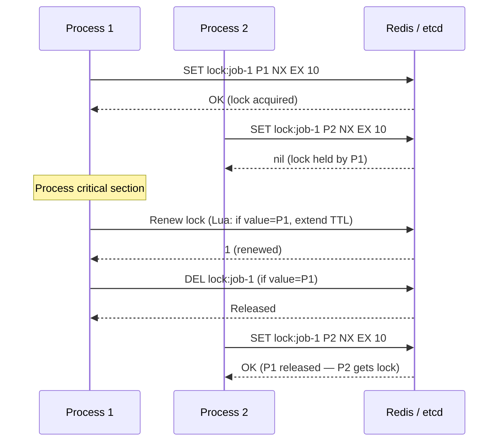

# Distributed Locking

## Category
Distributed Systems, Coordination, Concurrency Control

## Context

Distributed Locking provides **mutual exclusion** for a shared resource across multiple processes or services running on different machines. Unlike OS-level mutexes, distributed locks must account for network partitions, process crashes, and clock skew.

Common approaches: **Redis SETNX** (single node), **Redlock** (multi-node Redis), **etcd CAS leases**, **ZooKeeper ephemeral sequential nodes**, **PostgreSQL advisory locks**.

**Critical properties** of a correct distributed lock:
1. **Safety**: Only one client holds the lock at a time.
2. **Liveness**: The lock is eventually released (even if the holder crashes — via TTL).
3. **Fault tolerance**: The locking service itself must be highly available.

---

## Pros

- **Mutual exclusion**: Only one process executes a critical section at a time.
- **Prevents double processing**: Ensures only one worker picks up a job.
- **TTL-based auto-release**: Locks expire automatically — crash-safe.
- **Leader coordination**: Used to implement leader election and job scheduling.

---

## Cons

- **No perfect solution**: CAP theorem applies — you cannot have perfect safety + liveness + fault tolerance simultaneously.
- **Clock drift risk**: Expiry times based on wall clocks are unreliable across hosts.
- **Network partition risk**: GC pauses or partitions may cause the lock holder to lose the lock while believing it still holds.
- **Deadlocks**: If lock renewal fails silently, the process may continue acting while the lock has expired.
- **Fencing tokens required**: Even with distributed locks, storage systems need fencing to reject stale lock holders.

---

## Design Diagram



---

## Code Sample

### Distributed Lock with Redis (TypeScript)

```typescript
// locking/distributed-lock.ts
import { createClient } from 'redis';
import * as crypto from 'crypto';

const redis = createClient({ url: process.env.REDIS_URL });

// Lua script: delete key only if value matches (atomically)
const RELEASE_SCRIPT = `
  if redis.call("get", KEYS[1]) == ARGV[1] then
    return redis.call("del", KEYS[1])
  else
    return 0
  end
`;

// Lua script: extend TTL only if value matches (atomically)
const RENEW_SCRIPT = `
  if redis.call("get", KEYS[1]) == ARGV[1] then
    return redis.call("pexpire", KEYS[1], ARGV[2])
  else
    return 0
  end
`;

export class DistributedLock {
  private readonly lockId: string;
  private renewalTimer: ReturnType<typeof setInterval> | null = null;

  constructor(
    private readonly resource: string,
    private readonly ttlMs = 10_000,
    private readonly retryDelayMs = 200,
    private readonly maxRetries = 20
  ) {
    this.lockId = crypto.randomUUID(); // Unique owner identifier
  }

  async acquire(): Promise<boolean> {
    for (let attempt = 0; attempt <= this.maxRetries; attempt++) {
      const result = await redis.set(
        `lock:${this.resource}`,
        this.lockId,
        { NX: true, PX: this.ttlMs }
      );

      if (result === 'OK') {
        this.startRenewal();
        return true;
      }

      if (attempt < this.maxRetries) {
        const jitter = Math.floor(Math.random() * this.retryDelayMs);
        await sleep(this.retryDelayMs + jitter);
      }
    }
    return false;
  }

  async release(): Promise<void> {
    this.stopRenewal();
    await redis.eval(RELEASE_SCRIPT, {
      keys: [`lock:${this.resource}`],
      arguments: [this.lockId],
    });
  }

  private startRenewal(): void {
    const renewInterval = Math.floor(this.ttlMs * 0.33); // Renew at 1/3 of TTL
    this.renewalTimer = setInterval(async () => {
      const renewed = await redis.eval(RENEW_SCRIPT, {
        keys: [`lock:${this.resource}`],
        arguments: [this.lockId, String(this.ttlMs)],
      });
      if (!renewed) {
        console.error(`[Lock] Lost lock on ${this.resource}!`);
        this.stopRenewal();
      }
    }, renewInterval);
  }

  private stopRenewal(): void {
    if (this.renewalTimer) {
      clearInterval(this.renewalTimer);
      this.renewalTimer = null;
    }
  }
}

function sleep(ms: number): Promise<void> {
  return new Promise(r => setTimeout(r, ms));
}
```

### Usage — Locking a Critical Section

```typescript
// services/job.service.ts
import { DistributedLock } from '../locking/distributed-lock';

export async function processJobOnce(jobId: string): Promise<void> {
  const lock = new DistributedLock(`job:${jobId}`, 15_000);

  const acquired = await lock.acquire();
  if (!acquired) {
    console.log(`Job ${jobId} is already being processed by another worker`);
    return;
  }

  try {
    console.log(`Processing job ${jobId}...`);
    await doWork(jobId);
    console.log(`Job ${jobId} complete`);
  } finally {
    await lock.release(); // Always release, even on error
  }
}

async function doWork(jobId: string): Promise<void> {
  await new Promise(r => setTimeout(r, 3000)); // Simulate work
}
```

### Wrapper Helper — executeWithLock

```typescript
// locking/with-lock.ts
export async function withLock<T>(
  resource: string,
  fn: () => Promise<T>,
  options = { ttlMs: 10_000, maxRetries: 20 }
): Promise<T> {
  const lock = new DistributedLock(resource, options.ttlMs, 200, options.maxRetries);

  const acquired = await lock.acquire();
  if (!acquired) throw new Error(`Could not acquire lock for: ${resource}`);

  try {
    return await fn();
  } finally {
    await lock.release();
  }
}

// One-liner usage:
const result = await withLock(`order:${orderId}:payment`, async () => {
  return processPayment(orderId, amount);
});
```

### Redlock — Multi-node Redis for High Availability

```javascript
// locking/redlock-example.js
const Redlock = require('redlock');
const { createClient } = require('redis');

// Acquire lock on 3 independent Redis nodes — majority quorum needed
const redisNodes = [
  createClient({ url: 'redis://redis-1:6379' }),
  createClient({ url: 'redis://redis-2:6379' }),
  createClient({ url: 'redis://redis-3:6379' }),
];

for (const node of redisNodes) await node.connect();

const redlock = new Redlock(redisNodes, {
  driftFactor: 0.01,
  retryCount: 10,
  retryDelay: 200,
  retryJitter: 100,
});

async function processWithRedlock(resourceId) {
  const lock = await redlock.acquire([`locks:${resourceId}`], 10_000);
  try {
    await doWork(resourceId);
  } finally {
    await lock.release();
  }
}
```
