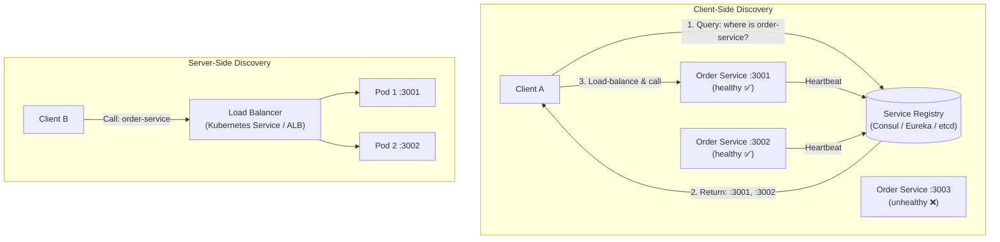

# Service Discovery

## Category
Distributed Systems, Networking, Scalability

## Context

Service Discovery is the mechanism by which services in a distributed system automatically find each other's network locations (host + port). In dynamic environments (Kubernetes, cloud auto-scaling), service instances start and stop frequently with ephemeral IP addresses. Hard-coded configuration is impossible. A Service Registry stores and updates every service's location, and clients query it to route requests.

Two patterns:
- **Client-side discovery**: Client queries the registry and load-balances itself (Netflix Eureka, Consul).
- **Server-side discovery**: Client sends requests to a load balancer / gateway that queries the registry internally (Kubernetes Service, AWS ALB).

---

## Pros

- **Dynamic registration**: Services register themselves on startup and deregister on shutdown.
- **Health-integrated routing**: Only healthy instances appear in the registry.
- **Auto-scaling friendly**: New instances are discovered automatically without config changes.
- **Decouples service locations**: Clients don't need to know IPs; only service names.
- **Multi-environment support**: Same service names work across dev, staging, and production.

---

## Cons

- **Registry is a critical dependency**: If the registry fails, service discovery breaks (must be HA).
- **Registration lag**: New or removed instances may have a brief propagation delay.
- **Stale entries**: Crashed services may remain registered until TTL expires.
- **Client-side discovery complexity**: Clients must implement load balancing and filtering logic.
- **Network overhead**: Health checks from registry to all instances generate traffic.

---

## Design Diagram



---

## Code Sample

### Service Self-Registration (Node.js / Consul)

```javascript
// discovery/registration.js
const Consul = require('consul');

const consul = new Consul({ host: process.env.CONSUL_HOST, port: 8500 });

const SERVICE_NAME = process.env.SERVICE_NAME ?? 'order-service';
const SERVICE_PORT = parseInt(process.env.PORT ?? '3000', 10);
const SERVICE_ID   = `${SERVICE_NAME}-${process.pid}`;
const HOST_ADDRESS = process.env.HOST_ADDRESS ?? 'localhost';

async function registerService() {
  await consul.agent.service.register({
    id: SERVICE_ID,
    name: SERVICE_NAME,
    address: HOST_ADDRESS,
    port: SERVICE_PORT,
    tags: ['v1', 'api'],
    check: {
      http: `http://${HOST_ADDRESS}:${SERVICE_PORT}/health`,
      interval: '10s',
      deregistercriticalserviceafter: '30s',
    },
  });
  console.log(`[${SERVICE_ID}] Registered with Consul`);
}

async function deregisterService() {
  await consul.agent.service.deregister(SERVICE_ID);
  console.log(`[${SERVICE_ID}] Deregistered from Consul`);
}

// Deregister gracefully on shutdown
process.on('SIGTERM', async () => {
  await deregisterService();
  process.exit(0);
});

registerService().catch(console.error);
```

### Client-Side Discovery with Load Balancing (TypeScript)

```typescript
// discovery/service-client.ts
import Consul from 'consul';
import axios from 'axios';

const consul = new Consul({ host: process.env.CONSUL_HOST });

interface ServiceInstance {
  address: string;
  port: number;
}

// Cache of discovered instances — refresh periodically
const instanceCache = new Map<string, { instances: ServiceInstance[]; lastFetched: number }>();
const CACHE_TTL_MS = 5000;

async function discoverInstances(serviceName: string): Promise<ServiceInstance[]> {
  const cached = instanceCache.get(serviceName);
  if (cached && Date.now() - cached.lastFetched < CACHE_TTL_MS) {
    return cached.instances;
  }

  const services = await consul.health.service({ service: serviceName, passing: true });
  const instances: ServiceInstance[] = services.map((s: any) => ({
    address: s.Service.Address || s.Node.Address,
    port: s.Service.Port,
  }));

  instanceCache.set(serviceName, { instances, lastFetched: Date.now() });
  return instances;
}

// Round-robin counter per service
const roundRobinCounters = new Map<string, number>();

function pickInstance(serviceName: string, instances: ServiceInstance[]): ServiceInstance {
  const idx = (roundRobinCounters.get(serviceName) ?? 0) % instances.length;
  roundRobinCounters.set(serviceName, idx + 1);
  return instances[idx];
}

export async function callService(serviceName: string, path: string, options?: object): Promise<unknown> {
  const instances = await discoverInstances(serviceName);
  if (instances.length === 0) throw new Error(`No healthy instances for: ${serviceName}`);

  const instance = pickInstance(serviceName, instances);
  const url = `http://${instance.address}:${instance.port}${path}`;
  const { data } = await axios.get(url, options);
  return data;
}

// Usage
const order = await callService('order-service', `/orders/${orderId}`);
```

### Kubernetes Service Discovery (built-in DNS)

```yaml
# Kubernetes handles service discovery via DNS — no external registry needed
# k8s/order-service.yaml
apiVersion: v1
kind: Service
metadata:
  name: order-service    # DNS name: order-service.default.svc.cluster.local
  namespace: default
spec:
  selector:
    app: order-service
  ports:
    - port: 80
      targetPort: 3000
  type: ClusterIP        # Internal discovery only
```

```javascript
// In Kubernetes, just use the service DNS name directly
const ORDER_SERVICE_URL = 'http://order-service'; // Kubernetes resolves this
const order = await axios.get(`${ORDER_SERVICE_URL}/orders/${orderId}`);
```

### Watch for Real-time Updates (Consul Watch)

```javascript
// discovery/consul-watch.js
const watch = consul.watch({
  method: consul.health.service,
  options: { service: 'order-service', passing: true },
  backoffFactor: 1000,
});

watch.on('change', (data) => {
  const instances = data.map(s => ({ address: s.Service.Address, port: s.Service.Port }));
  console.log(`order-service instances updated:`, instances);
  updateServicePool('order-service', instances);
});

watch.on('error', err => console.error('Consul watch error:', err));
```
