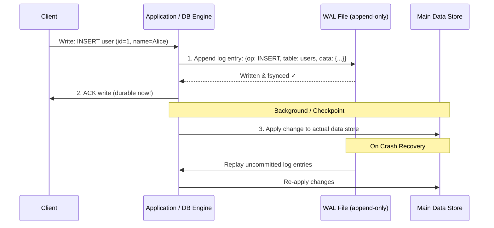

# Write-Ahead Log (WAL)

## Category
Distributed Systems, Durability, Data Integrity, Storage

## Context

A Write-Ahead Log (WAL) is a durability and crash-recovery mechanism used in databases and distributed systems. Before any data modification is applied to the actual data structures (tables, indexes, in-memory state), a record of the **intended change is first written to an append-only log on durable storage**. On crash recovery, the WAL is replayed to restore any changes that were not yet flushed.

WAL is used in: PostgreSQL, MySQL (InnoDB redo log), SQLite, Apache Kafka (its core is a WAL), etcd, RocksDB, CockroachDB.

---

## Pros

- **Crash recovery**: Replaying the WAL restores the database to a consistent state after a crash.
- **Durability (D in ACID)**: A write is durable once it hits the WAL on disk, even if the in-memory write hasn't happened yet.
- **Sequential writes are fast**: Appending to the WAL is faster than random disk writes.
- **Enables replication**: WAL can be streamed to replicas (PostgreSQL streaming replication).
- **Foundation for MVCC**: PostgreSQL uses WAL as the source of truth for multi-version concurrency control.
- **Change Data Capture**: WAL is tailed by CDC tools like Debezium.

---

## Cons

- **Disk I/O on every write**: Every write incurs at least two writes (WAL + actual data).
- **WAL growth**: The WAL can grow large during high write loads; checkpointing is required.
- **Checkpoint cost**: Checkpointing (flushing WAL changes to main storage) causes I/O spikes.
- **Storage overhead**: WAL takes additional disk space.
- **Complexity**: Implementing a correct WAL with proper recovery semantics is non-trivial.

---

## Design Diagram



---

## Code Sample

### Simple WAL Implementation (TypeScript)

```typescript
// wal/write-ahead-log.ts
import * as fs from 'fs';
import * as path from 'path';
import * as readline from 'readline';

export type Operation = 'INSERT' | 'UPDATE' | 'DELETE';

export interface WALEntry {
  lsn: number;           // Log Sequence Number — monotonically increasing
  timestamp: string;
  operation: Operation;
  table: string;
  key: string;
  data?: Record<string, unknown>;
  checksum: string;
}

export class WriteAheadLog {
  private lsn = 0;
  private readonly walStream: fs.WriteStream;

  constructor(private readonly walPath: string) {
    // Open in append mode — never overwrite previous entries
    this.walStream = fs.createWriteStream(walPath, { flags: 'a', encoding: 'utf8' });
    this.lsn = this.getLastLSN();
  }

  /** Append a log entry — must succeed before applying to main store */
  async append(operation: Operation, table: string, key: string, data?: Record<string, unknown>): Promise<number> {
    this.lsn++;
    const entry: WALEntry = {
      lsn: this.lsn,
      timestamp: new Date().toISOString(),
      operation,
      table,
      key,
      data,
      checksum: this.computeChecksum({ lsn: this.lsn, operation, table, key, data }),
    };

    const line = JSON.stringify(entry) + '<br/>';

    // Write + fsync ensures durability before we ACK the client
    await this.writeSynced(line);
    return this.lsn;
  }

  private writeSynced(data: string): Promise<void> {
    return new Promise((resolve, reject) => {
      this.walStream.write(data, (err) => {
        if (err) return reject(err);
        // fsync to force OS buffer flush to disk
        fs.fsync((this.walStream as any).fd, (syncErr) => {
          if (syncErr) reject(syncErr);
          else resolve();
        });
      });
    });
  }

  /** Replay WAL entries from a given LSN — used on crash recovery */
  async *replay(fromLSN = 0): AsyncGenerator<WALEntry> {
    const fileStream = fs.createReadStream(this.walPath, { encoding: 'utf8' });
    const rl = readline.createInterface({ input: fileStream });

    for await (const line of rl) {
      if (!line.trim()) continue;
      const entry: WALEntry = JSON.parse(line);

      const expectedChecksum = this.computeChecksum({
        lsn: entry.lsn,
        operation: entry.operation,
        table: entry.table,
        key: entry.key,
        data: entry.data,
      });

      if (entry.checksum !== expectedChecksum) {
        throw new Error(`WAL corruption detected at LSN ${entry.lsn}`);
      }

      if (entry.lsn > fromLSN) {
        yield entry;
      }
    }
  }

  private getLastLSN(): number {
    // Read last line of WAL file to get the current LSN
    try {
      const content = fs.readFileSync(this.walPath, 'utf8');
      const lines = content.trim().split('<br/>').filter(Boolean);
      if (lines.length === 0) return 0;
      const last: WALEntry = JSON.parse(lines[lines.length - 1]);
      return last.lsn;
    } catch {
      return 0;
    }
  }

  private computeChecksum(data: object): string {
    const crypto = require('crypto');
    return crypto.createHash('sha256').update(JSON.stringify(data)).digest('hex').slice(0, 16);
  }
}
```

### Database Engine Using WAL

```typescript
// storage/database-engine.ts
import { WriteAheadLog, Operation } from '../wal/write-ahead-log';

export class DatabaseEngine {
  private readonly wal: WriteAheadLog;
  private readonly store = new Map<string, Record<string, unknown>>();
  private lastCheckpointLSN = 0;

  constructor(walPath: string) {
    this.wal = new WriteAheadLog(walPath);
  }

  async start(): Promise<void> {
    console.log('[DB] Starting — replaying WAL for crash recovery...');
    let count = 0;
    for await (const entry of this.wal.replay(this.lastCheckpointLSN)) {
      this.applyEntry(entry);
      count++;
    }
    console.log(`[DB] Replayed ${count} WAL entries. Store has ${this.store.size} records.`);
  }

  async insert(table: string, key: string, data: Record<string, unknown>): Promise<number> {
    // 1. Write to WAL first — ensures durability even if we crash before step 2
    const lsn = await this.wal.append('INSERT', table, key, data);

    // 2. Apply to in-memory store
    this.store.set(`${table}:${key}`, data);

    console.log(`[DB] INSERT ${table}:${key} (LSN=${lsn})`);
    return lsn;
  }

  async delete(table: string, key: string): Promise<number> {
    const lsn = await this.wal.append('DELETE', table, key);
    this.store.delete(`${table}:${key}`);
    return lsn;
  }

  get(table: string, key: string): Record<string, unknown> | undefined {
    return this.store.get(`${table}:${key}`);
  }

  private applyEntry(entry: import('../wal/write-ahead-log').WALEntry): void {
    switch (entry.operation) {
      case 'INSERT':
      case 'UPDATE':
        if (entry.data) this.store.set(`${entry.table}:${entry.key}`, entry.data);
        break;
      case 'DELETE':
        this.store.delete(`${entry.table}:${entry.key}`);
        break;
    }
  }
}
```
