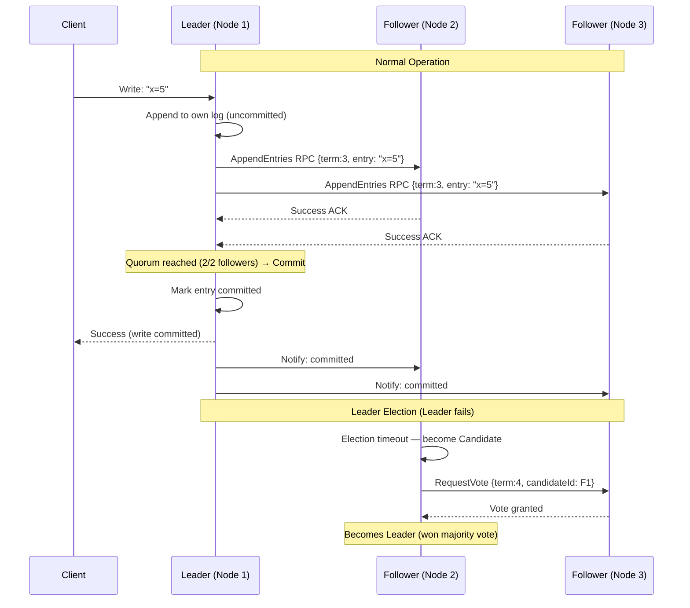

# Raft Consensus Algorithm

## Category
Distributed Systems, Consensus, Fault Tolerance

## Context

Raft is a **consensus algorithm** designed to be more understandable than Paxos. It ensures that a cluster of nodes agrees on a sequence of values (log entries) even in the presence of node failures, network partitions, and message delays. Raft is the foundation of etcd, CockroachDB, TiKV, and Consul.

Raft decomposes consensus into three sub-problems:
1. **Leader Election**: One node is the authoritative leader.
2. **Log Replication**: The leader accepts writes and replicates them to followers.
3. **Safety**: Committed entries are never lost, even after re-elections.

---

## Pros

- **Understandability**: Designed explicitly to be easier to understand than Paxos.
- **Strong consistency**: All committed entries are guaranteed to be persisted.
- **Automatic leader election**: The cluster self-heals after a leader failure.
- **Linearizable reads**: Clients always read the most recent committed state.
- **Well-implemented**: Production implementations available (etcd, CockroachDB, HashiCorp Raft).
- **Membership changes**: Supports dynamic cluster resizing (joint consensus).

---

## Cons

- **Leader bottleneck**: All writes go through the leader.
- **Availability window during election**: The system is unavailable for writes during re-election (typically 150–300ms).
- **Requires odd number of nodes**: 3 (tolerates 1 failure), 5 (tolerates 2 failures).
- **Performance at scale**: With many followers, replication latency grows.
- **Not Byzantine fault tolerant**: Raft assumes nodes behave correctly; malicious nodes break it.

---

## Design Diagram



---

## Code Sample

### Raft State Machine (Simplified TypeScript)

```typescript
// raft/raft-node.ts
export type RaftRole = 'follower' | 'candidate' | 'leader';

export interface LogEntry {
  term: number;
  index: number;
  command: unknown;
}

export interface RequestVoteArgs {
  term: number;
  candidateId: string;
  lastLogIndex: number;
  lastLogTerm: number;
}

export interface AppendEntriesArgs {
  term: number;
  leaderId: string;
  prevLogIndex: number;
  prevLogTerm: number;
  entries: LogEntry[];
  leaderCommit: number;
}

export class RaftNode {
  // Persistent state
  currentTerm = 0;
  votedFor: string | null = null;
  log: LogEntry[] = [];

  // Volatile state
  commitIndex = 0;
  lastApplied = 0;
  role: RaftRole = 'follower';
  leaderId: string | null = null;
  electionTimer: ReturnType<typeof setTimeout> | null = null;

  // Leader state
  nextIndex: Map<string, number> = new Map();
  matchIndex: Map<string, number> = new Map();

  constructor(
    public readonly nodeId: string,
    private readonly peers: string[],
    private readonly transport: RaftTransport,
    private readonly stateMachine: StateMachine
  ) {}

  start(): void {
    this.resetElectionTimer();
  }

  // --- RequestVote RPC Handler ---
  handleRequestVote(args: RequestVoteArgs): { term: number; voteGranted: boolean } {
    if (args.term < this.currentTerm) {
      return { term: this.currentTerm, voteGranted: false };
    }

    if (args.term > this.currentTerm) {
      this.currentTerm = args.term;
      this.convertToFollower(null);
    }

    const lastLogIndex = this.log.length - 1;
    const lastLogTerm = this.log[lastLogIndex]?.term ?? 0;

    const logUpToDate =
      args.lastLogTerm > lastLogTerm ||
      (args.lastLogTerm === lastLogTerm && args.lastLogIndex >= lastLogIndex);

    const canVote = (this.votedFor === null || this.votedFor === args.candidateId) && logUpToDate;

    if (canVote) {
      this.votedFor = args.candidateId;
      this.resetElectionTimer();
    }

    return { term: this.currentTerm, voteGranted: canVote };
  }

  // --- AppendEntries RPC Handler ---
  handleAppendEntries(args: AppendEntriesArgs): { term: number; success: boolean } {
    if (args.term < this.currentTerm) {
      return { term: this.currentTerm, success: false };
    }

    this.currentTerm = args.term;
    this.convertToFollower(args.leaderId);
    this.resetElectionTimer();

    // Check log consistency
    const prevEntry = this.log[args.prevLogIndex - 1];
    if (args.prevLogIndex > 0 && (!prevEntry || prevEntry.term !== args.prevLogTerm)) {
      return { term: this.currentTerm, success: false };
    }

    // Append new entries
    this.log = this.log.slice(0, args.prevLogIndex).concat(args.entries);

    // Update commit index
    if (args.leaderCommit > this.commitIndex) {
      this.commitIndex = Math.min(args.leaderCommit, this.log.length);
      this.applyCommitted();
    }

    return { term: this.currentTerm, success: true };
  }

  // --- Election ---
  private startElection(): void {
    this.currentTerm++;
    this.role = 'candidate';
    this.votedFor = this.nodeId;
    let votesReceived = 1; // Vote for self

    const majority = Math.floor((this.peers.length + 1) / 2) + 1;
    const lastLogIndex = this.log.length - 1;
    const lastLogTerm = this.log[lastLogIndex]?.term ?? 0;

    for (const peer of this.peers) {
      this.transport.requestVote(peer, {
        term: this.currentTerm,
        candidateId: this.nodeId,
        lastLogIndex,
        lastLogTerm,
      }).then(response => {
        if (response.voteGranted && this.role === 'candidate') {
          votesReceived++;
          if (votesReceived >= majority) {
            this.becomeLeader();
          }
        } else if (response.term > this.currentTerm) {
          this.currentTerm = response.term;
          this.convertToFollower(null);
        }
      }).catch(() => {});
    }
  }

  private becomeLeader(): void {
    this.role = 'leader';
    this.leaderId = this.nodeId;
    console.log(`[${this.nodeId}] Became leader for term ${this.currentTerm}`);

    for (const peer of this.peers) {
      this.nextIndex.set(peer, this.log.length + 1);
      this.matchIndex.set(peer, 0);
    }

    this.sendHeartbeats();
  }

  private sendHeartbeats(): void {
    if (this.role !== 'leader') return;
    for (const peer of this.peers) {
      this.transport.appendEntries(peer, {
        term: this.currentTerm,
        leaderId: this.nodeId,
        prevLogIndex: this.log.length,
        prevLogTerm: this.log[this.log.length - 1]?.term ?? 0,
        entries: [],
        leaderCommit: this.commitIndex,
      }).catch(() => {});
    }
    setTimeout(() => this.sendHeartbeats(), 50); // Heartbeat every 50ms
  }

  private convertToFollower(leaderId: string | null): void {
    this.role = 'follower';
    this.leaderId = leaderId;
    this.votedFor = null;
  }

  private resetElectionTimer(): void {
    if (this.electionTimer) clearTimeout(this.electionTimer);
    const timeout = 150 + Math.floor(Math.random() * 150); // 150–300ms
    this.electionTimer = setTimeout(() => this.startElection(), timeout);
  }

  private applyCommitted(): void {
    while (this.lastApplied < this.commitIndex) {
      this.lastApplied++;
      const entry = this.log[this.lastApplied - 1];
      this.stateMachine.apply(entry.command);
    }
  }
}

interface RaftTransport {
  requestVote(peer: string, args: RequestVoteArgs): Promise<{ term: number; voteGranted: boolean }>;
  appendEntries(peer: string, args: AppendEntriesArgs): Promise<{ term: number; success: boolean }>;
}

interface StateMachine {
  apply(command: unknown): void;
}
```

### Using HashiCorp Raft (production library)

```javascript
// Using github.com/hashicorp/raft — typical Go usage translated to concept
// In Node.js, use the 'node-raft' package or embed via gRPC to a Go sidecar

// Conceptual config for a 3-node Raft cluster
const raftConfig = {
  nodeId: process.env.NODE_ID,
  peers: ['node1:7000', 'node2:7000', 'node3:7000'],
  logStore: './raft-logs/',
  snapshotStore: './raft-snapshots/',
  transport: 'tcp',
  electionTimeout: '150ms',
  heartbeatTimeout: '50ms',
};
```
