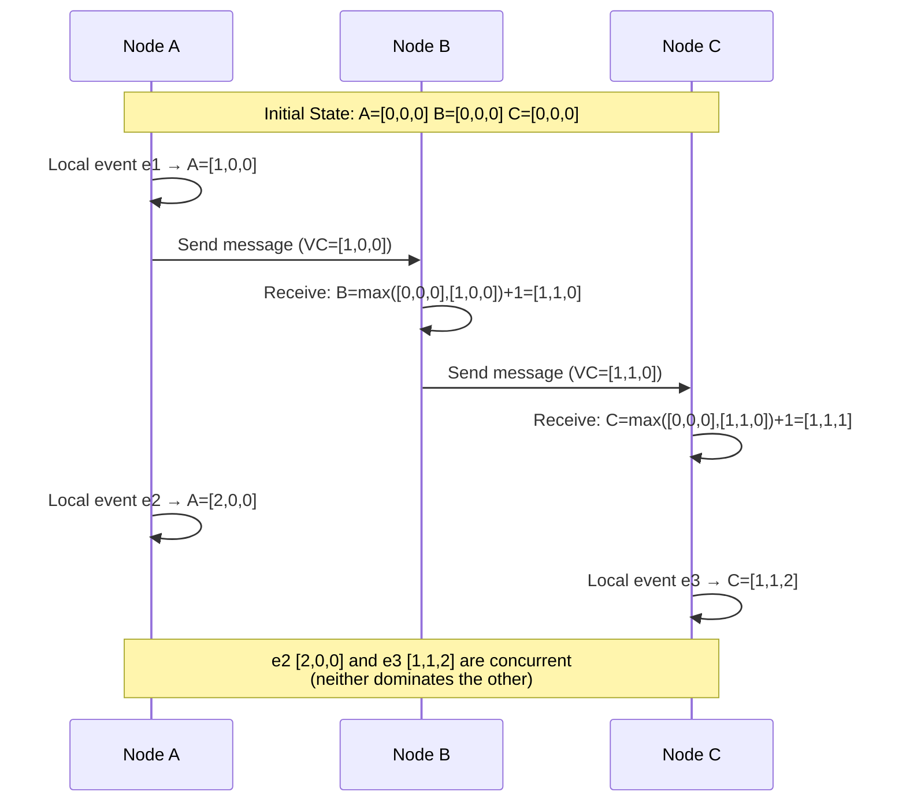

# Vector Clocks

## Category
Distributed Systems, Causality, Consistency

## Context

In distributed systems, wall-clock time is unreliable — clocks drift, and network latency means two events that appear simultaneous may have a causal relationship. **Vector clocks** are a logical timestamp mechanism for tracking causality between events across multiple nodes.

Each node maintains a vector of counters (one per node). When an event occurs, the node increments its own counter. When a message is sent, the current vector is attached. On receipt, the receiver takes the element-wise maximum of both vectors and increments its own. This allows us to determine:
- **A → B** (A happened-before B): if every counter in A ≤ B and at least one is strictly less.
- **Concurrent events**: neither A → B nor B → A — both have happened independently.

Use cases: DynamoDB conflict detection, version vectors in CRDTs, Riak, Voldemort, distributed debugging.

---

## Pros

- **Causal tracking**: Precisely determines happened-before relationships.
- **Conflict detection**: Identifies concurrent writes that need reconciliation.
- **No central coordinator**: Each node maintains its own vector independently.
- **Foundation for CRDTs**: Enables conflict-free replicated data types.
- **Debugging**: Enables causal replay of distributed event histories.

---

## Cons

- **Vector size grows with nodes**: O(N) space per event, per message. Impractical with hundreds of nodes.
- **Not total ordering**: Cannot determine a global event sequence — only partial order.
- **GC complexity**: Old entries must be pruned carefully.
- **Pruning risk**: Incorrect pruning discards causality information.
- **Conflict resolution is external**: Vector clocks detect conflicts; resolution strategy is application-specific.

---

## Design Diagram



---

## Code Sample

### Vector Clock Implementation (TypeScript)

```typescript
// vector-clock/vector-clock.ts
export type VectorClock = Map<string, number>;

export class VectorClockManager {
  private clock: VectorClock;

  constructor(private readonly nodeId: string, peers: string[]) {
    this.clock = new Map();
    this.clock.set(nodeId, 0);
    for (const peer of peers) {
      this.clock.set(peer, 0);
    }
  }

  /** Increment on local event */
  tick(): VectorClock {
    const current = this.clock.get(this.nodeId) ?? 0;
    this.clock.set(this.nodeId, current + 1);
    return this.snapshot();
  }

  /** Called when sending a message — stamps the message */
  send(): VectorClock {
    return this.tick();
  }

  /** Called on message receive — merge incoming vector and tick */
  receive(incoming: VectorClock): VectorClock {
    this.merge(incoming);
    return this.tick();
  }

  /** Returns a snapshot of the current vector */
  snapshot(): VectorClock {
    return new Map(this.clock);
  }

  private merge(other: VectorClock): void {
    for (const [node, time] of other.entries()) {
      const current = this.clock.get(node) ?? 0;
      this.clock.set(node, Math.max(current, time));
    }
  }
}

// --- Causality Comparison ---

export enum CausalRelation {
  HAPPENED_BEFORE = 'HAPPENED_BEFORE',
  HAPPENED_AFTER = 'HAPPENED_AFTER',
  CONCURRENT = 'CONCURRENT',
  IDENTICAL = 'IDENTICAL',
}

export function compare(a: VectorClock, b: VectorClock): CausalRelation {
  const allNodes = new Set([...a.keys(), ...b.keys()]);

  let aLessOrEqual = true;
  let bLessOrEqual = true;

  for (const node of allNodes) {
    const av = a.get(node) ?? 0;
    const bv = b.get(node) ?? 0;

    if (av > bv) bLessOrEqual = false;
    if (bv > av) aLessOrEqual = false;
  }

  if (aLessOrEqual && bLessOrEqual) return CausalRelation.IDENTICAL;
  if (aLessOrEqual) return CausalRelation.HAPPENED_BEFORE;
  if (bLessOrEqual) return CausalRelation.HAPPENED_AFTER;
  return CausalRelation.CONCURRENT;
}

// --- Versioned Value with Vector Clock ---

export interface VersionedValue<T> {
  value: T;
  vectorClock: VectorClock;
  nodeId: string;
}

export class ConflictResolvingStore<T> {
  private versions: Array<VersionedValue<T>> = [];

  put(version: VersionedValue<T>): void {
    const dominated = this.versions.filter(
      v => compare(version.vectorClock, v.vectorClock) === CausalRelation.HAPPENED_AFTER
    );

    // Remove all versions that are dominated by the new one
    for (const d of dominated) {
      this.versions = this.versions.filter(v => v !== d);
    }

    // Check if the new version is dominated by existing ones
    const isDominated = this.versions.some(
      v => compare(version.vectorClock, v.vectorClock) === CausalRelation.HAPPENED_BEFORE
    );

    if (!isDominated) {
      this.versions.push(version);
    }
  }

  get(): VersionedValue<T>[] {
    return this.versions;
  }

  isConcurrent(): boolean {
    return this.versions.length > 1;
  }
}

// --- Usage Demo ---
async function demo() {
  const nodeA = new VectorClockManager('A', ['B', 'C']);
  const nodeB = new VectorClockManager('B', ['A', 'C']);

  const vc1 = nodeA.tick(); // A does something
  console.log('A after tick:', Object.fromEntries(vc1)); // {A:1, B:0, C:0}

  const sentClock = nodeA.send(); // A sends message
  const vc2 = nodeB.receive(sentClock); // B receives
  console.log('B after receive:', Object.fromEntries(vc2)); // {A:1, B:1, C:0}

  const vc3 = nodeA.tick(); // A does another local event
  console.log('A concurrent event:', Object.fromEntries(vc3)); // {A:2, B:0, C:0}

  const relation = compare(vc3, vc2);
  console.log('Causality:', relation); // CONCURRENT
}
```

### Version Vectors in a Key-Value Store

```typescript
// Simulating DynamoDB-style version vector conflict detection
import { v4 as uuidv4 } from 'uuid';

interface DynamoItem<T> {
  key: string;
  value: T;
  versionVectors: Record<string, number>; // node → counter
}

class VersionVectorStore<T> {
  private store = new Map<string, DynamoItem<T>[]>();

  constructor(private readonly nodeId: string) {}

  write(key: string, value: T, clientVectorClock: Record<string, number> = {}): void {
    const existing = this.store.get(key) ?? [];

    const newVersion: DynamoItem<T> = {
      key,
      value,
      versionVectors: { ...clientVectorClock, [this.nodeId]: (clientVectorClock[this.nodeId] ?? 0) + 1 },
    };

    // Remove dominated versions
    const retained = existing.filter(e => {
      const dominated = dominates(newVersion.versionVectors, e.versionVectors);
      return !dominated;
    });

    this.store.set(key, [...retained, newVersion]);
  }

  read(key: string): DynamoItem<T>[] {
    return this.store.get(key) ?? [];
  }
}

function dominates(a: Record<string, number>, b: Record<string, number>): boolean {
  const allKeys = new Set([...Object.keys(a), ...Object.keys(b)]);
  for (const k of allKeys) {
    if ((a[k] ?? 0) < (b[k] ?? 0)) return false;
  }
  return true;
}
```
