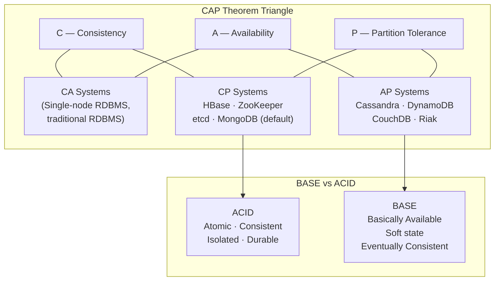
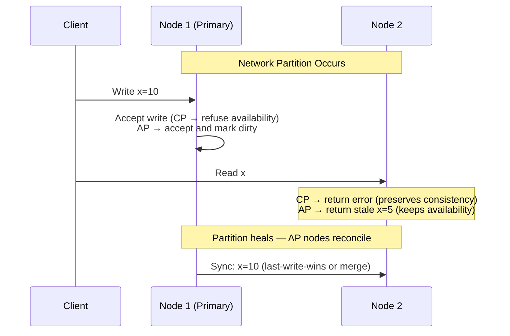

# CAP Theorem & BASE Properties

## Category
Distributed Systems, Consistency, Availability, Theoretical Foundation

## Context

The **CAP Theorem** (Brewer's Theorem, 2000) states that a distributed system can guarantee at most **two** of three properties simultaneously:

- **C — Consistency**: Every read receives the most recent write (or an error).
- **A — Availability**: Every request receives a (non-error) response, without guarantee of the most recent write.
- **P — Partition Tolerance**: The system continues to operate despite arbitrary network message loss or delay.

Since network partitions are inevitable in real distributed systems, the practical choice is always between **CP** and **AP** during a partition.

**BASE** is the relaxed consistency model adopted by AP systems as an alternative to ACID:
- **B**asically **A**vailable: System guarantees availability (responses return, even if stale).
- **S**oft state: System state may change over time without input (via propagation/convergence).
- **E**ventually consistent: Data will converge to a consistent state — eventually.

---

## Pros

### CP Systems (e.g., HBase, ZooKeeper, etcd)
- Strong correctness guarantees.
- No stale reads after successful commits.
- Suitable for financial systems, distributed locking, leader election.

### AP Systems (e.g., Cassandra, DynamoDB, CouchDB)
- High availability even during network partitions.
- Low latency writes (no waiting for quorum agreement).
- Suitable for shopping carts, user sessions, recommendation engines.

---

## Cons

### CP Systems
- Unavailable during network partitions (by design).
- Higher write latency (requires quorum acknowledgment).

### AP Systems
- Stale reads possible (eventual consistency lag).
- Conflict resolution complexity (last-write-wins, CRDTs, application merge logic).
- Not suitable where correctness is non-negotiable.

---

## Design Diagram





---

## Code Sample

### CP Pattern — Consistent Read with etcd

```typescript
// cp-pattern/etcd-consistent-read.ts
import { Etcd3 } from 'etcd3';

const client = new Etcd3({
  hosts: ['http://etcd1:2379', 'http://etcd2:2379', 'http://etcd3:2379'],
});

// CP: linearizable read — always returns the latest committed value
// etcd guarantees linearizability by default (reads go through Raft leader)
async function consistentRead(key: string): Promise<string | null> {
  return client.get(key).string();
}

// CP: atomic compare-and-swap (used for distributed locking / leader election)
async function atomicUpdate(key: string, expected: string, newValue: string): Promise<boolean> {
  const result = await client.if(key, 'Value', '==', expected)
    .then(client.put(key).value(newValue))
    .else(client.get(key))
    .commit();

  return result.succeeded;
}

// During network partition: etcd will refuse requests that cannot reach quorum
// → trades availability for consistency (CP)
```

### AP Pattern — Eventual Consistency with Cassandra

```typescript
// ap-pattern/cassandra-eventual.ts
import { Client, types } from 'cassandra-driver';

const cassandra = new Client({
  contactPoints: ['cassandra1', 'cassandra2', 'cassandra3'],
  localDataCenter: 'datacenter1',
  keyspace: 'ecommerce',
});

// AP: write with LOW consistency — accepts write even if only 1 node responds
async function writeBasketItem(userId: string, productId: string, qty: number): Promise<void> {
  const query = `
    INSERT INTO basket_items (user_id, product_id, quantity, updated_at)
    VALUES (?, ?, ?, toTimestamp(now()))
  `;
  await cassandra.execute(query, [userId, productId, qty], {
    consistency: types.consistencies.one, // AP: ONE = fastest, least consistent
  });
}

// AP: read with QUORUM — balances availability with consistency
async function readBasket(userId: string): Promise<types.Row[]> {
  const result = await cassandra.execute(
    'SELECT * FROM basket_items WHERE user_id = ?',
    [userId],
    { consistency: types.consistencies.quorum } // reads from majority
  );
  return result.rows;
}

// Tunable consistency: ONE < QUORUM < ALL
// ONE → available (AP), ALL → consistent (CP), QUORUM → the sweet spot
```

### BASE: Eventual Consistency Reconciliation

```typescript
// base-reconciliation/crdt-counter.ts

// G-Counter CRDT (Grow-only counter) — naturally eventually consistent
// Each node only increments its own slot; merge = element-wise max
type GCounter = Record<string, number>; // nodeId → count

function increment(counter: GCounter, nodeId: string): GCounter {
  return { ...counter, [nodeId]: (counter[nodeId] ?? 0) + 1 };
}

function merge(a: GCounter, b: GCounter): GCounter {
  const merged: GCounter = { ...a };
  for (const [nodeId, value] of Object.entries(b)) {
    merged[nodeId] = Math.max(merged[nodeId] ?? 0, value);
  }
  return merged;
}

function value(counter: GCounter): number {
  return Object.values(counter).reduce((sum, v) => sum + v, 0);
}

// Usage
let nodeA: GCounter = {};
let nodeB: GCounter = {};

nodeA = increment(nodeA, 'A'); // A: {A:1}
nodeA = increment(nodeA, 'A'); // A: {A:2}
nodeB = increment(nodeB, 'B'); // B: {B:1}

// After partition heals — merge
const reconciled = merge(nodeA, nodeB); // {A:2, B:1}
console.log('Total count:', value(reconciled)); // 3 — eventually consistent
```

### Choosing Consistency Level Based on Context

```typescript
type Operation = 'read' | 'write';
type Domain = 'banking' | 'shopping_cart' | 'user_profile' | 'analytics';

function recommendConsistencyModel(domain: Domain): { model: 'CP' | 'AP'; reason: string } {
  const recommendations: Record<Domain, { model: 'CP' | 'AP'; reason: string }> = {
    banking:       { model: 'CP', reason: 'Financial accuracy non-negotiable; prefer unavailability over wrong balance.' },
    shopping_cart: { model: 'AP', reason: 'Stale cart is acceptable; availability critical for conversion.' },
    user_profile:  { model: 'AP', reason: 'Minor staleness tolerable; system must stay responsive.' },
    analytics:     { model: 'AP', reason: 'Approximate counts acceptable; high write throughput needed.' },
  };
  return recommendations[domain];
}
```
