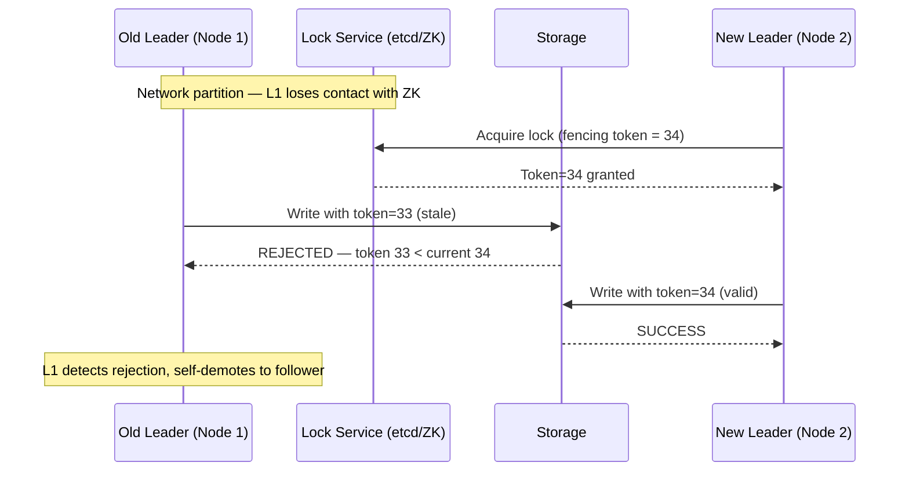
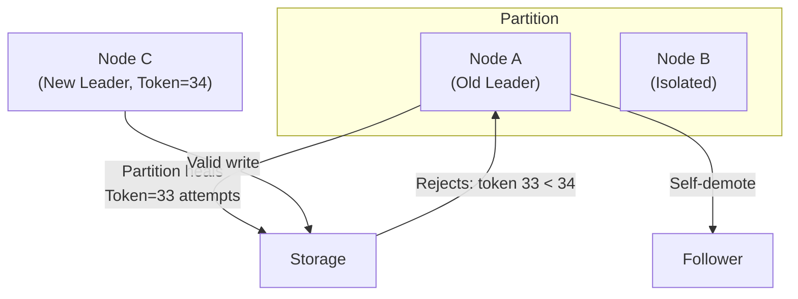

# Split Brain & Fencing

## Category
Distributed Systems, Fault Tolerance, Cluster Management

## Context

**Split Brain** occurs when a network partition causes a distributed cluster to split into two or more isolated sub-clusters, each believing it is the only surviving quorum and continuing to accept writes independently. This leads to **conflicting state**, data corruption, and data loss when the partition heals.

Common scenarios:
- A Raft/Paxos cluster where the leader is partitioned and a new leader is elected — the old leader keeps accepting writes.
- Active-Active database replication where both sides are writable during a partition.
- A Kubernetes controller that has two instances both acting as master.

**Fencing** is the mechanism used to prevent a "zombie leader" (an old leader that lost its mandate) from continuing to perform writes or acquire resources. Fencing strategies include:
- **Fencing Tokens**: Monotonically increasing tokens issued by the lock service. Storage systems reject operations with stale tokens.
- **STONITH (Shoot the Other Node in the Head)**: Physically power off or restart the partitioned node.
- **Epoch/Term numbers**: Raft uses `term` numbers; operations with old terms are rejected.
- **Lease expiry**: Leaders lease their role for a fixed TTL; no renewal = automatic demotion.

---

## Pros

- **Data integrity**: Fencing prevents conflicting writes from being committed.
- **Automatic recovery**: Lease-based fencing automatically expires zombie leaders.
- **Complement to consensus**: Works alongside Raft/Paxos for defense-in-depth.
- **Infrastructure-level protection**: STONITH operates at the hardware level — can't be bypassed by software bugs.

---

## Cons

- **Complexity**: Implementing fencing tokens requires coordination across the storage layer.
- **STONITH reliability**: If STONITH itself fails, the split brain persists.
- **False positives**: A slow (not crashed) node might be fenced unnecessarily.
- **Latency**: Lease-based fencing adds latency as clients wait for lease confirmation.
- **Recovery downtime**: Fenced nodes need restart and reconciliation before rejoining.

---

## Design Diagram





---

## Code Sample

### Fencing Token Pattern (TypeScript)

```typescript
// fencing/lock-service.ts
import { Etcd3 } from 'etcd3';

const etcd = new Etcd3({ hosts: ['http://etcd:2379'] });

// Monotonically increasing fencing token stored in etcd
async function acquireLeaderLock(nodeId: string, ttlSeconds = 10): Promise<number | null> {
  const lease = etcd.lease(ttlSeconds);
  const fencingToken = await etcd.get('fencing-token').number() ?? 0;
  const newToken = fencingToken + 1;

  const txn = await etcd.if('leader-lock', 'Create', '==', '0')
    .then(
      etcd.put('leader-lock').value(nodeId).lease(await lease.grant()),
      etcd.put('fencing-token').value(String(newToken))
    )
    .commit();

  if (txn.succeeded) {
    console.log(`[${nodeId}] Became leader with fencing token ${newToken}`);
    return newToken;
  }

  await lease.revoke();
  return null;
}

// Storage layer that rejects writes with stale fencing tokens
class FencedStorage {
  private currentToken = 0;
  private data = new Map<string, string>();

  write(key: string, value: string, fencingToken: number): void {
    if (fencingToken < this.currentToken) {
      throw new Error(
        `Fencing token ${fencingToken} rejected — current token is ${this.currentToken}. ` +
        `Node is a zombie leader and must step down.`
      );
    }
    // Accept newer or equal token
    this.currentToken = Math.max(this.currentToken, fencingToken);
    this.data.set(key, value);
    console.log(`[Storage] Write accepted with token ${fencingToken}: ${key}=${value}`);
  }

  read(key: string): string | undefined {
    return this.data.get(key);
  }
}

// Leader that uses fencing tokens for all writes
class FencedLeader {
  private stopped = false;

  constructor(
    private readonly nodeId: string,
    private readonly fencingToken: number,
    private readonly storage: FencedStorage
  ) {}

  async doWrite(key: string, value: string): Promise<void> {
    if (this.stopped) throw new Error('Leader has stepped down');

    try {
      this.storage.write(key, value, this.fencingToken);
    } catch (err) {
      // Storage rejected us — we are a zombie leader
      console.error(`[${this.nodeId}] Fencing token rejected, stepping down:`, err);
      this.stopped = true;
      throw err;
    }
  }
}

// --- Quorum-based Fencing ---
export class QuorumFencing {
  private fencingEpoch = 0;

  constructor(
    private readonly nodeId: string,
    private readonly peers: string[],
    private readonly transport: { fence(peer: string, epoch: number): Promise<boolean> }
  ) {}

  async fenceOldLeader(): Promise<boolean> {
    this.fencingEpoch++;
    const epoch = this.fencingEpoch;

    const results = await Promise.allSettled(
      this.peers.map(peer => this.transport.fence(peer, epoch))
    );

    const successes = results.filter(r => r.status === 'fulfilled' && r.value === true).length;
    const majority = Math.floor((this.peers.length + 1) / 2) + 1;

    if (successes >= majority) {
      console.log(`Fencing succeeded for epoch ${epoch}: ${successes}/${this.peers.length} nodes fenced`);
      return true;
    }

    console.warn(`Fencing failed for epoch ${epoch}: only ${successes} nodes fenced`);
    return false;
  }
}
```

### Lease-Based Anti-Split-Brain

```typescript
// fencing/lease-based-leader.ts
import { Etcd3 } from 'etcd3';

const etcd = new Etcd3({ hosts: ['http://etcd:2379'] });

export class LeaseBasedLeader {
  private lease = etcd.lease(5); // 5-second TTL
  private isLeader = false;

  async start(nodeId: string): Promise<void> {
    // Repeatedly try to acquire the leader key
    while (true) {
      const granted = await this.lease.grant();
      try {
        await etcd.put('leader').value(nodeId).lease(granted);
        this.isLeader = true;
        console.log(`[${nodeId}] Acquired leadership`);

        // Keep lease alive — failure means we lose leadership automatically
        this.lease.on('lost', () => {
          this.isLeader = false;
          console.warn(`[${nodeId}] Lost leadership — lease expired`);
        });

        await this.runLeaderLoop(nodeId);
      } catch {
        this.isLeader = false;
      }
      await new Promise(res => setTimeout(res, 1000));
    }
  }

  private async runLeaderLoop(nodeId: string): Promise<void> {
    while (this.isLeader) {
      // Perform leader actions — if lease cannot be renewed, loop exits
      console.log(`[${nodeId}] Performing leader work`);
      await new Promise(res => setTimeout(res, 1000));
    }
  }
}

// STONITH simulation (typically via IPMI, BMC, or cloud provider API)
async function stonithFence(targetNodeId: string, cloudProvider: 'aws' | 'gcp'): Promise<void> {
  if (cloudProvider === 'aws') {
    const { EC2Client, StopInstancesCommand } = await import('@aws-sdk/client-ec2');
    const ec2 = new EC2Client({ region: process.env.AWS_REGION });
    await ec2.send(new StopInstancesCommand({ InstanceIds: [targetNodeId] }));
    console.log(`STONITH: Stopped AWS instance ${targetNodeId}`);
  }
}
```
