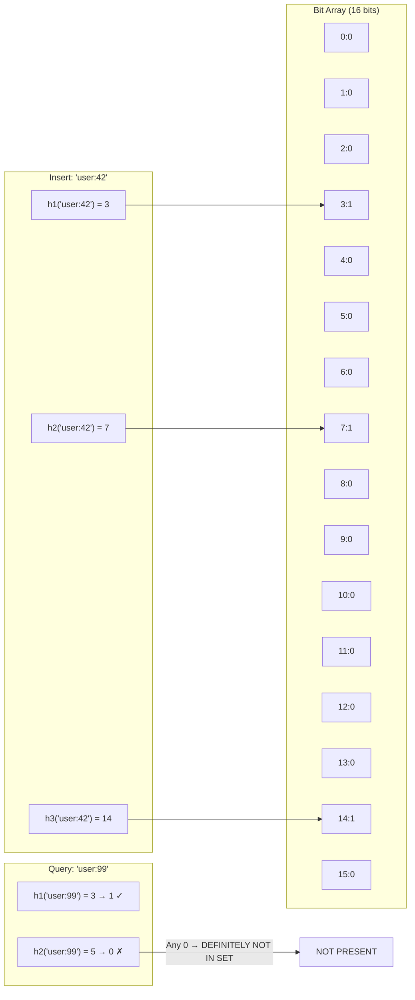

# Bloom Filter

## Category
Distributed Systems, Data Structures, Performance, Memory Efficiency

## Context

A **Bloom Filter** is a **space-efficient probabilistic data structure** used to test whether an element is a member of a set. It answers two questions:
- **"Definitely NOT in the set"**: 100% accurate — no false negatives.
- **"Probably IN the set"**: May produce false positives — an element might appear to be in the set when it is not.

A Bloom Filter uses a bit array of `m` bits and `k` independent hash functions. To add an element, all `k` hash positions are set to 1. To query, all `k` positions are checked — if any is 0, the element is definitely absent.

**Distributed use cases**:
- **Cassandra**: Avoids SSTables disk reads for non-existent keys.
- **HBase / Bigtable**: Row existence checks before reading from disk.
- **CDN/Proxy**: Cache negative lookups — avoid database hits for missing URLs.
- **Distributed caches**: Eliminate cache miss lookups for keys that were never cached.
- **Email deduplication**: Detect already-seen email IDs in a stream.

---

## Pros

- **Extremely memory-efficient**: 1 billion items with 1% false positive rate ≈ 1.2 GB (vs. ~8 GB for a HashSet).
- **O(k) constant time**: Both insert and membership check are O(k) regardless of set size.
- **No false negatives**: If the filter says "NOT present," it is guaranteed correct.
- **Parallelizable across nodes**: Each shard maintains its own Bloom Filter.
- **Cache-friendly**: Small bit arrays fit in CPU cache.

---

## Cons

- **False positives**: Rate grows as the filter fills up. Must be tuned at creation.
- **No deletion** (standard): Once a bit is set, it cannot be unset without rebuilding (use Counting Bloom Filter for deletion).
- **Not enumerable**: Cannot retrieve the elements from the filter.
- **Fixed capacity**: Must estimate the number of elements upfront.
- **Hash function quality matters**: Poor hash functions increase collisions and false positive rate.

---

## Design Diagram



---

## Code Sample

### Bloom Filter Implementation (TypeScript)

```typescript
// bloom-filter/bloom-filter.ts
import { createHash } from 'crypto';

export class BloomFilter {
  private readonly bits: Uint8Array;
  private readonly bitCount: number;
  private readonly hashCount: number;

  /**
   * @param expectedItems  - Expected number of items to insert
   * @param falsePositiveRate - Desired false positive rate (0.01 = 1%)
   */
  constructor(expectedItems: number, falsePositiveRate: number) {
    this.bitCount = BloomFilter.optimalBitCount(expectedItems, falsePositiveRate);
    this.hashCount = BloomFilter.optimalHashCount(expectedItems, this.bitCount);
    this.bits = new Uint8Array(Math.ceil(this.bitCount / 8));
  }

  /** Add an element to the filter */
  add(item: string): void {
    for (const position of this.hashPositions(item)) {
      this.setBit(position);
    }
  }

  /** Check if an element might be in the set */
  mightContain(item: string): boolean {
    for (const position of this.hashPositions(item)) {
      if (!this.getBit(position)) return false;
    }
    return true; // Might be present (could be false positive)
  }

  /** Estimate current false positive rate */
  estimatedFalsePositiveRate(insertedCount: number): number {
    const k = this.hashCount;
    const m = this.bitCount;
    const n = insertedCount;
    return Math.pow(1 - Math.exp(-k * n / m), k);
  }

  private *hashPositions(item: string): Iterable<number> {
    // Use double-hashing to generate k positions from 2 hash functions
    const h1 = this.hash(item, 'sha256');
    const h2 = this.hash(item, 'md5');

    for (let i = 0; i < this.hashCount; i++) {
      yield ((h1 + i * h2) >>> 0) % this.bitCount;
    }
  }

  private hash(item: string, algorithm: 'sha256' | 'md5'): number {
    const buf = createHash(algorithm).update(item).digest();
    // Read first 4 bytes as unsigned int
    return ((buf[0] << 24) | (buf[1] << 16) | (buf[2] << 8) | buf[3]) >>> 0;
  }

  private setBit(position: number): void {
    const byteIndex = Math.floor(position / 8);
    const bitIndex = position % 8;
    this.bits[byteIndex] |= (1 << bitIndex);
  }

  private getBit(position: number): boolean {
    const byteIndex = Math.floor(position / 8);
    const bitIndex = position % 8;
    return (this.bits[byteIndex] & (1 << bitIndex)) !== 0;
  }

  private static optimalBitCount(n: number, p: number): number {
    return Math.ceil(-n * Math.log(p) / (Math.log(2) ** 2));
  }

  private static optimalHashCount(n: number, m: number): number {
    return Math.max(1, Math.round((m / n) * Math.log(2)));
  }

  /** Serialize filter state to Base64 */
  serialize(): string {
    return Buffer.from(this.bits).toString('base64');
  }

  /** Load state from serialized form */
  static deserialize(serialized: string, expectedItems: number, fpr: number): BloomFilter {
    const filter = new BloomFilter(expectedItems, fpr);
    const loaded = Buffer.from(serialized, 'base64');
    filter.bits.set(loaded);
    return filter;
  }
}

// --- Cache Guard Pattern ---
// Use Bloom Filter to prevent cache penetration (querying DB for non-existent keys)

export class CacheGuard {
  private filter: BloomFilter;
  private insertCount = 0;

  constructor(expectedKeys: number) {
    this.filter = new BloomFilter(expectedKeys, 0.01); // 1% FPR
  }

  warmUp(existingKeys: string[]): void {
    for (const key of existingKeys) {
      this.filter.add(key);
      this.insertCount++;
    }
    console.log(
      `Bloom filter warmed with ${existingKeys.length} keys. ` +
      `Estimated FPR: ${(this.filter.estimatedFalsePositiveRate(this.insertCount) * 100).toFixed(3)}%`
    );
  }

  shouldQuery(key: string): 'SKIP' | 'QUERY' {
    if (!this.filter.mightContain(key)) {
      return 'SKIP'; // Definitely not in DB — skip DB query
    }
    return 'QUERY'; // Might exist — proceed with cache/DB lookup
  }

  register(key: string): void {
    this.filter.add(key);
    this.insertCount++;
  }
}

// Usage
async function cachedGet(key: string, guard: CacheGuard, cache: Map<string, string>, db: { get(k: string): Promise<string | null> }): Promise<string | null> {
  // Step 1: Bloom filter check (avoids cache miss + DB hit for phantom keys)
  if (guard.shouldQuery(key) === 'SKIP') {
    return null; // Definitely doesn't exist — no DB round trip
  }

  // Step 2: Cache check
  const cached = cache.get(key);
  if (cached) return cached;

  // Step 3: DB fallback
  const value = await db.get(key);
  if (value) {
    cache.set(key, value);
    guard.register(key);
  }
  return value;
}
```

### Redis-backed Distributed Bloom Filter

```typescript
// bloom-filter/redis-bloom-filter.ts
// Uses RedisBloom module (available in Redis Stack)
import { createClient } from 'redis';

const redis = createClient({ url: 'redis://localhost:6379' });
await redis.connect();

const FILTER_KEY = 'user_ids_bloom';

// Initialize filter with capacity and error rate
await redis.sendCommand(['BF.RESERVE', FILTER_KEY, '0.01', '1000000']);

// Add elements
async function addUserId(userId: string): Promise<void> {
  await redis.sendCommand(['BF.ADD', FILTER_KEY, userId]);
}

// Check membership
async function userMightExist(userId: string): Promise<boolean> {
  const result = await redis.sendCommand(['BF.EXISTS', FILTER_KEY, userId]);
  return result === 1;
}

// Bulk add for warm-up
async function bulkAdd(userIds: string[]): Promise<void> {
  await redis.sendCommand(['BF.MADD', FILTER_KEY, ...userIds]);
}
```
