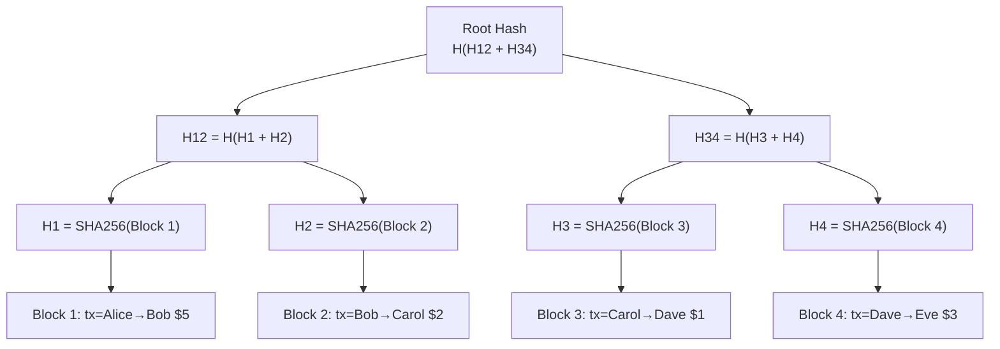
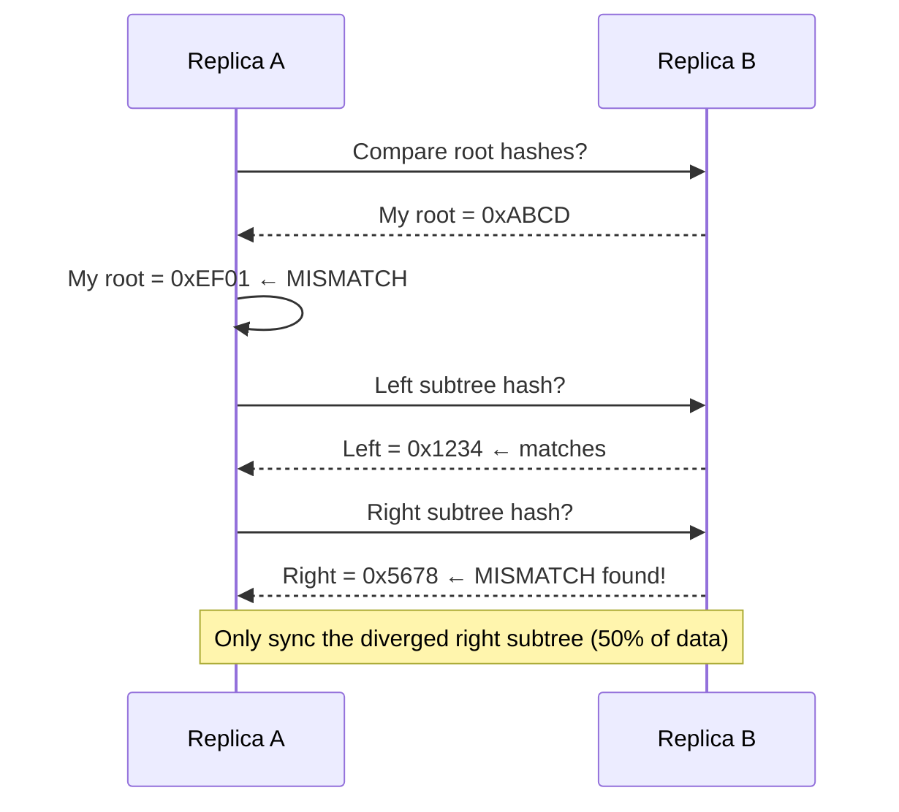

# Merkle Tree

## Category
Distributed Systems, Data Integrity, Consistency Verification

## Context

A **Merkle Tree** (hash tree) is a binary tree where every **leaf node** contains the hash of a data block, and every **internal node** contains the hash of its two children. The **root hash** (Merkle Root) is a cryptographic fingerprint of the entire dataset.

Key property: If **any** piece of data changes, the hashes propagate up and produce a different root hash. Additionally, Merkle trees support efficient proof of membership — you only need O(log N) hashes to prove that a specific data block is part of a dataset.

**Distributed use cases**:
- **Git**: Each commit's tree is a Merkle tree of files and directories.
- **Cassandra**: Anti-entropy repair uses Merkle trees to detect and synchronize diverged replicas.
- **Bitcoin/Ethereum**: Transactions in a block are organized as a Merkle tree; SPV proofs use Merkle proofs.
- **Dynamo/Riak**: Anti-entropy synchronization between replicas.
- **IPFS**: Content-addressed storage uses Merkle DAGs for deduplication.
- **Certificate Transparency**: Public logs use Merkle trees to prove certificate inclusion.

---

## Pros

- **Efficient inconsistency detection**: Two nodes can compare root hashes in O(1) to detect divergence.
- **Targeted reconciliation**: Binary-search down the tree to find exactly which blocks differ — O(log N) steps.
- **Tamper-evident**: Any modification changes the root hash, detectable immediately.
- **Membership proofs**: Prove a specific block is in the set with O(log N) hashes, no full data download.
- **Incremental updates**: Only the path from changed leaf to root needs rehashing.

---

## Cons

- **Rebuild cost**: Initial tree construction is O(N log N) and computationally expensive at scale.
- **Not real-time**: Typically used for periodic reconciliation, not continuous write verification.
- **Rebalancing**: Insertions may require tree restructuring.
- **Hash collision risk**: Theoretically possible (negligible with SHA-256).
- **Storage overhead**: Each node stores hash + two child hashes.

---

## Design Diagram





---

## Code Sample

### Merkle Tree Implementation (TypeScript)

```typescript
// merkle/merkle-tree.ts
import { createHash } from 'crypto';

function sha256(data: string): string {
  return createHash('sha256').update(data).digest('hex');
}

export interface MerkleNode {
  hash: string;
  left?: MerkleNode;
  right?: MerkleNode;
  data?: string; // Leaf nodes only
}

export class MerkleTree {
  root: MerkleNode;
  private leaves: MerkleNode[];

  constructor(dataBlocks: string[]) {
    if (dataBlocks.length === 0) throw new Error('Cannot build Merkle tree from empty data');

    this.leaves = dataBlocks.map(data => ({
      hash: sha256(data),
      data,
    }));

    this.root = this.buildTree(this.leaves);
  }

  private buildTree(nodes: MerkleNode[]): MerkleNode {
    if (nodes.length === 1) return nodes[0];

    const parents: MerkleNode[] = [];

    for (let i = 0; i < nodes.length; i += 2) {
      const left = nodes[i];
      const right = nodes[i + 1] ?? nodes[i]; // Duplicate last node if odd count

      parents.push({
        hash: sha256(left.hash + right.hash),
        left,
        right,
      });
    }

    return this.buildTree(parents);
  }

  /** Get root hash (fingerprint of entire dataset) */
  getRootHash(): string {
    return this.root.hash;
  }

  /** Generate a Merkle proof for a specific leaf (inclusion proof) */
  getProof(data: string): Array<{ hash: string; direction: 'left' | 'right' }> | null {
    const targetHash = sha256(data);
    const proof: Array<{ hash: string; direction: 'left' | 'right' }> = [];

    if (!this.findProof(this.root, targetHash, proof)) {
      return null; // Element not found
    }

    return proof.reverse(); // Return from leaf to root direction
  }

  private findProof(
    node: MerkleNode,
    target: string,
    proof: Array<{ hash: string; direction: 'left' | 'right' }>
  ): boolean {
    if (node.hash === target) return true;
    if (!node.left || !node.right) return false;

    if (this.findProof(node.left, target, proof)) {
      proof.push({ hash: node.right.hash, direction: 'right' });
      return true;
    }

    if (this.findProof(node.right, target, proof)) {
      proof.push({ hash: node.left.hash, direction: 'left' });
      return true;
    }

    return false;
  }

  /** Verify a Merkle proof without the full tree */
  static verifyProof(
    data: string,
    proof: Array<{ hash: string; direction: 'left' | 'right' }>,
    rootHash: string
  ): boolean {
    let current = sha256(data);

    for (const { hash, direction } of proof) {
      if (direction === 'right') {
        current = sha256(current + hash); // current is left sibling
      } else {
        current = sha256(hash + current); // current is right sibling
      }
    }

    return current === rootHash;
  }
}

// --- Anti-Entropy Reconciliation (Cassandra-style) ---

export interface MerkleRange {
  start: string; // Token range start
  end: string;
  hash: string;
  children?: [MerkleRange, MerkleRange];
}

export class AntiEntropyReplicator {
  async syncWith(
    localTree: MerkleTree,
    remoteRootHash: string,
    fetchRemoteSubtree: (path: string) => Promise<string>,
    syncRange: (rangeId: string) => Promise<void>
  ): Promise<void> {
    if (localTree.getRootHash() === remoteRootHash) {
      console.log('Replicas in sync — no reconciliation needed');
      return;
    }

    console.log('Root hash mismatch — starting anti-entropy comparison');
    // Binary search to find diverged subtrees
    // (simplified — real Cassandra uses token-range hash segments)
    await this.compareSubtrees(localTree.root, 'root', fetchRemoteSubtree, syncRange);
  }

  private async compareSubtrees(
    localNode: MerkleNode,
    path: string,
    fetchRemote: (path: string) => Promise<string>,
    syncRange: (rangeId: string) => Promise<void>
  ): Promise<void> {
    const remoteHash = await fetchRemote(path);

    if (localNode.hash === remoteHash) return; // Subtrees match

    // Leaf node — data block is diverged
    if (!localNode.left || !localNode.right) {
      console.log(`Diverged leaf at ${path} — syncing`);
      await syncRange(path);
      return;
    }

    // Recurse into children
    await Promise.all([
      this.compareSubtrees(localNode.left, `${path}/left`, fetchRemote, syncRange),
      this.compareSubtrees(localNode.right, `${path}/right`, fetchRemote, syncRange),
    ]);
  }
}

// --- Usage ---
const transactions = [
  'tx:Alice→Bob:$5',
  'tx:Bob→Carol:$2',
  'tx:Carol→Dave:$1',
  'tx:Dave→Eve:$3',
];

const tree = new MerkleTree(transactions);
console.log('Root hash:', tree.getRootHash());

// Generate inclusion proof
const proof = tree.getProof('tx:Bob→Carol:$2');
if (proof) {
  const valid = MerkleTree.verifyProof('tx:Bob→Carol:$2', proof, tree.getRootHash());
  console.log('Proof valid:', valid); // true
}

// Tamper detection
const tampered = new MerkleTree([
  'tx:Alice→Bob:$5',
  'tx:Bob→Carol:$99', // Tampered!
  'tx:Carol→Dave:$1',
  'tx:Dave→Eve:$3',
]);
console.log('Hashes match:', tree.getRootHash() === tampered.getRootHash()); // false
```
