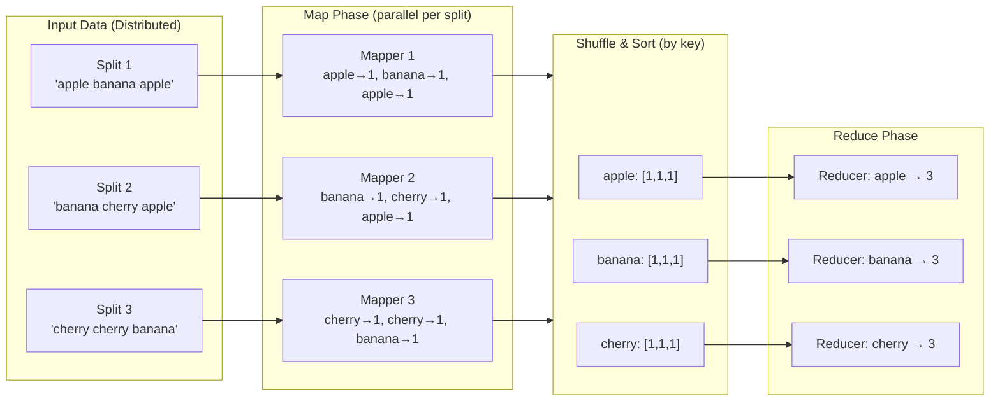

# MapReduce Pattern

## Category
Distributed Systems, Data Processing, Scalability

## Context

**MapReduce** is a programming model for processing large datasets in parallel across a distributed cluster. Introduced by Google in 2004, it abstracts parallelism, fault tolerance, and data movement into two user-defined functions:

1. **Map**: Takes an input key-value pair and produces zero or more intermediate key-value pairs.
2. **Reduce**: Takes all intermediate values for a given key and aggregates them into a result.

Between Map and Reduce, the framework performs a **Shuffle & Sort** phase, routing intermediate values to the correct Reducer based on key.

**Modern equivalents**:
- Apache Hadoop (open-source MapReduce)
- Apache Spark (in-memory MapReduce with DAG optimization)
- Apache Flink (streaming MapReduce)
- Google BigQuery / Dataflow
- AWS EMR, Athena

**Use cases**: Log analysis, word count, inverted index building, ETL pipelines, distributed sorting, compute-intensive batch jobs.

---

## Pros

- **Automatic parallelism**: The framework handles data partitioning, task scheduling, and parallelism.
- **Fault tolerance**: Failed map/reduce tasks are automatically retried on other nodes.
- **Horizontal scalability**: Add more nodes to process more data linearly.
- **Data locality**: Computation is moved to where data lives, minimizing network transfer.
- **Simple programming model**: Complex distributed processing boiled down to two functions.

---

## Cons

- **Batch-only**: Classic MapReduce processes static snapshots — not suitable for real-time streaming.
- **High latency**: Disk I/O between Map and Reduce phases adds latency (Hadoop's Achilles' heel).
- **Not suitable for iterative algorithms**: Each iteration requires a new MapReduce job (workaround: Spark).
- **Shuffle bottleneck**: The shuffle phase can consume significant network and disk bandwidth.
- **Over-simplified for complex DAGs**: Multi-stage pipelines require chaining multiple jobs.

---

## Design Diagram



---

## Code Sample

### In-Process MapReduce (TypeScript)

```typescript
// mapreduce/mapreduce.ts
export type KeyValue<K, V> = { key: K; value: V };
export type MapFn<IK, IV, OK, OV> = (key: IK, value: IV) => Array<KeyValue<OK, OV>>;
export type ReduceFn<K, V, OV> = (key: K, values: V[]) => OV;

export class MapReduceEngine {
  /**
   * Execute a MapReduce job over an input dataset.
   *
   * @param input    - Array of input key-value pairs
   * @param mapFn    - Map function: (key, value) → [(key, value), ...]
   * @param reduceFn - Reduce function: (key, values[]) → aggregatedValue
   */
  run<IK, IV, MK extends string | number, MV, OV>(
    input: Array<KeyValue<IK, IV>>,
    mapFn: MapFn<IK, IV, MK, MV>,
    reduceFn: ReduceFn<MK, MV, OV>
  ): Map<MK, OV> {
    // --- Map Phase ---
    const intermediate = new Map<MK, MV[]>();

    for (const { key, value } of input) {
      const mapped = mapFn(key, value);

      for (const { key: mk, value: mv } of mapped) {
        if (!intermediate.has(mk)) intermediate.set(mk, []);
        intermediate.get(mk)!.push(mv);
      }
    }

    // --- Reduce Phase ---
    const output = new Map<MK, OV>();

    for (const [key, values] of intermediate.entries()) {
      output.set(key, reduceFn(key, values));
    }

    return output;
  }
}

// --- Example 1: Word Count ---
const engine = new MapReduceEngine();

const documents = [
  { key: 'doc1', value: 'the quick brown fox jumps over the lazy dog' },
  { key: 'doc2', value: 'the fox ran quickly over the hill' },
  { key: 'doc3', value: 'quick brown fox quick fox' },
];

const wordCount = engine.run(
  documents,
  (_docId, text) =>
    text.split(/\s+/).map(word => ({ key: word.toLowerCase(), value: 1 as number })),
  (_word, counts) =>
    counts.reduce((sum, n) => sum + n, 0)
);

console.log('Word counts:');
const sorted = [...wordCount.entries()].sort((a, b) => b[1] - a[1]);
sorted.slice(0, 5).forEach(([word, count]) => console.log(`  ${word}: ${count}`));

// --- Example 2: Inverted Index ---
const invertedIndex = engine.run(
  documents,
  (docId, text) =>
    [...new Set(text.split(/\s+/))].map(word => ({
      key: word.toLowerCase(),
      value: docId as string,
    })),
  (_word, docIds) => [...new Set(docIds)] // Deduplicate
);

console.log('\nInverted index for "fox":', invertedIndex.get('fox')); // ['doc1', 'doc2', 'doc3']

// --- Example 3: Log Analysis ---
interface LogEntry {
  timestamp: string;
  level: 'ERROR' | 'WARN' | 'INFO';
  service: string;
  message: string;
}

const logs: Array<KeyValue<string, LogEntry>> = [
  { key: '1', value: { timestamp: '2024-01-01T10:00:00', level: 'ERROR', service: 'auth', message: 'Login failed' } },
  { key: '2', value: { timestamp: '2024-01-01T10:01:00', level: 'ERROR', service: 'auth', message: 'Login failed' } },
  { key: '3', value: { timestamp: '2024-01-01T10:02:00', level: 'WARN',  service: 'api',  message: 'Slow response' } },
  { key: '4', value: { timestamp: '2024-01-01T10:03:00', level: 'ERROR', service: 'api',  message: 'Timeout' } },
];

const errorsByService = engine.run(
  logs,
  (_id, entry) =>
    entry.level === 'ERROR'
      ? [{ key: entry.service, value: 1 as number }]
      : [],
  (service, counts) => ({ service, errorCount: counts.reduce((s, n) => s + n, 0) })
);

console.log('\nErrors by service:');
errorsByService.forEach((result) => console.log(`  ${result.service}: ${result.errorCount} errors`));
```

### Distributed MapReduce with Worker Threads (Node.js)

```typescript
// mapreduce/distributed-mapreduce.ts
import { Worker, isMainThread, parentPort, workerData } from 'worker_threads';
import { cpus } from 'os';

export async function parallelWordCount(texts: string[]): Promise<Map<string, number>> {
  const numWorkers = Math.min(cpus().length, texts.length);
  const chunkSize = Math.ceil(texts.length / numWorkers);
  const chunks: string[][] = [];

  for (let i = 0; i < texts.length; i += chunkSize) {
    chunks.push(texts.slice(i, i + chunkSize));
  }

  // --- Parallel Map Phase ---
  const mapResults = await Promise.all(
    chunks.map(chunk => runMapWorker(chunk))
  );

  // --- Shuffle & Sort Phase (main thread) ---
  const shuffled = new Map<string, number[]>();
  for (const partial of mapResults) {
    for (const [word, count] of partial.entries()) {
      if (!shuffled.has(word)) shuffled.set(word, []);
      shuffled.get(word)!.push(count);
    }
  }

  // --- Reduce Phase ---
  const result = new Map<string, number>();
  for (const [word, counts] of shuffled.entries()) {
    result.set(word, counts.reduce((sum, n) => sum + n, 0));
  }

  return result;
}

function runMapWorker(texts: string[]): Promise<Map<string, number>> {
  return new Promise((resolve, reject) => {
    const worker = new Worker(__filename, { workerData: texts });
    worker.on('message', (data: [string, number][]) => resolve(new Map(data)));
    worker.on('error', reject);
  });
}

// Worker thread logic
if (!isMainThread) {
  const texts: string[] = workerData;
  const counts = new Map<string, number>();

  for (const text of texts) {
    for (const word of text.toLowerCase().split(/\W+/).filter(Boolean)) {
      counts.set(word, (counts.get(word) ?? 0) + 1);
    }
  }

  parentPort!.postMessage([...counts.entries()]);
}
```

### Apache Spark Equivalent (PySpark concept in pseudocode)

```python
# Equivalent Spark job — for documentation context
# spark = SparkSession.builder.appName("WordCount").getOrCreate()
# rdd = spark.sparkContext.textFile("hdfs://data/logs/*.txt")
# word_counts = (
#     rdd
#     .flatMap(lambda line: line.split())           # Map
#     .map(lambda word: (word.lower(), 1))           # Map
#     .reduceByKey(lambda a, b: a + b)               # Reduce (distributed)
#     .sortBy(lambda x: x[1], ascending=False)
# )
# word_counts.saveAsTextFile("hdfs://output/word-counts/")
```
