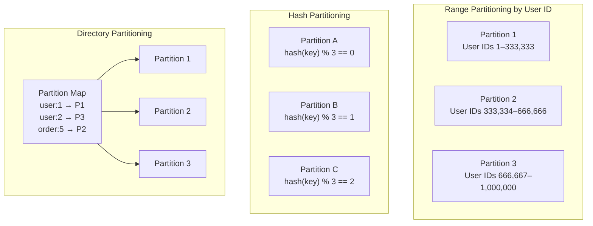
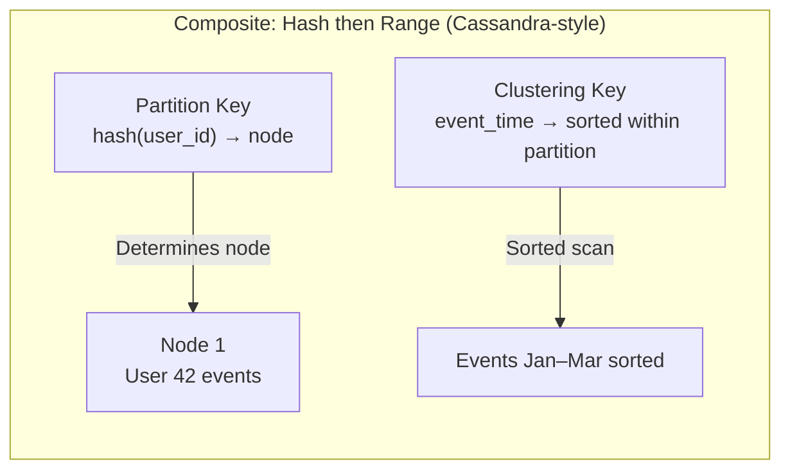

# Partitioning Strategies

## Category
Distributed Systems, Data Management, Scalability

## Context

**Partitioning** (also called **sharding**) is the process of dividing a large dataset into smaller, independent subsets (partitions) that can be distributed across multiple nodes. Each node is responsible for its own partition(s), enabling horizontal scaling of both storage and throughput.

Choosing the right partitioning strategy is critical — a poor strategy leads to **hot spots** (one node receiving disproportionate load), **skewed data distribution**, or expensive cross-partition queries.

**Core strategies**:
1. **Range Partitioning**: Keys are divided into contiguous ranges (e.g., A–F, G–M, N–Z).
2. **Hash Partitioning**: A hash function maps keys to partitions. Distributes evenly but loses range order.
3. **Consistent Hashing**: A specialized hash partitioning that minimizes rebalancing when nodes are added/removed.
4. **Directory-Based Partitioning**: A lookup table (directory) maps each key to its partition. Maximum flexibility, single point of failure risk.
5. **Composite Partitioning**: Combines multiple strategies (e.g., hash then range).
6. **Geographic/Zone Partitioning**: Routes data to specific regions (GDPR, data residency).

---

## Pros

- **Horizontal scalability**: Each partition scales independently.
- **Improved query performance**: Queries only scan relevant partitions.
- **Parallel processing**: Partitions can be processed simultaneously.
- **Failure isolation**: A failed node only affects its own partitions.
- **Resource optimization**: Hot data can be placed on high-performance nodes.

---

## Cons

- **Cross-partition operations**: JOINs and transactions spanning partitions are expensive.
- **Hot spots**: Poor key selection concentrates load on one partition.
- **Rebalancing complexity**: Adding/removing nodes requires data migration.
- **Secondary index complexity**: Global secondary indexes must span all partitions.
- **Schema coupling**: The partitioning key affects query patterns — hard to change later.

---

## Design Diagram





---

## Code Sample

### Partitioning Strategy Implementations (TypeScript)

```typescript
// partitioning/strategies.ts

// --- 1. Range Partitioning ---
export class RangePartitioner {
  constructor(
    private readonly partitions: Array<{ id: string; min: number; max: number; node: string }>
  ) {
    // partitions must be sorted and non-overlapping
  }

  getPartition(key: number): string {
    const partition = this.partitions.find(p => key >= p.min && key <= p.max);
    if (!partition) throw new Error(`No partition for key ${key}`);
    return partition.node;
  }

  // Add a new partition by splitting an existing range
  splitPartition(partitionId: string, splitPoint: number): void {
    const idx = this.partitions.findIndex(p => p.id === partitionId);
    if (idx === -1) throw new Error('Partition not found');

    const original = this.partitions[idx];
    const left = { id: `${partitionId}_L`, min: original.min, max: splitPoint, node: original.node };
    const right = { id: `${partitionId}_R`, min: splitPoint + 1, max: original.max, node: `${original.node}_new` };

    this.partitions.splice(idx, 1, left, right);
    console.log(`Split partition ${partitionId} at ${splitPoint}`);
  }
}

// --- 2. Hash Partitioning ---
export class HashPartitioner {
  constructor(private readonly numPartitions: number) {}

  getPartition(key: string): number {
    let hash = 0;
    for (let i = 0; i < key.length; i++) {
      hash = (hash * 31 + key.charCodeAt(i)) >>> 0;
    }
    return hash % this.numPartitions;
  }

  getNode(key: string, nodes: string[]): string {
    return nodes[this.getPartition(key) % nodes.length];
  }
}

// --- 3. Consistent Hashing (see dedicated doc, condensed here) ---
export class ConsistentHashPartitioner {
  private ring: Array<{ hash: number; nodeId: string }> = [];
  private readonly virtualNodesPerServer: number;

  constructor(virtualNodes = 150) {
    this.virtualNodesPerServer = virtualNodes;
  }

  addNode(nodeId: string): void {
    for (let i = 0; i < this.virtualNodesPerServer; i++) {
      const hash = this.hash(`${nodeId}#${i}`);
      this.ring.push({ hash, nodeId });
    }
    this.ring.sort((a, b) => a.hash - b.hash);
  }

  removeNode(nodeId: string): void {
    this.ring = this.ring.filter(e => e.nodeId !== nodeId);
  }

  getNode(key: string): string {
    const hash = this.hash(key);
    for (const entry of this.ring) {
      if (entry.hash >= hash) return entry.nodeId;
    }
    return this.ring[0].nodeId; // Wrap around
  }

  private hash(key: string): number {
    let h = 0;
    for (let i = 0; i < key.length; i++) h = (h * 31 + key.charCodeAt(i)) >>> 0;
    return h;
  }
}

// --- 4. Directory-Based Partitioning ---
export class DirectoryPartitioner {
  private directory = new Map<string, string>(); // key → partitionId

  constructor(private readonly partitions: string[]) {}

  assign(key: string): string {
    if (!this.directory.has(key)) {
      // Assign to partition with least load (simplified)
      const partitionId = this.partitions[this.directory.size % this.partitions.length];
      this.directory.set(key, partitionId);
    }
    return this.directory.get(key)!;
  }

  reassign(key: string, newPartitionId: string): void {
    this.directory.set(key, newPartitionId);
    // Trigger data migration from old partition to new
  }

  getPartition(key: string): string | undefined {
    return this.directory.get(key);
  }
}

// --- 5. Composite Partitioning (Cassandra-style) ---
export class CompositePartitioner {
  constructor(private readonly hashPartitioner: HashPartitioner) {}

  /**
   * Cassandra uses: hash(partitionKey) → selects node
   * Then within that node, data is sorted by clustering key
   */
  route(partitionKey: string, clusteringKey: string, nodes: string[]): {
    node: string;
    sortKey: string;
  } {
    const node = this.hashPartitioner.getNode(partitionKey, nodes);
    return { node, sortKey: clusteringKey }; // clusteringKey used for local ordering
  }
}

// --- Partition Assignment Rebalancing ---
export class RebalanceManager {
  computeRebalancePlan(
    currentMap: Map<string, string>, // partitionId → nodeId
    newNodes: string[],
    currentNodes: string[]
  ): Array<{ partition: string; from: string; to: string }> {
    const allNodes = [...new Set([...currentNodes, ...newNodes])];
    const moves: Array<{ partition: string; from: string; to: string }> = [];

    let i = 0;
    for (const [partitionId, currentNode] of currentMap.entries()) {
      const targetNode = allNodes[i % allNodes.length];
      if (targetNode !== currentNode) {
        moves.push({ partition: partitionId, from: currentNode, to: targetNode });
      }
      i++;
    }

    console.log(`Rebalance plan: ${moves.length} partition moves required`);
    return moves;
  }
}
```

### Partitioned Data Access Layer

```typescript
// partitioning/partitioned-repository.ts
import { Pool } from 'pg';

export class PartitionedUserRepository {
  private readonly shards: Pool[];

  constructor(connectionStrings: string[]) {
    this.shards = connectionStrings.map(cs => new Pool({ connectionString: cs }));
  }

  private getShardForUser(userId: number): Pool {
    // Hash partitioning: userId mod numShards
    return this.shards[userId % this.shards.length];
  }

  async getUserById(userId: number): Promise<Record<string, unknown> | null> {
    const shard = this.getShardForUser(userId);
    const result = await shard.query('SELECT * FROM users WHERE id = $1', [userId]);
    return result.rows[0] ?? null;
  }

  async createUser(user: { id: number; name: string; email: string }): Promise<void> {
    const shard = this.getShardForUser(user.id);
    await shard.query(
      'INSERT INTO users (id, name, email) VALUES ($1, $2, $3)',
      [user.id, user.name, user.email]
    );
  }

  // Fan-out query across all shards (for cross-partition operations)
  async findUsersByEmail(emailDomain: string): Promise<Array<Record<string, unknown>>> {
    const results = await Promise.all(
      this.shards.map(shard =>
        shard.query('SELECT * FROM users WHERE email LIKE $1', [`%@${emailDomain}`])
      )
    );
    return results.flatMap(r => r.rows);
  }
}
```
