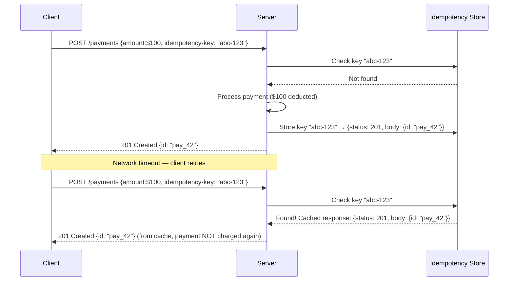

# Idempotency Pattern

## Category
Distributed Systems, Reliability, API Design, Messaging

## Context

**Idempotency** means an operation can be executed multiple times and always produces the same result as if it were executed exactly once. In distributed systems, network failures, timeouts, and retries make it impossible to guarantee exactly-once delivery at the transport layer — so the application layer must be designed to tolerate duplicates safely.

**When idempotency is needed**:
- Client retries after a timeout (was the request received? Did it process?)
- Message broker duplicates (at-least-once delivery guarantees)
- Distributed saga compensations
- Payment processing, order creation, inventory deductions

**Implementation approaches**:
1. **Idempotency Keys**: Client generates a unique request ID; server stores processed IDs and returns cached responses for duplicates.
2. **Conditional Updates**: Use database-level constraints (`INSERT ... ON CONFLICT DO NOTHING`).
3. **Natural Idempotency**: GET, PUT, DELETE in REST are naturally idempotent; POST is not.
4. **Deduplication Windows**: Store keys with TTL — reject duplicates within a time window.

---

## Pros

- **Safe retries**: Clients can retry any failed request without fear of side effects.
- **At-least-once becomes effectively exactly-once**: Lower-layer guarantees are upgraded.
- **Simpler retry logic**: No need for complex "did this succeed?" checks.
- **Resilience to network failures**: Tolerate dropped acknowledgments gracefully.
- **Compatible with sagas**: Saga steps can be retried independently.

---

## Cons

- **Storage overhead**: Must persist processed idempotency keys (memory or database).
- **TTL management**: Short TTL = missed duplicates; long TTL = excessive storage.
- **Key generation**: Client must generate sufficiently unique keys (UUID v4 is standard).
- **Partial processing**: If a request partially processes before failure, rollback or completion logic is complex.
- **Cache invalidation**: Stored responses may become stale in some edge cases.

---

## Design Diagram



---

## Code Sample

### Idempotency Key Middleware (Express + Redis)

```typescript
// idempotency/idempotency-middleware.ts
import { Request, Response, NextFunction } from 'express';
import { createClient } from 'redis';

const redis = createClient({ url: process.env.REDIS_URL });
await redis.connect();

const IDEMPOTENCY_TTL_SECONDS = 86400; // 24 hours

interface CachedResponse {
  statusCode: number;
  body: unknown;
  headers: Record<string, string>;
}

export async function idempotencyMiddleware(
  req: Request,
  res: Response,
  next: NextFunction
): Promise<void> {
  // Only apply to non-idempotent methods
  if (['GET', 'HEAD', 'OPTIONS', 'PUT', 'DELETE'].includes(req.method)) {
    return next();
  }

  const idempotencyKey = req.headers['idempotency-key'];

  if (!idempotencyKey || typeof idempotencyKey !== 'string') {
    res.status(400).json({
      error: 'Idempotency-Key header is required for POST/PATCH requests',
    });
    return;
  }

  // Validate key format (UUIDv4)
  const uuidPattern = /^[0-9a-f]{8}-[0-9a-f]{4}-4[0-9a-f]{3}-[89ab][0-9a-f]{3}-[0-9a-f]{12}$/i;
  if (!uuidPattern.test(idempotencyKey)) {
    res.status(400).json({ error: 'Idempotency-Key must be a valid UUID v4' });
    return;
  }

  const redisKey = `idempotency:${req.path}:${idempotencyKey}`;

  // Acquire distributed lock to prevent concurrent duplicate processing
  const lockKey = `idempotency:lock:${redisKey}`;
  const lockAcquired = await redis.set(lockKey, '1', { NX: true, EX: 10 });

  if (!lockAcquired) {
    // Another instance is processing this key right now
    res.status(409).json({ error: 'Request with this Idempotency-Key is being processed' });
    return;
  }

  try {
    // Check for existing cached response
    const cached = await redis.get(redisKey);

    if (cached) {
      const { statusCode, body, headers }: CachedResponse = JSON.parse(cached);
      res.set(headers).set('Idempotent-Replayed', 'true').status(statusCode).json(body);
      return;
    }

    // Intercept the response
    const originalJson = res.json.bind(res);
    res.json = (body: unknown) => {
      const responseToCache: CachedResponse = {
        statusCode: res.statusCode,
        body,
        headers: {
          'content-type': res.getHeader('content-type') as string ?? 'application/json',
        },
      };

      // Cache the response asynchronously
      redis.set(redisKey, JSON.stringify(responseToCache), { EX: IDEMPOTENCY_TTL_SECONDS })
        .catch(err => console.error('Failed to cache idempotency response:', err));

      return originalJson(body);
    };

    next();
  } finally {
    await redis.del(lockKey);
  }
}
```

### Idempotent Payment Service

```typescript
// idempotency/payment-service.ts
import { v4 as uuidv4 } from 'uuid';
import { Pool } from 'pg';

const db = new Pool({ connectionString: process.env.DATABASE_URL });

interface PaymentRequest {
  idempotencyKey: string;
  fromAccountId: string;
  toAccountId: string;
  amount: number;
  currency: string;
}

interface Payment {
  id: string;
  fromAccountId: string;
  toAccountId: string;
  amount: number;
  currency: string;
  createdAt: Date;
}

export class IdempotentPaymentService {
  async processPayment(request: PaymentRequest): Promise<Payment> {
    const client = await db.connect();

    try {
      await client.query('BEGIN');

      // Check if this idempotency key was already processed
      const existing = await client.query<Payment>(
        'SELECT * FROM payments WHERE idempotency_key = $1',
        [request.idempotencyKey]
      );

      if (existing.rows.length > 0) {
        await client.query('ROLLBACK');
        console.log(`Duplicate request detected for key ${request.idempotencyKey} — returning cached result`);
        return existing.rows[0];
      }

      // Validate sufficient funds
      const account = await client.query(
        'SELECT balance FROM accounts WHERE id = $1 FOR UPDATE',
        [request.fromAccountId]
      );

      if (!account.rows.length || account.rows[0].balance < request.amount) {
        await client.query('ROLLBACK');
        throw new Error('Insufficient funds');
      }

      const paymentId = uuidv4();

      // Deduct from source
      await client.query(
        'UPDATE accounts SET balance = balance - $1 WHERE id = $2',
        [request.amount, request.fromAccountId]
      );

      // Credit to destination
      await client.query(
        'UPDATE accounts SET balance = balance + $1 WHERE id = $2',
        [request.amount, request.toAccountId]
      );

      // Record payment with idempotency key
      const result = await client.query<Payment>(
        `INSERT INTO payments (id, idempotency_key, from_account_id, to_account_id, amount, currency)
         VALUES ($1, $2, $3, $4, $5, $6)
         RETURNING *`,
        [paymentId, request.idempotencyKey, request.fromAccountId, request.toAccountId, request.amount, request.currency]
      );

      await client.query('COMMIT');
      return result.rows[0];
    } catch (err) {
      await client.query('ROLLBACK');
      throw err;
    } finally {
      client.release();
    }
  }
}

// --- Idempotent Message Consumer ---
export class IdempotentMessageConsumer {
  private readonly processedIds = new Set<string>(); // In production: use Redis or DB

  async process(messageId: string, payload: unknown, handler: (payload: unknown) => Promise<void>): Promise<void> {
    if (this.processedIds.has(messageId)) {
      console.log(`Skipping duplicate message: ${messageId}`);
      return;
    }

    await handler(payload);
    this.processedIds.add(messageId);
  }
}
```

### PostgreSQL Schema for Idempotency

```sql
-- Idempotency keys table
CREATE TABLE idempotency_keys (
    key             TEXT PRIMARY KEY,
    endpoint        TEXT NOT NULL,
    response_status INTEGER NOT NULL,
    response_body   JSONB NOT NULL,
    created_at      TIMESTAMPTZ DEFAULT NOW(),
    expires_at      TIMESTAMPTZ DEFAULT NOW() + INTERVAL '24 hours'
);

-- Cleanup expired keys (run via cron or pg_cron)
DELETE FROM idempotency_keys WHERE expires_at < NOW();

-- Payments table with idempotency
CREATE TABLE payments (
    id               UUID PRIMARY KEY DEFAULT gen_random_uuid(),
    idempotency_key  TEXT UNIQUE NOT NULL,
    from_account_id  UUID NOT NULL,
    to_account_id    UUID NOT NULL,
    amount           NUMERIC(15, 2) NOT NULL,
    currency         CHAR(3) NOT NULL,
    created_at       TIMESTAMPTZ DEFAULT NOW()
);

CREATE UNIQUE INDEX payments_idempotency_key_idx ON payments (idempotency_key);
```
