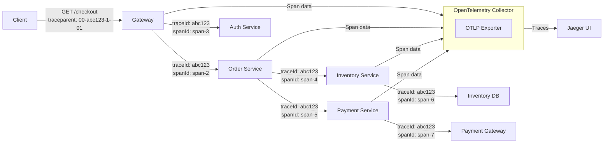

# Distributed Tracing

## Category
Distributed Systems, Observability, Monitoring, Debugging

## Context

In a microservices architecture, a single user request may traverse dozens of services. When something goes wrong — a slow response, an error, or unexpected behavior — it's extremely difficult to identify the root cause from individual service logs alone.

**Distributed Tracing** solves this by propagating a unique **trace context** (trace ID + span ID) through every service, recording timing, metadata, and relationships between operations. The result is a complete visualization of a request's journey across the system.

**Core concepts**:
- **Trace**: A complete end-to-end request lifecycle, identified by a trace ID.
- **Span**: A single operation within a trace (e.g., HTTP call, DB query). Spans form a parent-child hierarchy.
- **Context Propagation**: The trace ID is passed via HTTP headers (`traceparent`, `X-B3-TraceId`) or message metadata.
- **Baggage**: Key-value pairs carried alongside the trace for downstream correlation.

**Standards & Tools**:
- **OpenTelemetry (OTel)**: Vendor-neutral SDK and specification (the recommended standard).
- **Jaeger**: Open-source distributed tracing backend (CNCF project).
- **Zipkin**: Lightweight tracing backend.
- **AWS X-Ray, Datadog APM, Dynatrace**: Commercial implementations.

---

## Pros

- **Root cause identification**: Pinpoint which service or operation caused a slowdown.
- **Performance analysis**: Visualize latency contributions from each service.
- **Request flow visualization**: See the complete call graph for any request.
- **Anomaly detection**: Identify unexpected service calls or dependency changes.
- **Cross-team visibility**: Each team sees how their service fits in the larger picture.

---

## Cons

- **Performance overhead**: Sampling and exporting trace data adds latency and CPU cost.
- **Instrumentation effort**: All services, SDKs, and libraries must be instrumented.
- **Data volume**: High-traffic systems generate enormous trace data — requires aggressive sampling.
- **Context propagation**: Message queues, async tasks, and background jobs break trace propagation without explicit handling.
- **Storage costs**: Full trace retention is expensive — sampling strategies are essential.

---

## Design Diagram



```mermaid
gantt
    title Trace Timeline (abc123) — 450ms total
    dateFormat SSS
    axisFormat %Lms

    section Gateway
    Auth check         :000, 50ms
    Route to Order Svc :050, 10ms

    section Order Service
    Validate order     :060, 20ms
    Call Inventory     :080, 100ms
    Call Payment       :200, 200ms

    section Inventory Service
    DB query           :090, 80ms

    section Payment Service
    External gateway   :210, 180ms
```

---

## Code Sample

### OpenTelemetry Setup (TypeScript / Node.js)

```typescript
// tracing/setup.ts — must be the FIRST import in your application
import { NodeSDK } from '@opentelemetry/sdk-node';
import { OTLPTraceExporter } from '@opentelemetry/exporter-trace-otlp-http';
import { Resource } from '@opentelemetry/resources';
import { SemanticResourceAttributes } from '@opentelemetry/semantic-conventions';
import { SimpleSpanProcessor } from '@opentelemetry/sdk-trace-base';
import { getNodeAutoInstrumentations } from '@opentelemetry/auto-instrumentations-node';

const exporter = new OTLPTraceExporter({
  url: process.env.OTEL_EXPORTER_OTLP_ENDPOINT ?? 'http://jaeger:4318/v1/traces',
});

const sdk = new NodeSDK({
  resource: new Resource({
    [SemanticResourceAttributes.SERVICE_NAME]: process.env.SERVICE_NAME ?? 'unknown-service',
    [SemanticResourceAttributes.SERVICE_VERSION]: process.env.SERVICE_VERSION ?? '1.0.0',
    [SemanticResourceAttributes.DEPLOYMENT_ENVIRONMENT]: process.env.NODE_ENV ?? 'development',
  }),
  spanProcessor: new SimpleSpanProcessor(exporter),
  instrumentations: [
    getNodeAutoInstrumentations({
      // Auto-instruments: http, express, pg, redis, grpc, kafka, etc.
      '@opentelemetry/instrumentation-fs': { enabled: false }, // Skip filesystem noise
    }),
  ],
});

sdk.start();
console.log('OpenTelemetry tracing initialized');

process.on('SIGTERM', () => {
  sdk.shutdown().then(() => process.exit(0));
});
```

### Custom Span Instrumentation

```typescript
// tracing/order-service.ts
import { trace, context, SpanStatusCode, SpanKind, Attributes } from '@opentelemetry/api';

const tracer = trace.getTracer('order-service', '1.0.0');

interface Order {
  id: string;
  userId: string;
  items: Array<{ productId: string; quantity: number; price: number }>;
}

export class OrderService {
  async createOrder(orderData: Omit<Order, 'id'>): Promise<Order> {
    return tracer.startActiveSpan('order.create', async (span) => {
      span.setAttributes({
        'order.user_id': orderData.userId,
        'order.item_count': orderData.items.length,
        'order.total': orderData.items.reduce((sum, i) => sum + i.price * i.quantity, 0),
      });

      try {
        // Each sub-operation creates a child span automatically (auto-instrumentation)
        const [inventoryOk, payment] = await Promise.all([
          this.checkInventory(orderData.items),
          this.processPayment(orderData.userId, orderData.items),
        ]);

        if (!inventoryOk) {
          span.setStatus({ code: SpanStatusCode.ERROR, message: 'Insufficient inventory' });
          throw new Error('Insufficient inventory for one or more items');
        }

        const order: Order = {
          id: crypto.randomUUID(),
          ...orderData,
        };

        span.setAttributes({ 'order.id': order.id, 'payment.id': payment.id });
        span.setStatus({ code: SpanStatusCode.OK });
        return order;
      } catch (err) {
        span.recordException(err as Error);
        span.setStatus({ code: SpanStatusCode.ERROR });
        throw err;
      } finally {
        span.end();
      }
    });
  }

  private async checkInventory(items: Order['items']): Promise<boolean> {
    return tracer.startActiveSpan('inventory.check', { kind: SpanKind.CLIENT }, async (span) => {
      span.setAttributes({ 'inventory.items_checked': items.length });
      try {
        // Actual inventory check (HTTP call auto-instrumented)
        await new Promise(res => setTimeout(res, 50)); // Simulated
        span.setStatus({ code: SpanStatusCode.OK });
        return true;
      } finally {
        span.end();
      }
    });
  }

  private async processPayment(userId: string, items: Order['items']): Promise<{ id: string }> {
    return tracer.startActiveSpan('payment.process', { kind: SpanKind.CLIENT }, async (span) => {
      const total = items.reduce((s, i) => s + i.price * i.quantity, 0);
      span.setAttributes({ 'payment.user_id': userId, 'payment.amount': total });
      try {
        await new Promise(res => setTimeout(res, 120)); // Simulated
        const paymentId = crypto.randomUUID();
        span.setAttributes({ 'payment.id': paymentId });
        span.setStatus({ code: SpanStatusCode.OK });
        return { id: paymentId };
      } finally {
        span.end();
      }
    });
  }
}

// --- Trace Context Propagation through Kafka ---
import { propagation, context as otelContext } from '@opentelemetry/api';

export async function publishWithTraceContext(
  producer: { send(msg: object): Promise<void> },
  topic: string,
  payload: unknown
): Promise<void> {
  // Inject current trace context into message headers
  const headers: Record<string, string> = {};
  propagation.inject(otelContext.active(), headers);

  await producer.send({
    topic,
    messages: [{ value: JSON.stringify(payload), headers }],
  });
}

export async function consumeWithTraceContext(
  headers: Record<string, string>,
  handler: () => Promise<void>
): Promise<void> {
  // Extract trace context from message headers and restore it
  const extractedContext = propagation.extract(otelContext.active(), headers);

  await otelContext.with(extractedContext, async () => {
    return tracer.startActiveSpan('kafka.message.process', async (span) => {
      try {
        await handler();
        span.setStatus({ code: SpanStatusCode.OK });
      } catch (err) {
        span.recordException(err as Error);
        span.setStatus({ code: SpanStatusCode.ERROR });
        throw err;
      } finally {
        span.end();
      }
    });
  });
}
```

### Docker Compose: Jaeger + OpenTelemetry Collector

```yaml
# docker-compose.tracing.yml
version: '3.8'

services:
  jaeger:
    image: jaegertracing/all-in-one:1.54
    ports:
      - "16686:16686"  # Jaeger UI
      - "14268:14268"  # HTTP collector (legacy)
      - "4317:4317"    # OTLP gRPC
      - "4318:4318"    # OTLP HTTP
    environment:
      COLLECTOR_OTLP_ENABLED: "true"

  otel-collector:
    image: otel/opentelemetry-collector-contrib:0.92.0
    command: ["--config=/etc/otel-config.yaml"]
    volumes:
      - ./otel-config.yaml:/etc/otel-config.yaml
    ports:
      - "4319:4318"  # OTLP HTTP (for apps)
    depends_on:
      - jaeger
```

```yaml
# otel-config.yaml
receivers:
  otlp:
    protocols:
      http:
        endpoint: 0.0.0.0:4318
      grpc:
        endpoint: 0.0.0.0:4317

processors:
  batch:
    timeout: 1s
    send_batch_size: 1024
  # Tail sampling: only keep traces with errors or slow spans
  tail_sampling:
    decision_wait: 10s
    policies:
      - name: errors-policy
        type: status_code
        status_code: { status_codes: [ERROR] }
      - name: slow-traces
        type: latency
        latency: { threshold_ms: 500 }
      - name: probabilistic-10pct
        type: probabilistic
        probabilistic: { sampling_percentage: 10 }

exporters:
  otlp/jaeger:
    endpoint: jaeger:4317
    tls:
      insecure: true

service:
  pipelines:
    traces:
      receivers: [otlp]
      processors: [batch, tail_sampling]
      exporters: [otlp/jaeger]
```
