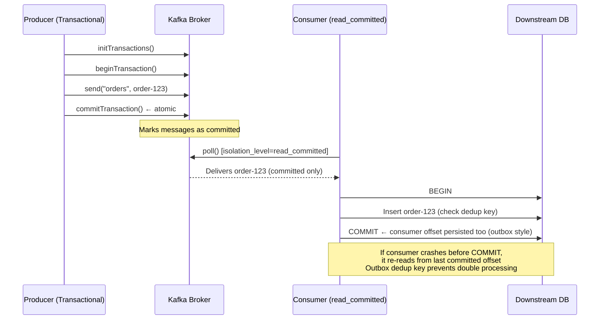

# Exactly-Once Delivery

## Category
Distributed Systems, Messaging, Reliability, Data Integrity

## Context

Message delivery semantics in distributed systems come in three levels:

| Guarantee | Description | Risk |
|-----------|-------------|------|
| **At-most-once** | Message is sent once; may be lost | Data loss |
| **At-least-once** | Message is retried until acknowledged; may be received multiple times | Duplicate processing |
| **Exactly-once** | Message is delivered and processed precisely one time | Complex, high cost |

True exactly-once is built from two components:
1. **Idempotent Producers**: The broker deduplicates messages from the same producer within a sequence window. (Kafka `enable.idempotence=true`)
2. **Transactional Messaging**: Write to the message topic and commit the consumer offset atomically, within the same transaction. (Kafka transactions, AMQP transactions)

**Kafka's exactly-once semantics (EOS)**: Uses producer sequence numbers + broker deduplication + `read_committed` consumer isolation + atomic offset commits within a Kafka transaction.

**Database-level EOS**: The outbox pattern combined with idempotent consumers reuses database ACID transactions to achieve exactly-once end-to-end.

---

## Pros

- **Data integrity**: No duplicate orders, payments, or notifications.
- **No deduplication logic in consumers**: The broker handles it transparently.
- **Simplified error handling**: Retries are safe by design.
- **Auditability**: Each event is represented exactly once in downstream systems.
- **Stream processing correctness**: Aggregations and stateful computations are accurate.

---

## Cons

- **High overhead**: Transactions, sequence tracking, and deduplication add latency (2–5x vs. at-least-once).
- **Broker support required**: Kafka EOS requires version ≥ 0.11; not all brokers support it.
- **Client library support**: Must use transactional producer API correctly.
- **No cross-system EOS**: Kafka EOS only works within Kafka — writing to a DB in the same transaction requires the outbox pattern.
- **Zombie producer risk**: Old producer instances must be fenced with epoch numbers.

---

## Design Diagram



---

## Code Sample

### Kafka Exactly-Once Producer (Node.js / KafkaJS)

```typescript
// exactly-once/transactional-producer.ts
import { Kafka, Producer, CompressionTypes } from 'kafkajs';

const kafka = new Kafka({
  brokers: ['kafka:9092'],
  clientId: 'payment-producer',
});

export class ExactlyOnceProducer {
  private producer: Producer;
  private transactionId: string;

  constructor(transactionId: string) {
    this.transactionId = transactionId;
    this.producer = kafka.producer({
      // Enable idempotent producer (guarantees dedup at broker level)
      idempotent: true,
      // Transactional ID — must be unique per producer instance
      transactionalId: transactionId,
      // Required for transactions
      maxInFlightRequests: 1,
    });
  }

  async connect(): Promise<void> {
    await this.producer.connect();
  }

  async sendExactlyOnce(
    topic: string,
    messages: Array<{ key: string; value: string; headers?: Record<string, string> }>
  ): Promise<void> {
    const transaction = await this.producer.transaction();

    try {
      await transaction.send({
        topic,
        compression: CompressionTypes.Snappy,
        messages: messages.map(m => ({
          key: m.key,
          value: m.value,
          headers: m.headers ?? {},
        })),
      });

      await transaction.commit();
      console.log(`[${this.transactionId}] Transaction committed for ${messages.length} messages`);
    } catch (err) {
      await transaction.abort();
      console.error(`[${this.transactionId}] Transaction aborted:`, err);
      throw err;
    }
  }

  async disconnect(): Promise<void> {
    await this.producer.disconnect();
  }
}
```

### Kafka Exactly-Once Consumer (read_committed + DB deduplication)

```typescript
// exactly-once/transactional-consumer.ts
import { Kafka, EachMessagePayload } from 'kafkajs';
import { Pool } from 'pg';

const kafka = new Kafka({ brokers: ['kafka:9092'], clientId: 'order-consumer' });
const db = new Pool({ connectionString: process.env.DATABASE_URL });

const consumer = kafka.consumer({
  groupId: 'order-processor',
  readUncommitted: false, // Only read committed messages (EOS consumer isolation)
});

export async function startExactlyOnceConsumer(): Promise<void> {
  await consumer.connect();
  await consumer.subscribe({ topic: 'orders', fromBeginning: false });

  await consumer.run({
    eachMessage: async ({ topic, partition, message }: EachMessagePayload) => {
      const messageId = `${topic}:${partition}:${message.offset}`;
      const payload = JSON.parse(message.value!.toString());

      await processExactlyOnce(messageId, payload);
    },
  });
}

async function processExactlyOnce(messageId: string, payload: Record<string, unknown>): Promise<void> {
  const client = await db.connect();

  try {
    await client.query('BEGIN');

    // Deduplication check — if already processed, skip
    const exists = await client.query(
      'SELECT 1 FROM processed_messages WHERE message_id = $1',
      [messageId]
    );

    if (exists.rows.length > 0) {
      await client.query('ROLLBACK');
      console.log(`Skipping duplicate message: ${messageId}`);
      return;
    }

    // Process the message (business logic)
    await client.query(
      'INSERT INTO orders (id, data, created_at) VALUES ($1, $2, NOW())',
      [payload.orderId, JSON.stringify(payload)]
    );

    // Record that this message was processed (atomic with business logic)
    await client.query(
      'INSERT INTO processed_messages (message_id, processed_at) VALUES ($1, NOW())',
      [messageId]
    );

    await client.query('COMMIT');
    console.log(`Exactly-once processed: ${messageId}`);
  } catch (err) {
    await client.query('ROLLBACK');
    throw err; // Will trigger Kafka retry
  } finally {
    client.release();
  }
}
```

### Transactional Outbox + Exactly-Once (Combined Pattern)

```typescript
// exactly-once/transactional-outbox-eos.ts
import { Pool } from 'pg';
import { ExactlyOnceProducer } from './transactional-producer';

const db = new Pool({ connectionString: process.env.DATABASE_URL });
const producer = new ExactlyOnceProducer('order-service-producer');

interface Order {
  id: string;
  userId: string;
  total: number;
}

/**
 * Creates an order and records the Kafka message in the outbox — atomically.
 * A relay process reads the outbox and publishes to Kafka.
 */
export async function createOrderWithOutbox(order: Order): Promise<void> {
  const client = await db.connect();

  try {
    await client.query('BEGIN');

    // 1. Create order
    await client.query(
      'INSERT INTO orders (id, user_id, total) VALUES ($1, $2, $3)',
      [order.id, order.userId, order.total]
    );

    // 2. Write event to outbox (same transaction)
    await client.query(
      `INSERT INTO outbox_messages (id, topic, message_key, payload, created_at)
       VALUES (gen_random_uuid(), 'orders', $1, $2, NOW())`,
      [order.id, JSON.stringify({ event: 'ORDER_CREATED', ...order })]
    );

    await client.query('COMMIT');
  } catch (err) {
    await client.query('ROLLBACK');
    throw err;
  } finally {
    client.release();
  }
}

/** Outbox relay: polls DB and publishes to Kafka with exactly-once semantics */
export async function relayOutboxMessages(): Promise<void> {
  const client = await db.connect();

  try {
    const rows = await client.query(
      'SELECT * FROM outbox_messages WHERE published = false ORDER BY created_at LIMIT 100 FOR UPDATE SKIP LOCKED'
    );

    if (rows.rows.length === 0) return;

    // Publish to Kafka transactionally
    await producer.sendExactlyOnce(
      rows.rows[0].topic,
      rows.rows.map(row => ({
        key: row.message_key,
        value: row.payload,
        headers: { 'outbox-id': row.id },
      }))
    );

    // Mark as published
    const ids = rows.rows.map(r => r.id);
    await client.query(
      'UPDATE outbox_messages SET published = true, published_at = NOW() WHERE id = ANY($1)',
      [ids]
    );
  } finally {
    client.release();
  }
}
```

### Kafka Broker Configuration for EOS

```yaml
# Kafka topic configuration for exactly-once
# server.properties
enable.idempotence=true
transactional.id.expiration.ms=604800000  # 7 days
transaction.max.timeout.ms=900000          # 15 minutes
min.insync.replicas=2                      # Requires 2/3 replicas to ack

# Consumer configuration
isolation.level=read_committed             # Don't read uncommitted messages
enable.auto.commit=false                   # Manual offset management
```
