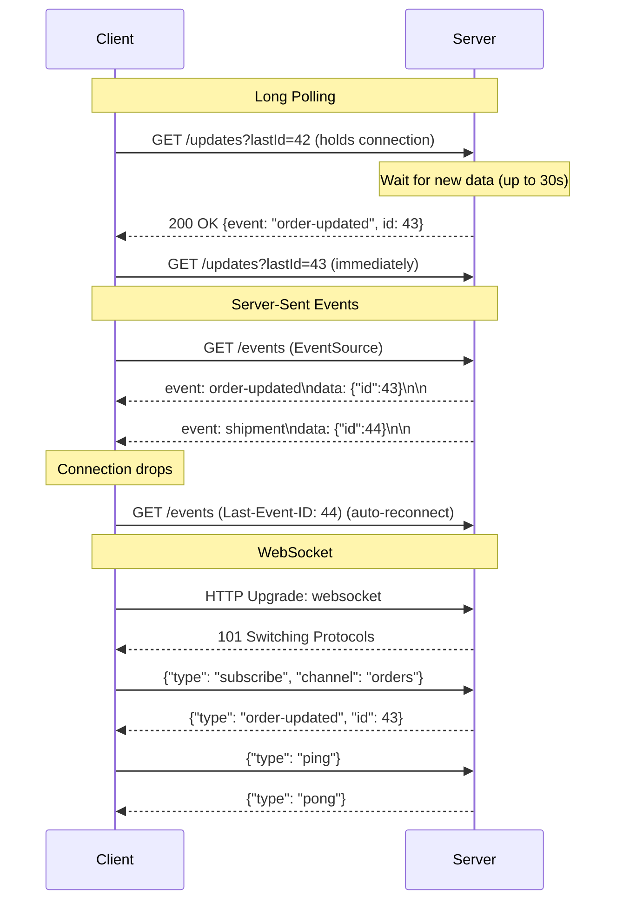

# Long Polling, SSE & WebSockets

## Category
Distributed Systems, Real-Time Communication, API Design

## Context

Traditional HTTP follows a request-response model — the client asks, the server responds, and the connection closes. This is inefficient for real-time scenarios where the server needs to **push updates** to the client (chat messages, live dashboards, notifications, collaborative editing).

Three patterns address this, each with different tradeoffs:

| Pattern | Protocol | Direction | Connection | Best For |
|---------|----------|-----------|------------|---------|
| **Long Polling** | HTTP | Server → Client (pull) | Short-lived, repeated | Simple notifications, legacy clients |
| **Server-Sent Events (SSE)** | HTTP/1.1+ | Server → Client only | Persistent, one-way | Live feeds, dashboards, progress |
| **WebSockets** | WS/WSS | Bidirectional | Persistent, full-duplex | Chat, gaming, collaborative editing |

**Long Polling**: Client sends a request; server holds it open until data is available (or timeout), then responds. Client immediately sends the next request.

**SSE**: Client opens a single HTTP connection; server sends a stream of `text/event-stream` formatted events. Built-in reconnection.

**WebSocket**: Full-duplex TCP connection upgraded from HTTP. Both client and server can send messages at any time.

---

## Pros

### Long Polling
- Works everywhere (plain HTTP, proxies, firewalls).
- Simple server implementation (standard HTTP handlers).
- No special protocol support needed.

### SSE
- Native browser support (`EventSource` API).
- Automatic reconnection with `Last-Event-ID`.
- Works over HTTP/2 (multiplexed, no connection limit).
- Simple text-based protocol, easy to debug.

### WebSockets
- True bidirectional communication.
- Lowest latency (no HTTP overhead per message).
- Ideal for high-frequency bidirectional data.
- Binary frame support.

---

## Cons

### Long Polling
- High server resource usage (many open connections).
- Latency spikes during long requests under load.
- Not suitable for high-frequency updates.

### SSE
- Server → Client only (no client-to-server push).
- Browser connection limit (6 per origin in HTTP/1.1, solved by HTTP/2).
- Not supported in Internet Explorer.

### WebSockets
- Requires stateful connections — harder to load balance.
- Doesn't work through all HTTP proxies.
- No built-in reconnection — must implement yourself.
- Firewall/proxy issues can block upgrades.

---

## Design Diagram



---

## Code Sample

### 1. Long Polling (Express + TypeScript)

```typescript
// realtime/long-polling.ts
import express from 'express';
import { EventEmitter } from 'events';

const app = express();
const eventBus = new EventEmitter();

interface Event {
  id: number;
  type: string;
  data: unknown;
  timestamp: Date;
}

let eventStore: Event[] = [];
let eventIdCounter = 0;

// Publish events (called by other services/endpoints)
export function publishEvent(type: string, data: unknown): void {
  const event: Event = { id: ++eventIdCounter, type, data, timestamp: new Date() };
  eventStore.push(event);
  eventBus.emit('new-event', event);
}

// Long polling endpoint
app.get('/api/updates', async (req, res) => {
  const lastId = parseInt(req.query.lastId as string ?? '0', 10);
  const timeout = parseInt(req.query.timeout as string ?? '30000', 10);

  // Check for immediately available events
  const newEvents = eventStore.filter(e => e.id > lastId);
  if (newEvents.length > 0) {
    res.json({ events: newEvents });
    return;
  }

  // Wait for new events (hold connection open)
  const timer = setTimeout(() => {
    res.json({ events: [] }); // Timeout — client should retry
    cleanup();
  }, Math.min(timeout, 60000)); // Max 60s

  const listener = (event: Event) => {
    if (event.id > lastId) {
      res.json({ events: eventStore.filter(e => e.id > lastId) });
      cleanup();
    }
  };

  function cleanup() {
    clearTimeout(timer);
    eventBus.removeListener('new-event', listener);
  }

  req.on('close', cleanup); // Client disconnected
  eventBus.on('new-event', listener);
});
```

### 2. Server-Sent Events (Express)

```typescript
// realtime/sse.ts
import express from 'express';
import { EventEmitter } from 'events';

const app = express();
const hub = new EventEmitter();

// SSE endpoint
app.get('/api/stream', (req, res) => {
  const userId = req.query.userId as string;
  const lastEventId = req.headers['last-event-id'] ?? '0';

  // SSE headers
  res.set({
    'Content-Type': 'text/event-stream',
    'Cache-Control': 'no-cache',
    'Connection': 'keep-alive',
    'X-Accel-Buffering': 'no', // Disable Nginx buffering
  });
  res.flushHeaders();

  // Replay missed events since last-event-id
  const missed = getMissedEvents(Number(lastEventId));
  for (const event of missed) {
    sendSSEEvent(res, event.type, event.data, String(event.id));
  }

  // Send heartbeat every 15s to keep connection alive
  const heartbeat = setInterval(() => {
    res.write(': heartbeat\n\n');
  }, 15000);

  // Subscribe to new events
  const listener = (event: { type: string; data: unknown; id: number; userId?: string }) => {
    if (!event.userId || event.userId === userId) {
      sendSSEEvent(res, event.type, event.data, String(event.id));
    }
  };

  hub.on('event', listener);

  req.on('close', () => {
    clearInterval(heartbeat);
    hub.removeListener('event', listener);
    console.log(`SSE connection closed for user ${userId}`);
  });
});

function sendSSEEvent(res: express.Response, type: string, data: unknown, id?: string): void {
  if (id) res.write(`id: ${id}\n`);
  res.write(`event: ${type}\n`);
  res.write(`data: ${JSON.stringify(data)}\n\n`);
}

function getMissedEvents(sinceId: number): Array<{ id: number; type: string; data: unknown }> {
  // Retrieve from in-memory store or Redis
  return [];
}

// SSE Client (browser)
// const eventSource = new EventSource('/api/stream?userId=42');
// eventSource.addEventListener('order-updated', (e) => console.log(JSON.parse(e.data)));
// eventSource.addEventListener('error', () => eventSource.close());
```

### 3. WebSocket Server (ws library)

```typescript
// realtime/websocket-server.ts
import { WebSocketServer, WebSocket } from 'ws';
import { createServer } from 'http';

interface ClientConnection {
  id: string;
  ws: WebSocket;
  userId?: string;
  subscriptions: Set<string>;
}

const clients = new Map<string, ClientConnection>();

export function createWebSocketServer(httpServer: ReturnType<typeof createServer>): void {
  const wss = new WebSocketServer({ server: httpServer, path: '/ws' });

  wss.on('connection', (ws, req) => {
    const clientId = crypto.randomUUID();
    const client: ClientConnection = { id: clientId, ws, subscriptions: new Set() };
    clients.set(clientId, client);

    console.log(`WebSocket client connected: ${clientId}`);

    // Ping/pong heartbeat — detect dead connections
    (ws as WebSocket & { isAlive: boolean }).isAlive = true;
    ws.on('pong', () => { (ws as WebSocket & { isAlive: boolean }).isAlive = true; });

    ws.on('message', (data) => {
      try {
        const message = JSON.parse(data.toString());
        handleClientMessage(client, message);
      } catch {
        ws.send(JSON.stringify({ type: 'error', message: 'Invalid JSON' }));
      }
    });

    ws.on('close', () => {
      clients.delete(clientId);
      console.log(`WebSocket client disconnected: ${clientId}`);
    });

    ws.send(JSON.stringify({ type: 'connected', clientId }));
  });

  // Keepalive check every 30s
  const pingInterval = setInterval(() => {
    wss.clients.forEach((ws) => {
      const wsWithAlive = ws as WebSocket & { isAlive: boolean };
      if (!wsWithAlive.isAlive) {
        ws.terminate();
        return;
      }
      wsWithAlive.isAlive = false;
      ws.ping();
    });
  }, 30000);

  wss.on('close', () => clearInterval(pingInterval));
}

function handleClientMessage(client: ClientConnection, message: Record<string, unknown>): void {
  switch (message.type) {
    case 'authenticate':
      client.userId = message.userId as string;
      client.ws.send(JSON.stringify({ type: 'authenticated', userId: client.userId }));
      break;

    case 'subscribe':
      client.subscriptions.add(message.channel as string);
      break;

    case 'unsubscribe':
      client.subscriptions.delete(message.channel as string);
      break;

    case 'ping':
      client.ws.send(JSON.stringify({ type: 'pong' }));
      break;
  }
}

/** Broadcast message to all subscribers of a channel */
export function broadcast(channel: string, data: unknown): void {
  const message = JSON.stringify({ type: 'message', channel, data });
  for (const client of clients.values()) {
    if (client.subscriptions.has(channel) && client.ws.readyState === WebSocket.OPEN) {
      client.ws.send(message);
    }
  }
}
```
