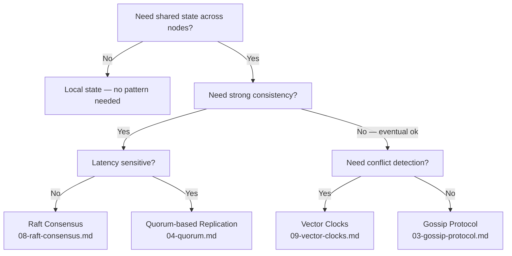
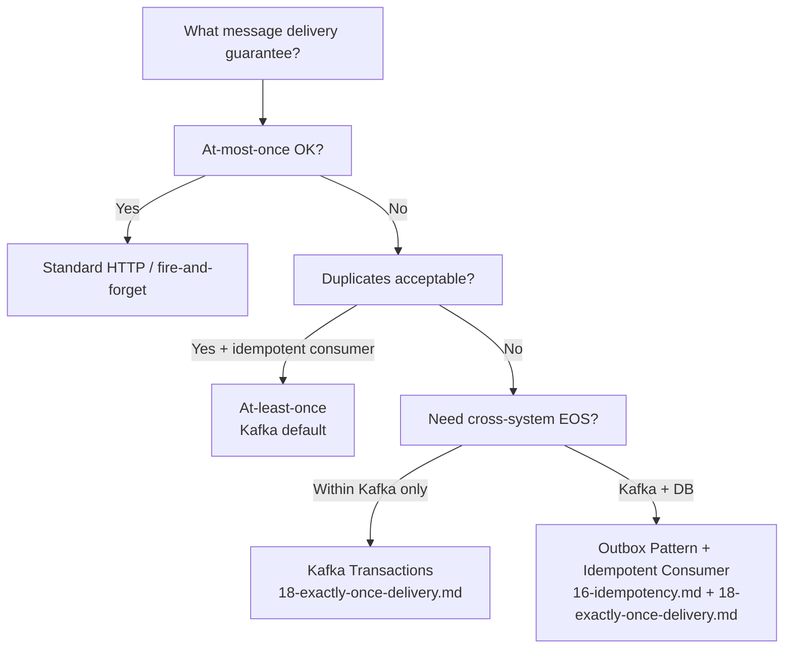
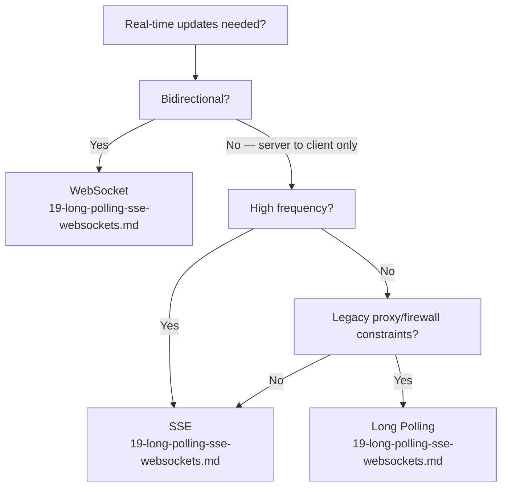
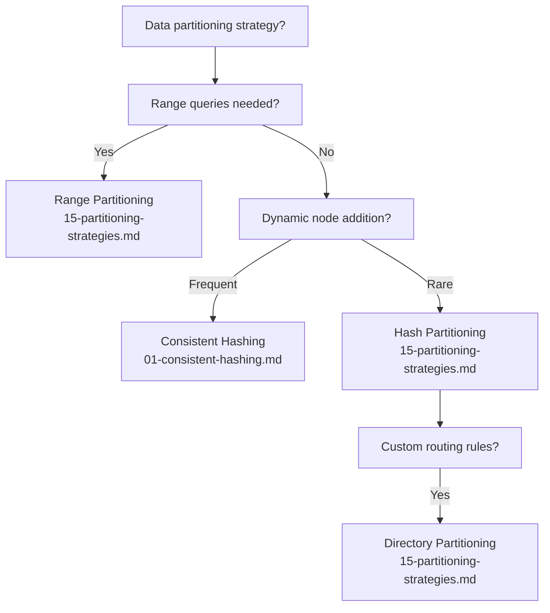

# Distributed Design Patterns

A comprehensive reference of distributed systems design patterns. Each pattern document includes: **Category**, **Context**, **Pros**, **Cons**, **Design Diagram** (Mermaid), and **Code Sample** (TypeScript/Node.js).

---

## Pattern Index

| # | Pattern | Category | Key Problem Solved |
|---|---------|----------|--------------------|
| [01](./01-consistent-hashing.md) | Consistent Hashing | Data Distribution | Minimize data movement when nodes are added/removed |
| [02](./02-leader-election.md) | Leader Election | Coordination | Elect a single authoritative coordinator node |
| [03](./03-gossip-protocol.md) | Gossip Protocol | Cluster Management | Propagate state to all nodes without central coordinator |
| [04](./04-quorum.md) | Quorum-based Replication | Consistency | Balance consistency and availability in replicated data |
| [05](./05-distributed-locking.md) | Distributed Locking | Coordination | Mutual exclusion across distributed processes |
| [06](./06-service-discovery.md) | Service Discovery | Networking | Dynamically locate service instances |
| [07](./07-write-ahead-log.md) | Write-Ahead Log (WAL) | Durability | Crash-safe persistence before in-memory writes |
| [08](./08-raft-consensus.md) | Raft Consensus | Consensus | Distributed consensus with understandable mechanics |
| [09](./09-vector-clocks.md) | Vector Clocks | Causality | Track happened-before relationships across nodes |
| [10](./10-cap-theorem-base.md) | CAP Theorem & BASE | Theory | Trade-offs between consistency, availability and partition tolerance |
| [11](./11-split-brain-fencing.md) | Split Brain & Fencing | Fault Tolerance | Prevent conflicting writes during network partitions |
| [12](./12-bloom-filter.md) | Bloom Filter | Data Structures | Space-efficient probabilistic set membership testing |
| [13](./13-merkle-tree.md) | Merkle Tree | Data Integrity | Efficient data verification and anti-entropy reconciliation |
| [14](./14-mapreduce.md) | MapReduce | Data Processing | Parallel batch computation over large distributed datasets |
| [15](./15-partitioning-strategies.md) | Partitioning Strategies | Data Management | Distribute data across nodes; avoid hot spots |
| [16](./16-idempotency.md) | Idempotency | Reliability | Safe retries — operations produce the same result on repetition |
| [17](./17-distributed-tracing.md) | Distributed Tracing | Observability | Track request flow across multiple microservices |
| [18](./18-exactly-once-delivery.md) | Exactly-Once Delivery | Messaging | Deliver and process each message precisely one time |
| [19](./19-long-polling-sse-websockets.md) | Long Polling, SSE & WebSockets | Real-Time | Push server updates to clients without polling |

---

## Patterns by Category

### Consensus & Coordination
| Pattern | File |
|---------|------|
| Leader Election | [02-leader-election.md](./02-leader-election.md) |
| Raft Consensus | [08-raft-consensus.md](./08-raft-consensus.md) |
| Quorum-based Replication | [04-quorum.md](./04-quorum.md) |
| Distributed Locking | [05-distributed-locking.md](./05-distributed-locking.md) |

### Data Distribution & Partitioning
| Pattern | File |
|---------|------|
| Consistent Hashing | [01-consistent-hashing.md](./01-consistent-hashing.md) |
| Partitioning Strategies | [15-partitioning-strategies.md](./15-partitioning-strategies.md) |

### Consistency & Causality
| Pattern | File |
|---------|------|
| Vector Clocks | [09-vector-clocks.md](./09-vector-clocks.md) |
| CAP Theorem & BASE | [10-cap-theorem-base.md](./10-cap-theorem-base.md) |
| Write-Ahead Log | [07-write-ahead-log.md](./07-write-ahead-log.md) |

### Fault Tolerance & Resilience
| Pattern | File |
|---------|------|
| Split Brain & Fencing | [11-split-brain-fencing.md](./11-split-brain-fencing.md) |
| Idempotency | [16-idempotency.md](./16-idempotency.md) |
| Exactly-Once Delivery | [18-exactly-once-delivery.md](./18-exactly-once-delivery.md) |

### Cluster Management & Discovery
| Pattern | File |
|---------|------|
| Gossip Protocol | [03-gossip-protocol.md](./03-gossip-protocol.md) |
| Service Discovery | [06-service-discovery.md](./06-service-discovery.md) |

### Data Structures & Algorithms
| Pattern | File |
|---------|------|
| Bloom Filter | [12-bloom-filter.md](./12-bloom-filter.md) |
| Merkle Tree | [13-merkle-tree.md](./13-merkle-tree.md) |
| MapReduce | [14-mapreduce.md](./14-mapreduce.md) |

### Observability & Reliability
| Pattern | File |
|---------|------|
| Distributed Tracing | [17-distributed-tracing.md](./17-distributed-tracing.md) |

### Real-Time Communication
| Pattern | File |
|---------|------|
| Long Polling, SSE & WebSockets | [19-long-polling-sse-websockets.md](./19-long-polling-sse-websockets.md) |

---

## Decision Guide

### Which consistency mechanism should I use?

### Which delivery guarantee do I need?

### Which real-time communication pattern?

### How should I partition my data?

---

## Pattern Combinations

Some patterns are designed to be used together:

| Combination | Why |
|-------------|-----|
| **Raft + WAL** | Raft provides consensus; WAL provides durability on each node (etcd does exactly this) |
| **Quorum + Vector Clocks** | Quorum writes with causal tracking for conflict-accurate AP systems (DynamoDB, Riak) |
| **Consistent Hashing + Gossip** | Hash ring for data routing + gossip for ring membership propagation (Cassandra) |
| **Outbox + Exactly-Once Delivery** | Outbox ensures atomic write + event; EOS ensures no duplicate message processing |
| **Bloom Filter + Merkle Tree** | Bloom filter for fast negative lookups; Merkle tree for anti-entropy (Cassandra) |
| **Distributed Tracing + Service Discovery** | Traces show which discovered instances were called; critical for debugging routing issues |
| **Idempotency + Exactly-Once** | Idempotency keys at the application layer + Kafka EOS at the broker layer = defense in depth |
| **Leader Election + Distributed Locking** | Use leader election to select a lock manager; use locking for per-resource mutual exclusion |
| **Split Brain Fencing + Raft** | Raft prevents split brain via term numbers; fencing tokens add a second line of defense at storage |
| **MapReduce + Partitioning** | MapReduce workers process per-partition input; partition strategy determines data locality |

---

## Technology Reference

| Technology | Patterns Used |
|-----------|---------------|
| **Apache Kafka** | Exactly-Once Delivery, Idempotency, Distributed Tracing (context propagation) |
| **Apache Cassandra** | Consistent Hashing, Gossip Protocol, Quorum, Bloom Filter, Merkle Tree |
| **etcd** | Raft Consensus, Leader Election, Distributed Locking, Service Discovery |
| **Redis** | Distributed Locking (Redlock), Bloom Filter (RedisBloom), Idempotency Keys |
| **ZooKeeper** | Leader Election, Distributed Locking, Service Discovery |
| **DynamoDB** | Consistent Hashing, Vector Clocks, Quorum, Partitioning |
| **PostgreSQL** | WAL, Idempotency (DB dedup), Exactly-Once (outbox) |
| **OpenTelemetry** | Distributed Tracing |

---

## Related

See also the [System Design Patterns](../system-design/README.md) collection for higher-level architectural patterns including Microservices, CQRS, Event Sourcing, Circuit Breaker, API Gateway, and more.
